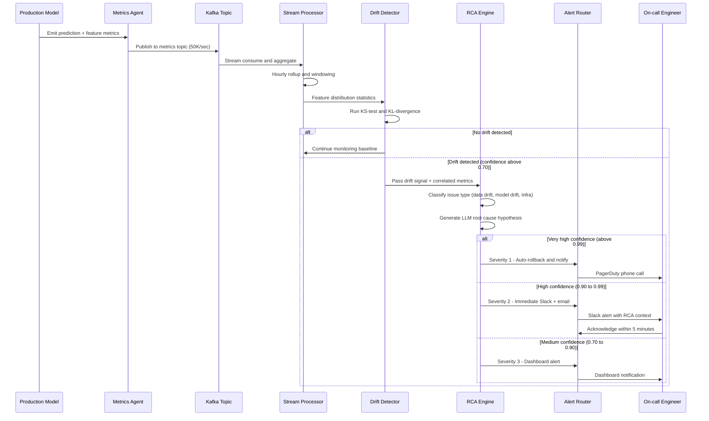

## Process Flow (Metric Ingestion to Alert)

**Key Decision Points:**
1. **Hourly Aggregation**: Raw metrics aggregated to reduce alert noise from transient spikes
2. **Statistical Tests**: KS-test for distribution comparison, KL-divergence for feature drift
3. **RCA Classification**: LLM + rule-based system classifies root cause before alerting
4. **Confidence-based Escalation**: Higher confidence = faster, more aggressive response
5. **Auto-Rollback Gate**: Only triggered above 0.99 confidence to avoid false-positive rollbacks

**Error Paths:**
- Kafka lag growing: alert ops team, scale consumer group
- Drift detector false positive surge: tighten statistical threshold, add multi-day confirmation
- RCA engine unavailable: route to manual review queue with raw drift signal

**Optimization Points:**
- Downsample normal metrics (log 1% of healthy predictions, 100% of anomalies)
- Archive metrics older than 30 days to cold storage (reduce DB cost 80%)
- Cache baseline distributions per model to speed up KS-test comparisons
