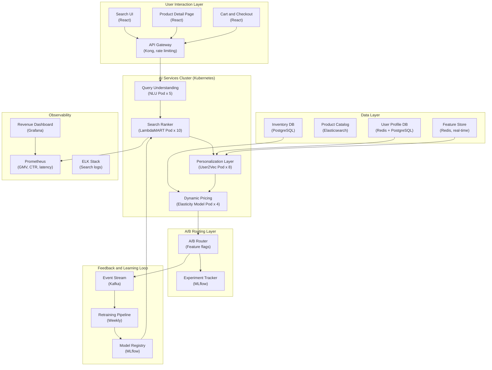

## System Architecture (Infrastructure and Deployment)

**Infrastructure Components:**
- **Compute**: Kubernetes cluster with separate pods for query understanding, search ranking, personalization, dynamic pricing
- **Storage**: Elasticsearch (product catalog, 100K+ SKUs), Redis (user profiles, feature store), PostgreSQL (inventory, transaction history)
- **Learning**: Kafka event stream, weekly retraining pipeline, MLflow model registry
- **Monitoring**: Real-time GMV tracking, CTR dashboards, A/B experiment analytics
