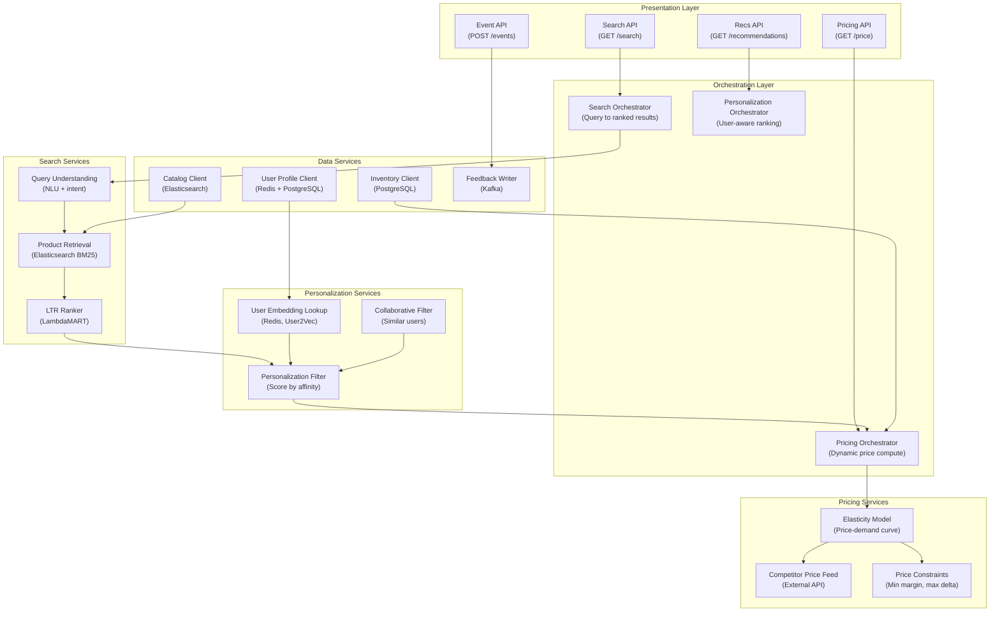

## Application Architecture (Components and Layers)

**Layer Breakdown:**
- **Presentation**: Separate APIs for search, recommendations, pricing, and event ingestion
- **Orchestration**: Per-capability orchestrators for search, personalization, and dynamic pricing
- **Search Services**: NLU query understanding, BM25 product retrieval, LambdaMART re-ranking
- **Personalization Services**: User2Vec embedding lookup, personalization filter, collaborative filtering
- **Pricing Services**: Elasticity model, competitor price feed, margin constraint enforcement
- **Data Services**: User profiles, product catalog, inventory, event stream writer
