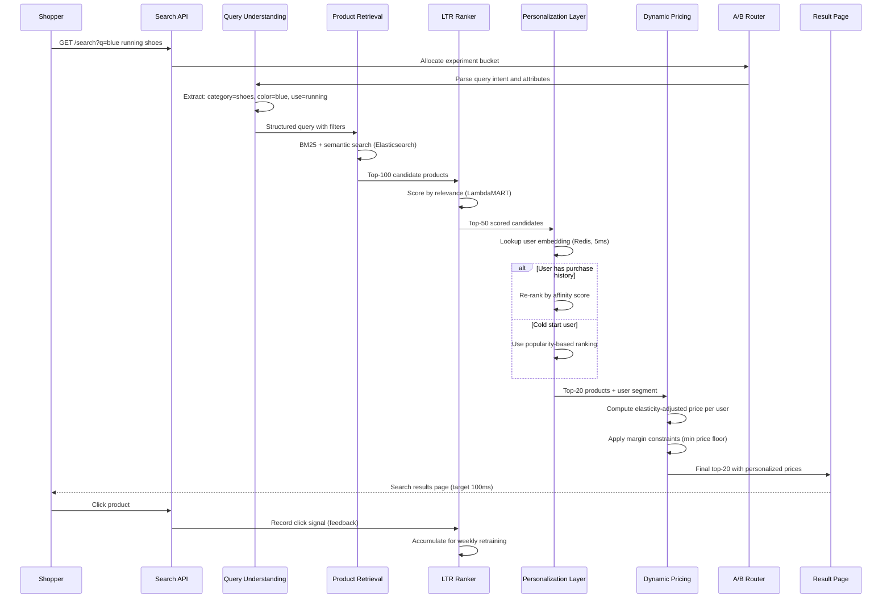

## Process Flow (Search Query to Personalized Results with Price)

**Key Decision Points:**
1. **Query Understanding**: Extracts category, color, use-case to filter catalog before ranking
2. **Two-Stage Ranking**: BM25 retrieval (top-100) then LambdaMART re-ranking (top-50) for efficiency
3. **Cold Start Check**: No user history falls back to popularity-based ordering
4. **Dynamic Pricing**: Elasticity model adjusts price per user segment, constrained by margin floor
5. **A/B Routing**: Traffic split for testing new ranking models before full rollout

**Error Paths:**
- Query understanding failure: fall back to keyword search
- Personalization service timeout: serve unranked results within SLA
- Pricing service unavailable: serve catalog price as fallback

**Optimization Points:**
- Cache popular query results (30-minute TTL for top-1000 queries)
- Pre-compute user affinity scores for top-10K most active users
- Warm pricing cache with elasticity estimates computed overnight
