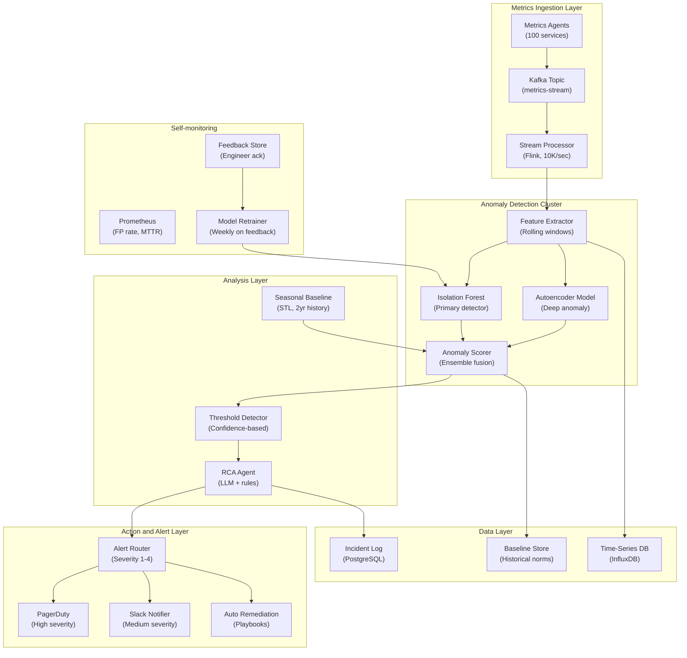

## System Architecture (Infrastructure and Deployment)

**Infrastructure Components:**
- **Compute**: Flink stream processors, Isolation Forest and Autoencoder GPU inference workers
- **Storage**: InfluxDB (time-series metrics), PostgreSQL (incident log), baseline historical store (2 years)
- **Detection**: Isolation Forest primary detector (50ms), Autoencoder for deep patterns (200ms), seasonal STL baseline
- **Action**: Confidence-tiered alerts (log only, dashboard, Slack, PagerDuty, auto-remediate)
