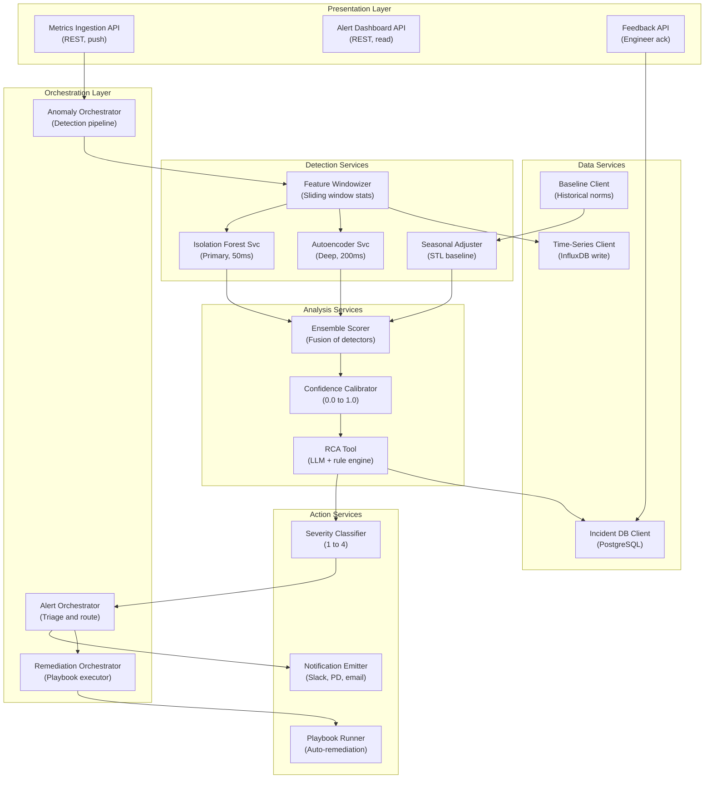

## Application Architecture (Components and Layers)

**Layer Breakdown:**
- **Presentation**: Metrics push API, alert read API, engineer feedback API
- **Orchestration**: Detection pipeline coordinator, alert triage, remediation executor
- **Detection Services**: Sliding window featurization, Isolation Forest (50ms), Autoencoder (200ms), STL seasonal baseline
- **Analysis Services**: Ensemble fusion, confidence calibration, LLM+rule-based root cause analysis
- **Action Services**: Severity 1-4 classification, multi-channel notifications, automated playbook execution
- **Data Services**: InfluxDB time-series, historical baseline store, PostgreSQL incident log
