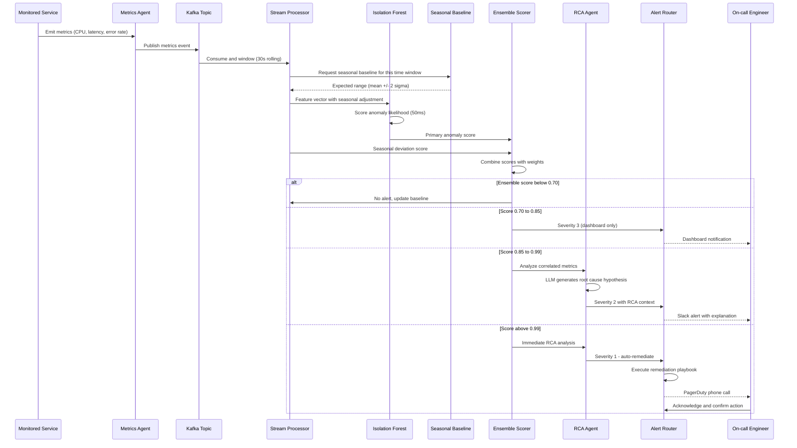

## Process Flow (Metrics Stream to Alert and Remediation)

**Key Decision Points:**
1. **Seasonal Adjustment**: Baselines adjust for known patterns (peak hours, weekly cycles) to reduce false positives
2. **Isolation Forest**: Unsupervised outlier detection without labeled anomaly data
3. **Ensemble Fusion**: Combines statistical and ML scores for higher precision
4. **Confidence Tiers**: Four response levels (ignore, dashboard, Slack, PagerDuty+auto-remediate)
5. **Auto-Remediation Gate**: Only at 0.99+ confidence to prevent false-positive rollbacks

**Error Paths:**
- Kafka consumer lag: alert ops team, scale Flink workers
- Isolation Forest unavailable: fall back to pure threshold-based detection
- RCA engine timeout: send alert without explanation, flag for manual investigation

**Optimization Points:**
- Pre-compute seasonal baselines once per hour for each metric/service
- Cache Isolation Forest inference for identical feature vectors (within 60-second window)
- Batch low-severity anomalies into digest notifications (hourly dashboard summary)
