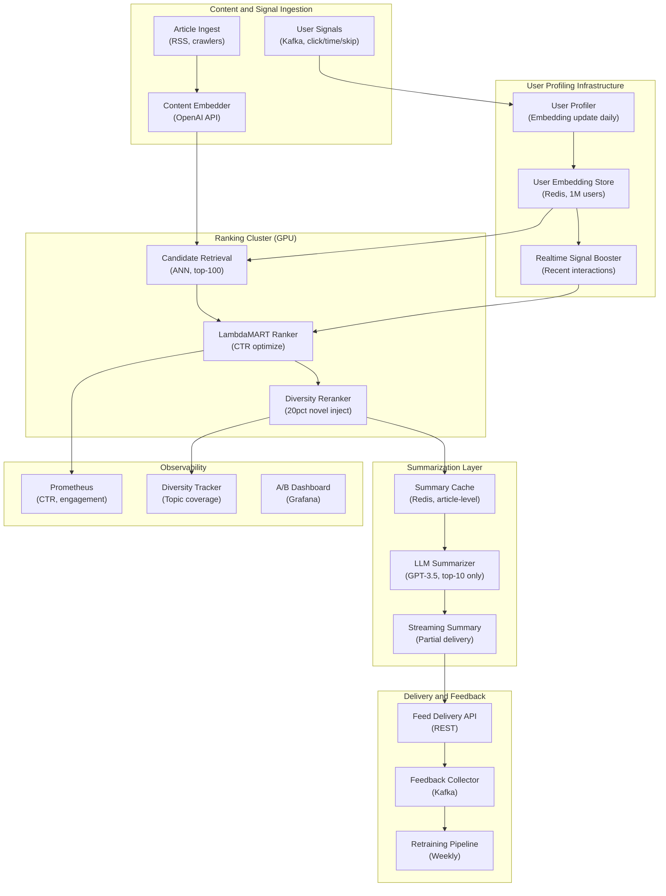

## System Architecture (Infrastructure and Deployment)

**Infrastructure Components:**
- **Compute**: GPU cluster for LambdaMART ranker, async LLM summarization workers
- **Storage**: Redis (user embeddings for 1M users, article summary cache), Kafka (event streams)
- **Summarization**: LLM only for top-10 ranked articles per feed (not all candidates)
- **Monitoring**: CTR tracking, diversity score (topic coverage percentage), A/B test dashboards
