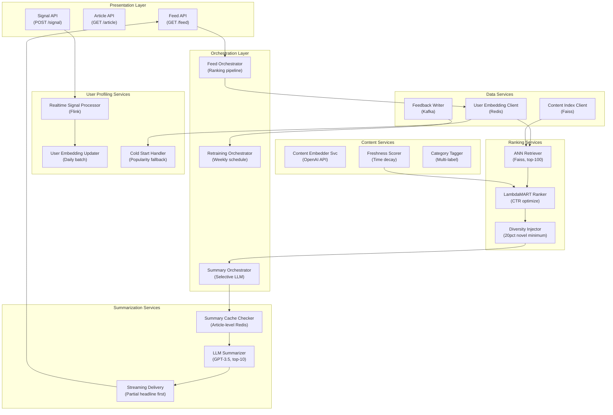

## Application Architecture (Components and Layers)

**Layer Breakdown:**
- **Presentation**: Feed retrieval, article detail, and user signal ingestion APIs
- **Orchestration**: Feed ranking pipeline, selective LLM summarization, weekly retraining
- **Content Services**: OpenAI content embedding, freshness decay scoring, multi-label category tagging
- **User Profiling**: Daily batch embedding updates, real-time Flink signal processing, cold start fallback
- **Ranking Services**: Faiss ANN retrieval (top-100), LambdaMART CTR optimization, diversity injection
- **Summarization Services**: Article-level Redis cache check, GPT-3.5 top-10 summarization, streaming headline delivery
