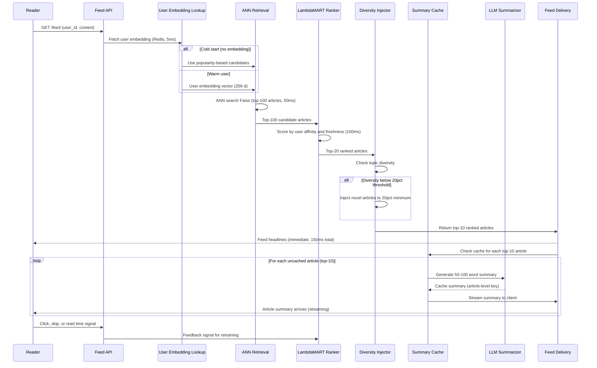

## Process Flow (User Session to Personalized Feed with Summaries)

**Key Decision Points:**
1. **Headlines First**: Feed headlines delivered immediately (150ms), summaries stream in background
2. **Cold Start**: No user embedding falls back to popularity-based retrieval
3. **ANN Retrieval**: Faiss approximate nearest neighbor limits candidate pool to 100 relevant articles
4. **Diversity Injection**: If top-20 candidates lack variety, novel articles forcibly inserted at 20% minimum
5. **Selective Summarization**: LLM only generates summaries for final top-10, not all 100 candidates

**Error Paths:**
- LLM summarizer unavailable: serve feed without summaries, retry async
- User embedding stale (older than 7 days): serve stale with diversity boosted as safety mechanism
- Faiss index unavailable: fall back to Elasticsearch keyword-based retrieval

**Optimization Points:**
- Cache summaries at article level (not user level) for high reuse across users
- Pre-generate summaries for top-1000 daily trending articles during low-traffic periods
- Streaming headline delivery decouples latency from summary generation time
