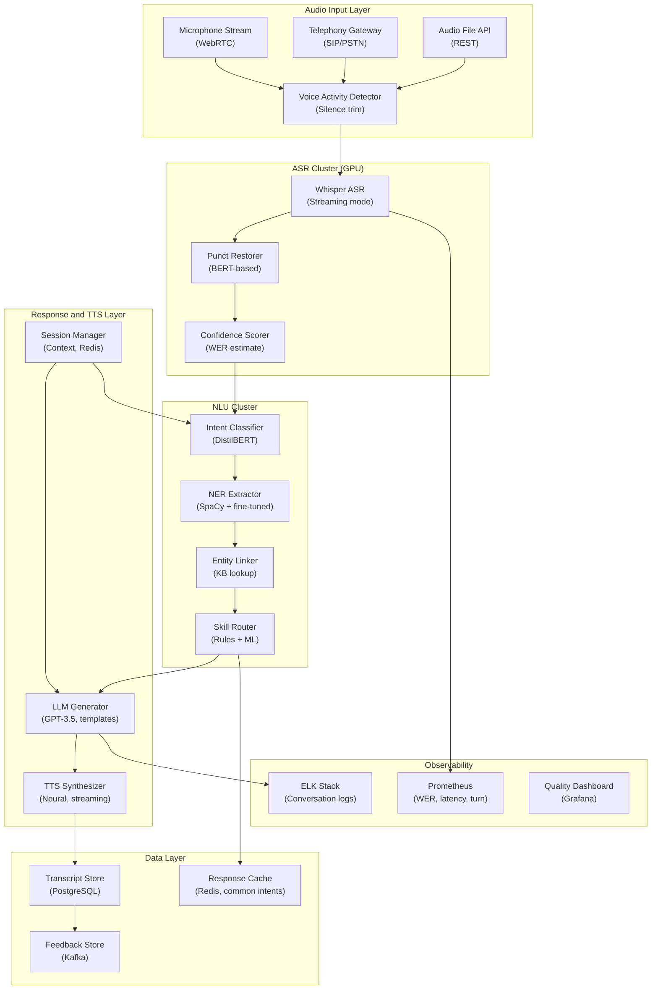

## System Architecture (Infrastructure and Deployment)

**Infrastructure Components:**
- **Compute**: GPU cluster for Whisper ASR (200ms streaming) and NLU inference (50ms)
- **Storage**: Redis (session context, response cache), PostgreSQL (transcript store)
- **Pipeline**: Parallel ASR and NLU processing, streaming TTS for sub-500ms response
- **Monitoring**: WER tracking, end-to-end latency per turn, conversation quality dashboards
