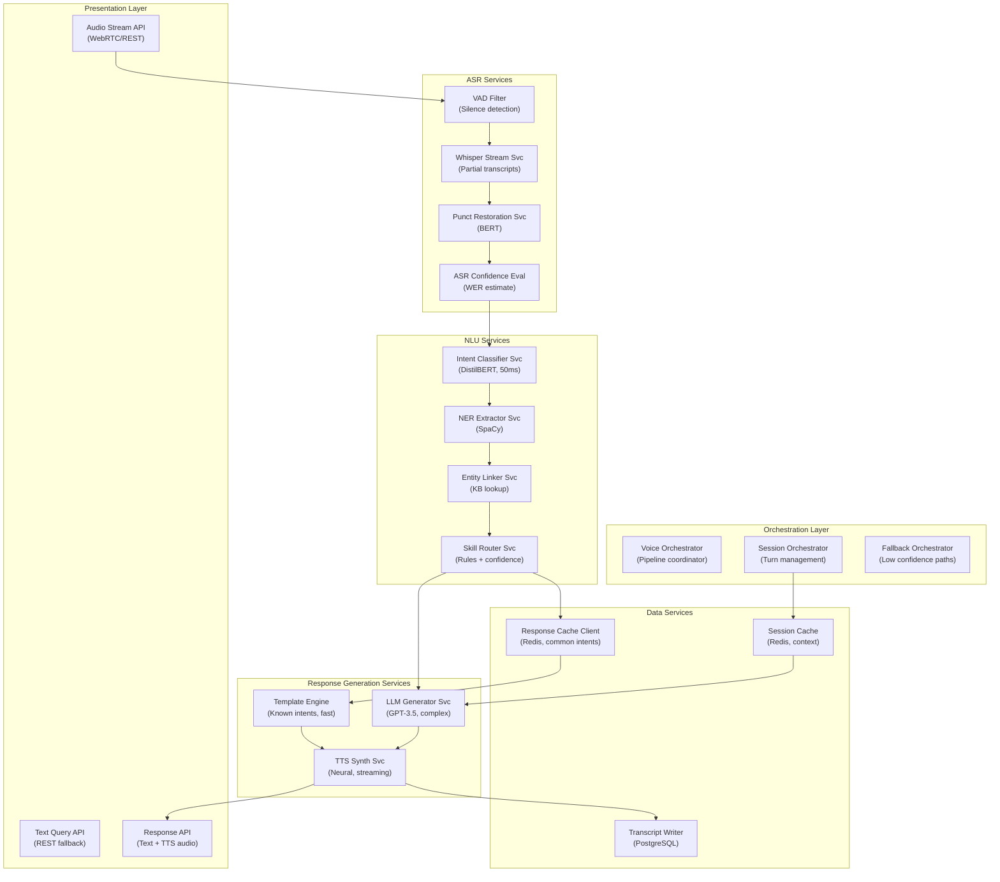

## Application Architecture (Components and Layers)

**Layer Breakdown:**
- **Presentation**: Streaming audio API, text fallback API, combined text+audio response API
- **Orchestration**: Voice pipeline coordinator, multi-turn session management, low-confidence fallback
- **ASR Services**: VAD filter, Whisper streaming transcription, punctuation restoration, confidence evaluation
- **NLU Services**: Intent classification (50ms), named entity recognition, knowledge base entity linking, skill routing
- **Response Services**: Fast template engine for known intents, LLM for complex queries, neural TTS synthesis
- **Data Services**: Redis session context, response cache for common intents, transcript persistence
