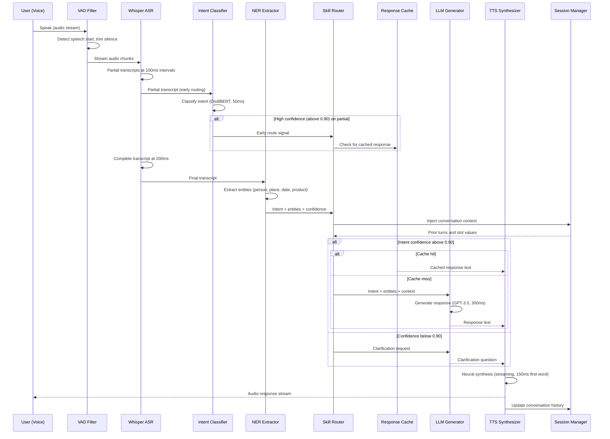

## Process Flow (Audio Input to Voice Response)

**Key Decision Points:**
1. **Early Routing**: NLU starts on partial transcripts (100ms) for faster response initiation
2. **VAD Trimming**: Voice activity detection prevents processing silence and noise
3. **Session Context**: Prior conversation turns injected into LLM prompt for multi-turn coherence
4. **Confidence Gate**: Below 0.90 triggers clarification question rather than wrong response
5. **Streaming TTS**: First audio word delivered at 150ms without waiting for full text generation

**Error Paths:**
- Whisper confidence below 0.80: ask user to repeat (not cascade to wrong intent)
- LLM timeout (above 800ms): fall back to template response for known high-frequency intents
- TTS synthesis failure: deliver text response as fallback, retry audio async

**Optimization Points:**
- Cache template responses for top-50 most common intents (zero LLM cost)
- Parallelize NER and entity linking with partial ASR output
- Use DistilBERT (50ms) not BERT (200ms) for intent classification in the critical path
