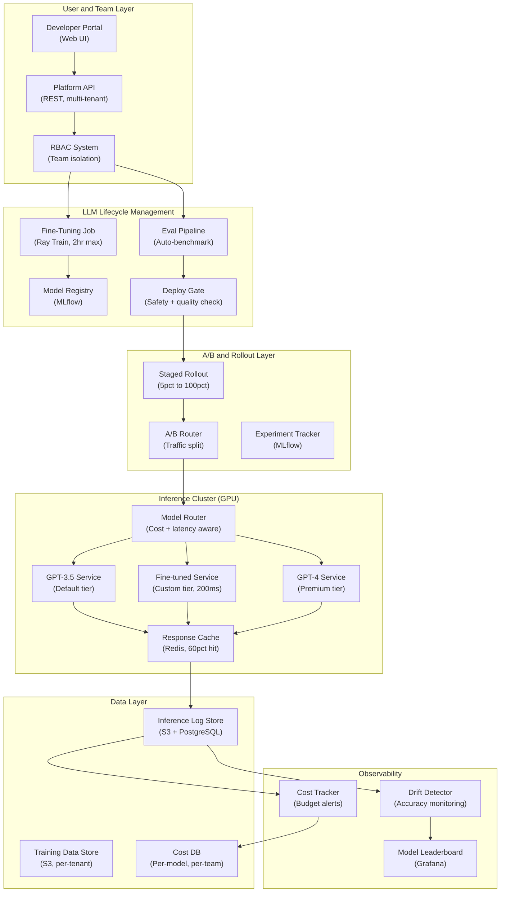

## System Architecture (Infrastructure and Deployment)

**Infrastructure Components:**
- **Compute**: Ray Train for fine-tuning (2hr job limit), GPU cluster for inference, async evaluation workers
- **Storage**: S3 per-tenant training data (isolation), MLflow model registry, PostgreSQL cost database
- **Routing**: Cost+latency-aware model router (GPT-3.5 default, fine-tuned custom, GPT-4 premium)
- **Governance**: RBAC per team, safety gate before deployment, staged rollout (5% to 100%)
