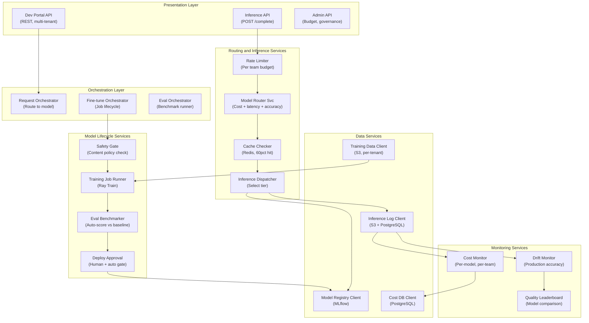

## Application Architecture (Components and Layers)

**Layer Breakdown:**
- **Presentation**: Developer portal, inference, and admin APIs (multi-tenant)
- **Orchestration**: Inference routing, fine-tuning lifecycle, evaluation benchmark runner
- **Routing Services**: Cost+latency+accuracy-aware model router, 60% cache hit layer, per-team rate limiter
- **Lifecycle Services**: Safety content gate, Ray Train job runner, auto-benchmark evaluator, human+auto deploy gate
- **Monitoring Services**: Production drift monitor, per-model/per-team cost monitor, model quality leaderboard
- **Data Services**: MLflow model registry, per-tenant S3 training data, inference logs, cost database
