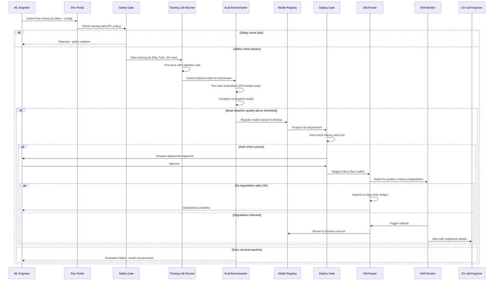

## Process Flow (Training Job to Production Deployment)

**Key Decision Points:**
1. **Safety Gate**: Checks training data for PII and policy violations before any compute is allocated
2. **Evaluation Gate**: Auto-benchmark against baseline model before registry registration
3. **Human Approval**: Engineer must explicitly approve before traffic is shifted
4. **Staged Rollout**: 5% traffic for 24 hours before expanding to minimize blast radius
5. **Auto-Rollback**: Drift monitor triggers automatic revert if quality degrades during rollout

**Error Paths:**
- Training job runs over 2-hour budget: checkpoint and pause, alert engineer
- Eval benchmark fails to complete: block promotion, notify engineer with partial results
- A/B rollout degrades latency P99: immediate rollback, investigate before retry

**Optimization Points:**
- Reuse evaluation results for identical model versions (hash-based dedup)
- Cache common inference requests during staged rollout to reduce cost of parallel model serving
- Pre-warm fine-tuned model containers before shifting traffic to avoid cold-start latency spike
