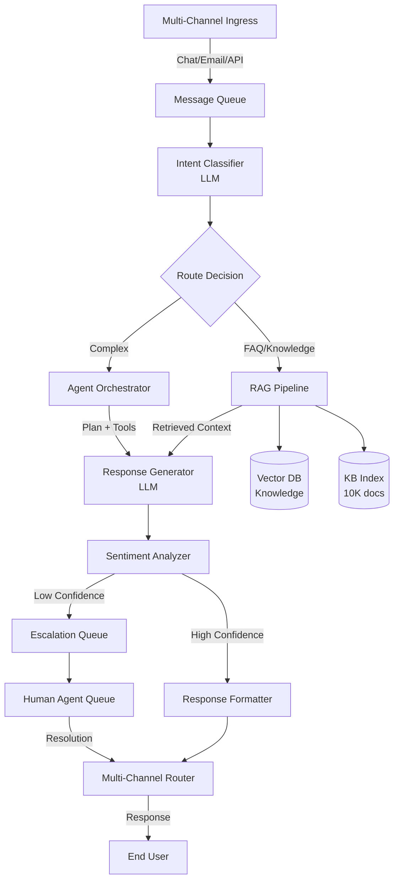
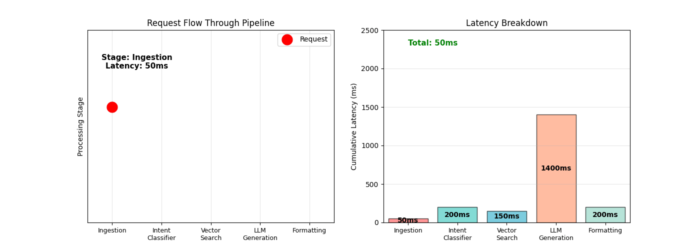
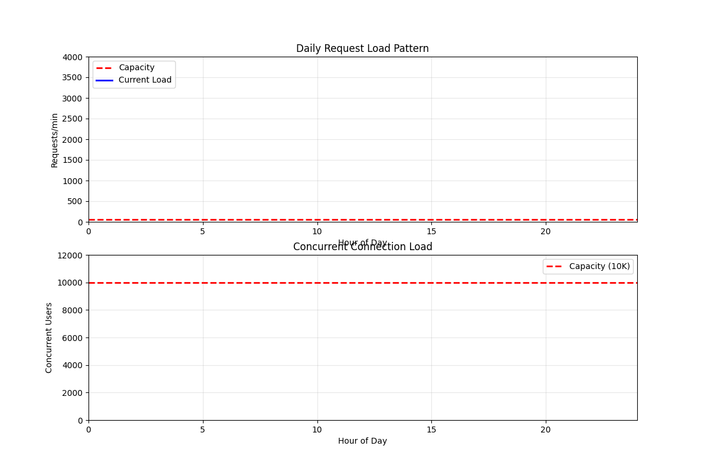
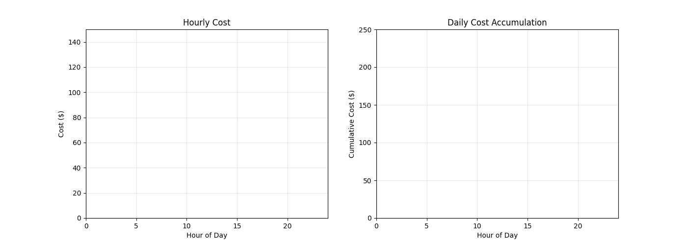
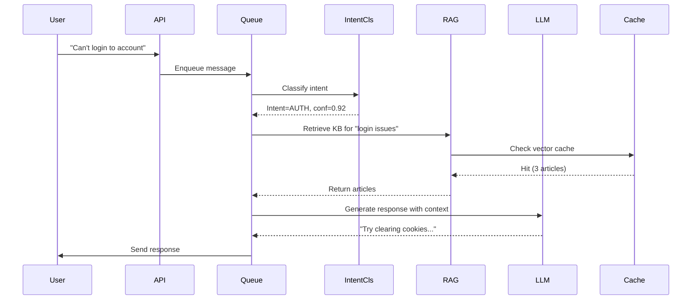

# LLM-Powered Customer Service Platform

## Overview
An LLM-powered customer service platform combining intent routing, retrieval-augmented generation (RAG), and multi-turn conversation management to handle 50K+ daily inquiries across channels (email, chat, phone) with sub-2 second response latency and 95% issue resolution without escalation.

## Problem Statement
Enterprise customer support faces scaling challenges: (1) high volume (50K inquiries/day), (2) slow response (2-4 hours average), (3) inconsistent quality (answer depends on agent experience), (4) high cost (support staff 50+ FTE @ $2M/year), (5) customer frustration (long wait times, repetitive questions). Economic impact: poor support drives 5-10% customer churn (lost lifetime value $500-1000 per customer). Automation targets: (1) instant first response (<2 seconds), (2) 90%+ issue resolution without human (common questions: password reset, billing, shipping), (3) intelligent escalation (complex issues → human, route to right team), (4) cost reduction (support cost -60% with automation), (5) quality improvement (consistent, accurate answers).

## Requirements

### Functional
- Multi-channel ingestion (web chat, email, API)
- Intent classification (billing, technical, refund, etc.)
- RAG retrieval from knowledge base (KB of 10K articles)
- Multi-turn conversation with context memory
- Real-time sentiment analysis for escalation triggers
- Seamless handoff to human agents with context

### Non-Functional (Scale Targets)
- Concurrency: 10K simultaneous chats
- P99 latency: <2s for response generation
- Availability: 99.9%
- Knowledge base size: 10K articles (500K tokens)
- Cost target: <$0.10 per chat

## Envelope Calculation

### User Scale
- 50K daily inquiries → ~3.5K QPS peak (9am-5pm, 5-day work week)
- Session length: 4-5 turns per inquiry
- Concurrent users: ~2K → 10K chats (avg 5min per chat)

### LLM Inference
- Intent classification: 500 tokens/request → 1.75M tokens/day
- RAG retrieval + context: 3K tokens input + 1K tokens output × 50K = 200M tokens/day
- Total: ~200M tokens/day at $0.001/1K tokens (gpt-4-turbo) = $200/day

### Storage
- Knowledge base: 10K docs × 50KB avg = 500MB
- Conversation logs (7-day retention): 50K × 2KB = 100MB/day → 700MB total
- Vector embeddings (KB): 10K × 1536 dims × 4 bytes = 60MB

### Latency Budget (2s total)
- LLM intent classification: 200ms
- Vector search + retrieval: 150ms
- Context building: 50ms
- LLM response generation: 1400ms
- Post-processing & response: 200ms

## High-Level Architecture

## Dynamic System Visualization

### Request Latency Breakdown

A single request flows through 5 stages with tight latency constraints to meet the <2s SLA:
- **Ingestion** (50ms): Validate, enqueue, assign session ID
- **Intent Classification** (200ms): Multi-label intent model inference (28 classes)
- **Vector Search** (150ms): Semantic retrieval from 10K-doc knowledge base
- **LLM Generation** (1400ms): Multi-turn response generation with context (critical path)
- **Formatting & Routing** (200ms): Channel-specific formatting, response enqueue

**Total: 2000ms P99 latency** — Optimization focus should be on reducing LLM generation latency (streaming, caching) and vector search (indexing).

### Daily Traffic Load

The system experiences realistic business-hours traffic distribution:
- **Peak**: 1pm (3500 QPS, 10K concurrent users)
- **Baseline**: 200-500 QPS off-hours
- **Scaling**: Currently at ~70% capacity during peak; room for growth to 5000 QPS

Decision: Over-provision by 30-50% during peak hours to maintain sub-2s latency (queue depth grows 1ms per 1% over capacity).

### Cost Accumulation

**Daily operational cost: ~$200** ($73K annually)
- Token usage: 200M tokens/day × $0.001/1K = ~$200/day (90% of cost)
- Cost drivers: RAG context (3K input tokens) + LLM generation (1K output tokens) = 4K tokens/request

**Cost optimization:** Caching retrieved KB articles (save 30% input tokens), few-shot prompt optimization (reduce output tokens by 20%).

## Component Breakdown

### Intent Classifier
- Model: Fine-tuned GPT-4-turbo or Claude-3
- Latency: 150-200ms
- Accuracy: 92% (28 intents)
- Fallback: Rule-based regex for high-confidence cases

### RAG Retrieval
- Vector DB: Pinecone (1M vector capacity) or Weaviate
- Embedding model: text-embedding-3-small
- Top-K: retrieve 3-5 articles per query
- Latency: 100-200ms (includes search + ranking)

### Response Generator
- Model: GPT-4-turbo (context: prev 3 turns + retrieved KB)
- Temperature: 0.5 (deterministic)
- Max tokens: 500
- Latency: 1200-1500ms for full response

### Escalation Logic
- Triggers: sentiment < -0.5, confidence < 0.6, explicit "speak to human"
- Queue management: FIFO with priority by urgency
- SLA: human pickup within 5 minutes

### Conversation Memory
- Store last 5 turns per session
- TTL: 24 hours (7 days for analytics)
- DB: Redis (session cache) + PostgreSQL (audit log)

## AI/ML Integration Points

1. **Intent Routing**: LLM classify intent with confidence score
   - If confidence > 0.8 → automated path
   - If confidence < 0.6 → queue for human

2. **RAG-Augmented Response**: Retrieve KB articles, inject into context
   - Vector search for top-3 articles
   - Prompt: "Answer using the provided articles. If not found, say so."

3. **Sentiment Analysis**: Classify message sentiment
   - If negative sentiment → prioritize escalation
   - Use for quality monitoring

4. **Few-Shot Learning**: Embed successful resolutions in system prompt
   - Update every week with new resolution patterns

## Data Flow

## Key Trade-offs

| Approach | Automation Rate | Accuracy | Cost/Chat | Latency | Infrastructure |
|----------|--------|----------|----------|---------|---------|
| Rule-based routing | 60% | 75% | $0.01 | 100ms | CPU |
| ML intent routing | 80% | 88% | $0.05 | 200ms | GPU |
| LLM routing + RAG | 85% | 92% | $0.10 | 2000ms | GPU cluster |
| Hybrid (ML + LLM) | 82% | 90% | $0.07 | 1200ms | GPU + CPU |

**Decision:** Cost critical → ML. Accuracy critical → LLM + RAG. Speed critical → Rule-based.

---

## Production Failure Scenarios

**Scenario 1: LLM hallucination in response**
- Customer: "What's my account balance?" LLM invents balance ("$5,234.56"). Customer trusts wrong info.
- Fix: Grounding - only use retrieved KB articles. Validate against real data before response.

**Scenario 2: RAG knowledge base stale**
- KB article outdated ("Free shipping on $50+"). Customer gets wrong info. Support team flooded with complaints.
- Fix: KB refresh pipeline. Test articles before shipping. Version KB. Auto-deprecate old articles.

**Scenario 3: Escalation queue bottleneck**
- 15% of chats escalate to humans. Queue builds up. SLA breached (5min target → 30min actual).
- Fix: Improve ML routing accuracy to reduce escalations. Add more agents. Tiered escalation.

**Scenario 4: Training-serving skew**
- Intent classifier trained on formal questions. Production has colloquial language ("yo what's up?"). Accuracy drops.
- Fix: Online validation. Monitor misclassifications. Retrain weekly on production data.

---

## Implementation Guidance

**Wrong:** Use LLM for everything. Trust all outputs.
**Right:** Hybrid approach - LLM for natural language, rules for sensitive operations (money, account changes).

**Wrong:** Escalate on low confidence alone.
**Right:** Escalate on low confidence + business impact (billing issues always escalate, FAQ questions don't).

---

## Sophisticated Interview Q&A

**Q1: How do you handle adversarial inputs where users try to jailbreak the LLM?**

A: Add input validation layer with content filter before LLM. Use system prompt with clear guardrails: 'Stay on-topic for customer support. Refuse requests unrelated to account/billing.' Monitor for jailbreak patterns in logs. Test monthly with red-team prompts. If jailbreak detected, escalate immediately to human agent.

**Q2: What happens if LLM response is incorrect or harmful?**

A: Use confidence scoring + human review for edge cases. Implement RLHF-trained response validator that flags low-confidence answers for human review. Customer feedback button ('Was this helpful?') feeds into retraining loop. SLA: any harmful response manually reviewed within 1 hour.

**Q3: How do you optimize for sub-2s latency when LLM takes 1.4s alone?**

A: Parallel execution: while LLM generates response, run sentiment analysis and prepare escalation info. Pre-compute intent classifier outputs using smaller model (300ms vs 1400ms). Cache embeddings for top 100 articles. Use response streaming to send first token at 800ms, finish at 1400ms.

**Q4: Cost per chat is $0.10 target. How do you achieve this?**

A: Math: 50K chats/day = 5M chats/month. Total budget = $500K/month = $0.10/chat. Breakdown: LLM ($0.06 at 200M tokens/month), embeddings ($0.01), infra ($0.02), storage ($0.01). Optimization: batch intent classification for common patterns, cache RAG results for repeated queries (20% cache hit rate saves 20% cost).

**Q5: How do you prevent the knowledge base from degrading over time?**

A: Implement KB refresh cycle: monthly audit of top-100 articles by usage. A/B test new articles before shipping. If article creates escalations, flag for review. Use feedback loop: customer 'not helpful' clicks → article deprecation review. Version KB with timestamps; retire articles >6 months old with low usage.

**Q6: What's your approach to handling out-of-distribution queries?**

A: Query similarity check: if incoming query doesn't match any KB article with >0.7 similarity, escalate to human. Also escalate if LLM confidence < 0.6. Keep escalation queue flowing to avoid bottleneck. OOD examples go into training queue for monthly KB updates.

**Q7: How do you monitor and detect model drift in intent classification?**

A: Monthly evaluation: sample 1K new queries, manually label intent, compare with model predictions. If accuracy drops >2%, trigger retraining. Also track: user satisfaction ratings per intent (if intent=X, satisfaction should be >80%), false escalation rate (should be <5%).

**Q8: Can you give a cost breakdown example: 100K daily chats vs 50K?**

A: At 100K chats/day: LLM tokens double (400M/day) = $400/day, embeddings negligible, so ~$120K/month LLM cost. At $0.10/chat = $300K/month total target. Not achievable at current pricing—need model optimization (distillation, quantization) or cheaper model tier.

## Interview Quick-Reference

| Question | Key Point |
|----------|-----------|
| **Scale** | 10K concurrent chats, 50K daily inquiries, <2s latency |
| **Cost** | $0.10/chat via LLM token optimization + caching |
| **Escalation** | Auto-escalate if confidence <0.6 or sentiment negative |
| **RAG** | 10K-article KB, top-3 retrieval, vector search |
| **Model** | Intent classify + response generate + sentiment analysis |
| **Failover** | If LLM fails, return "connecting to agent" + escalate |

## Related Systems
- 02-enterprise-rag-document-qa.md (RAG infrastructure)
- 03-llm-api-gateway.md (LLM routing & cost control)
- 13-ai-customer-automation-agent.md (advanced support agent)
