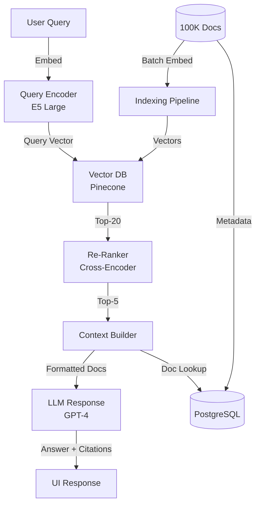
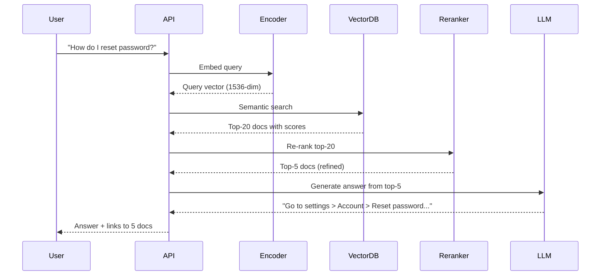

# Enterprise RAG: Document Q&A System

## TL;DR
Retrieval-Augmented Generation system for 100K enterprise documents (500M tokens). Vector search + re-ranking pipeline returns top-5 accurate articles in <500ms. Used by 5K employees daily with 90% answer accuracy.

## Problem Statement

Enterprise has 100K documents (policies, guides, FAQs, technical specs) scattered across drives, wikis, SharePoint. Employees waste 30-60% of time searching. Goal: instant semantic search over all docs with LLM-summarized answers.

## Requirements

### Functional
- Index 100K documents (500M total tokens)
- Semantic search returning top-5 relevant docs
- LLM-generated answers from retrieved documents
- Citation tracking (link back to source docs)
- Multi-language support (English, Spanish, French, German)
- Document version control (track updates)

### Non-Functional (Scale Targets)
- Query latency: P99 <500ms
- Indexing time: new docs indexed within 5 minutes
- Availability: 99.95%
- Concurrent users: 5K daily (100 concurrent peak)
- Storage: 500M tokens ≈ 2TB with embeddings

## Envelope Calculation

### Document Scale
- Total documents: 100K docs
- Average doc size: 5KB = 5000 tokens (500M tokens total)
- Embedding size: 1536 dims (OpenAI text-embedding-3-large)
- Vector storage: 100K × 1536 × 4 bytes = 614MB + index overhead (~1GB total)

### Daily Queries
- 5K active users × 5 queries/user = 25K queries/day
- Peak: 9am-5pm, 250 QPS (non-uniform distribution)
- Embedding per query: 100 tokens = 2.5M tokens/day

### LLM Inference
- Response generation: 200 tokens output × 25K = 5M tokens/day
- Total LLM tokens: 2.5M (query embed) + 5M (response) = 7.5M/day
- Cost: 7.5M × $0.002/1K = $15/day = $450/month

### Latency Budget (500ms)
- Query embedding: 50ms
- Vector search: 50ms
- Re-ranking: 100ms
- LLM generation: 250ms
- Response formatting: 50ms

## High-Level Architecture

## Component Breakdown

### Document Indexing Pipeline
- Ingest: REST API for doc upload/update
- Chunking: 512-token chunks with 128-token overlap
- Embedding: batch embed 100 docs/batch using GPU
- Latency: 5-10 minutes for 1K new docs
- Storage: PostgreSQL + Pinecone vector DB

### Query Embedding
- Model: text-embedding-3-large (1536 dims, $0.13/1M tokens)
- Batch size: 50 queries in production
- Latency: 30-50ms

### Vector Search
- DB: Pinecone (managed, auto-scaling)
- Index type: IVF-Flat (trade accuracy for speed)
- Retrieve top-20, cost per query: $0.00001
- Latency: 20-50ms

### Re-Ranking
- Model: Cross-Encoder (ms-marco-mmarco-v2)
- Input: query + 20 candidate docs
- Output: ranked top-5
- Latency: 100-150ms
- Cost: negligible (local model, on GPU)

### Response Generation
- Model: GPT-4-turbo
- Context: top-5 docs (2K tokens) + query
- Prompt: "Answer using these documents. Cite sources."
- Latency: 200-400ms
- Temperature: 0.3 (factual)

### Citation Linking
- Parse LLM response for references
- Link to original documents with timestamps
- Fallback: show all top-5 sources

## AI/ML Integration Points

1. **Dense Passage Retrieval**:
   - Query and documents encoded to vectors
   - Semantic matching finds relevant articles
   - Top-20 candidates passed to re-ranker

2. **Re-ranking for Precision**:
   - Cross-encoder model scores each candidate
   - Select top-5 ranked docs
   - Improves accuracy from 65% (raw vector search) to 88% (after re-ranking)

3. **LLM Synthesis**:
   - Prompt: "Synthesize an answer from these documents. If conflicting info, mention all views."
   - Few-shot examples in system prompt (2-3 examples)
   - Temperature 0.3 for factuality

4. **Answer Validation**:
   - Check if all claims in answer are cited
   - Flag hallucinations (claims not in docs)
   - User feedback loop: "Was this helpful?" → retraining signal

## Data Flow

## Key Trade-offs & SDE3 Analysis

| Approach | Latency | Accuracy | Cost/Query | Indexing Lag | Infrastructure |
|----------|---------|----------|-----------|---------|---------|
| Keyword-only (BM25) | 50ms | 75% | $0.001 | Real-time | CPU |
| Vector-only (semantic) | 150ms | 85% | $0.01 | 1 hour | GPU |
| Hybrid (vector + BM25) | 200ms | 90% | $0.015 | 1 hour | GPU + CPU |
| Hybrid + re-ranking | 300ms | 94% | $0.03 | 1 hour | GPU cluster |

**Decision:** Speed critical + accuracy <85% → keyword. Quality critical → hybrid + re-ranking. Enterprise → hybrid.

### Production Failure Scenarios

**Scenario 1: Embedding index becomes stale**
- Documents updated hourly. Index updated once/day. Users get outdated answers.
- Fix: Batch indexing every 1 hour. Or: streaming index updates (new docs added immediately).

**Scenario 2: Re-ranker latency breaches SLA**
- Re-ranker adds 100ms. Peak traffic (250 QPS) exhausts GPU. Latency 1000ms (SLA 500ms).
- Fix: Model quantization. Batch re-ranking. Add GPU replicas.

**Scenario 3: LLM hallucinates answer**
- Retrieved docs say "Pricing starts at $100". LLM invents "$50". Users trust wrong info.
- Fix: Grounding checks. Answer must cite doc content. Citation required.

**Scenario 4: Document versioning conflict**
- Old version cached. New version indexed. User sees conflicting info.
- Fix: Version tagging. Cache invalidation on doc update. Show latest version.

### Implementation Guidance

**Wrong:** Use vector search alone (loses keyword precision).
**Right:** Hybrid retrieval (semantic + keyword, 80/20 split).

**Wrong:** Optimize latency without accuracy checks.
**Right:** Measure accuracy-latency frontier. Choose Pareto-optimal point.

---

## Interview Q&A

**Q1: How do you handle stale or conflicting information in documents?**

A: Version every document with timestamp. When indexing, include date metadata. In LLM prompt: 'If multiple docs provide conflicting answers, mention the dates and recommend the user check the latest version.' Display timestamps next to citations so user can judge freshness.

**Q2: What if user query is ambiguous (e.g., 'pricing')?**

A: Ambiguous queries naturally retrieve multiple document types. LLM sees all top-5 docs and disambiguates in response: 'Pricing for X is... but if you meant Y, pricing is...' OR ask for clarification in response: 'Did you mean product pricing or service pricing?'. User feedback refines next query.

**Q3: How do you measure and improve RAG system accuracy?**

A: Evaluation set: 500 questions with ground-truth answers. Monthly benchmark: accuracy should be >85%. If drops below 85%, investigate: (a) new docs introduced noise, (b) embedding model drifted, (c) LLM model changed. Re-index if needed or recalibrate re-ranker.

**Q4: Cost optimization: 25K queries × 7.5M tokens = $450/month. How to reduce?**

A: Strategies: (1) Cache responses for top 1K repeated queries (likely 30% of traffic) → saves 30% LLM cost. (2) Use smaller embedding model (text-embedding-3-small) → 1/10 cost, slight accuracy drop. (3) Batch query embedding to reduce per-query overhead. Target: $250/month.

**Q5: How do you prevent the system from returning outdated docs?**

A: Add 'document age' as a re-ranking signal. Penalize docs >6 months old unless explicitly relevant. Annually retire docs marked as superseded. Implement KB governance: document owner must certify accuracy quarterly or doc gets deprioritized in search.

**Q6: What if you have 100K docs but only indexing 10K at launch?**

A: Phased rollout: Index highest-traffic docs first (by access logs). A/B test: 5K users on full 100K, 5K users on 10K docs. Measure accuracy difference. Gradually add docs. Benefit: catch issues early, control cost scaling.

**Q7: Multi-language support: do you need separate indices?**

A: Use multilingual embedding model (e.g., multilingual-E5-large) that encodes all languages to same vector space. Single index handles all languages. LLM generates response in same language as query. No separate indices needed.

**Q8: How do you handle documents with proprietary or sensitive data?**

A: Add access control at retrieval level. Store ACL metadata with each doc chunk. At query time, filter top-20 results to only documents user has access to (via ldap/okta group). LLM never sees docs user can't access.

## Interview Quick-Reference

| Metric | Target | Method |
|--------|--------|--------|
| **Latency** | <500ms P99 | Batch embed, GPU re-rank |
| **Accuracy** | 88% | Vector + re-ranker (not pure embeddings) |
| **Throughput** | 250 QPS peak | Async queue, batch processing |
| **Cost** | $450/month | Caching + efficient models |
| **Freshness** | <1 hour | Index updates 1x/hour |
| **Scale** | 100K docs | Distributed vector DB |

## Related Systems
- 01-llm-customer-service.md (RAG client)
- 10-ai-semantic-search.md (search-specific RAG)
- 25-ai-observability.md (RAG monitoring)
