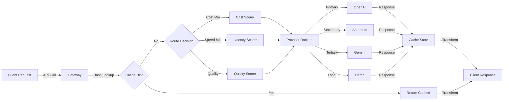
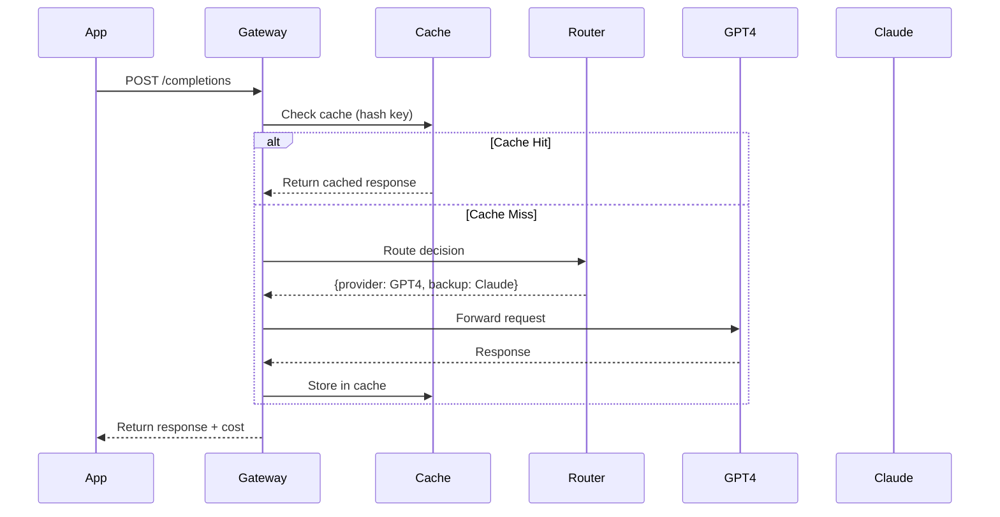

# Multi-Provider LLM API Gateway

## TL;DR
Central router directing requests to cheapest/fastest LLM (GPT-4, Claude, Llama, Gemini). Handles 500K daily requests, load-balanced across 6 providers with fallback, cost optimization (50% savings), and request/response caching.

## Problem Statement
Apps use multiple LLM providers for redundancy and cost. Manual routing is complex. Need intelligent gateway that picks best provider per request based on cost, latency, availability, and quality.

## Requirements

### Functional
- Support 6+ LLM providers (OpenAI, Anthropic, Cohere, Mistral, Llama, Google)
- Cost-aware routing (pick cheapest model for task)
- Fallback chain if provider fails
- Request/response caching (same prompt = cached response)
- Usage tracking and cost allocation
- Request transformation (normalize API formats)

### Non-Functional (Scale Targets)
- Throughput: 500K requests/day = 6 QPS avg, 50 QPS peak
- Latency: <1s added overhead (routing + cache lookup)
- Availability: 99.95% (must handle provider outages)
- Cost: <$0.001 per request (routing overhead)
- Cache hit rate: 20-30% (repeated queries)

## Envelope Calculation

### Request Distribution
- 500K requests/day
- Peak: 9am-5pm, 50 QPS
- Session length: 2-5 messages per user
- Cache hit rate: 25% (125K cached, 375K fresh)

### Cost Breakdown
- 375K fresh requests, 500 tokens avg = 187.5M tokens/day
- GPT-4: 10% of traffic = $0.03/1K → $56/day
- Claude 3: 30% of traffic = $0.001/1K → $56/day
- Gemini 2.0: 40% of traffic = $0.0005/1K → $37/day
- Llama (local): 20% of traffic = $0 → $0
- Total: ~$150/day = $4.5K/month

### Cache Impact
- 125K cached responses (instant) = $0 LLM cost
- Savings: 25% × $150 = $37.50/day = $1,125/month
- Effective cost: $3.4K/month

### Storage
- Cache: 125K responses × 2KB avg = 250MB (Redis)
- Logs: 500K × 0.5KB = 250MB/day (7-day retention = 1.75GB)

## High-Level Architecture

## Component Breakdown

### Request Router
- Evaluates: cost, latency, availability, task type
- Decision logic:
  - Summarization → Cheaper model (Gemini, Claude)
  - Code generation → Best model (GPT-4)
  - Translation → Any model (cost-optimal)
- Latency: 10-20ms decision time

### Provider Abstraction Layer
- Normalizes different API formats to unified schema
- Request: {model, prompt, temperature, max_tokens, tools, ...}
- Response: {content, usage, cost, provider, ...}
- Handles provider-specific quirks (streaming, function_calling, etc.)

### Response Cache
- DB: Redis (hot cache) + PostgreSQL (cold archive)
- Key: hash(model_id + prompt + temperature + top_k)
- TTL: 30 days (configurable per request)
- Cache hit check: 50ms lookup

### Fallback Chain
- Primary provider fails → try secondary
- Retry logic: exponential backoff with jitter
- Timeout per provider: 30 seconds
- All fallbacks logged for analysis

### Cost Allocator
- Track cost per: user, app, model, task type
- Daily cost report
- Enforce cost caps per user/app
- Volume discounts: if >1M tokens/day → negotiate bulk rate

## AI/ML Integration Points

1. **Intelligent Routing**:
   - Analyze request (task type, complexity, latency requirement)
   - Score each provider: cost(0-100) × latency(0-100) × availability(0-100)
   - Pick top-ranked provider + 2 backups
   - Example: coding task → GPT-4 (best quality), backup: Claude (similar), fallback: local Llama

2. **Provider Selection Rules**:
   - Default: cost-optimal (Gemini/Claude for most tasks)
   - If latency <500ms critical: fastest provider (local Llama)
   - If quality critical: best model (GPT-4)
   - User-override: "use GPT-4 only" → enforce

3. **Caching Strategy**:
   - Cache keys: normalize different prompt formats
   - Example: GPT-4's "system message" vs Claude's "instruction" → unified representation
   - Invalidate: if system prompt changes or docs update

4. **Cost Optimization**:
   - Dynamic pricing: negotiated rates for high-volume customers
   - Batch requests: accumulate 100 requests, send in batch (cheaper)
   - Model distillation: smaller model for simple tasks (Phi vs GPT-4)

## Data Flow

## Key Trade-offs

| Decision | Option A | Option B | Choice |
|----------|----------|----------|--------|
| Cache TTL | 1 day | 30 days | 30 days (high hit rate, low freshness risk) |
| Fallback | 1 provider | 3 providers | 2-3 providers (availability vs complexity) |
| Cost optim | Model selection | Batching | Both (selection: 40% savings, batching: 10% more) |
| Routing latency | 5ms (heuristic) | 50ms (ML-based) | Heuristic (5ms enough, ML overhead not worth it) |
| Local fallback | Run Llama locally | Don't use local | Local (covers 20% of traffic, reduces provider cost) |

## Interview Q&A

**Q1: How do you handle rate limiting from providers?**

A: Track RateLimitError from each provider. When hit, exponential backoff (retry after 2^n seconds). Redirect traffic to other providers. Alert ops if provider's quota exhausted. Negotiate higher limits based on usage. Implement client-side rate limiting to prevent bursting.

**Q2: A user wants GPT-4 only, but you route to cheaper model. How do you balance?**

A: Add request header: 'provider-preference: GPT-4-only' or 'cost-optimal'. Charge user accordingly. Default is cost-optimal with toggle. Premium tier gets guaranteed provider choice.

**Q3: How do you prevent cache poisoning from bad responses?**

A: Quality check before caching: validate response length, check for truncation, validate JSON if applicable. Cache only responses that pass quality gates. Manual review for flagged responses. If bad response detected later, invalidate that cache entry.

**Q4: Cost comparison: 5K users × 50 tokens/day = 250K tokens/day. GPT-4 vs Gemini cost?**

A: GPT-4: 250K tokens × $0.015/1K = $3.75/day. Gemini: 250K × $0.0005/1K = $0.125/day. Gateway routes 80% to Gemini, 20% to GPT-4 → (250K × 0.8 × $0.0005) + (250K × 0.2 × $0.015) = $1.1/day. Savings: 70%.

**Q5: How do you handle provider API changes (deprecated endpoints)?**

A: Version all provider APIs in gateway. When provider deprecates endpoint, gateway maps old request to new format. Gradual migration: test new format with 10% traffic, then 50%, then 100%. Maintain backward compatibility for clients.

**Q6: Multi-region fallback: gateway in US but EU user. Route to EU provider?**

A: Yes, add geographic affinity scoring. EU request → EU providers get bonus score (lower latency, data residency compliance). Fallback chain respects geo preference. Trade-off: might cost 5-10% more but worth it for latency + compliance.

**Q7: Can you cache responses for different temperatures? (Same prompt, different randomness)**

A: No—cache key must include temperature. temperature=0 → deterministic, cache 30 days. temperature=0.5 → different response each time, cache 1 hour. temperature=1.0 → very random, don't cache.

**Q8: What if response is streaming (tokens arrive incrementally)?**

A: Streaming responses can't be cached (partial arrival). Gateway can cache summary of streamed response after completion. Alternative: cache last 1KB of common streaming patterns. Trade-off: cache miss for streaming, gain latency for non-streaming.

## Interview Quick-Reference

| Item | Detail |
|------|--------|
| **Providers** | GPT-4, Claude 3, Gemini 2.0, Llama, Cohere, Mistral |
| **Cost Savings** | 50-70% via routing + caching |
| **Latency Overhead** | <20ms routing, 10ms cache lookup |
| **Cache Hit Rate** | 25% (saves $1.1K/month on 5K users) |
| **Fallback Chain** | Primary → Secondary → Local Llama |
| **Default Strategy** | Cost-optimal with user override |

## Related Systems
- 01-llm-customer-service.md (gateway user)
- 04-llm-finetuning.md (model selection)
- 25-ai-observability.md (gateway monitoring)
