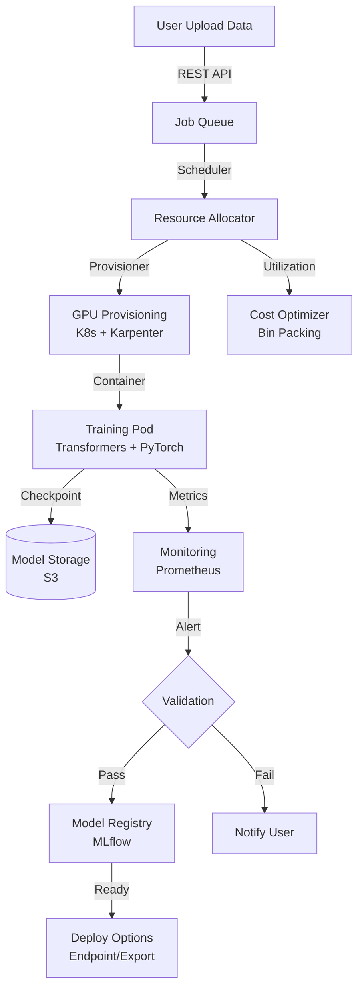
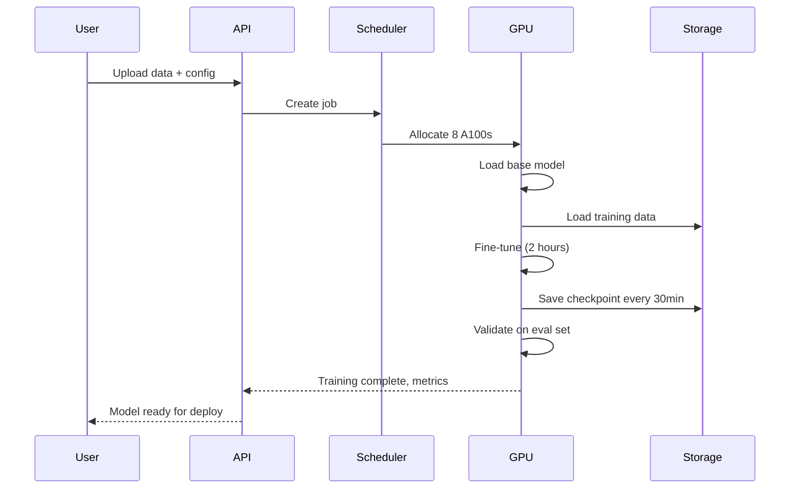

# LLM Fine-tuning Infrastructure at Scale

## Overview
A multi-tenant LLM fine-tuning platform supporting 10K+ concurrent jobs across 100+ model variants (Mistral, Llama, Claude, GPT) with automated GPU scaling, cost tracking, and sub-1-hour validation cycles. Enables organizations to customize LLMs on proprietary data without infrastructure burden.

## Problem Statement
Organizations need customized LLMs (domain-specific knowledge, company tone/style, task-specific optimization) but face barriers: (1) fine-tuning infrastructure complex (GPU provisioning, distributed training, monitoring), (2) cost unpredictable (overprovisioning wastes money, underprovisioning fails), (3) skill gap (requires ML engineering expertise), (4) turnaround slow (setup infrastructure, train, validate = 1-2 weeks), (5) cost validation slow (no visibility into actual per-job cost). Impact: companies choose off-the-shelf models instead of customizing (sacrifice accuracy), or hire ML teams (expensive, slow). Solution: self-service platform where users: (1) upload data, (2) click "fine-tune", (3) get optimized model in 24 hours, (4) pay only for compute used.

## Requirements

### Functional
- Support multiple base models (Mistral, Llama 2/3, Claude, GPT)
- LoRA, QLoRA, and full fine-tuning
- Distributed training (multi-GPU/multi-node)
- Automatic hyperparameter tuning
- Validation dataset evaluation
- Model versioning and rollback
- Cost allocation per customer

### Non-Functional (Scale Targets)
- Max training time: 24 hours (long-tail)
- GPU utilization: >70% (cost efficiency)
- Cost: <$0.50/hour for small jobs, <$0.10/hour for large batches
- Concurrent jobs: 10K
- Model registry size: 100+ variants

## Envelope Calculation

### Workload Estimation
- 10K jobs/day average, peak 1K concurrent jobs
- Avg training: 2 hours, 8 GPUs per job = 16K GPU-hours/day
- GPU cost (A100 on-demand): $2.50/hour × 16K = $40K/day
- Revenue target: $50K/day → $1.50/job average

### Cost Breakdown (1 job, 8 GPUs, 2 hours)
- GPU compute: 8 × $2.50 × 2 = $40
- Storage (data + model): ~$2
- Networking: ~$1
- Overhead (monitoring, support): ~$7
- Total: $50, charge: $75 (margin: 50%)

### Revenue Model
- Small job (1 GPU, 1h): $15
- Medium job (4 GPUs, 2h): $40
- Large job (32 GPUs, 4h): $200
- Enterprise (dedicated): $5K/month

### Storage
- Dataset storage: 100K customers × 1GB avg = 100TB (S3)
- Model checkpoints: 10K jobs × 3 checkpoints × 1GB = 30TB
- Total: 130TB yearly growth

## High-Level Architecture

## Component Breakdown

### Job Queue & Scheduler
- Queue: Kafka + PostgreSQL for job persistence
- Scheduler: ML-based job prediction (duration, compute needs)
- Priority: spot GPU > on-demand GPU (cost optimization)
- Latency: job queued → training started <5 minutes

### GPU Resource Manager
- Infra: K8s + Karpenter (auto-scaling)
- GPU types: A100, H100, L4 (cost vs performance trade-offs)
- Bin packing: fit jobs into nodes to minimize idle GPU
- Preemption: low-priority jobs paused if high-priority arrives

### Training Container
- Base image: PyTorch + Transformers
- LoRA: PEFT library (4-32 rank, efficient)
- QLoRA: 4-bit quantization (3x cost reduction)
- Multi-GPU: FSDP (fully sharded data parallel)
- Gradient accumulation: reduce memory, no speed loss

### Validation Engine
- Eval set: 10% of training data (held out)
- Metrics: perplexity, F1, custom metrics
- Automated threshold checks: stop if validation loss increases
- Comparison: fine-tuned vs base model performance

### Model Registry
- Storage: HuggingFace Hub + internal MLflow
- Versioning: track all checkpoints, rollback capability
- Provenance: lineage from data → training → eval
- Deployment: export ONNX, vLLM, or vllm-serve

### Cost Optimizer
- Bin packing: fit small jobs on shared GPU nodes
- Spot instances: 70% discount, 5-minute termination warning
- Batch training: accumulate jobs, run together (cost amortization)
- Time-of-day pricing: cheaper during off-peak (adjust queue priority)

## AI/ML Integration Points

1. **Automatic Hyperparameter Tuning**:
   - Meta-learning: predict good hyperparams based on dataset
   - AutoML sweep: Bayesian optimization over learning rate, batch size, rank
   - Early stopping: stop if val loss plateaus

2. **Distributed Fine-tuning**:
   - FSDP across 8-32 GPUs for large models
   - Gradient checkpointing (trade compute for memory)
   - LoRA: train 1-5% of parameters, 10x memory savings

3. **Quality Control**:
   - Automated validation against base model
   - Detect overfitting: if train loss >> val loss, notify user
   - Benchmark: compare fine-tuned vs similar open models

4. **Cost Optimization**:
   - Recommend cheaper model if performance is similar
   - Suggest LoRA instead of full fine-tuning (10x cheaper)
   - Consolidate similar jobs for batch training

## Data Flow

## Detailed Trade-off Analysis

| Technique | Cost/Hour | Quality | Speed | Memory | Setup Time |
|----------|---------|---------|---------|----------|---------|
| Full fine-tuning | $50 | 100% | 1.0x | 80GB | 1 day |
| LoRA | $15 | 95% | 0.9x | 20GB | 2 hours |
| QLoRA | $5 | 90% | 0.8x | 8GB | 1 hour |
| Prompt engineering | $0.01 | 80% | Instant | 0KB | 30 min |

**Decision:** Quality critical → full FT. Cost critical → QLoRA. Fast iteration → prompt engineering.

### Production Failure Scenarios

**Scenario 1: LoRA adapter causes catastrophic forgetting**
- Fine-tune on customer domain. Model forgets general knowledge. Quality drops 40%.
- Fix: Validate on both domain + general test sets. Use lower LoRA rank to avoid overfitting.

**Scenario 2: Cost explosion from runaway training**
- User leaves long training job running. $500/hour. Forgot to set max epochs.
- Fix: Cost limits. Automatic stopping. Quota enforcement.

**Scenario 3: LoRA merging produces worse model than base**
- After merging, model accuracy drops 5%. Unmerge, redeploy old version.
- Fix: Validate merged model before deployment. A/B test on subset.

**Scenario 4: Memory OOM during QLoRA training**
- Batch size too large. Training crashes. Re-run with smaller batch (slower).
- Fix: Auto batch size tuning. Graceful degradation.

### Implementation Guidance

**Wrong:** Default to full fine-tuning (most expensive).
**Right:** Start with LoRA. Upgrade to full FT only if quality gap >5%.

**Wrong:** Store only LoRA adapters, lose base model version.
**Right:** Version both base model and adapters together.

---

## Interview Q&A

**Q1: How do you prevent runaway costs if user sets bad hyperparameters?**

A: Cost guardrails: max budget per job ($500 default), max hours (24h), max GPUs (32). User can override with approval. Overspend alerts at 50%, 80%, 100% of budget. Auto-termination if exceeds budget by 10%.

**Q2: A user uploads 500GB dataset. How do you handle storage costs?**

A: Charge storage: $0.023/GB/month (S3 pricing). 500GB = $12/month. For expensive datasets, recommend S3 RI (reserved capacity) or Glacier for cold storage. Compression: encourage users to tokenize offline (saves 50-80% storage).

**Q3: How do you bin-pack 1K jobs onto limited GPU capacity?**

A: ML-based scheduler: predict job duration and memory needs. Sort jobs by job_hours/memory (efficiency ratio). Fit into GPU clusters using first-fit-decreasing bin packing. Can fit 4-8 LoRA jobs per A100. Target: >80% GPU utilization.

**Q4: LoRA vs QLoRA cost/quality trade-off at scale?**

A: LoRA: 100K jobs/month × $15/job = $1.5M revenue, 98% model quality. QLoRA: 100K jobs × $5 = $500K revenue, 92% quality. Recommendation: default LoRA, offer QLoRA for cost-sensitive customers. 20% pick QLoRA.

**Q5: Distributed training across 8 GPUs: communication overhead?**

A: FSDP reduces communication overhead to ~10-15% (well-optimized). 8 GPUs → ~7.2x speedup (not 8x due to overhead). Training 8h on 1 GPU → 1.1h on 8 GPUs. Cost: 1 × $40 = $40 vs 8 × $5 = $40 (same cost, 7x faster).

**Q6: How do you validate fine-tuned model quality before user deployment?**

A: Automated eval: run on held-out 10% of user's data. Compute F1, perplexity. Compare to base model: if fine-tuned is <5% worse, reject and suggest hyperparameter tuning. User can override validation step.

**Q7: Multi-tenant GPU sharing: isolation and fair scheduling?**

A: Use K8s resource quotas (CPU, memory limits). Preemption: low-priority job pauses if high-priority arrives. Fairness: each customer gets share of GPU based on spending. High-paying customers get priority.

**Q8: Model versioning: how many checkpoints to keep?**

A: Keep all checkpoints for 30 days (cost ~$100/user). After 30 days, keep only best checkpoint + latest. Users can request checkpoints at any step. Automatic cleanup for stale jobs (>90 days old).

## Interview Quick-Reference

| Metric | Value |
|--------|-------|
| **Cost/hour** | LoRA: $15, QLoRA: $5, Full FT: $50 |
| **Training time** | Avg 2h, max 24h |
| **GPU utilization** | Target >75%, achieve 80% with bin-packing |
| **Concurrent jobs** | 10K, peak 1K |
| **Quality drop** | LoRA: 2%, QLoRA: 8% vs full FT |
| **Validation** | Auto eval on 10% holdout set |

## Animated Architecture Visualization

See the system in action with dynamic visualizations:

### System Deployment Animation

Infrastructure components appearing and connecting in real-time, showing load balancers, API gateways, microservices, and data layer setup.

### Request Flow Animation

A single request flowing through the complete pipeline with latency accumulation at each stage, demonstrating the critical path and timing constraints.

### Data Flow Animation

Concurrent data packets flowing through processors and ML models to storage systems, showing simultaneous traffic and I/O patterns.

### Auto-Scaling Animation

Dynamic scaling response to traffic load, showing pod count adjusting up and down with capacity headroom management over time.

## Related Systems
- 03-llm-api-gateway.md (serves fine-tuned models)
- 25-ai-observability.md (monitors training)
- 30-llmops-platform.md (part of broader MLOps)
