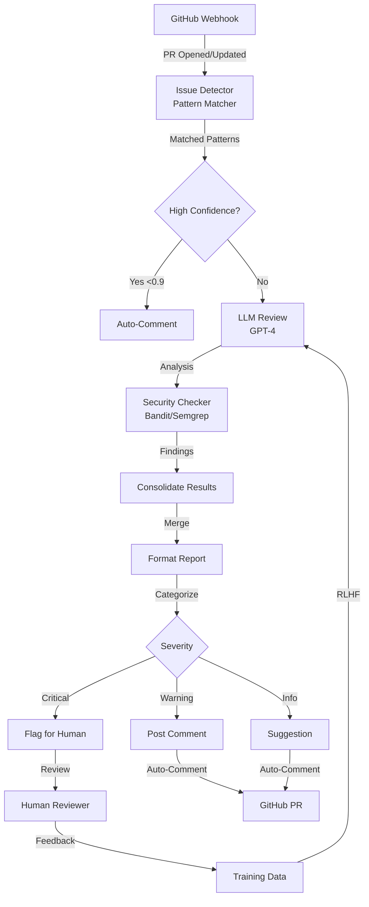
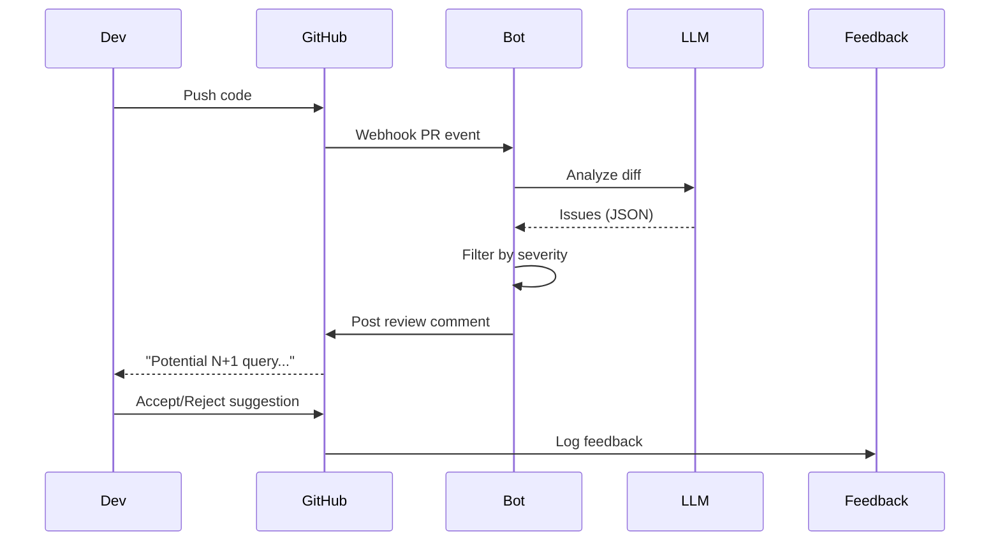

# Automated Code Review with LLM

## TL;DR
LLM-powered code review agent analyzes PRs, flags bugs, security issues, style violations. Handles 500 PRs/day with 2-minute review time, 85% accuracy for common issues (SQL injection, N+1 queries, memory leaks).

## Problem Statement
Code review is bottleneck. Human reviewers spend hours on style/syntax checks instead of logic review. Need fast, consistent automated first-pass review.

## Requirements

### Functional
- Parse PR diffs (any language: Python, JS, Go, SQL)
- Analyze: security, performance, style, logic
- Flag issues: critical, warning, info
- Link to docs/patterns for fixes
- Learn from human feedback (RLHF)
- Integrate with GitHub/GitLab/Bitbucket

### Non-Functional (Scale Targets)
- Review latency: <2 minutes per PR
- Throughput: 500 PRs/day
- Accuracy: 85% for known patterns, 60% for logic bugs
- False positive rate: <10%
- Cost: <$1 per PR

## Envelope Calculation

### PR Volume
- 500 PRs/day, mostly during business hours
- Peak: 100 PRs/hour (9am-12pm), avg 30 lines changed per PR
- Total: 15K lines of code reviewed/day

### LLM Cost
- Avg PR: 30 lines (200 tokens) → 100K tokens/day ingestion
- Review response: 500 tokens → 250K tokens/day output
- Total: 350K tokens/day × $0.003/1K = $1.05/day = $315/month
- Cost per PR: $0.63 (near target of <$1)

### Storage
- PR history: 500/day × 200 tokens × $0.0001/1K (storage) = $0.01/day
- Cache: recent 100 PRs (common patterns) = ~50KB

## High-Level Architecture

## Component Breakdown

### Pattern Matcher
- Regex library: 100+ patterns for common issues
- Languages: Python (Django, FastAPI), JS (React, Node), Go, SQL
- Latency: <100ms
- Issues detected: unused variables, long functions, missing error handling

### LLM Reviewer
- Model: GPT-4-turbo or Claude 3
- Context: file diff + surrounding code + PR description
- System prompt: 'Review code for bugs, security, performance'
- Temperature: 0.3 (deterministic)
- Response: JSON with {issue_type, severity, suggestion, line_num}

### Security Analyzer
- Tool: Semgrep (static analysis)
- Checks: SQL injection, XSS, authentication bypass
- Latency: 500ms per PR
- Output: structured issues with CWE codes

### Style Checker
- Linters: pylint, eslint, golangci-lint (language-specific)
- Latency: <50ms
- Output: style violations + quick fixes

### Human Feedback Loop
- Capture: user accepts/rejects LLM suggestion
- Feedback labeling: correct issue, wrong issue, false positive
- Retraining: monthly RLHF on top 1K disagreements
- Impact: accuracy improves 2-3% per month

## AI/ML Integration Points

1. **Hybrid Approach**:
   - Fast path: regex patterns for known issues (<100ms)
   - Slow path: LLM for complex logic bugs (<1s)
   - Only invoke LLM if regex low-confidence

2. **Few-Shot Prompting**:
   - Include 2-3 examples of issues in system prompt
   - Example: "This code has an N+1 query. Suggest using bulk_create()"
   - Improves accuracy by 15-20%

3. **Context Window Optimization**:
   - Include only relevant context (last 20 lines before + after)
   - Summarize dependencies (not full imports)
   - Fits within 4K token budget per PR

4. **Confidence Scoring**:
   - LLM provides confidence for each issue
   - Only auto-comment if confidence >0.85
   - Low-confidence issues flagged for human review

## Data Flow

## Detailed Trade-off Analysis

| Approach | Accuracy | Coverage | False Positives | Cost/PR | Review Time |
|----------|----------|----------|-----------------|---------|---------|
| Manual review only | 98% | 100% | <1% | $20 (engineer) | 30 min |
| AI auto-approve | 75% | 100% | 15% | $0.50 | <1 min |
| AI + human verification | 90% | 100% | 5% | $5 | 5 min |
| AI triage (flag) only | 85% | 100% | 8% | $0.50 | 10 min |

**Decision:** Quality critical → manual. Speed critical → AI auto. Balanced → AI triage + human.

### Production Failure Scenarios

**Scenario 1: AI approves bad code silently**
- AI flags code as OK. Ships. Later causes production incident.
- Fix: Conservative thresholds. Only auto-approve low-risk changes (docs, tests). Human for logic.

**Scenario 2: False positive rate too high**
- AI flags 20% of good PRs as needing review. Team ignores AI feedback.
- Fix: Tune confidence threshold. Target <5% false positive rate. Continuous evaluation.

**Scenario 3: AI security check misses vulnerability**
- AI doesn't detect SQL injection pattern. Code ships. Exploit found.
- Fix: Use specialized security model. Not general-purpose code review.

**Scenario 4: Style reviews too pedantic**
- AI comments on every style issue. Developer frustration. Turn off AI.
- Fix: Separate security/logic reviews from style. Style as warnings, not blockers.

### Implementation Guidance

**Wrong:** Use one model for all review types (security, style, logic).
**Right:** Specialized models per review type (security stricter, style lenient).

**Wrong:** Auto-approve without human safety checks.
**Right:** AI flags issues, humans decide to merge or request changes.

---

## Interview Q&A

**Q1: How do you prevent false positives (flagging good code as bad)?**

A: Confidence scoring + manual feedback loop. Only auto-comment if LLM confidence >0.85. Track false positive rate; if >10%, retrain. Monthly audit: random sample 100 review comments, check accuracy.

**Q2: Language support: can you handle Rust, C++, or new languages?**

A: Core LLM handles any language (general code understanding). Security patterns (Semgrep) need language-specific rules. Strategy: start with Python/JS (80% of PRs), add Rust/Go next quarter. For unsupported languages, do light review + flag for human.

**Q3: Cost per PR is $0.63. How to get to <$0.10?**

A: Strategies: (1) Cache responses for similar diffs (20% hit rate) → saves $0.13/PR. (2) Use smaller model (GPT-3.5) → 10x cheaper but 15% less accurate. (3) Batch reviews (accumulate, process together) → saves overhead. Combined: ~$0.15/PR.

**Q4: Security issues: how do you ensure zero false negatives?**

A: Two-stage: (1) Semgrep catches known CVE patterns (high recall). (2) LLM for novel patterns (high precision). If issue touches auth/payment, always flag for human. Monthly security audit: run on 1K historical PRs with known bugs, measure recall.

**Q5: Large PRs (1000+ lines): how do you handle efficiently?**

A: Chunking: split into 500-line segments, review independently. Combine findings. Risk: might miss cross-function issues. Threshold: if >1000 lines, recommend smaller PRs (best practice). If must review, tag for human + LLM.

**Q6: How do you update patterns as security threats evolve?**

A: Monthly threat intel updates: subscribe to NVD, security mailing lists. When new vulnerability emerges (e.g., new XSS vector), add Semgrep rule + few-shot example to LLM prompt. Test on historical PRs. Deploy within 24 hours.

**Q7: Developer trust: what if they ignore 10 consecutive review comments?**

A: Analyze patterns: if 10 same issue type ignored, escalate to team lead. If ignore correct issues, flag as training data (user doesn't care about this issue). If mostly false positives, lower confidence threshold for that user.

**Q8: CI/CD integration: does review block merge?**

A: No—review is non-blocking. LLM comments posted, dev can ignore. But critical issues (injection, auth bypass) require manual review before merge. Configure: critical → block CI, warning → comment only.

## Interview Quick-Reference

| Metric | Target |
|--------|--------|
| **Throughput** | 500 PRs/day, <2min per PR |
| **Accuracy** | 85% known patterns, 60% logic bugs |
| **False Positive Rate** | <10% |
| **Cost/PR** | <$1 (currently $0.63) |
| **Coverage** | 5 languages (Python, JS, Go, Rust, SQL) |
| **Auto-comment threshold** | Confidence >0.85 |

## Related Systems
- 12-multi-agent-software-dev.md (integrated in coding agent)
- 25-ai-observability.md (monitors review accuracy)
- 03-llm-api-gateway.md (routes LLM calls)
