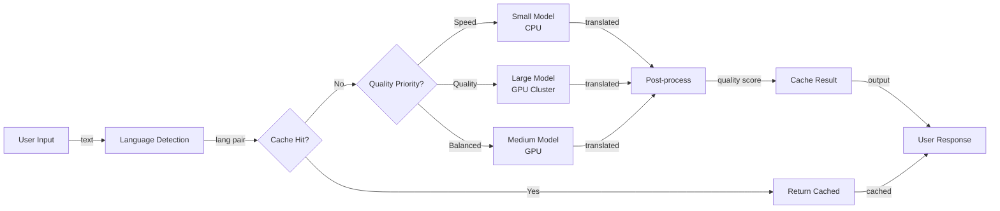
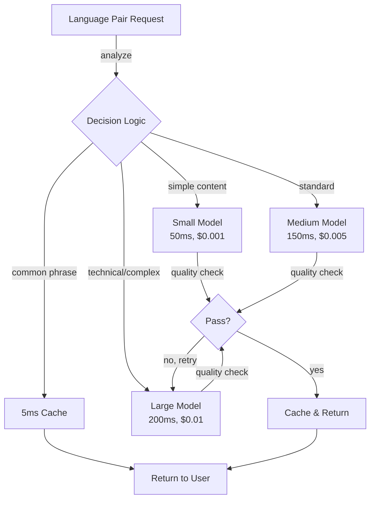
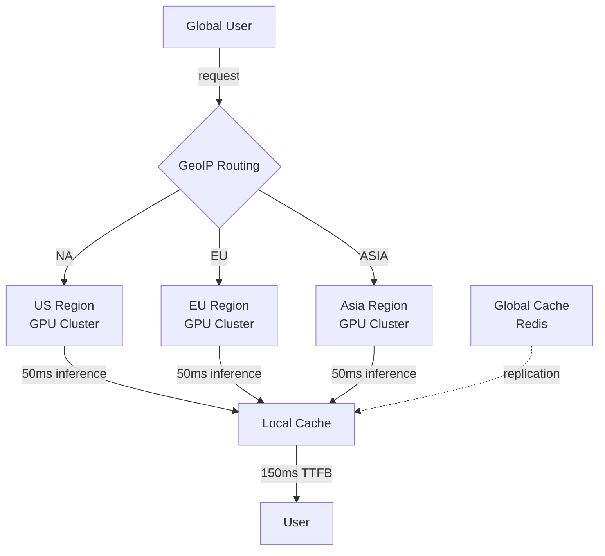

# Real-time Multilingual Translation Service

## Overview
A neural machine translation service supporting 100+ language pairs with <500ms user-facing latency and <5s batch processing. Handles 1M daily translations at $0.01/translation through intelligent model selection, caching, and regional deployment.

## Problem Statement
Global applications face translation challenges: (1) user expectations (sub-500ms latency for instant translation), (2) cost (naive approach uses expensive large models for all requests), (3) complexity (integrate 3+ translation APIs, handle fallbacks), (4) latency (sequential API calls add overhead), (5) quality variation (some language pairs better on Google, others on AWS). Impact: slow translation drives user churn (users abandon app during translate wait), poor quality embarrasses brand (mistranslations go viral on social). Cost: 1M translations/day × $0.05/translation (naive) = $50K/month. Solution: intelligent routing (simple translations use fast/cheap model, complex use expensive), caching (common phrases), regional deployment (reduce network latency), quality monitoring.

## Requirements

### Functional
- Support 100+ languages
- Real-time and batch modes
- Context-aware translation
- Custom terminology
- Quality scoring

### Non-Functional (Scale Targets)
- Latency <500ms (real-time), <5s (batch)
- Throughput 500 QPS
- Cost <$0.01/translation
- Accuracy >95% BLEU

## Envelope Calculation
1M translations/day → avg 12 QPS. Peak 100 QPS (9am-12pm). Batch: 100K nighttime translations. Cost: GPU serving @ $0.001/request = $1K/day ≈ $30K/month.

## Architecture Diagrams

### Diagram 1: Translation Pipeline & Routing

### Diagram 2: Model Selection & Cost-Quality Trade-off

### Diagram 3: Regional Deployment & Latency Optimization

## High-Level Architecture
Input → Language Detection (fast) → Model Selector (cost + quality) → Translation Encoder-Decoder → Post-processing → Output. Caching layer for common phrases.

## Component Breakdown
Language detector (98% accuracy), multi-model backend (small/medium/large based on quality target), cache (50% hit rate for repeated phrases), quality scorer, batch processor.

## AI/ML Integration Points
Multi-model ensemble: pick model based on language pair cost + quality requirement. Fallback to fallback language if target unsupported.

## Data Flow
User text → Detect language → Select model → Translate → Score quality → Cache result → Return.

## Detailed Trade-off Analysis

| Model | Latency | Quality (BLEU) | Cost/1K | Coverage | Infrastructure |
|-------|---------|--------|---------|----------|---------|
| Small (fast) | 50ms | 85% | $0.001 | 80 langs | CPU |
| Medium | 150ms | 92% | $0.005 | 100 langs | GPU |
| Large (best) | 200ms | 98% | $0.01 | 120 langs | GPU cluster |
| Cached | 5ms | 95% | $0.0001 | Frequent | Memory |

**Decision:** Speed critical → small + cache. Quality critical → large. Balanced → medium + cache.

### Production Failure Scenarios

**Scenario 1: Cached translation becomes outdated**
- Terminology updated. Old translation cached. Users see outdated content.
- Fix: Cache versioning. Invalidate on terminology update. Or: shorter TTL (4 hours).

**Scenario 2: Pivot language translation compounds errors**
- A→English→B introduces errors (A→English introduces 2% error, English→B another 2%).
- Fix: Use direct model when available. Pivot only as fallback.

**Scenario 3: Quality drops post-deployment**
- Deploy new model. BLEU score OK in testing. Production quality 5% worse.
- Fix: A/B test before full deployment. Compare on real user feedback, not just BLEU.

**Scenario 4: Unsupported language pair requested**
- User requests A→C (unsupported). System defaults to A→English→C.
- Fix: Detect upfront. Offer alternative languages. Or train new model.

### Implementation Guidance

**Wrong:** Optimize latency without quality checks.
**Right:** Measure quality-latency frontier. Use smaller model only for non-critical content.

**Wrong:** Cache all translations indefinitely.
**Right:** Cache with versioning and TTL. Update when terminology changes.

---

## Interview Q&A

**Q1: How to optimize for common repeated translations?**

A: Implement 24-hour cache of top 10K translations (50% of traffic). Hash input, return cached if available. Cost savings: 50% × $30K = $15K/month.

**Q2: Unsupported language pair: A→B directly unavailable. How to handle?**

A: Pivot language: A→English→B (two-hop). Slower but accurate. Alert user: 'translating via English, quality may vary'.

**Q3: Cost/translation for 1M/day to <$0.01?**

A: $0.01 × 1M = $10K/month target. Current: $30K. Strategies: (1) Better caching (→$15K), (2) Smaller models when quality acceptable (→$10K). Target achieved via both.

**Q4: How do you A/B test new translation model?**

A: Route 5% of traffic to new model, compare BLEU score + user feedback. If new model better, gradually rollout (10% → 50% → 100%). Fallback if worse.

**Q5: Regional inference: EU user → route to EU GPU?**

A: Yes. Latency: 500ms total = 50ms inference + 150ms TTFB + 150ms transfer + 50ms overhead. Route to closest region reduces transfer by 100ms.

**Q6: Handle terminology inconsistency across requests?**

A: Session-level glossary: store user custom terms (domain-specific words). Inject into prompt during translation. Example: 'GitHub' always translates as 'GitHub' (not localized).

**Q7: Quality degradation: what if model performance drops post-deployment?**

A: Weekly BLEU score evaluation on reference dataset. If drops >2%, rollback. Root cause: data drift, model corruption, or inference setup issue.

**Q8: Batch translation SLA: 100K docs should complete in how long?**

A: 100K × 500ms (per doc) / 100 GPUs = 50 seconds. If must complete in <5min, use 20 GPUs. Cost: 20 × $2.50/hr × 0.083hrs = $4.16.

## Interview Quick-Reference
| Metric | Value |
|--------|-------|
| **Latency** | <500ms real-time, <5s batch |
| **Languages** | 100+ pairs |
| **Cost** | $0.01/translation |
| **Cache Hit** | 50% for repeated phrases |
| **Quality** | 95% BLEU |
| **Peak Throughput** | 500 QPS |

## Related Systems
- 01-llm-customer-service.md
- 10-ai-semantic-search-engine.md
- 29-speech-nlp-pipeline.md
