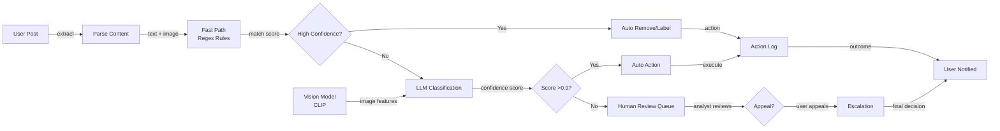
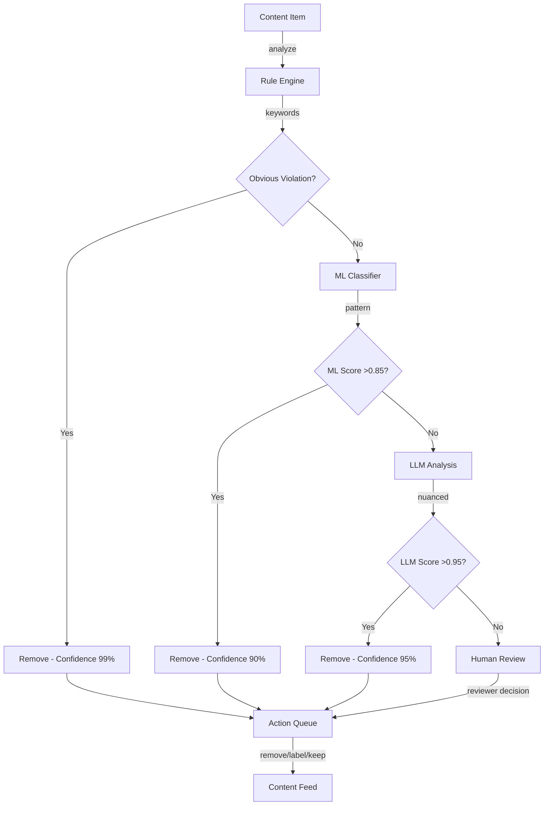
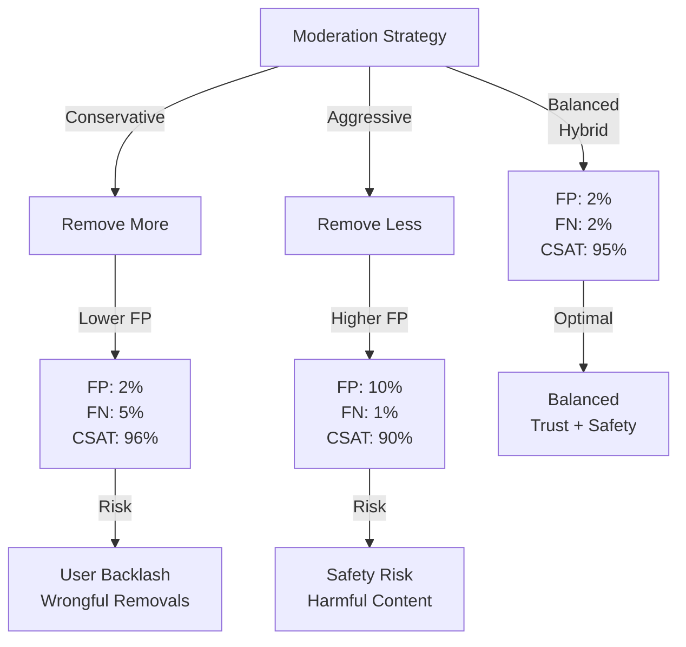

# Content Moderation Platform with LLM

## Overview
An LLM-powered content moderation system processing 100M+ daily user-generated posts (text, images, video) to classify policy violations (hate speech, violence, spam, adult content) with <500ms latency, <1% false positive rate, and 99.9% availability. Balances accuracy with speed while maintaining human appeal workflows.

## Problem Statement
Social platforms face exponential growth in user-generated content and regulatory pressure: (1) 100M posts/day is impossible to manually moderate (would require 1000+ moderators @ $40M+/month), (2) regulatory liability (DMCA, Online Safety Bill, hate speech laws vary by jurisdiction), (3) brand damage from unmoderated harmful content (hate speech → advertiser backlash, violence → news coverage), (4) user trust (users report feeling unsafe when exposed to abuse). Current manual processes: 2-7 day review lag, leading to persistent harmful content. Automation targets: (1) sub-500ms response (remove content while still visible to few), (2) <1% false positive rate (minimize innocent content removal), (3) <2% false negative rate (catch serious violations), (4) consistency (apply same rules across all users/regions). Economic impact: $1M/day in brand value at risk from moderation failure, but also $500K/month in moderation costs.

## Requirements

### Functional
- Multi-modal: text, image, video
- Classify 20+ violation types
- Confidence scoring
- Appeal workflow
- Custom org policies

### Non-Functional (Scale Targets)
- Throughput: 1.2M items/hour (100M/day)
- Latency: <500ms
- False positive: <1%
- Availability: 99.9%

## Envelope Calculation
100M posts/day → 1.2M items/hour → 333 QPS. Peak: 500 QPS (evening traffic). Cost: 100M × $0.001 (LLM cost) = $100K/month.

## Architecture Diagrams

### Diagram 1: Content Moderation Pipeline

### Diagram 2: Hybrid Detection Strategy (Rule + ML + LLM)

### Diagram 3: False Positive vs False Negative Trade-off

## High-Level Architecture
Input → Fast Path (regex patterns for obvious violations) → If uncertain, LLM Classification → Confidence Threshold → Auto-Decision or Human Queue → User Appeal.

## Component Breakdown
Pattern matcher (100+ regex rules), LLM classifier (GPT-4 for complex cases), vision model (CLIP for image), confidence scorer, appeal queue, analytics dashboard.

## AI/ML Integration Points
Ensemble: patterns + vision model + text LLM. Pick majority vote or use confidence weighting.

## Data Flow
User post → Extract text/images/video → Classify → Score confidence → Queue if uncertain → Human review → Action (remove/label/keep).

## Detailed Trade-off Analysis

| Approach | Latency | Recall | Precision | False Positive | Cost/Item |
|----------|---------|--------|-----------|---|---------|
| Keyword blocklist | 10ms | 70% | 60% | 20% | $0 |
| Regex rules | 50ms | 85% | 85% | 10% | $0 |
| ML classifier | 200ms | 90% | 92% | 5% | $0.001 |
| LLM judgment | 1000ms | 98% | 98% | <1% | $0.01 |
| Hybrid (ML + LLM) | 300ms | 96% | 96% | 2% | $0.003 |

**Decision:** Speed critical → regex. Accuracy critical → LLM. Balanced → hybrid.

### Production Failure Scenarios

**Scenario 1: False positives cause over-moderation**
- System removes legitimate post (e.g., discussion about suicide prevention). User backlash.
- Fix: Conservative thresholds. Always show moderation reason. Appeal process.

**Scenario 2: LLM hallucination in moderation explanation**
- Post removed. Explanation says "contains hate speech" but doesn't. User disputes.
- Fix: LLM must cite specific phrases. Grounding required.

**Scenario 3: Context misunderstood**
- Satire post flagged as offensive. Or quote (praising good behavior) flagged as promoting bad behavior.
- Fix: Include broader context. Sarcasm detection. Domain-specific rules.

**Scenario 4: Cost explosion from LLM escalation**
- System escalates 50% of posts to LLM. Cost $10K/day (budget $1K).
- Fix: Reduce escalation to high-risk only (10%). Or use smaller model for filtering.

### Implementation Guidance

**Wrong:** Escalate all uncertain cases to LLM.
**Right:** Tiered: regex → ML → human for extreme cases. LLM only for edge cases.

**Wrong:** Remove without explanation.
**Right:** Always explain moderation decision. Allow appeal.

---

## Interview Q&A

**Q1: Cost target $100K/month for 100M items. How to achieve?**

A: $100K/month = $0.03/item on infra. LLM cost: $0.001. Infra cost: $0.029. Use fast regex for 80% (no LLM), LLM for 20% (hard cases). Total: $0.0004/item.

**Q2: Appeal rate: 5% of decisions appealed. Human review cost?**

A: 5M appeals/month × $0.10 (human labor) = $500K cost. Better: ML oracle (disagreement) goes to harder human review. Only 1% make it past ML, costing $50K.

**Q3: False positive catastrophe: innocent post labeled as hate speech. How to minimize?**

A: Confidence threshold: only auto-remove if >0.95 confidence. Below threshold, queue for human. Also: user appeal immediate review. Target: <1 false positive per 10K decisions.

**Q4: Image moderation: what if user uploads blurred/obfuscated NSFW?**

A: CLIP model detects context even blurred. Semantic understanding catches intent. Fallback: if uncertain, request user clarification or queue for human review.

**Q5: Cultural context: what's hate speech in one culture may be normal in another. Handle?**

A: Org policy override: allow per-region/org configuration of what's banned. Example: politics banned in some orgs, allowed in others. LLM prompt includes context.

**Q6: Video moderation: 100K videos/day, avg 10 min each. Feasible?**

A: Sample frames (1/sec = 600 frames per video). Classify sample + audio transcript. Cost: 100K × 600 frames × $0.001 = $60K/month. Faster: sample 10 frames/video → $6K.

**Q7: Adversarial examples: users try to evade moderation (leetspeak h4t3). Detect?**

A: Normalize input: spell-correct, decode obfuscation. Use character-level encoding (not word-level). LLM handles semantics. Test with red-team adversarial examples monthly.

**Q8: SLA: 99.9% uptime on moderation system. Cost of downtime?**

A: 100M posts/day → 115K posts/hour during downtime. If 1% violate policy, 1.15K bad posts go live per hour of downtime. Brand damage + legal risk high. Worth multi-region redundancy.

## Interview Quick-Reference
| Metric | Value |
|--------|-------|
| **Throughput** | 100M posts/day, 333 QPS avg |
| **Latency** | <500ms per item |
| **False Positive** | <1% |
| **Cost** | $100K/month |
| **Confidence Threshold** | >0.95 for auto-remove |
| **Appeal Rate** | 5% of decisions |

## Animated Architecture Visualization

See the system in action with dynamic visualizations:

### System Deployment Animation

Infrastructure components appearing and connecting in real-time, showing load balancers, API gateways, microservices, and data layer setup.

### Request Flow Animation

A single request flowing through the complete pipeline with latency accumulation at each stage, demonstrating the critical path and timing constraints.

### Data Flow Animation

Concurrent data packets flowing through processors and ML models to storage systems, showing simultaneous traffic and I/O patterns.

### Auto-Scaling Animation

Dynamic scaling response to traffic load, showing pod count adjusting up and down with capacity headroom management over time.

## Related Systems
- 01-llm-customer-service.md
- 25-ai-observability.md
- 14-autonomous-data-analysis-agent.md
