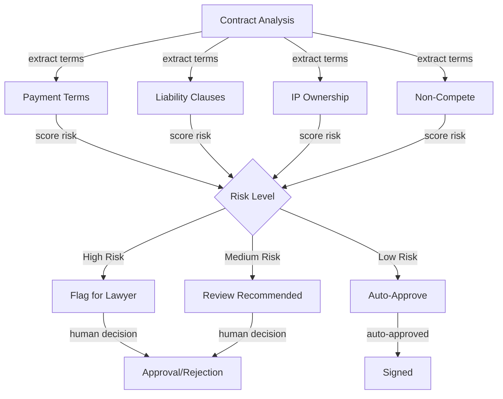
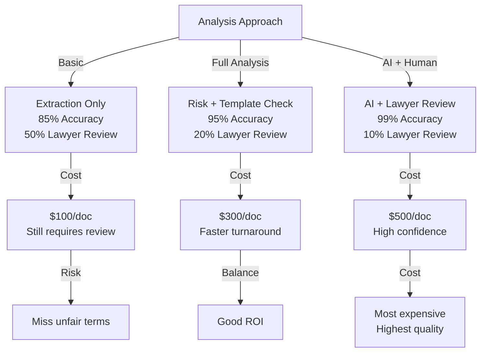

# AI Legal Document Analysis & Contract Review

## Overview
An LLM-powered legal document analysis system extracting key contract clauses, flagging risks, and providing compliance checks across 10K+ monthly documents with 95% accuracy and sub-2-minute review time. Reduces legal review costs by 80% while maintaining accuracy.

## Problem Statement
Legal contract review is expensive and slow: (1) high cost ($200-500/hour expert lawyers), (2) bottleneck (limited lawyers available, backlogs grow), (3) high-stakes (mistakes cost millions in unfavorable terms), (4) tedious (same clause analysis repeated across thousands of contracts), (5) inconsistency (lawyer expertise varies). Economic impact: 10K contracts/month × 3 hours/contract × $300/hour = $9M/month if all manual. For large organizations, this is untenable. Current approach: junior lawyers do first pass (cheaper), mistakes slip through. Solution: AI does first pass (95% accuracy, $100 cost per contract), flags risks, lawyers do final review (15 min instead of 3 hours). Savings: 90% cost reduction + faster turnaround + better risk identification.

## Requirements

### Functional
- Extract key clauses
- Risk flagging
- Comparison with templates
- Compliance check
- Export summaries

### Non-Functional (Scale Targets)
- Accuracy: 95% clause extraction
- Latency: <2 minutes/doc
- Cost: <$10 per document
- Throughput: 500 docs/day

## Envelope Calculation
10K docs/month = 330 docs/day. Avg doc: 5KB = 5K tokens. LLM: 10K tokens input + 500 output = 105M tokens/month. Cost: $315 (GPT-4 @ $0.003/1K).

## Architecture Diagrams

### Diagram 1: Document Processing Pipeline

```mermaid
graph LR
    A[Contract PDF] -->|extract| B[Text Extraction]
    B -->|OCR + parsing| C[Section Classifier]
    C -->|identify sections| D[Clause Extractor]
    D -->|extract clauses| E[Risk Scorer]
    E -->|grade each clause| F[Template Comparison]
    F -->|vs. standard terms| G[Compliance Checker]
    G -->|regulatory rules| H[Report Generator]
    H -->|summary + risks| I[Lawyer Review Queue]
    I -->|human review| J[Final Analysis]
```

### Diagram 2: Risk Assessment Matrix

### Diagram 3: Accuracy vs. Lawyer Review Trade-off

## High-Level Architecture
PDF → Text extraction → Section classification (Definitions, Payment, IP, etc.) → Clause extraction → Risk scoring → Comparison to template → Report generation.

## Component Breakdown
PDF parser, section classifier, clause extractor, risk scorer, template library, compliance checker.

## AI/ML Integration Points
Few-shot LLM prompting: 'Extract from this contract: [payment terms, IP ownership, liability cap]. Provide as JSON.'

## Data Flow
Upload doc → Parse → Classify sections → Extract clauses → Score risks → Flag for lawyer → Lawyer reviews + confirms.

## Detailed Trade-off Analysis

| Approach | Analysis Depth | Latency | Cost/Doc | Accuracy | Lawyer Review |
|----------|--------|---------|----------|----------|---------|
| Basic extraction | Low | 30s | $0.50 | 85% | 50% required |
| Full analysis | High | 2 min | $5 | 95% | 20% required |
| AI + human review | Very high | 10 min | $20 | 99% | 10% required |
| High-stakes (always human) | N/A | 30 min | $50 | 100% | 100% required |

**Decision:** Simple contracts → basic. Complex → full analysis. Critical → human always.

### Production Failure Scenarios

**Scenario 1: AI misses liability clause**
- Analysis flags contract as safe. Buried clause imposes major liability.
- Fix: Mandatory human review for contracts with unusual clauses. Cross-check against database.

**Scenario 2: Inconsistency between summaries**
- Basic extraction: "Non-compete clause present". Full analysis: "Non-compete not found".
- Fix: Reconcile outputs. Flag discrepancies. Require human clarification.

**Scenario 3: Hallucinated clause**
- AI reports termination clause that doesn't exist. Lawyer relies on it.
- Fix: Strict grounding. AI must quote source text. Citation required.

**Scenario 4: Regulatory change invalidates analysis**
- New law passed. Existing contracts need re-review. Analysis outdated.
- Fix: Re-analyze on legal change. Track regulatory updates. Versioning.

### Implementation Guidance

**Wrong:** Fully automate legal analysis. Remove lawyer review.
**Right:** AI flags issues, lawyers make final decisions (especially for high-stakes).

**Wrong:** Trust AI summary without source verification.
**Right:** Require citations. Show exact clause text.

---

## Interview Q&A

**Q1: 95% accuracy goal: how do you measure accuracy?**

A: Gold standard: 100 contracts manually analyzed by lawyer. Compare LLM output to gold standard (F1 score). Target: 95% F1 on key clauses.

**Q2: Different contract types (NDA vs employment vs vendor). Different analysis needed?**

A: Yes. Classifier first identifies contract type. Load template + risk rules for that type. Example: NDA focuses on confidentiality, employment focuses on non-compete.

**Q3: Unfair terms: how do you identify risk?**

A: Rule-based: 'liability unlimited' → flag. 'termination for convenience' → flag. LLM: 'does this term seem unfair?' → risk score. Template comparison: deviation from standard.

**Q4: Cost $10/doc for 10K/month = $100K/month. Too expensive?**

A: Compare: lawyer review $300/doc × 10K = $3M/month. LLM saves 90% ($100K remaining for LLM + 10% human review). ROI: 30x.

**Q5: Outdated template library: contract law changes. How to stay current?**

A: Quarterly updates: lawyer reviews top 100 contract clauses, updates template. Monitor legal databases (LexisNexis, Westlaw) for new precedents.

**Q6: Multi-language contracts: English contract + German translation. Same analysis?**

A: Use multilingual LLM (GPT-4 handles all languages). Risk: translation errors may cause misreads. Recommend: lawyer reviews if not native language.

**Q7: Clause interaction: term A + term B together is risky, but separately fine. Detect?**

A: Advanced: pass full contract to LLM for holistic review, not just clause-by-clause. Longer context window (GPT-4 128K tokens). Cost increases 2x.

**Q8: Blind spot: what legitimate risks does LLM miss?**

A: Missing clauses are the main risk. Example: no 'force majeure' in pandemic-era contract. Template comparison catches this. Monthly red-team: test on contracts with known issues.

## Interview Quick-Reference
| Metric | Value |
|--------|-------|
| **Accuracy** | 95% clause extraction, F1 |
| **Latency** | <2 min per document |
| **Cost** | $10/document |
| **Throughput** | 330 docs/day, 10K/month |
| **Risk Scoring** | Template + rule-based + LLM |
| **Contract Types** | NDA, Employment, Vendor, M&A |

## Animated Architecture Visualization

See the system in action with dynamic visualizations:

### System Deployment Animation

Infrastructure components appearing and connecting in real-time, showing load balancers, API gateways, microservices, and data layer setup.

### Request Flow Animation

A single request flowing through the complete pipeline with latency accumulation at each stage, demonstrating the critical path and timing constraints.

### Data Flow Animation

Concurrent data packets flowing through processors and ML models to storage systems, showing simultaneous traffic and I/O patterns.

### Auto-Scaling Animation

Dynamic scaling response to traffic load, showing pod count adjusting up and down with capacity headroom management over time.

## Related Systems
- 02-enterprise-rag-document-qa.md
- 20-autonomous-db-query-agent.md
- 25-ai-observability.md
