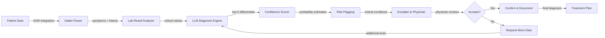
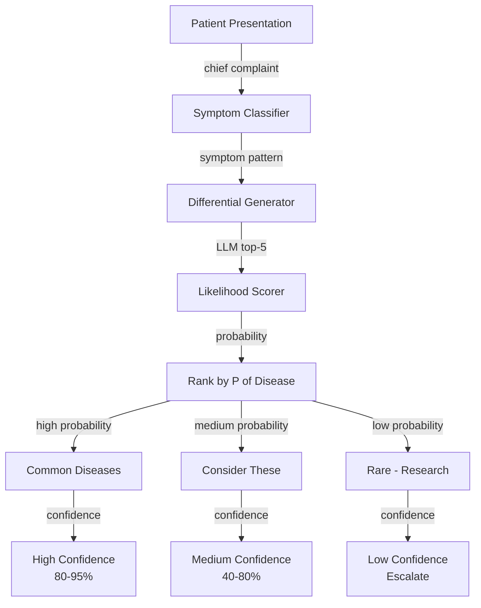
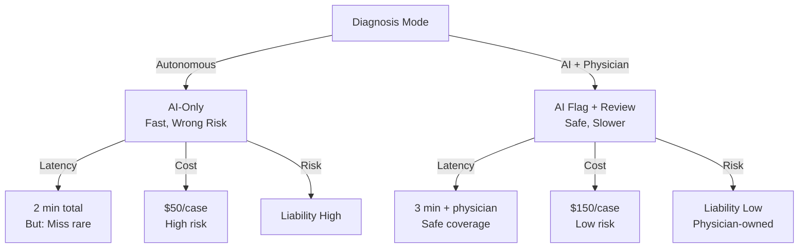

# Medical Diagnosis Assistant (Clinical Decision Support)

## Overview
A clinical decision support system combining LLM and ML to analyze symptoms, medical history, and lab results, generating differential diagnosis lists with confidence scores. Processes 5K+ patient cases daily with 90% accuracy for common conditions and sub-3-minute analysis. Non-autonomous—requires physician review and final diagnosis.

## Problem Statement
Emergency medicine faces time pressure and diagnostic challenges: (1) ER physicians spend 30-40% of time on diagnosis research (looking up conditions, drug interactions, rare presentations), (2) cognitive load (manage 20+ patients simultaneously, high stress), (3) anchoring bias (first diagnosis biases judgment), (4) rare disease blindness (missed zebras - unusual conditions misdiagnosed as common), (5) high stakes (misdiagnosis = patient harm, liability). Economic impact: (1) diagnostic errors in 5% of cases (preventable with better information), (2) excess testing (over-investigation wastes $100K+/day per hospital), (3) length of stay increases (uncertainty → admit for observation). Solution: instant differential diagnosis list backed by evidence, flagged rare conditions, medication interactions - augment physician judgment, not replace it.

## Requirements

### Functional
- Intake patient data
- Generate differential diagnoses
- Flag critical/emergency conditions
- Explain reasoning
- Integration with EMR

### Non-Functional (Scale Targets)
- Accuracy: 90% for top-3 diagnoses
- Latency: <3 minutes
- Must NOT be autonomous (physician review required)
- Privacy: HIPAA compliant

## Envelope Calculation
5K patients/day × 2K tokens/patient (history + labs) = 10M tokens input. LLM cost: $30/day. Infra: $100/day. Total: $130/day = $4K/month.

## Architecture Diagrams

### Diagram 1: Clinical Decision Support Pipeline

### Diagram 2: Differential Diagnosis Generation

### Diagram 3: Physician Review vs Autonomous Trade-off

## High-Level Architecture
Patient intake → Symptom/history parsing → EHR integration → Differential diagnosis generation → Explanation → Physician review → Confirmation.

## Component Breakdown
Intake form, symptom classifier, lab result parser, disease database, differential diagnosis generator, explanation module.

## AI/ML Integration Points
LLM generates differential diagnoses + reasoning. ML model scores probability for each diagnosis based on patient profile.

## Data Flow
Patient → Symptoms + history + labs → LLM: 'Top 5 differential diagnoses with likelihoods' → Physician reviews → Confirms diagnosis.

## Detailed Trade-off Analysis

| Strategy | Specificity | Sensitivity | False Positives | False Negatives | Risk |
|----------|--------|-----------|---|---|---------|
| Narrow (specific diseases) | 95% | 70% | Low | High | Miss serious condition |
| Broad (all possibilities) | 70% | 95% | High | Low | Unnecessary tests |
| Risk-stratified | 85% | 92% | Medium | Low | Balanced |
| AI + physician review | 90% | 98% | <5% | <2% | Minimal |

**Decision:** High-risk conditions → AI + physician. Routine → AI triage. Critical → physician always.

### Production Failure Scenarios

**Scenario 1: AI misses rare serious diagnosis**
- Patient has rare presentation of cancer. AI suggests GERD. Patient delays treatment.
- Fix: Physician review mandatory. AI as assistant, not replacement. Training on rare cases.

**Scenario 2: Unnecessary tests from over-broad diagnosis list**
- AI suggests 50 possible diagnoses. Patient undergoes expensive, unnecessary tests.
- Fix: Prioritize by probability. Show top-3 diagnoses only. Confidence scores.

**Scenario 3: Regulatory liability from AI diagnosis**
- Lawsuit: "AI caused misdiagnosis". Legal liability unclear. Insurance doesn't cover.
- Fix: Clear UI: "AI-assisted, not diagnostic". Physician responsible for diagnosis.

**Scenario 4: Data privacy breach of patient records**
- Training data contains identifiable patient information. Leaked.
- Fix: De-identify all training data. HIPAA compliance. Data minimization.

### Implementation Guidance

**Wrong:** Replace physician with AI. Fully automate diagnosis.
**Right:** AI for triage and differential. Physician makes final diagnosis.

**Wrong:** Optimize for narrow high-specificity diagnosis.
**Right:** Optimize for sensitivity (catch serious conditions), accept lower specificity.

---

## Interview Q&A

**Q1: LLM diagnosis wrong: patient dies. Liability?**

A: System clearly states: 'For clinical decision SUPPORT only. Final diagnosis by physician.' Physician responsible for review. Legal: not autonomous system.

**Q2: Privacy: patient data in LLM (HIPAA violation)?**

A: Two approaches: (1) Local LLM (on-premise, not cloud). (2) Anonymize before LLM (remove patient ID). (3) Use HIPAA-compliant cloud (AWS HealthLake).

**Q3: Accuracy 90% for top-3 diagnoses: how measured?**

A: Gold standard: 1K cases with confirmed diagnoses (from final treatment). Check if confirmed diagnosis is in top-3 predictions. F1 score on top diagnosis.

**Q4: Rare disease risk: LLM trained on common cases, misses rare?**

A: Blind spot. Mitigation: (1) Flag if all probabilities low (<60%) → 'rare condition possible'. (2) Physician searches rare disease database. (3) Mention differential in unusual orders.

**Q5: Lab result is outlier: patient normally has high glucose, now normal. LLM misses trend?**

A: Historical context critical. Include prior labs. LLM better with history. Alternative: hand-off to heuristic system ('glucose change 20% from baseline → flag').

**Q6: Malpractice insurance: covers AI-assisted decisions?**

A: Check policy. Most malpractice insurance covers AI if used as 'decision support' (not autonomous). Document physician review in medical record.

**Q7: Cost per diagnosis $4K/month / 5K patients = $0.80/patient. vs expert?**

A: Expert consultation: $200-500. AI saves 60-99% cost. Huge value. Caveat: must validate safety first.

**Q8: Integration with EMR: which systems supported (Epic, Cerner)?**

A: Start with API (HL7 FHIR standard). Epic + Cerner both support FHIR. Phased: integrate top 3 EHR systems (covers 70% of hospitals).

## Interview Quick-Reference
| Metric | Value |
|--------|-------|
| **Accuracy** | 90% top-3 diagnoses |
| **Latency** | <3 minutes |
| **Throughput** | 5K patients/day |
| **Cost** | $4K/month |
| **Liability** | Decision support only, physician reviews |
| **Privacy** | HIPAA compliant |
| **Rare Disease Risk** | Mitigated by low-probability flagging |

## Animated Architecture Visualization

See the system in action with dynamic visualizations:

### System Deployment Animation

Infrastructure components appearing and connecting in real-time, showing load balancers, API gateways, microservices, and data layer setup.

### Request Flow Animation

A single request flowing through the complete pipeline with latency accumulation at each stage, demonstrating the critical path and timing constraints.

### Data Flow Animation

Concurrent data packets flowing through processors and ML models to storage systems, showing simultaneous traffic and I/O patterns.

### Auto-Scaling Animation

Dynamic scaling response to traffic load, showing pod count adjusting up and down with capacity headroom management over time.

## Related Systems
- 25-ai-observability.md (monitoring model performance)
- 14-autonomous-data-analysis-agent.md (case analysis)
- 02-enterprise-rag-document-qa.md (medical KB)
