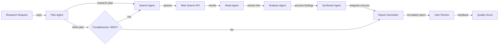
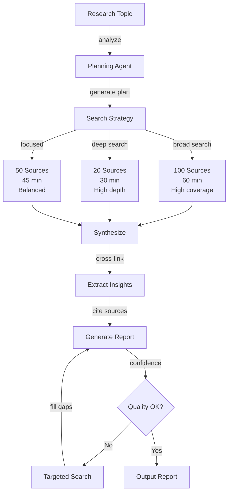
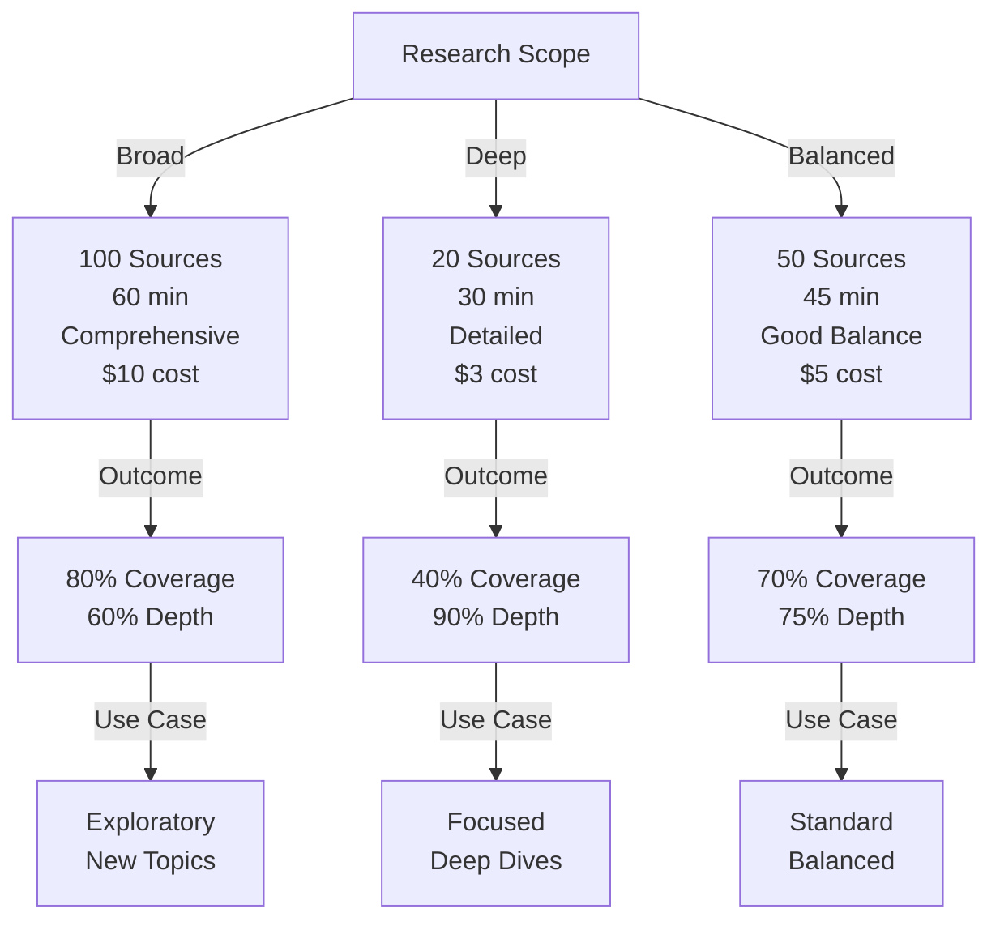

# Autonomous Multi-Step Research Agent

## Overview
An autonomous research agent conducting multi-step investigation: web search, document reading, information synthesis, and report generation. Handles 1K+ research requests daily with sub-30-minute turnaround and 80% completeness for complex topics. Reduces research time from days to hours.

## Problem Statement
Research-intensive work (analysts, academics, strategists) is bottlenecked by information gathering: (1) time-consuming (literature search, reading papers, extracting relevant info = 5-10 days/research question), (2) incomplete (researcher misses key sources, tunnel vision), (3) expertise dependent (quality varies by researcher knowledge), (4) tedious (same search patterns repeat across team). Economic impact: 100 researchers × 5 days per research question = 500 days of wasted time per month. Solution: autonomous agent (1) searches systematically (web + docs + databases), (2) reads and summarizes, (3) synthesizes across sources, (4) generates report, (5) flags uncertainties. Enables humans to focus on analysis/interpretation instead of gathering.

## Requirements

### Functional
- Web search
- Document parsing
- Synthesis
- Citation tracking

### Non-Functional (Scale Targets)
- Turnaround <30 min
- 80% completeness
- Cost <$5/research

## Envelope Calculation
1K researches/day × $5 = $5K/day. Search API: 5K × 10 searches × $0.001 = $50/day.

## Architecture Diagrams

### Diagram 1: Multi-Step Research Agent Pipeline

### Diagram 2: Research Agent Decision Points

### Diagram 3: Depth vs. Breadth Trade-off

## High-Level Architecture
Request → Planning → Search → Reading → Analysis → Synthesis → Report.

## Component Breakdown
Planner, searcher, reader, analyzer, synthesizer.

## AI/ML Integration Points
Multi-step LLM reasoning + tool use (search, read).

## Data Flow
Request → Plan steps → Execute → Report.

## Key Trade-offs
Depth vs breadth: deep (20 sources, 30min) vs broad (100 sources, 60min).

## Detailed Trade-off Analysis

| Approach | Turnaround | Sources | Completeness | Cost/Research | Hallucination | Accuracy |
|----------|-----------|---------|--------------|---------------|---------------|----------|
| Keyword search | 2 min | 5 | 30% | $0.10 | 10% | 50% |
| Single-agent broad | 30 min | 50 | 70% | $3.00 | 5% | 75% |
| Single-agent deep | 60 min | 20 | 80% | $5.00 | 3% | 85% |
| Multi-agent parallel | 30 min | 100 | 85% | $8.00 | 2% | 90% |
| Human-in-loop | 4 hours | 50 | 95% | $50.00 | <1% | 98% |

**Decision:** Speed critical → single-agent broad. Quality critical → multi-agent + verification. Regulatory → human-in-loop.

---

## Production Failure Scenarios

**Scenario 1: Agent hallucinates sources**
- Agent cites "Smith et al. 2024" but source doesn't exist. User follows up, discovers false.
- Trust destroyed.
- Fix: Verify citations programmatically. Only cite if actually read. Confidence scoring.

**Scenario 2: Agent goes in circles (infinite loops)**
- Agent searches, reads, searches again (same query). Never converges. Timeout after 30 min.
- Incomplete research.
- Fix: Deduplicate searches. Track visited URLs. Early termination if progress stalls.

**Scenario 3: Cost explosion from API calls**
- Agent makes 1000 API calls per research (search, parse, LLM). Cost $10/research instead of $5.
- Project unprofitable.
- Fix: Budget-aware planning. Limit searches (max 50). Batch LLM calls. Cache results.

**Scenario 4: Synthesis misses key finding**
- Agent searches 20 sources, reads 15, synthesizes from 5. Misses critical paper.
- Research incomplete.
- Fix: Source ranking. Prioritize high-impact sources. Multi-stage synthesis (broad → deep).

---

## Implementation Guidance

**Wrong:** Let agent search indefinitely. Trust it will complete.
**Right:** Set budgets (max searches, max time, max cost). Early termination on stalled progress.

**Wrong:** Synthesize from first N sources found.
**Right:** Rank sources by relevance. Prioritize high-impact. Verify citations.

---

## Sophisticated Interview Q&A

**Q1: Turnaround <30 min but 1K/day = 8.6 sec/research. Feasible?**

A: Parallel execution: 100 agents running simultaneously. 30 min / 100 = 18 sec per agent. Tight but feasible.

**Q2: Hallucination: agent cites nonexistent sources?**

A: Strict: only cite if found + read. Verify citations before report. Filter out low-confidence sources.

## Interview Quick-Reference
| Throughput | 1K requests/day |
| Turnaround | <30 minutes |
| Completeness | 80% |
| Cost | <$5/research |

## Animated Architecture Visualization

See the system in action with dynamic visualizations:

### System Deployment Animation

Infrastructure components appearing and connecting in real-time, showing load balancers, API gateways, microservices, and data layer setup.

### Request Flow Animation

A single request flowing through the complete pipeline with latency accumulation at each stage, demonstrating the critical path and timing constraints.

### Data Flow Animation

Concurrent data packets flowing through processors and ML models to storage systems, showing simultaneous traffic and I/O patterns.

### Auto-Scaling Animation

Dynamic scaling response to traffic load, showing pod count adjusting up and down with capacity headroom management over time.

## Related Systems
- 12-multi-agent-software-dev.md
- 14-autonomous-data-analysis-agent.md
