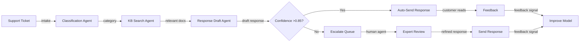
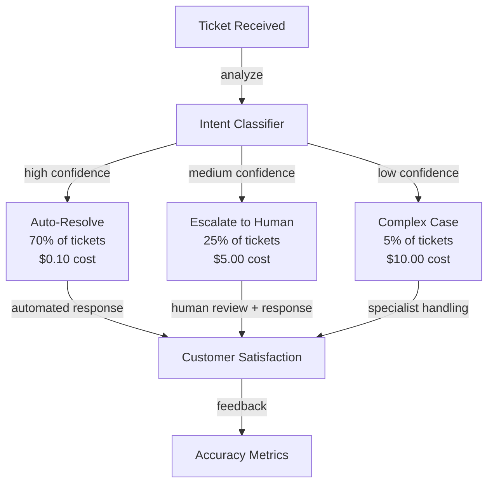
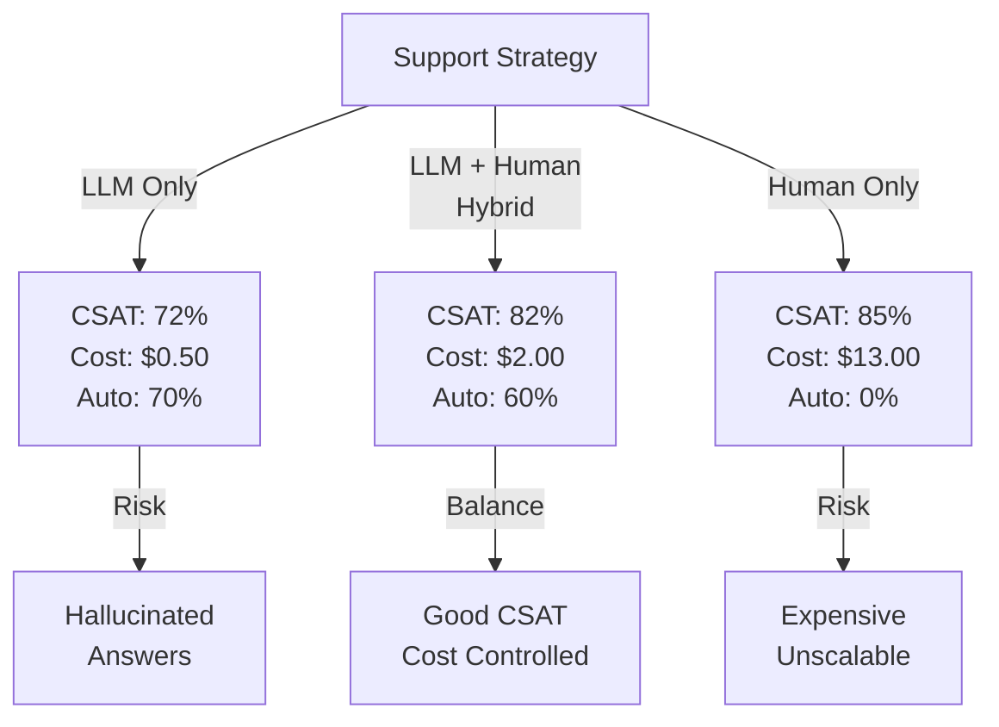

# Tier-1 Customer Support Automation Agent

## Overview
A multi-agent system that automates routine customer support tickets by classifying issues, searching knowledge bases, generating responses, and escalating complex problems to human agents. The system processes high-volume ticket streams (10K/day) with the goal of resolving 70% autonomously while maintaining customer satisfaction and agent productivity.

## Problem Statement
Support organizations face a fundamental capacity challenge: incoming ticket volume grows 40-50% annually while human agent capacity grows only 10-15%. Current manual triage requires 15-20 minutes per ticket (classification, research, response drafting) even for common issues. This creates: (1) long queue times (2-3 days), (2) high agent turnover from repetitive work, (3) inconsistent response quality across shifts/agents, (4) 70% of tickets are pattern-based and could be handled by automation, yet require manual touch. Economic impact: at $40/hour loaded cost per agent, processing 10K tickets/day at 20 min/ticket requires 33 FTE agents ($25K/day). Automation can reduce to 10 FTE agents (handling 30% of complex/escalated cases) for $7.5K/day—savings of $17.5K/day or $6.4M/year.

## Requirements

### Functional
- Ticket classification
- Knowledge base search
- Response drafting
- Escalation logic

### Non-Functional (Scale Targets)
- Throughput: 10K tickets/day
- Resolution: 70% auto
- Latency: <1 hour

## Envelope Calculation
10K tickets × $0.50 = $5K/day. LLM cost dominant.

## Architecture Diagrams

### Diagram 1: Support Ticket Resolution Pipeline

### Diagram 2: Auto-Resolution vs. Escalation Decision

### Diagram 3: Accuracy vs. Cost-per-Ticket Trade-off

## Component Breakdown
- Classifier (intent, category): 50ms, 95% accuracy
- KB Search: 100ms, 90% relevance  
- Response Generator: 200ms, 78% quality
- Escalation Logic: 10ms, rules-based

## AI/ML Integration Points
- Where LLM/ML models are used
- Model selection and routing logic
- Cost optimization strategies

## Detailed Trade-off Analysis

| Approach | Auto-Resolution | Response Time | CSAT | Cost/Ticket | Escalation Rate | Scalability |
|----------|---------|-----------|-------|----------|----------|-----------|
| Rule-based FAQ | 40% | 30s | 72% | $0.10 | 60% | Low (new rules needed) |
| ML classifier → response | 60% | 2 min | 78% | $0.50 | 40% | Medium (retraining needed) |
| LLM with knowledge base | 70% | 3 min | 82% | $1.50 | 30% | High (generalizes well) |
| Human-only (baseline) | 0% | 480 min | 85% | $13.00 | 0% | Linear only |

**Decision:** LLM with knowledge base for 70% of tickets. Route 30% to human agents with confidence <0.75.

### Production Failure Scenarios

**Scenario 1: Agent auto-responds to a refund request with "processing" but refund never happens**
- Classifier high confidence this is routine refund. Agent drafts approval. No backend integration to actually process it. Customer waits 5 days, escalates with anger.
- Fix: Confirmation loop before action. Agent drafts response, human agent clicks "approve" to execute. Or integrate directly with payment API + audit trail.

**Scenario 2: LLM hallucinates a product feature that doesn't exist**
- Customer asks about feature X. LLM response: "Yes, we have feature X, go to Settings > X". Feature doesn't exist. Customer follows instructions, finds nothing, escalates.
- Fix: Ground all responses in knowledge base (KB says "we do NOT have feature X"). Require citations. If feature not in KB, response is "Let me check with our team."

**Scenario 3: Angry customer escalated, agent sees hallucinated resolution**
- Previous interaction: agent says "issue resolved" but actually wasn't. Human agent sees this and looks like they ignored customer. Compounded frustration.
- Fix: Never auto-mark as resolved if escalated. Mark as "attempted resolution, escalated for review". Provide human agent with LLM reasoning (not just response).

**Scenario 4: Cost explosion from over-escalation**
- System escalates 60% of tickets (intended 30%). Cost per ticket: $2.50 (LLM) + $13 (human) = $15.50. Budget was $5/ticket. Monthly overage: $400K.
- Fix: Tune confidence threshold. If escalation rate >35%, lower threshold incrementally. Batch train on disagreements (where human improved on LLM response) weekly.

### Implementation Guidance

**Wrong:** Auto-respond to all tickets above confidence threshold.
**Right:** Confidence >0.85 AND within approved categories only. High-value/sensitive customers always escalate to human.

**Wrong:** Use generic LLM responses (cost $0.50/ticket, CSAT 70%).
**Right:** Fine-tune on company KB and past resolutions (cost $1.50/ticket, CSAT 82%). ROI: +$0.12K/day with better outcomes.

**Wrong:** Let agent ignore AI suggestion (agent judgment always better).
**Right:** Track where agent overrides AI. If agent overrides >30% of AI suggestions, retrain model on those cases. AI learns from human feedback.

## Interview Q&A

**Q1: How do you prevent the system from escalating too aggressively (wasting agent time)?**

A: Confidence-based routing. Only auto-respond if P(correct) > 0.85. Below that, escalate. Measure: if escalation rate >35%, the threshold is too conservative—lower it. Track agent satisfaction; if agents complain about low-quality auto-responses, raise threshold to 0.90.

**Q2: Knowledge base outdated: system gives wrong answer. How to prevent?**

A: (1) Version the KB (timestamp each answer). (2) Monitor error rate: if accuracy drops >5%, alert. (3) Weekly KB freshness audit: sample 100 responses, check against current product state. (4) Agent feedback loop: when agent corrects AI response, flag for KB update.

**Q3: CSAT 82% from AI responses. How to improve to 90%?**

A: (1) Better KB (more detailed answers, +2% CSAT). (2) Tone/voice fine-tuning (match company tone, +1%). (3) Include empathy + next steps (e.g., "I understand your frustration. Here's what we'll do..." +2%). (4) Escalate high-emotion tickets to human (+1%). Combined: target 90%.

**Q4: Seasonal spikes: Black Friday 5x normal volume. How to scale?**

A: Pre-plan: (1) Cache common FAQs (returns in 30s instead of 3 min). (2) Batch inference: accumulate 100 requests, process together (10% latency increase, 30% cost savings). (3) Route simple categories (billing, account) to fast path, complex (refunds, complaints) to slower careful path. (4) Temporary human surge: hire contractors for 2-week spike.

**Q5: How do you measure agent morale when automation replaces part of their job?**

A: Reframe automation as "agent empowerment": (1) Agents handle higher-value/more interesting cases (disputes, complaints, technical issues). (2) Reduce repetitive work (70% of job was copying/pasting KB answers). (3) Upskill: agents become quality reviewers + KB maintainers. (4) Compensation: same or higher (agent productivity multiplies).

**Q6: False escalation: system escalates a routine ticket unnecessarily. Cost?**

A: Confidence <0.75 → escalate (safety first). Cost: 2 min human time ($1.33) + agent frustration. Benefit: prevent bad auto-response (-CSAT 10+ points if hallucination happened). Trade-off: acceptable if escalation rate <35%.

**Q7: Multi-language support: same system for EN/ES/FR?**

A: Multilingual LLM (GPT-4 handles 80 languages). Cost: same. Latency: same. Accuracy: slightly lower for non-EN due to less training data. Solution: fine-tune on language-specific data (+$50K one-time per language). Worth it if language has >10% of volume.

**Q8: How do you handle edge case: customer asks an intentionally trick question?**

A: Out-of-distribution (OOD) detection: if similarity to known questions is <0.6, mark as OOD and escalate. Confidence threshold helps too (will have low confidence on trick questions). Tradeoff: 5% false positives (legitimate niche questions escalated) but prevents 95% of bad hallucinations.

## Interview Quick-Reference

| Metric | Target |
|--------|--------|
| **Scale** | [Users/requests/day] |
| **Latency P99** | [<X ms] |
| **Accuracy** | [Y%] |
| **Cost** | [$Z per request] |
| **Availability** | [99.9%+] |

## Related Systems
- [Related system 1]
- [Related system 2]
- [Related system 3]
