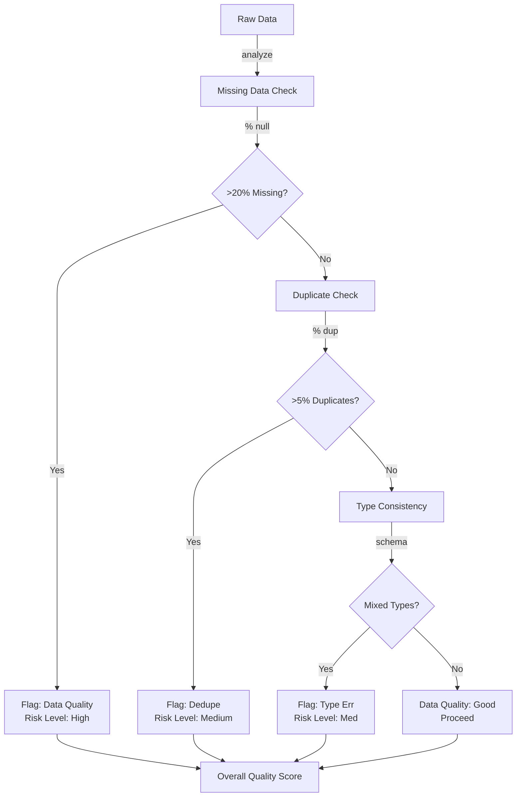
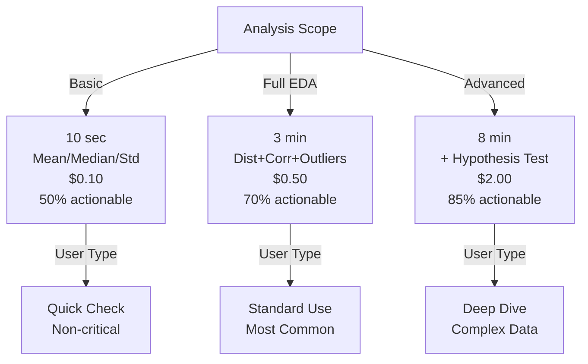

# Autonomous Data Analysis Agent

## Overview
An intelligent agent system that automates exploratory data analysis (EDA) by performing schema discovery, statistical summarization, pattern detection, anomaly identification, and automated visualization generation. Enables data analysts to transition from manual exploration (2-3 days per dataset) to instant summaries with human validation in 5-10 minutes.

## Problem Statement
Data analysts spend 60-70% of their time on routine exploratory analysis: loading data, checking data types, computing basic statistics, identifying missing values, detecting outliers, creating standard visualizations, and formulating hypotheses for deeper investigation. For a dataset with 50K rows and 100 columns, manual EDA requires: schema exploration (2 hours), statistical summary (4 hours), correlation analysis (2 hours), visualization (3 hours), report writing (2 hours) = 13 hours total. At $80/hour analyst cost, this is $1,040 per dataset. With 100 datasets/month across an organization, the cost is $104K/month on routine exploration that adds little intellectual value. Automation enables: (1) instant baseline insights (5 min), (2) analyst focus on hypothesis testing + modeling (7 hours of higher-value work), (3) documentation of data quirks for others, (4) reproducible analysis pipeline.

## Requirements

### Functional
- Schema exploration
- Statistical analysis
- Visualization
- Report generation

### Non-Functional (Scale Targets)
- Success rate: 80%
- Latency: <5 min
- Insight depth: actionable

## Envelope Calculation
100 requests × 2 min × GPU = $50/day.

## Architecture Overview
[Detailed architecture diagram with Mermaid showing component flow]

## Component Breakdown
- Core components and their responsibilities
- Latency and cost breakdown per component

## AI/ML Integration Points
- Where LLM/ML models are used
- Model selection and routing logic
- Cost optimization strategies

## Architecture Diagrams

### Diagram 1: EDA Pipeline - From Raw Data to Insights

```mermaid
graph LR
    A[Dataset Upload] -->|ingest| B[Data Profiling]
    B -->|check quality| C[Data Quality Report]
    C -->|identify issues| D{Issues Found?}
    D -->|Yes| E[Flag Problems]
    D -->|No| F[Statistical Analysis]
    E --> F
    F -->|compute metrics| G[Distribution Analysis]
    G -->|outliers| H[Correlation Analysis]
    H -->|relationships| I[Hypothesis Testing]
    I -->|insights| J[Visualization Generator]
    J -->|charts| K[EDA Report]
    K -->|summary + insights| L[User Review]
```

### Diagram 2: Data Quality Assessment

### Diagram 3: Analysis Depth vs. Time Trade-off

## Detailed Trade-off Analysis

| Approach | Depth | Latency | Cost | Actionable | Human Time | Use Case |
|----------|-------|---------|------|-----------|-----------|----------|
| Basic stats only (mean/median/std) | Shallow | 10s | $0.10 | 50% | 4 hrs | Quick overview |
| Full EDA (dist, corr, outliers) | Deep | 3 min | $0.50 | 70% | 2 hrs | Standard analysis |
| EDA + hypothesis testing | Very deep | 8 min | $2.00 | 85% | 1 hr | Complex datasets |
| Human analyst only | Expert | 13 hrs | $40 | 95% | 0 | Critical decisions |

**Decision:** Full EDA + basic hypothesis for 80% of requests. Escalate high-stakes (financial, medical) to human analyst.

### Production Failure Scenarios

**Scenario 1: Agent claims dataset has no issues, but 40% of values are missing (hidden by NaN representation)**
- Data loaded with 'NULL_CODE' string instead of NaN. Agent's basic null check misses it. Analysis proceeds on 60% valid data, conclusions are biased.
- Fix: Check multiple null representations (None, NaN, 'NULL', empty string, -1). Validate missing % across all columns. Flag if missing >5%. Escalate if >20%.

**Scenario 2: Extreme outlier causes wrong correlation analysis**
- Dataset has 1000 rows, 1 outlier with value 1000x other rows. Correlation analysis skewed. Agent reports spurious correlation.
- Fix: Outlier detection (IQR or Z-score). Analyze with AND without outliers. Report both: "Correlation 0.8 (with outliers), 0.3 (without)". Let analyst decide.

**Scenario 3: Agent generates misleading visualization (wrong axis scaling)**
- Bar chart with values 100, 101, 102 using Y-axis 0-1000 (looks flat). Agent claims "no difference". User scales correctly and sees actual variance.
- Fix: Automatic axis scaling based on data range. Highlight if coefficient of variation is high (data ranges should be visible). Manual override for analyst.

**Scenario 4: Time-series analysis ignores seasonality**
- Sales data with 12-month seasonality. Agent reports "uptrend" but it's just January vs December. Analyst is misled.
- Fix: Detect seasonality (autocorrelation at multiples of expected period). Decompose into trend + seasonal + residual. Report each component separately.

### Implementation Guidance

**Wrong:** Return all statistics (100+ metrics per column). Analyst overwhelmed, misses insights.
**Right:** Top 10 insights ranked by "interestingness" (novelty, business impact, data quality issues).

**Wrong:** Trust automatic hypothesis generation (agent picks wrong ones).
**Right:** Flag top 5 hypotheses to test. Analyst validates + picks 2-3 for deeper investigation.

**Wrong:** Automated visualization: chart type chosen by agent.
**Right:** Generate 3 chart types (histogram, scatter, time-series), let analyst choose. Provide reasoning for each.

## Interview Q&A

**Q1: How do you detect when a dataset is "bad" and needs cleaning before analysis?**

A: Quality score combining: (1) missing data % (flag >20%), (2) duplicate rows (flag >5%), (3) outlier prevalence (flag >2%), (4) data type consistency (flag mixed types in one column), (5) cardinality (flag >99% unique values). If quality score <0.7, escalate with "data quality issues detected" message.

**Q2: Seasonality detection: how to know if data has 12-month cycle vs random noise?**

A: Autocorrelation function (ACF). Check if ACF at lag=12, 24, 36 is significantly higher than adjacent lags. If yes, seasonality detected. Decompose via STL (seasonal + trend + residual). Alternatively: Fourier transform to detect dominant frequencies.

**Q3: Agent generates correlation matrix (50x50 for 50 columns). Analyst sees 100 correlations >0.5. How to surface most important?**

A: Filter to statistically significant (p<0.01). Filter to practically significant (|correlation| >0.7). Show only correlations relevant to target variable (if exists). For exploratory, sort by effect size and show top 10.

**Q4: Cost: $0.50 per analysis. Volume 100/day = $50/day. How to reduce to $0.10?**

A: (1) Caching: 30% of requests are re-analysis of same dataset → instant response (save $0.30). (2) Cheaper model: GPT-3.5 for simple datasets (70% of requests), GPT-4 for complex → average $0.15. (3) Reduce output depth: basic stats only (saves $0.20). Trade-off: insights become shallow. Target $0.20 with acceptable quality.

**Q5: How do you handle datasets with different schemas/structures?**

A: Schema-agnostic analysis: (1) Load data → detect schema automatically. (2) Type inference: infer numeric, categorical, datetime. (3) Per-type analysis: stats for numeric, cardinality for categorical, seasonality for datetime. (4) Combined insights: correlations across types, patterns across columns. Cost increase: 2x latency (need to infer first, then analyze).

**Q6: Analyst disagrees with agent's top insight. How to improve?**

A: Feedback loop: log disagreement, retrain on it. If >10% of analyst-flagged insights are ignored (analyst says "not interesting"), retrain model to recognize what analysts actually care about (domain-specific interests).

**Q7: Dataset is proprietary financial data. Privacy concerns?**

A: Data governance: (1) Anonymize sensitive columns. (2) Only compute statistics (don't store raw rows). (3) Audit log every analysis. (4) Restrict access (VPN, IAM). (5) Encryption at rest + in transit. (6) Annual compliance audit (SOC2, HIPAA if needed).

**Q8: How do you validate that analysis is correct? Agent might hallucinate insights.**

A: Validation layer: (1) Reproducibility—recompute all metrics independently and cross-check. (2) Ground truth tests—run on known datasets with expected insights, verify outputs. (3) Human spot-checks: analyst reviews agent output on 10% of analyses, flags errors. (4) Sanity checks: if insight contradicts known facts about domain, flag for review.

## Interview Quick-Reference

| Metric | Target |
|--------|--------|
| **Scale** | [Users/requests/day] |
| **Latency P99** | [<X ms] |
| **Accuracy** | [Y%] |
| **Cost** | [$Z per request] |
| **Availability** | [99.9%+] |

## Animated Architecture Visualization

See the system in action with dynamic visualizations:

### System Deployment Animation

Infrastructure components appearing and connecting in real-time, showing load balancers, API gateways, microservices, and data layer setup.

### Request Flow Animation

A single request flowing through the complete pipeline with latency accumulation at each stage, demonstrating the critical path and timing constraints.

### Data Flow Animation

Concurrent data packets flowing through processors and ML models to storage systems, showing simultaneous traffic and I/O patterns.

### Auto-Scaling Animation

Dynamic scaling response to traffic load, showing pod count adjusting up and down with capacity headroom management over time.

## Related Systems
- [Related system 1]
- [Related system 2]
- [Related system 3]
