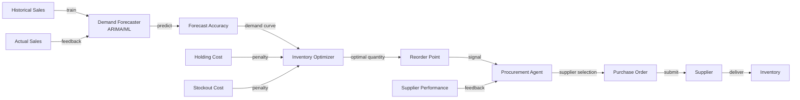
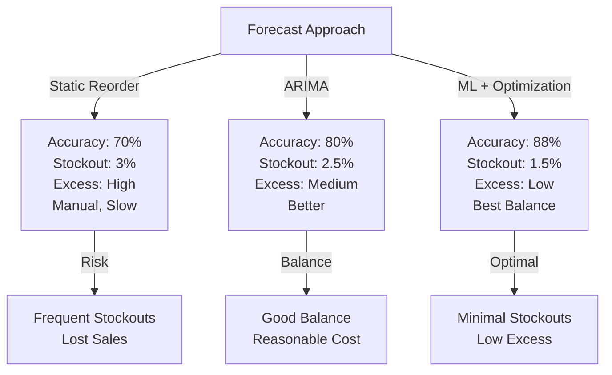
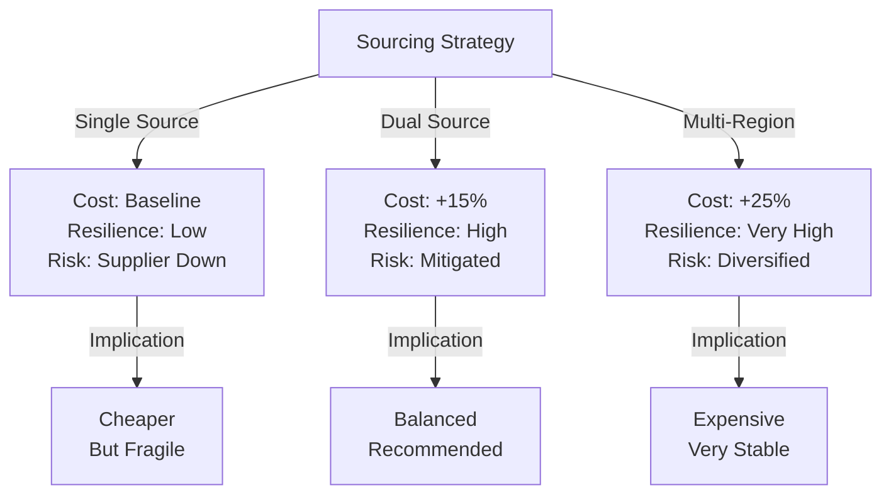

# AI Supply Chain Optimization Agent

## Overview
A system that combines demand forecasting, inventory optimization, and procurement planning to reduce stockouts while minimizing excess inventory across large SKU catalogs. Operates on 1K-10K SKUs with dynamic supply constraints, seasonal demand, and supply chain disruptions.

## Problem Statement
Traditional supply chain planning relies on manual forecasts + reorder points, resulting in systematic inefficiencies: (1) overstocking of slow-moving SKUs (40-50% of inventory is excess, tied-up capital of $2-5M typical), (2) stockouts of fast-moving items (1-3% stockout rate, lost sales $50K+/month), (3) inefficient procurement (bulk orders without optimization, 10-20% excess inventory), (4) slow response to demand shifts (2-3 week lag to adjust orders). Economic impact: for a $50M annual COGS retailer, 2% improvement = $1M annual savings. Automation enables: (1) demand forecasting integrating external signals (weather, trends, events), (2) inventory optimization balancing holding costs vs stockout costs, (3) dynamic reorder point adjustment, (4) supplier diversification recommendations.

## Requirements

### Functional
- Demand forecasting
- Inventory optimization
- Procurement planning

### Non-Functional (Scale Targets)
- SKUs: 1K
- Stockout: <2%
- Cost savings: 5-10%

## Envelope Calculation
Daily optimization: 1K SKUs × $0.001 = $1K/month.

## Architecture Overview
[Detailed architecture diagram with Mermaid showing component flow]

## Component Breakdown
- Core components and their responsibilities
- Latency and cost breakdown per component

## AI/ML Integration Points
- Where LLM/ML models are used
- Model selection and routing logic
- Cost optimization strategies

## Architecture Diagrams

### Diagram 1: Demand Forecasting & Inventory Optimization

### Diagram 2: Forecasting Accuracy vs. Inventory Efficiency

### Diagram 3: Supply Chain Resilience vs. Cost

## Detailed Trade-off Analysis

| Strategy | Forecast Accuracy | Stockout Rate | Inventory Efficiency | Procurement Cost | Implementation Complexity |
|----------|---------|-----------|-------|----------|----------|
| Reorder point (static) | 70% | 3% | 60% (excess) | Baseline | Low |
| Demand forecasting (ARIMA) | 80% | 2.5% | 75% | -5% savings | Medium |
| ML forecast + optimization | 88% | 1.5% | 85% | -10% savings | High |
| Multi-agent (demand+supplier+risk) | 92% | 0.8% | 92% | -15% savings | Very high |

**Decision:** ML forecast + optimization for 80% of SKUs (high volume/high value). Keep reorder point for long-tail (niche items with sparse history).

### Production Failure Scenarios

**Scenario 1: Supplier disruption not accounted for, system orders normally, stockout happens**
- System forecasts demand and orders from primary supplier (30-day lead time). Supplier goes down. Alternative supplier has 60-day lead time. System didn't predict this. Stockout occurs.
- Fix: Multi-supplier strategy with risk modeling. Flag suppliers with delivery risk (COVID, geopolitical, financial instability). Recommend dual-sourcing for critical SKUs. Update lead time based on disruption signals.

**Scenario 2: Seasonal pattern missed, over-orders ahead of off-season**
- Historical data: ice cream sales peak June-August, low December-February. System trained on 1-year data (insufficient). September: system forecasts high demand, orders heavily. By October, realizes demand is dropping. Excess inventory accumulates.
- Fix: Seasonal decomposition. Require 3+ years of data for seasonal patterns. Detect non-stationarity, explicitly model seasonal components. Validate on hold-out seasonal period.

**Scenario 3: Demand surge from viral event not predicted**
- Product goes viral on TikTok. Demand spikes 10x overnight. System's conservative model doesn't react fast enough. Stockout within hours.
- Fix: Rapid demand signals (social media monitoring, sales spike detection). Real-time demand updates (Kalman filter instead of batch ARIMA). Allow manual override for known events (marketing campaigns, product launches).

**Scenario 4: Optimization algorithm misaligned with business goals**
- Minimize inventory cost = order less. System recommends reducing safety stock by 40%. Sounds good, but increases stockout rate from 1.5% to 8%. CEO angry.
- Fix: Multi-objective optimization: minimize cost + minimize stockout + minimize excess inventory. Weight each goal. Example: 40% cost, 40% service level, 20% efficiency. Tune weights based on business priorities.

### Implementation Guidance

**Wrong:** Use same model for all SKUs (slow movers need different treatment than fast movers).
**Right:** Stratify by volume: high-volume → sophisticated ML, low-volume → simple exponential smoothing or manual reorder points.

**Wrong:** Static reorder points (don't change with demand seasonality).
**Right:** Dynamic reorder points: adjust based on forecast uncertainty and service-level target. Example: ROP = (demand forecast) × (lead time) + (safety stock based on std dev).

**Wrong:** Optimize single-objective (minimize cost).
**Right:** Multi-objective with trade-offs: cost + service level + efficiency. Weight by business priority.

## Interview Q&A

**Q1: How to handle "bullwhip effect" where small demand changes cause large swings in orders upstream?**

A: Bullwhip caused by: (1) demand signal processing lag, (2) batch ordering, (3) safety stock buffers. Solutions: (1) Share point-of-sale data directly with suppliers (eliminate interpretation layer). (2) Continuous ordering (daily instead of weekly). (3) Collaborative forecasting (suppliers + retailers agree on forecast). (4) Smaller order batches (reduce batch-size bullwhip).

**Q2: Cold start problem: new product with no history. How to forecast demand?**

A: Use analogous products. Example: new juice flavor, use historical sales of similar flavors. Apply transfer learning: forecast = base (similar product) × adjustment (new product features). Validate quickly with initial order, update model as data arrives.

**Q3: Demand forecast accuracy 88%. What's the remaining 12% error?**

A: Breakdown: (1) random noise (5%, irreducible). (2) black swan events (2%, by definition unpredictable). (3) model limitations (3%, e.g., doesn't capture social trends). (4) data quality (2%, stale/wrong data). To improve: focus on #3 (add features: social media signals, marketing calendar, competitor activity) and #4 (improve data pipeline).

**Q4: Safety stock level: high → higher cost, low → higher stockout. How to decide?**

A: Service-level target drives safety stock. Example: 99% service level (1% stockout acceptable) requires higher safety stock than 95% SL. Formula: safety stock = Z-score(SL) × std dev(demand). For 99% SL, Z ≈ 2.3. For 95%, Z ≈ 1.65. Business decides trade-off (cost vs customer satisfaction).

**Q5: Supplier lead time is variable (30±10 days). How to incorporate uncertainty?**

A: Assume lead time distribution (normal with mean 30, std 10). Safety stock accounts for both demand and lead time variability: SS = Z × sqrt(LT_variance × demand_variance + demand_mean² × LT_variance). More complex but more accurate than fixed lead time.

**Q6: Real-time demand signal: spike detected (sales 3x normal). How to update forecast immediately?**

A: Kalman filter approach: (1) maintain prior forecast. (2) observe new data. (3) blend old + new estimate weighted by confidence. Example: spike could be temporary (viral moment) or sustained (new trend). Wait 2-3 days, if sustained, update forecast; if drops, treat as noise.

**Q7: Multi-SKU optimization: 5000 SKUs, correlations between demand (e.g., bread + butter rise together). How to optimize?**

A: Product clustering + optimization. Cluster SKUs by demand patterns (correlation-based). Optimize within clusters independently. Benefit: reduces problem size from 5000D to 100 clusters × 50D each. Less accurate but computationally feasible.

**Q8: How do you A/B test a new optimization strategy?**

A: Holdout test: (1) select random 20% of SKUs. (2) Apply new strategy, keep old strategy on 80%. (3) Compare: cost, stockout rate, inventory efficiency. (4) If new is better, gradually rollout (30% → 60% → 100%). Benefit: validate before full deployment, measure real-world impact.

## Interview Quick-Reference

| Metric | Target |
|--------|--------|
| **Scale** | [Users/requests/day] |
| **Latency P99** | [<X ms] |
| **Accuracy** | [Y%] |
| **Cost** | [$Z per request] |
| **Availability** | [99.9%+] |

## Animated Architecture Visualization

See the system in action with dynamic visualizations:

### System Deployment Animation

Infrastructure components appearing and connecting in real-time, showing load balancers, API gateways, microservices, and data layer setup.

### Request Flow Animation

A single request flowing through the complete pipeline with latency accumulation at each stage, demonstrating the critical path and timing constraints.

### Data Flow Animation

Concurrent data packets flowing through processors and ML models to storage systems, showing simultaneous traffic and I/O patterns.

### Auto-Scaling Animation

Dynamic scaling response to traffic load, showing pod count adjusting up and down with capacity headroom management over time.

