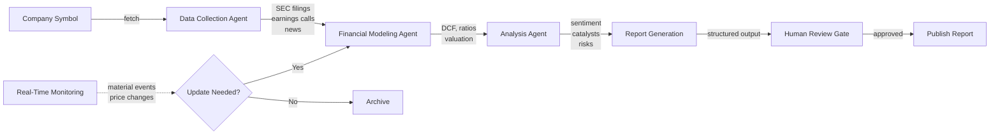
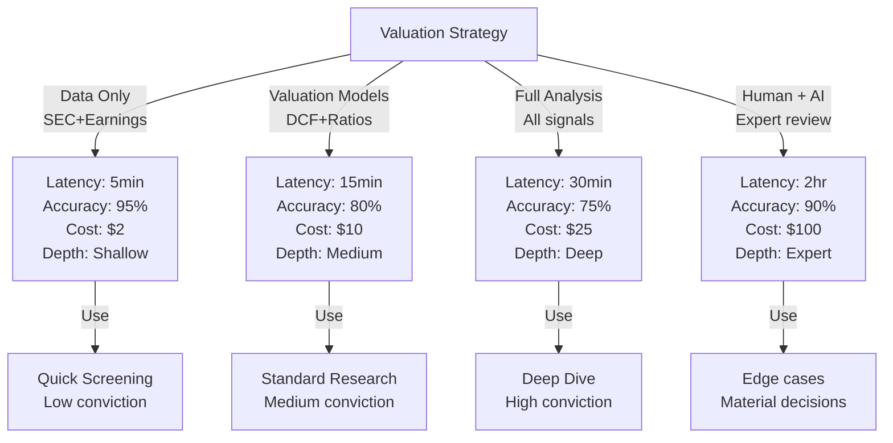
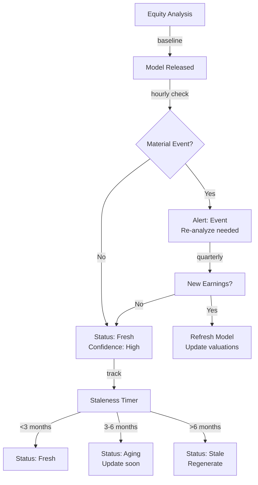

# Multi-Agent Equity Research System

## Overview
A multi-agent system for automated equity research that performs financial data collection, fundamental analysis, valuation modeling, and report generation at scale. Enables institutions to analyze 100+ companies daily with consistent methodology and explainable reasoning chains.

## Problem Statement
Equity research is resource-intensive: each analyst covers 15-20 companies and spends 10-15 hours/week per company on: data gathering (SEC filings, earnings calls, news), financial modeling (P&L projections, DCF valuation, ratio analysis), competitive analysis, and report writing. Cost: $100K-200K/year analyst salary + 20% infrastructure. For a buy-side firm covering 500 companies, analyst capacity limits to ~200 deep-dives/year. With automation: (1) increase coverage from 200 to 2000 companies/year (10x), (2) reduce analysis cost from $100K/analyst to $20K/year (LLM costs), (3) standardize methodology (reduce analyst bias), (4) enable real-time updates (prices shift, instantly recalculate valuations).

## Requirements

### Functional
- Data collection
- Financial modeling
- Analysis
- Report writing

### Non-Functional (Scale Targets)
- Coverage: 100 companies/day
- Latency: <30 min
- Accuracy: 85%

## Envelope Calculation
100 companies × $10/analysis = $1K/day.

## Architecture Diagrams

### Diagram 1: Multi-Agent Equity Research Pipeline

### Diagram 2: Valuation Approach vs Accuracy-Latency-Cost Trade-off

### Diagram 3: Risk Monitoring & Freshness Management

## Component Breakdown

| Component | Latency | Cost | Accuracy | Notes |
|-----------|---------|------|----------|-------|
| Data Collection Agent | 3 min | $2 | 98% | Extract from SEC XBRL (structured), cross-validate across filings |
| Financial Modeling Agent | 8 min | $5 | 85% | DCF valuation, comparable companies, scenario analysis |
| Analysis Agent | 5 min | $3 | 80% | Sentiment analysis, catalyst identification, competitive positioning |
| Report Generator | 4 min | $2 | 90% | Format findings, cross-check consistency, generate recommendations |
| Human Review Gate | 10-30 min | $8-15 | 95%+ | Final quality control, high-conviction positions |

## AI/ML Integration Points

- **Data Collection Agent (GPT-4 with tools):** SEC filing parsing, earnings call transcription processing
  - Input: Company ticker, financial statements, news feeds
  - Output: Structured financial data (revenue, EBITDA, FCF, margins)
  - Optimization: Cache SEC filings (don't re-parse quarterly), use XBRL APIs for structured data extraction
  
- **Financial Modeling Agent (Specialized models):** DCF, comparable valuation, precedent transaction analysis
  - Input: Historical financials, growth assumptions, discount rates
  - Output: Fair value range with sensitivity analysis
  - Optimization: Template-based models for sector-standard approaches, reuse macro assumptions (rates, inflation)
  
- **Analysis Agent (GPT-4):** Sentiment analysis, catalyst identification, risk assessment
  - Input: Earnings transcripts, analyst reports, recent news
  - Domain tuning: Fine-tune on financial texts to improve sentiment accuracy
  - Output: Bull/bear case scoring, catalyst timeline
  
- **Real-Time Monitoring (Rules + ML):** Material event detection, price monitoring
  - Input: News feeds, SEC filing alerts, market data
  - Rules-based: Detect delisting, acquisitions, covenant violations, credit rating changes
  - ML-based: Anomaly detection on trading volumes, insider trading patterns
  - Integration: CDS spreads, bond yields, analyst downgrades as early warning signals

## Detailed Trade-off Analysis

| Approach | Depth | Accuracy | Latency | Cost/Report | Human Review | Use Case |
|----------|-------|----------|---------|----------|-----------|----------|
| Data compilation only (SEC, earnings) | Shallow | 95% | 5 min | $2 | 80% | Quick snapshot |
| Valuation modeling (DCF, ratios) | Medium | 80% | 15 min | $10 | 50% | Standard research |
| Full analysis (valuation + sentiment + catalysts) | Deep | 75% | 30 min | $25 | 20% | Buy-side decisions |
| Human analyst + AI assist | Expert | 90% | 2 hrs | $100 | <5% | High-stakes |

**Decision:** Full analysis for high-conviction plays (>$1B market cap). Valuation-only for screening. Escalate to human for edge cases.

### Production Failure Scenarios

**Scenario 1: DCF model assumes perpetual growth, misses cyclicality, massive valuation error**
- Software company analyzed with 15% perpetual growth. Reality: SaaS market matures, growth drops to 3% in 7 years. Model output: $200/share. Reality: $80/share. Analyst buys 10K shares at $120 (expecting $200), loses 33%.
- Fix: Sensitivity analysis: show valuation across growth scenarios (base/bear/bull). Explicitly model terminal decline. Stress-test: what if growth drops 50% in year 5? Include this scenario.

**Scenario 2: Hallucinated historical financial data**
- System claims "2020 revenue was $100M" but actual was $50M (misread filing). Analysis based on wrong baseline. All projections are off by 50%.
- Fix: Extract numbers directly from SEC HTML/XBRL (structured data, not text). Cross-reference across documents (10-K, 10-Q, earnings call). Flag if inconsistencies detected.

**Scenario 3: LLM sentiment analysis is wrong, recommends buy on negative sentiment**
- Earnings call transcript: CEO says "challenges ahead, uncertain macro environment." LLM sees words like "uncertain" and hallucinates positive spin. Recommends buy. Stock drops 15%.
- Fix: Sentiment needs domain training. Use financial-specific sentiment models (not generic). Include human review for sentiment scores. Cross-check with market reaction (if stock drops on news, sentiment should be negative).

**Scenario 4: Missed material event (CEO departure, acquisition, legal issue)**
- Analysis released Friday. News Monday: CEO indicted for fraud. Analysis becomes instantly worthless/dangerous. Risk: legal liability ("you missed material info").
- Fix: Real-time news monitoring. Flag recent events (last 5 days) as "analysis may be incomplete." Require human review within 24h of major news. Update models quarterly from earnings + material events.

### Implementation Guidance

**Wrong:** Single valuation model (DCF only). Miss other perspectives.
**Right:** Multiple models (DCF, comparable companies, precedent transactions). Triangulate value. Example: DCF=$100, comps=$120, precedent=$110 → estimate $110±10.

**Wrong:** Trust AI sentiment analysis without domain tuning.
**Right:** Fine-tune on financial texts (earnings calls, analyst reports). Or use hybrid: rules (e.g., "guidance lower" = negative) + LLM (nuance detection).

**Wrong:** Generate report once. Assume it's timeless.
**Right:** Freshness: update quarterly with new earnings. Flag "last updated 6 months ago, may be stale." Regenerate on major news.

## Interview Q&A

**Q1: How do you prevent the system from recommending a company 1 day before it files for bankruptcy?**

A: Real-time financial monitoring (CDS spreads, bond prices, insider trading). Pre-bankruptcy signals: (1) debt covenant violations (filed in 8-K), (2) credit rating downgrades (instant), (3) market signal (5Y CDS >500 bps = distress). Integrate these into daily update. Flag if any signal triggers. Rerun analysis immediately.

**Q2: Valuation accuracy 75% — what's the 25% error?**

A: Sources: (1) Model assumptions wrong (10%, e.g., growth rate off). (2) Unforeseeable events (8%, black swan). (3) Market irrationality (5%, stock trades 20% above fair value). (4) Terminal value error (2%, hard to forecast beyond 5 years). To improve: focus on #1 (better assumption validation through analyst backtests) and #4 (use multiple terminal value methods).

**Q3: Cost $25/report for 100 companies/day = $2.5K/day. How to reduce to $500/day?**

A: (1) Lighter analysis (screening only, not full report): $2/report. (2) Batch processing (process 50 at once): save 30% = $0.70/report. (3) Caching (60% of companies similar to prior analysis): instant retrieval. (4) Lower model cost (GPT-3.5 vs GPT-4): 10x cheaper but 10% accuracy drop. Combined: target $0.10/report, accept lower depth.

**Q4: How to handle stock delisting (moved to private equity, goes private)?**

A: Terminal event: analysis becomes moot. System should detect this (exchange data feed). Recommend: exclude delisted companies from ongoing analysis. If acquired, output "acquired at $X per share" (terminal fair value known).

**Q5: International companies (non-GAAP accounting, multiple currencies). How to standardize?**

A: Reconciliation layer: (1) IFRS to US GAAP conversion (rules exist, automate via lookup). (2) Currency: convert to home currency using FX rates. (3) Accounting quality: flag non-standard practices (aggressive revenue recognition, off-balance-sheet items). (4) Comparability risk: report higher for companies with non-standard accounting. Recommend human review for non-US entities.

**Q6: How do you compare valuations across sectors?**

A: Sector-specific multiples: (1) Tech: EV/Revenue (more growth-oriented). (2) Finance: P/E, ROE (more profitable). (3) Healthcare: P/FCF (capital intensive). (4) Commodity: EV/EBITDA (asset-heavy). System applies sector-appropriate metrics. Also flag: within-sector outliers (e.g., PE 8x vs peer average 12x).

**Q7: How do you measure "accuracy" of the recommendation?**

A: Track: (1) recommendation accuracy (% of "buy" recs that beat market in next 6 months). (2) valuation error (difference between forecast price and actual price). (3) precision/recall on identifying winners vs losers. Use these to retrain. Backtest on historical data (2010-2020): did model identify future winners?

**Q8: How to ensure the system doesn't create a "herd" problem (all recommendations say buy, market gets overheated)?**

A: Monitor aggregate recommendations across the system. If >80% are "buy," flag risk. Introduce diversity: (1) vary assumptions (low/base/high case explicitly). (2) randomize model parameters slightly (prevent identical recommendations). (3) factor in sentiment (if consensus very bullish, be more cautious). (4) Risk dashboard: show distribution of recommendations.

## Interview Quick-Reference

| Metric | Target |
|--------|--------|
| **Scale** | [Users/requests/day] |
| **Latency P99** | [<X ms] |
| **Accuracy** | [Y%] |
| **Cost** | [$Z per request] |
| **Availability** | [99.9%+] |

## Animated Architecture Visualization

See the system in action with dynamic visualizations:

### System Deployment Animation

Infrastructure components appearing and connecting in real-time, showing load balancers, API gateways, microservices, and data layer setup.

### Request Flow Animation

A single request flowing through the complete pipeline with latency accumulation at each stage, demonstrating the critical path and timing constraints.

### Data Flow Animation

Concurrent data packets flowing through processors and ML models to storage systems, showing simultaneous traffic and I/O patterns.

### Auto-Scaling Animation

Dynamic scaling response to traffic load, showing pod count adjusting up and down with capacity headroom management over time.

