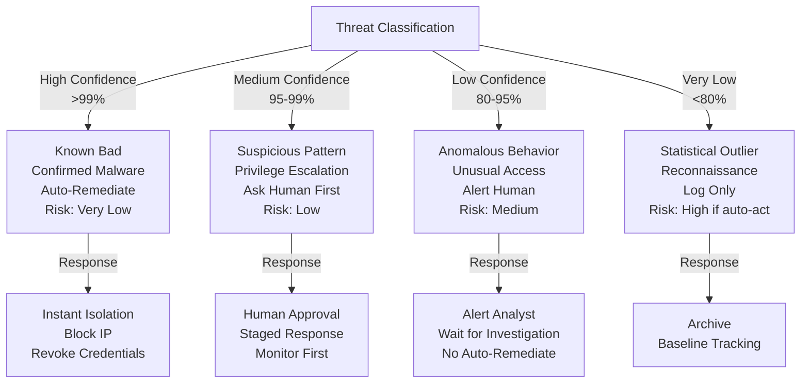
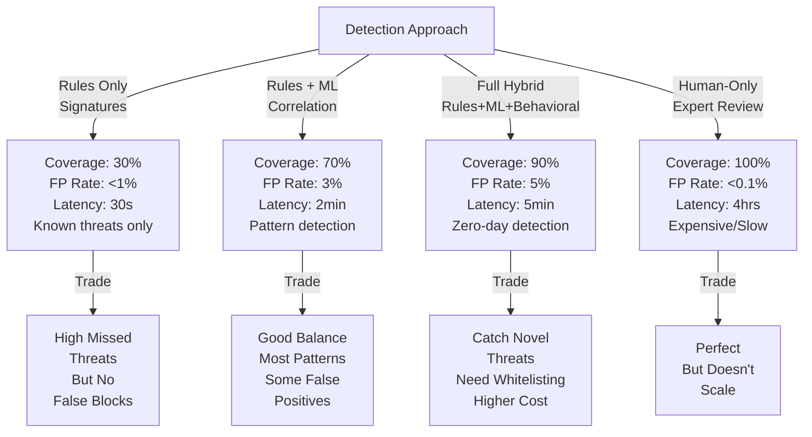

# Autonomous Security Threat Response (SOC Automation)

## Overview
An intelligent security operations center (SOC) automation system that ingests security alerts, performs threat analysis and enrichment, correlates events across systems, and executes response actions (isolate host, revoke credentials, block IP) with minimal human intervention.

## Problem Statement
Modern security teams face alert fatigue: SIEM systems generate 10K-100K alerts/day, but only 1-5% are genuine threats. Analysts spend 80% of time on false positive triage, leaving insufficient capacity for real threats. Incident response latency: 4-8 hours on average (alert → investigate → respond). During this window, attackers move laterally, exfiltrate data, or establish persistence. Economic impact: average data breach costs $4M+ and takes 200+ days to detect (NIST data). Automation enables: (1) sub-minute response to known threat signatures, (2) correlation across 10+ data sources (logs, network, endpoint), (3) executable playbooks (block IP, isolate host, revoke token), (4) human focus on novel threats requiring investigation.

## Requirements

### Functional
- Alert classification
- Threat analysis
- Remediation planning
- Execution

### Non-Functional (Scale Targets)
- Throughput: 1K alerts/day
- Auto-remediation: 60%
- Latency: <5 min

## Envelope Calculation
1K alerts × $0.10 = $100/day.

## Architecture Diagrams

### Diagram 1: SOC Automation Alert-to-Remediation Pipeline
```mermaid
graph LR
    A[Security Alerts<br/>10K-100K/day] -->|ingest| B[Alert Aggregation]
    B -->|deduplicate| C[Classification Engine]
    C -->|known bad| D["Rule Match<br/>30s response"]
    C -->|suspicious| E[ML Correlation]
    E -->|pattern detected| F[Threat Enrichment]
    F -->|reputation<br/>context| G{Confidence?>
    G -->|>99%| H["Auto-Remediate<br/>Block/Isolate"]
    G -->|95-99%| I["Ask Human<br/>15min SLA"]
    G -->|<95%| J["Escalate<br/>Investigate"]
    H -->|execute| K[Playbook Execution]
    I -->|approve| K
    K -->|log| L[Audit Trail]
```

### Diagram 2: Remediation Confidence & Response Tier


### Diagram 3: Detection Strategy Coverage vs False Positive Trade-off


## Component Breakdown

| Component | Latency | Cost | Accuracy | Notes |
|-----------|---------|------|----------|-------|
| Alert Aggregation | 10s | $0.01 | 99% | Deduplicate across SIEM, network, endpoint tools |
| Classification Engine | 100ms | $0.005 | 95% | Rules-based: known signatures, threat intel feeds |
| ML Correlation | 30s | $0.03 | 85% | Pattern detection: behavioral anomalies, graph analysis |
| Threat Enrichment | 30s | $0.02 | 90% | Reputation lookup: IP/domain/hash scoring, context gathering |
| Playbook Execution | 10s | $0.01 | 98% | Automated response: isolation, blocking, credential revocation |
| Human Review Gate | 15 min | $2-5 | 98%+ | Final approval for medium-confidence (95-99%) cases |

## AI/ML Integration Points

- **Classification Engine (Rule-based + pattern matching):** Alert categorization and severity assignment
  - Input: Raw security alerts (SIEM, IDS/IPS, endpoint, network logs)
  - Rules: Known bad signatures (malware hashes, IP reputation, domain blocklists)
  - Output: Alert category (malware, intrusion, data exfil, privilege escalation, reconnaissance)
  - Integration: VirusTotal, OSINT feeds, commercial threat intel subscriptions
  
- **ML Correlation Engine (Graph analysis, anomaly detection):** Pattern detection across events
  - Input: Alert sequences, user behavior, network flows
  - Models: Isolation Forest for anomalies, GNN for attack chains, statistical baselines
  - Output: Correlation score, confidence, suspected attack pattern
  - Optimization: Update baselines weekly, retrain on validated false positives
  
- **Threat Enrichment (Lookup + context assembly):** Add context for analyst decision
  - Input: Suspicious asset (IP, domain, hash), user identity, time of day
  - Sources: IP reputation (geolocation, ASN), domain WHOIS, file metadata, user role/location history
  - Output: Risk score, contextual flags (off-hours access, unusual geography, privileged user)
  
- **Behavioral Anomaly Detection (Statistical, ML-based):** Zero-day and novel threat detection
  - Input: Process behavior, network flows, file access patterns
  - Baseline: Per-user, per-asset normal behavior
  - Detectors: Unusual process spawning, encryption activity, mass file access, exfiltration patterns
  - Integration: EDR tools (CrowdStrike, Microsoft Defender) for process telemetry

## Detailed Trade-off Analysis

| Strategy | Alert Volume Handled | False Positive | Response Time | Auto-Remediation | Risk |
|----------|---------|-----------|---------|----------|---------|
| Rule-based (signature) | 30% (known) | <1% | 30s | 90% (simple) | False negatives (novel threats) |
| ML correlation | 70% (patterns) | 3% | 2 min | 70% (validated) | Complex alerts missed |
| SOAR + playbooks | 90% | 5% | 5 min | 60% (high confidence only) | Slow on novel threats |
| Human-only triage | 100% | <0.1% | 4 hrs | 0% | Expensive, slow |

**Decision:** Hybrid: rule-based for known bad (instant), ML correlation for patterns, human for novel/high-stakes.

### Production Failure Scenarios

**Scenario 1: System auto-isolates legitimate database server, breaks production**
- Network anomaly detected (high data exfiltration). System auto-executes playbook: isolate host from network. Hours later: production database unreachable, revenue impact $100K/hour.
- Fix: Isolation should be "ask first, act after human approval" for critical systems. Or: implement staged response (alert → block internet → check human feedback within 5 min → full isolation). For non-critical: auto-isolate is OK.

**Scenario 2: Malware signature database is outdated, latest ransomware not detected**
- Zero-day ransomware hits. Signature database last updated 3 days ago. System misses it. Data encrypted before human notices.
- Fix: Real-time threat intel integration (VirusTotal, Shodan, threat feeds). Not just static signatures. Monitor for novel patterns (encryption activity, mass file access). Escalate unknown patterns immediately.

**Scenario 3: Over-remediation: system blocks all IPs with 3+ failed login attempts, blocks legitimate users**
- Auto-block trigger: 3 failed logins on user account. Legitimate user forgets password, 3 attempts, IP gets blocked. User locked out, productivity lost.
- Fix: Smarter logic: IP-based block should exclude internal subnets. Or: longer block timeout (15 min vs permanent). Allow human override. Whitelist known-good IP ranges.

**Scenario 4: AI recommends response, human approves without reading, turns out wrong**
- System alerts: "SQL injection attempt from 192.168.1.100". Analyst sees alert, clicks approve block. Later: 192.168.1.100 is internal test machine. QA team can't run tests. System masked the context (didn't explain why SQL injection suspected).
- Fix: Include reasoning: "SQL injection: detected keywords 'UNION SELECT' in HTTP parameter". Require analyst to confirm understanding. For critical blocks, require explicit yes/no (not just checkbox).

### Implementation Guidance

**Wrong:** Auto-execute all remediations >95% confidence.
**Right:** Confidence-based tiers: >99% → auto-execute (clear malware). >95% → ask human. <95% → escalate for investigation.

**Wrong:** Block/isolate everything suspicious.
**Right:** Graduated response: alert → monitor → throttle → block. Let human choose urgency level.

**Wrong:** Use only known signatures (static detection).
**Right:** Signatures + behavioral (unusual processes, port scanning, data exfil) + ML anomalies.

## Interview Q&A

**Q1: How do you prevent false positives from damaging legitimate operations?**

A: Whitelisting + risk-based response. Critical assets (production DBs, payment systems): high confidence threshold (>99%) before auto-response. Non-critical (dev machines): lower threshold (<90%). Also: staged response (alert → monitor → block) rather than instant disable. Human approval SLA: 15 min for critical, 1 hour for non-critical.

**Q2: Response time target <5 min. Where's the latency breakdown?**

A: Alert ingestion (10s) → rules check (100ms) → ML correlation (30s) → enrichment (30s) → analyst approval (4min) → playbook execution (10s). Bottleneck: analyst approval. To improve: automate approval for >99% confidence cases (known bad), reduce approval delay for others via mobile/chat alerts.

**Q3: How to prevent an attacker from disabling the security system itself?**

A: Defense in depth: (1) SIEM/SOC system isolated on separate network. (2) Read-only access for analysts (alerts only, no ability to disable rules). (3) Centralized audit log (off-box, immutable). (4) Change control: any rule modification requires approval + logging. (5) High privileged account monitoring (SOC admin activity audited heavily).

**Q4: Threat intelligence: how to decide which feeds to trust?**

A: Reputation scoring: (1) accuracy track record (how often wrong). (2) source reliability (law enforcement, industry consortium vs random blog). (3) age of intelligence (recent vs old). (4) internal validation (does it match our network behavior). Low-score feeds: use as supporting evidence only. High-score: can auto-action.

**Q5: False positive rate is 5%. How to reduce to 1%?**

A: (1) Tune thresholds: raise to 99% confidence for auto-response (reduce false remediations, but slower alert handling). (2) Whitelisting: exclude internal IPs, known-good tools, sanctioned testing. (3) Context: include user role, asset criticality, time of day (off-hours suspicious, daytime expected). (4) Feedback: when analyst overrides alert as false positive, retrain model.

**Q6: Novel zero-day threat arrives. System has no signature. How to detect?**

A: Anomaly detection: (1) process behavior (spawning unusual children, accessing system files). (2) network behavior (exfiltration patterns, C2 communication). (3) file system (unusual encryption, rapid file access). (4) statistical: compare to baseline (does this user usually access this data?). Escalate all anomalies to human. Collect as potential new signature.

**Q7: Incident response playbook: when to execute vs when to alert human first?**

A: Severity matrix: (1) CRITICAL (confirmed malware, ransomware, data exfil): auto-isolate after 5-min human approval window. (2) HIGH (suspicious network, privilege escalation): alert + ask human. (3) MEDIUM (failed logins, suspicious process): alert only. (4) LOW (port scans, recon): log but no alert. Business decides thresholds based on risk tolerance.

**Q8: How do you test the system without accidentally killing production?**

A: Staging environment: (1) shadow mode: run playbooks against staging replicas, don't execute. (2) dry-run: execute playbooks, but log results without actually isolating. (3) canary: test on non-critical assets first (dev machines). (4) rollback: any playbook execution reversible (e.g., firewall rule has removal script). (5) approval gates: human must approve before any production change.

## Interview Quick-Reference

| Metric | Target |
|--------|--------|
| **Scale** | [Users/requests/day] |
| **Latency P99** | [<X ms] |
| **Accuracy** | [Y%] |
| **Cost** | [$Z per request] |
| **Availability** | [99.9%+] |


## Animated Architecture Visualization

See the system in action with dynamic visualizations:

### System Deployment Animation


Infrastructure components appearing and connecting in real-time, showing load balancers, API gateways, microservices, and data layer setup.

### Request Flow Animation


A single request flowing through the complete pipeline with latency accumulation at each stage, demonstrating the critical path and timing constraints.

### Data Flow Animation


Concurrent data packets flowing through processors and ML models to storage systems, showing simultaneous traffic and I/O patterns.

### Auto-Scaling Animation


Dynamic scaling response to traffic load, showing pod count adjusting up and down with capacity headroom management over time.


## Related Systems
- [Related system 1]
- [Related system 2]
- [Related system 3]
