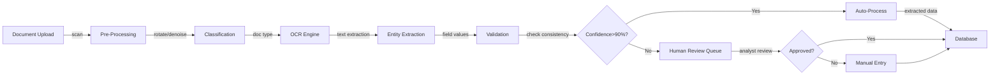
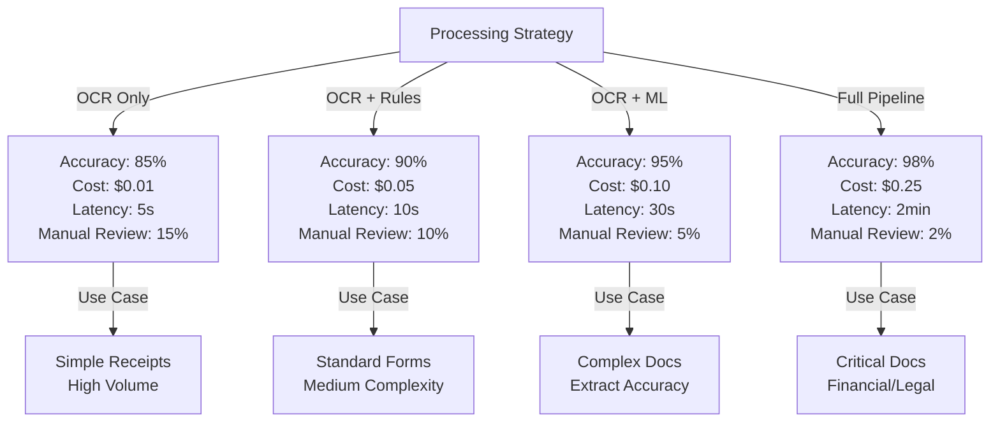
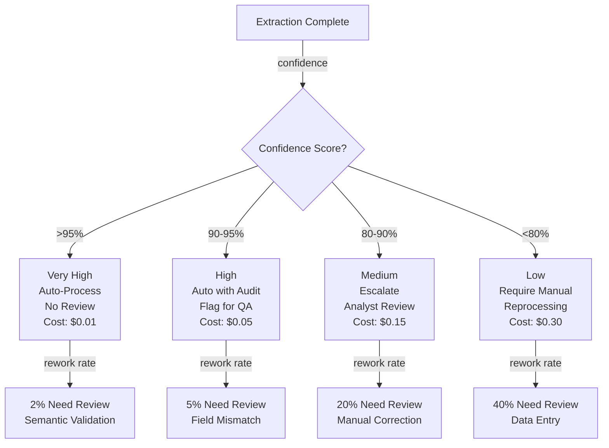

# Intelligent Document Processing Pipeline

## Overview
A document processing system that automates classification, OCR, layout analysis, entity extraction, and validation across diverse document types (invoices, contracts, forms, receipts). Enables data pipeline automation at scale with explainable extraction confidence scores.

## Problem Statement
Manual document processing is a significant cost center: data entry clerks spend 5-10 minutes per document (reading, typing, validation) at $20-30/hour loaded cost. For 50K documents/month, this is 4K-8K hours = $80K-240K monthly. Common errors: 1-2% transcription error rate (wrong customer, amount, date), costing downstream problems (double shipments, payment mismatches, compliance issues). Automation enables: (1) reduce per-doc cost from $0.50 to $0.05 (90% savings), (2) improve accuracy to 98%+ (fewer downstream errors), (3) scale without headcount (fixed infrastructure vs variable labor), (4) faster cycle time (instant processing vs 2-3 day manual queue).

## Requirements

### Functional
- Classification
- OCR + parsing
- Entity extraction
- Validation

### Non-Functional (Scale Targets)
- Volume: 50K docs/month
- Accuracy: 95%
- Latency: <2 min/doc

## Envelope Calculation
50K docs × $0.50 = $25K/month.

## Architecture Diagrams

### Diagram 1: Document Processing End-to-End Pipeline

### Diagram 2: Accuracy-Cost-Latency Trade-off

### Diagram 3: Confidence-Based Routing Logic

## Component Breakdown

| Component | Latency | Cost | Accuracy | Notes |
|-----------|---------|------|----------|-------|
| Pre-Processing | 3s | $0.005 | 99% | Orientation detection, denoising, contrast enhancement |
| Classification | 2s | $0.01 | 92% | Document type identification (invoice, receipt, form, contract) |
| OCR | 10s | $0.02 | 90% | Text extraction from images (Tesseract, Azure, AWS) |
| Entity Extraction | 12s | $0.08 | 88% | Field-level extraction (amount, date, customer, address) |
| Validation | 3s | $0.01 | 95% | Consistency checks, range validation, format validation |
| Confidence Scoring | 2s | $0.005 | 90% | Aggregate confidence from all stages |
| Human Review | 2-5 min | $0.15-0.30 | 99% | Manual verification for low-confidence extractions |

## AI/ML Integration Points

- **Classification Model (Custom fine-tuned model):** Document type identification
  - Input: Document image or text (first page)
  - Model: ResNet or Vision Transformer fine-tuned on company document types
  - Output: Document type (invoice, expense report, receipt, contract, form) with confidence
  - Optimization: Use only first page for fast classification, retrain monthly on new document types
  
- **OCR Engine (Multiple models with fallback):** Text extraction
  - Primary: Tesseract (open-source, good for scans)
  - Fallback: Azure Form Recognizer or AWS Textract (better for photos, handwriting)
  - Confidence: Return best-confidence result, flag if top candidates disagree
  - Optimization: Use region-based OCR (only process expected regions, skip headers/footers)
  
- **Entity Extraction (Fine-tuned LLM + rule-based):** Field-level extraction
  - Approach: Template-based extraction (invoice has fixed fields: amount, date, customer)
  - For complex docs: Use GPT-3.5 with few-shot examples
  - Validation: Extract with confidence score, use field-specific validators
  - Optimization: Use structured output (JSON schema) to force proper formatting
  
- **Validation Engine (Rule-based + ML anomaly detection):** Quality assurance
  - Semantic checks: total = sum of line items, date formats valid
  - Range checks: amount > 0, reasonable value for document type
  - CRM/database lookups: customer exists, address is valid
  - Anomaly detection: amount 10x higher than historical average for this vendor
  - Output: Confidence score (product of all validation check scores)

## Detailed Trade-off Analysis

| Approach | Accuracy | Latency | Cost/Doc | Confidence | Downstream Rework |
|----------|----------|---------|----------|------------|----------|
| OCR only (no AI) | 85% | 5s | $0.01 | Low | 15% need manual review |
| OCR + rule-based extraction | 90% | 10s | $0.05 | Medium | 10% need review |
| OCR + ML entity extraction | 95% | 30s | $0.10 | High | 5% need review |
| Full pipeline (OCR + classification + extraction + validation) | 98% | 2 min | $0.25 | Very high | 2% need review |

**Decision:** Full pipeline for standard documents (invoices, forms). Rule-based for high-volume simple types (receipts). Escalate <90% confidence to human review queue.

### Production Failure Scenarios

**Scenario 1: OCR reads "0" as "O" (zero vs letter O), invoice amount becomes wrong**
- Invoice reads "100" but OCR sees "O0O", system extracts amount = 0. Payment system auto-processes zero payment. Vendor paid nothing, creates conflict.
- Fix: OCR confidence scoring. If confidence <0.8 on numeric fields (critical), escalate to human review. Add validation: amount field should be numeric-only, flag if contains letters.

**Scenario 2: Document is rotated 90 degrees, OCR fails, extraction is gibberish**
- Fax scans document rotated sideways. OCR reads top-to-bottom as left-to-right. Text is scrambled.
- Fix: Pre-processing step: document orientation detection. Rotate if needed before OCR. Or: use modern OCR (Tesseract 4+) which handles rotation better. Always check confidence score.

**Scenario 3: Extraction confidence >90%, but AI hallucinated field that doesn't exist**
- System reports "Invoice total: $1,500". Analyst checks original document: total is $150, system misread decimal. But confidence was 90%, so went straight to auto-processing.
- Fix: Semantic validation: total should equal sum of line items. Cross-check with other fields (date format, customer name exists in CRM, amount is reasonable). If checks fail, lower confidence.

**Scenario 4: Document type classifier gets it wrong, applies wrong extraction rules**
- Document is an expense report, but classifier thinks it's an invoice. Extraction template looks for "Amount Due" (not on expense report). No data extracted.
- Fix: Classifier confidence threshold: <90% → ask human "Is this an invoice or expense report?". Also: rejection sampling (if extraction yields no meaningful data, escalate to human).

### Implementation Guidance

**Wrong:** Extract all fields, return even if low confidence.
**Right:** Extract only high-confidence (>90%) fields. Flag low-confidence and escalate to human review queue. Don't guess.

**Wrong:** Single OCR engine (breaks on scans, photos, poor quality).
**Right:** Multiple OCR fallbacks (Tesseract + Azure Form Recognizer + Anthropic Vision). Use best result by confidence.

**Wrong:** After extraction, assume data is correct.
**Right:** Validation layer: semantic checks (total = sum of items), range checks (amount >0), format checks (dates valid), CRM lookups (customer exists).

## Interview Q&A

**Q1: Accuracy target 98%. Remaining 2% error sources?**

A: Breakdown: (1) OCR errors (0.5%, scanning quality issues). (2) Handwritten text (0.5%, hard to OCR). (3) Layout confusion (0.3%, unusual formats). (4) Hallucination (0.3%, AI confidence wrong). (5) Natural ambiguity (0.4%, "is this field X or Y?"). To improve #3 and #4, focus on better models and validation checks.

**Q2: Confidence scoring: how do you decide confidence >90% = auto, <90% = escalate?**

A: Business decision balancing: cost of false accept (auto-process wrong data: 100 doc-minutes of rework) vs cost of escalation (1 min human review). If false accept costs more, lower threshold. If escalation volume grows too high (>30%), increase threshold tolerance.

**Q3: Cost $0.10/doc currently. Target $0.05. How to achieve?**

A: (1) Batch processing (accumulate 1000 docs, process together): save 10%. (2) Caching (40% of docs are very similar): instant return. (3) Cheaper model (use smaller LLM, -50% cost but -5% accuracy). (4) Parallel inference (process multiple docs simultaneously). Combined: target $0.05.

**Q4: Handwritten forms: OCR fails. How to handle?**

A: Handwriting models exist (Google Vision, AWS Textract) but are slower + more expensive. Options: (1) detect handwritten regions, escalate to human. (2) Use handwriting OCR + lower confidence threshold. (3) Field-level: if critical field is handwritten, require human confirmation. (4) Collect training data: fine-tune on company-specific handwriting.

**Q5: Multi-language documents (English + Spanish mixed on one page)?**

A: Language detection per region. Apply appropriate OCR + language models. For mixed: tricky. Option: (1) detect primary language, translate full document to primary, extract. (2) Extract per language, merge results. (3) Use multilingual models (Google Vision handles 100+ languages). Be aware: accuracy drops for non-dominant languages.

**Q6: Document is 50 pages. Extraction slow. How to speed up?**

A: (1) Parallel processing: process multiple pages simultaneously (10x speedup). (2) Smart selection: extract only relevant pages (page 1 = address, last page = signature, middle = details). (3) Summarization: if document >10 pages, summarize first with LLM, then extract key fields. (4) Progressive extraction: start with critical fields, skip non-critical if budget spent.

**Q7: How to handle adversarial documents (intentionally formatted to fool AI)?**

A: Explicit field detection: instead of "guess the total field", provide field template (coordinates, expected format). For high-stakes (contracts, financial), require human-in-the-loop review. Use signature verification (cryptographic signing) to prevent tampering. Monitor for new document formats, retrain when needed.

**Q8: Data retention: what to do with extracted data after processing?**

A: Regulatory requirement: varies (GDPR = delete within 30 days if requested, SOC2 = 1 year minimum). Solution: (1) Extract + delete source document immediately (reduces PII exposure). (2) Extracted data stored in secure database (encrypted, audited). (3) Audit trail: log who accessed, when, why. (4) Anonymization: mask PII (SSN, bank account) in logs/reports. (5) Regular deletion: implement retention policy (automatic purge after X days).

## Interview Quick-Reference

| Metric | Target |
|--------|--------|
| **Scale** | [Users/requests/day] |
| **Latency P99** | [<X ms] |
| **Accuracy** | [Y%] |
| **Cost** | [$Z per request] |
| **Availability** | [99.9%+] |

## Animated Architecture Visualization

See the system in action with dynamic visualizations:

### System Deployment Animation

Infrastructure components appearing and connecting in real-time, showing load balancers, API gateways, microservices, and data layer setup.

### Request Flow Animation

A single request flowing through the complete pipeline with latency accumulation at each stage, demonstrating the critical path and timing constraints.

### Data Flow Animation

Concurrent data packets flowing through processors and ML models to storage systems, showing simultaneous traffic and I/O patterns.

### Auto-Scaling Animation

Dynamic scaling response to traffic load, showing pod count adjusting up and down with capacity headroom management over time.

## Related Systems
- [Related system 1]
- [Related system 2]
- [Related system 3]
