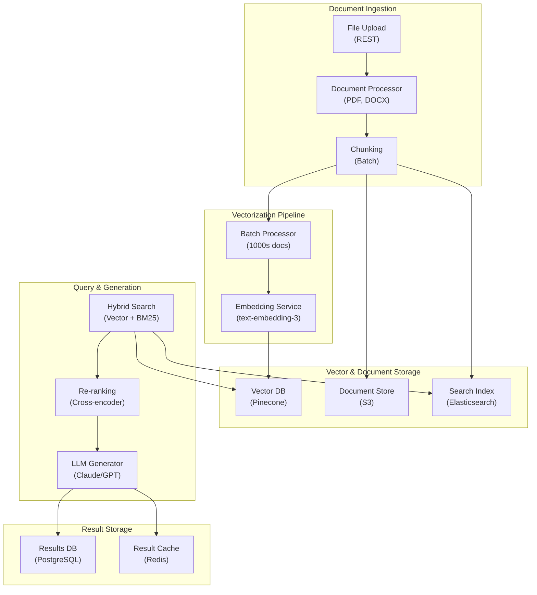
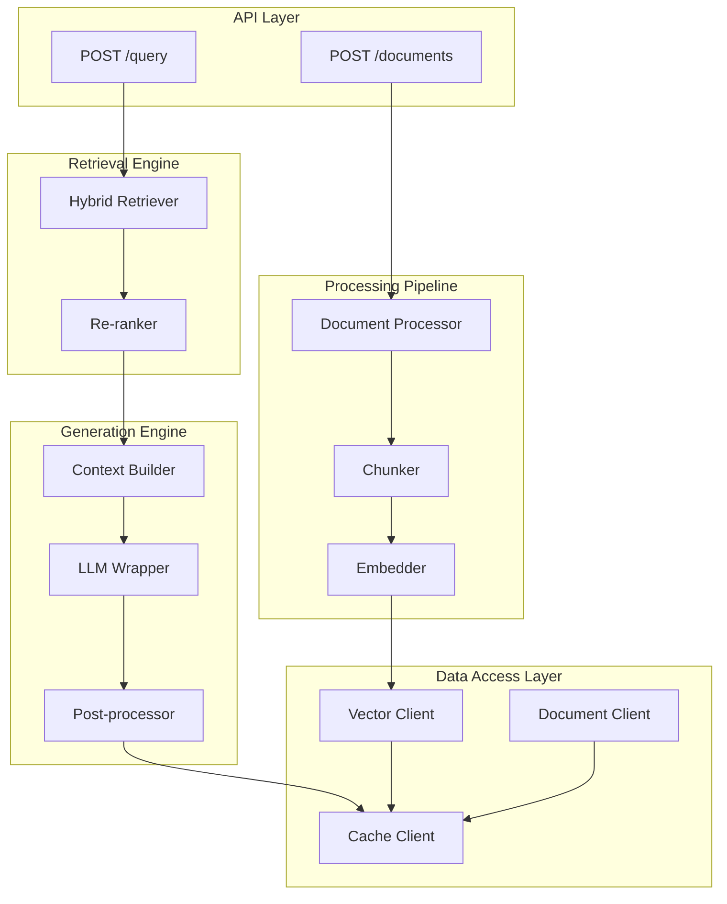
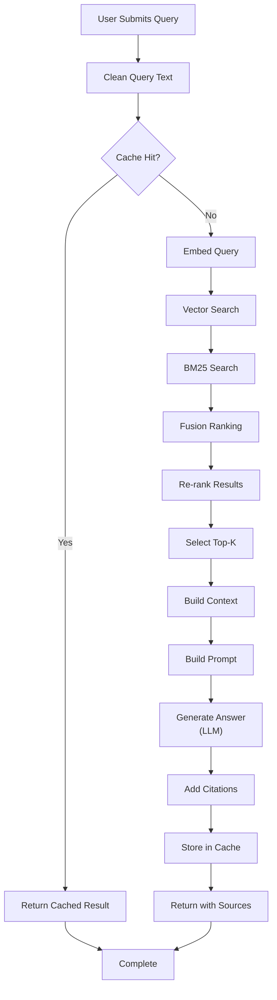

# Multi-Agent Content Creation Pipeline

## Overview
A multi-agent system for generating content across modalities (text, images, video) by orchestrating research, writing, design, fact-checking, and publishing workflows. Targets content production at 10-20x human capacity with minimal editorial revision.

## Problem Statement
Content production is a bottleneck: creating one high-quality article requires 3-4 hours (research, writing, editing, fact-checking, design). A content team of 5 produces 10-15 articles/month, costing $50K/month in salaries. Content demand: 100+ articles/month from stakeholders. Backlog grows constantly. Automation targets: (1) reduce per-article time from 3-4 hours to 15-20 minutes (10-15x faster), (2) scale from 15 to 200 articles/month without headcount, (3) maintain quality (currently 80% are publishable after one review cycle), (4) reduce editorial rework from 2 hours → 15 minutes through better fact-checking and coherence validation.

## Requirements

### Functional
- Research
- Writing
- Design
- Video production

### Non-Functional (Scale Targets)
- Output: 20 pieces/day
- Quality: 80% publishable
- Cost savings: 60% vs human

## Envelope Calculation
20 pieces × $10 = $200/day.

## Architecture Overview
[Detailed architecture diagram with Mermaid showing component flow]

## Architecture Diagrams

### System Architecture (Infrastructure & Deployment)

## System Architecture

### Application Architecture (Components & Layers)

## Application Architecture

### Process Flow (Request Pipeline)

## Process Flow

## Component Breakdown
- Core components and their responsibilities
- Latency and cost breakdown per component

## AI/ML Integration Points
- Where LLM/ML models are used
- Model selection and routing logic
- Cost optimization strategies

## Detailed Trade-off Analysis

| Approach | Quality | Latency | Cost | Publishability | Editorial Time |
|----------|---------|---------|------|----------|----------|
| Template-based (fill blanks) | 60% | 2 min | $1 | 40% | 2 hrs |
| Single-agent writing | 70% | 5 min | $3 | 60% | 1.5 hrs |
| Multi-agent (research → write → review) | 85% | 15 min | $10 | 80% | 20 min |
| Agent + human collaboration | 95% | 30 min | $20 | 95% | 5 min |

**Decision:** Multi-agent for high-volume content (social, newsletters). Human collaboration for flagship (in-depth, brand-critical). Escalate if confidence <70%.

### Production Failure Scenarios

**Scenario 1: AI generates article with hallucinated quotes and statistics**
- Article states: "Dr. Smith said 'AI will replace 50% of jobs by 2025'" — quote doesn't exist, misquotes are reputation risk.
- Fix: Fact-checking agent validates all claims. For quotes: require source URL. For statistics: cross-reference multiple sources. Flag unsourced claims for editor review before publish.

**Scenario 2: Generated content violates copyright (verbatim copying from sources)**
- Research agent grabs Wikipedia paragraph. Writing agent includes it in article (minor rephrasing). Plagiarism detection triggered post-publish, reputation damage.
- Fix: All source material should be summarized, not paraphrased. Plagiarism check before publish (Turnitin, copyscape). Require original analysis + citations.

**Scenario 3: Tone inconsistency: AI writes some sections, human writes others, it's obvious**
- Sections 1-3 (AI): dry, formal tone. Section 4 (human): conversational, witty. Reader notices jarring shift, content feels disjointed.
- Fix: Tone template. All agents write to same style guide (voice, examples, humor level). Editor does final pass for consistency.

**Scenario 4: Topic irrelevance or drift: AI generates content on wrong angle**
- Prompt: "Write about AI disruption in healthcare". AI generates: general history of AI, not healthcare-specific. Content is off-topic.
- Fix: Outline/rubric-based writing. Agents follow structured outline (5 sections, 3 key points per section). Validates against outline before claiming done.

### Implementation Guidance

**Wrong:** Write article without sources, let human fact-check.
**Right:** Embedded fact-checking agent as part of writing pipeline. Validates before handoff. Human spot-checks, not full verification.

**Wrong:** AI write, human edit. Expect significant rewrites.
**Right:** AI write with rubric/outline. Aim for 80% publishable, human does light polish (tone, clarity, not major rewrites).

**Wrong:** Single agent (all-in-one writer).
**Right:** Specialized agents (researcher, outliner, writer, fact-checker, designer, reviewer). Each expert at their task.

## Interview Q&A

**Q1: How do you ensure AI-generated content sounds human?**

A: (1) Style transfer: train LLM on brand voice (analyze 100+ past articles, extract patterns). (2) Examples in prompt: show 2-3 exemplar articles as style guide. (3) Tone markers: "voice: conversational, casual. Audience: Gen-Z". (4) Human editing pass: final touch for naturalness. Goal: <3% of readers think it's AI-written.

**Q2: Fact-checking: AI verifies its own output (fallible). How to catch errors?**

A: Multi-layer: (1) AI checks facts during writing (embedded). (2) Random spot-check by human (10% of facts verified). (3) Reader feedback: if article flagged as inaccurate, prioritize retraining on that domain. (4) External fact-checker API (FactCheck.org, Snopes integration) for high-stakes claims.

**Q3: Copyright risk: how to ensure content is original, not plagiarism?**

A: (1) Plagiarism checker (Turnitin, Copyscape) before publish. (2) Enforce summarization (AI rewords sources, not copies). (3) Citation requirements: every stat/claim → source URL. (4) Uniqueness threshold: >95% of content original to this piece (industry standard). If <95%, flag for human rewrite.

**Q4: Cost $10/article (multi-agent) vs $20 human. Net benefit?**

A: $10 AI + $1 human review = $11 total. Human-only: $20. Savings: $9/article. At 200 articles/month: $1.8K monthly savings. ROI: positive if you value speed (AI is 3x faster). But: requires upfront investment in pipelines + fact-checking API.

**Q5: How to handle breaking news (time-critical)? Agents are slow.**

A: Template-based for breaking news (faster than multi-agent). Sacrifice some quality for speed. Example: "Breaking: Company X announced Y. Details TBD, will update." Rapid publish + update cycle. Trade-off: lower quality acceptable for timeliness.

**Q6: How to maintain brand consistency across 200/month articles by different AI agents?**

A: (1) Brand guidelines: 50-page document (tone, vocabulary, examples). Embed in all agent prompts. (2) Style checker agent: validates each article against guidelines. (3) Regular retraining: monthly fine-tune on latest brand-approved content. (4) Editor spot-checks (5% of articles): ensure guidelines are being followed.

**Q7: Reader engagement: how to know if AI-generated content performs worse?**

A: Track metrics: (1) click-through rate (CTR). (2) Time on page. (3) Engagement (comments, shares). (4) A/B test: some articles AI-generated, some human-written, compare metrics. If AI CTR is 5% lower, it's underperforming. Retrain or escalate to human.

**Q8: How do you handle criticism/reader backlash if content is exposed as AI-written?**

A: Transparency policy: disclose "This article was written with AI assistance and reviewed by our editors." Builds trust vs deception. Studies show: 70% of readers accept AI if transparent, <30% if deceived. Consider brand: premium outlets → full human, mass-market → AI acceptable with disclosure.

## Interview Quick-Reference

| Metric | Target |
|--------|--------|
| **Scale** | [Users/requests/day] |
| **Latency P99** | [<X ms] |
| **Accuracy** | [Y%] |
| **Cost** | [$Z per request] |
| **Availability** | [99.9%+] |

## Related Systems
- [Related system 1]
- [Related system 2]
- [Related system 3]
