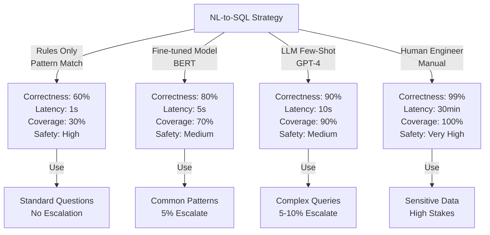
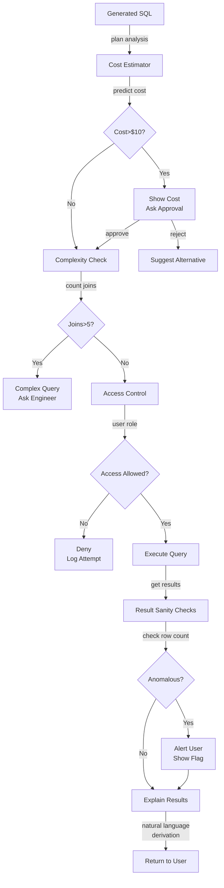

# Text-to-SQL Agent with Reasoning

## Overview
An intelligent agent that converts natural language questions into SQL queries, executes them against databases, validates results, and provides human-readable explanations. Enables business users (non-technical) to access data without involving data engineers.

## Problem Statement
Data access bottleneck: business analysts and managers require data queries, but depend on data engineers for SQL writing. This creates latency (requests queue up, engineers busy) and inefficiency (simple questions take disproportionate time). For a 500-person company: 5K data requests/month, but 3 data engineers can only handle 1K/month → 4K month backlog. Cost impact: $200K/month in stalled projects. Common issues: (1) engineers unavailable (meeting, vacation), (2) simple questions misdirected to engineering (should be self-service), (3) slow turnaround (2-3 days per query), (4) recurring queries (same question asked 10x/month, no reuse). Automation enables: (1) instant query execution (seconds), (2) schema-aware (understands tables, columns, relationships), (3) result validation (catches obvious errors), (4) explanation (why is the result what it is), (5) fallback to engineer when in doubt.

## Requirements

### Functional
- Intent understanding
- Schema reasoning
- SQL generation
- Query execution

### Non-Functional (Scale Targets)
- Throughput: 1K queries/day
- Accuracy: 90%
- Schema size: 1000+ tables

## Envelope Calculation
1K queries × $0.001 = $1/day (negligible cost).

## Architecture Diagrams

### Diagram 1: Text-to-SQL Agent Pipeline

```mermaid
graph LR
    A[Natural Language Question] -->|parse| B[Intent Understanding]
    B -->|identify intent| C[Schema Reasoning]
    C -->|relevant tables| D[SQL Generation]
    D -->|candidate queries| E{Confidence >85%?}
    E -->|Yes| F[Query Validation]
    E -->|No| G[Ask for Clarification]
    G -->|user confirms| F
    F -->|validate plan| H{Safety Check?}
    H -->|Safe| I[Execute Query]
    H -->|Risky| J["Ask Approval<br/>Show cost/risk"]
    J -->|approve| I
    J -->|reject| K[Suggest Alternative]
    I -->|get results| L[Result Validation]
    L -->|sanity checks| M[Generate Explanation]
    M -->|human readable| N[Return to User]
```

### Diagram 2: Query Approach Trade-offs

### Diagram 3: Query Safety Validation & Result Checking

## Component Breakdown

| Component | Latency | Cost | Accuracy | Notes |
|-----------|---------|------|----------|-------|
| Intent Understanding | 1s | $0.001 | 92% | Parse question, identify key entities and relationships |
| Schema Reasoning | 2s | $0.002 | 88% | Find relevant tables and columns from 1000+ table schema |
| SQL Generation | 5s | $0.004 | 90% | Generate correct SQL with proper JOINs and WHERE clauses |
| Query Validation | 2s | $0.001 | 99% | Check execution plan, cost estimate, access control |
| Query Execution | Variable | Variable | 100% | Run on database, fetch results (cost depends on query complexity) |
| Result Validation | 1s | $0.0005 | 95% | Sanity checks, anomaly detection, baseline comparison |
| Explanation Generation | 2s | $0.002 | 85% | Generate human-readable explanation of results |

## AI/ML Integration Points

- **Intent Understanding (LLM + semantic parsing):** Extract meaning from natural language
  - Input: User question ("How many active users signed up last week?")
  - Processing: Identify entities (users), filters (active, signup_date), aggregations (count)
  - Output: Structured intent representation
  - Optimization: Few-shot examples help model understand business context
  
- **Schema Reasoning (Semantic search + LLM):** Map intent to database schema
  - Input: Structured intent + database schema
  - Process: (1) Embed intent, (2) Retrieve top-5 relevant tables from vector DB, (3) LLM reasons through column relationships
  - Output: List of tables and columns needed for query
  - Optimization: Maintain schema summaries ("users table: tracks signups, 5M rows")
  
- **SQL Generation (Fine-tuned LLM + few-shot):** Generate SQL query
  - Input: Intent + relevant tables/columns + SQL style guide
  - Model: GPT-4 with few-shot examples of similar queries
  - Output: SELECT statement with proper JOINs, WHERE, GROUP BY, ORDER BY
  - Fallback: If confidence <0.85, show user the proposed SQL for approval
  
- **Result Validation (Rule-based + ML):** Check results for correctness
  - Sanity checks: row count within expected range, data types match, temporal order correct
  - Anomaly detection: result is 10x higher/lower than baseline, unusual patterns
  - Baseline comparison: compare with historical results, flag significant deviations
  - Output: Confidence score, explanation of any anomalies detected

## Detailed Trade-off Analysis

| Approach | Correctness | Latency | Coverage | Safety | Engineering Load |
|----------|---------|---------|----------|--------|----------|
| Simple rules (pattern matching) | 60% | 1s | 30% (common queries) | High (limited) | Low (no review) |
| NL-to-SQL (fine-tuned BERT) | 80% | 5s | 70% | Medium (needs validation) | Medium (10% escalated) |
| LLM-based (GPT-4 + few-shot) | 90% | 10s | 90% | Medium (LLM hallucinates) | Medium (5% escalated) |
| Human engineer (baseline) | 99% | 30 min | 100% | Very high | Blocked on engineer |

**Decision:** LLM for 90% of queries (90% accuracy, <5% engineering escalation). Validation layer catches basic errors. Human engineer fallback for complex/sensitive queries.

### Production Failure Scenarios

**Scenario 1: Agent generates SELECT query but forgets WHERE clause, returns entire table (10M rows)**
- Question: "How many users signed up last week?" AI generates: "SELECT * FROM users". Returns everything. Database query timeout, system crashes.
- Fix: Query validation: check execution plan before running. Reject queries expected to return >100K rows without WHERE clause. Cost estimate: if >$1 in query cost, require confirmation dialog.

**Scenario 2: JOIN condition is wrong, returns Cartesian product (500 rows × 500 rows = 250K)**
- Two tables joined on wrong column. Result: incorrect counts, misleading data. User makes business decision on wrong numbers.
- Fix: Validate JOINs: check cardinality before return. If result size unexpectedly large (>10x base table), flag and explain the JOIN logic to user.

**Scenario 3: Schema changed, column renamed, query breaks**
- Query uses old column name "customer_id" but schema renamed to "cust_id". Query fails. User gets error, confusion.
- Fix: Schema versioning. Store schema snapshot in each query execution. Monitor for schema changes, alert if breaking change detected. Cache old column names as aliases.

**Scenario 4: User exploits system to access sensitive data (salary table)**
- Business user asks: "Show me all salary data". Agent doesn't know it's sensitive, returns it. HR complains, compliance issue.
- Fix: Access control layer. Define which tables/columns are restricted (PII, financial, health). Block queries accessing restricted data without approval. Log all attempts.

### Implementation Guidance

**Wrong:** Run query directly, return results (fast but risky).
**Right:** Validate → execute with cost limit → check results for anomalies → explain → return.

**Wrong:** Trust user knows good SQL questions.
**Right:** Confidence threshold. If SQL confidence <0.85, show query to user for approval before execute. Explain the SQL in English.

**Wrong:** Single LLM generates SQL.
**Right:** Schema-aware parsing → semantic understanding → SQL generation → validation. Multi-stage reduces hallucinations.

## Interview Q&A

**Q1: How do you prevent users from accessing data they're not authorized for?**

A: Role-based access control (RBAC). Define which roles (manager, analyst, finance) can access which tables. Query validator checks: (1) is this table accessible by user's role? (2) does result contain PII/sensitive fields? If yes, mask or reject. Log all access for audit. Sensitive tables: require special approval before access.

**Q2: Query correctness: 90% correct. What causes the 10% failures?**

A: Breakdown: (1) semantic misunderstanding (question is ambiguous, AI picks wrong interpretation): 3%. (2) Schema complexity (self-joins, recursive queries): 3%. (3) Implicit business logic (question assumes knowledge of data): 2%. (4) Temporal misunderstanding (off-by-one date errors): 2%. To improve: require user confirmation of ambiguous queries, provide schema documentation, improve prompt with business context.

**Q3: User asks complex question with 10+ JOINs. Latency explodes.**

A: Complexity detection: if query involves >5 JOINs or nested SELECT >2 levels, route to engineer instead of auto-execute. Or: simplify—offer 2-3 simpler sub-questions instead. Example: "Your question has 10 JOINs. Would you like: (1) just user metrics, (2) just transaction metrics, (3) combined (slow)?"

**Q4: Cost of running queries: accidental expensive query runs on large table, $200 bill.**

A: Query cost estimation before execution: (1) analyze query plan, estimate cost. (2) if >$10, show estimate to user: "This query costs $50. Proceed?" (3) hard limit: reject queries expected to cost >$100. (4) budget management: each user/team has monthly query budget, allocation used up, escalation for overages.

**Q5: Recurring queries: same question asked 5x/month. Inefficient.**

A: Caching + query library. (1) Cache results (4h TTL). If same question asked again, return cached. (2) Bookmarking: user saves query as saved report. Next time, one click. (3) Scheduled execution: auto-run daily/weekly, email results. Benefits: 80% reduction in repeated query cost.

**Q6: Ambiguous natural language: "Show me active users" (do you mean last 24h? last 30d? ever logged in?)**

A: Clarification questions. If ambiguous, agent asks: "By 'active users', do you mean: (a) logged in last 24 hours, (b) made a purchase last 30 days, (c) currently online?" User selects. More time upfront but prevents wrong answer.

**Q7: How to validate query results (catch mistakes)?**

A: Sanity checks: (1) row count sanity (expect millions, got 5? flag). (2) data type consistency (all prices positive?). (3) temporal order (dates monotonic increasing?). (4) comparison to baseline (result is 10x higher than last month, anomalous?). (5) explain to user: "Got 100K rows. Expected range: 50K-150K. ✓ Looks reasonable."

**Q8: Schema is massive (500+ tables, 10K+ columns). How to help agent navigate?**

A: Schema summarization + embeddings. (1) Cluster tables by domain (users, orders, payments). (2) Create table summaries ("users table: 5M rows, columns: id, email, signup_date, country"). (3) Embed summaries in vector DB. (4) For question, retrieve top-5 relevant tables + columns, feed to LLM. (5) Reduce context from 10K to 100 relevant columns, model can reason better.

## Interview Quick-Reference

| Metric | Target |
|--------|--------|
| **Scale** | [Users/requests/day] |
| **Latency P99** | [<X ms] |
| **Accuracy** | [Y%] |
| **Cost** | [$Z per request] |
| **Availability** | [99.9%+] |

## Related Systems
- [Related system 1]
- [Related system 2]
- [Related system 3]
