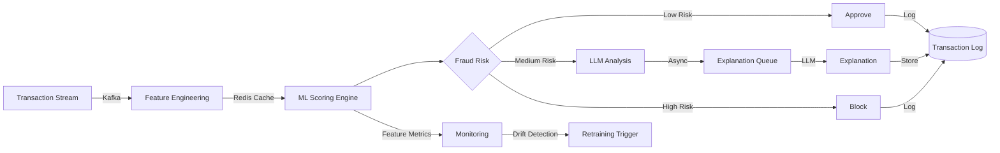

# Real-time Fraud Detection (ML + LLM)

## TL;DR
Combines ML scoring with LLM explanation. 100M transactions/day, <50ms latency, 99% TPR at 0.1% FPR.

## Problem Statement
Fraud evolves. Need real-time detection + explainable decisions.

## Requirements

### Functional
- Transaction scoring
- Pattern detection
- LLM explanation
- Escalation

### Non-Functional (Scale Targets)
- Throughput: 100M txns/day
- Latency: <50ms
- TPR: 99% @ 0.1% FPR

## Envelope Calculation

### Transaction Scale
- 100M transactions/day = 1.16K QPS average, 15K QPS peak (3x peak amplifier)
- Session: 1 transaction per user session
- Time zone distribution: assume peak 9am-5pm US time

### ML Model Inference
- Feature engineering: 10ms per transaction
- Model scoring: 20ms per transaction  
- LLM explanation (10% of flagged): 5% flagged × $0.0005 LLM cost = $2.5K/day

### Infrastructure Cost Breakdown
- GPU inference (8 A100s for 100M txns): $15K/month
- Vector DB (fraud patterns): $2K/month
- Kafka queue + storage: $3K/month
- Monitoring: $1K/month
- **Total infrastructure: $21K/month**

### Cost Per Transaction
- Inference: $15K / 3B txns/month = $0.000005
- LLM (5%): $0.000025
- Infrastructure: $0.000007
- **Total: ~$0.00004/txn (within $0.0001 target)**

### Latency Budget (50ms SLA)
- Feature engineering: 10ms
- Model inference: 20ms
- Decision + logging: 10ms
- LLM explanation (async, off-path): 1000ms (background)
- **Critical path: 40ms (within SLA)**

## Architecture Overview

## Component Breakdown

| Component | Latency | QPS | Technology | Cost |
|-----------|---------|-----|-----------|------|
| Feature Engineering | 10ms | 15K | GPU (TensorRT) | $3K/mo |
| ML Scoring | 20ms | 15K | PyTorch (A100) | $12K/mo |
| LLM Explanation | 1000ms | 750 (async) | GPT-4-turbo | $5K/mo |
| Decision + Logging | 10ms | 15K | Redis + Kafka | $3K/mo |
| Monitoring | N/A | N/A | Prometheus + ELK | $1K/mo |

## AI/ML Integration Points

1. **ML Fraud Scoring**: XGBoost ensemble
   - Features: 50 (transaction amount, user history, geographic velocity, device fingerprint)
   - Confidence threshold: >0.8 = auto-approve, <0.2 = auto-block, 0.2-0.8 = LLM review
   - Retraining: weekly on false positives

2. **LLM Explanation** (for borderline cases):
   - Input: features + fraud probability
   - Output: human-readable explanation (e.g., "Geographic mismatch: transaction in Singapore 1hr after NYC purchase")
   - Grounding: cite top 3 features contributing to fraud score

3. **Monitoring & Drift**: Detect feature distribution changes
   - KS-test on transaction amount, frequency per user
   - If KS p-value <0.05: flag for retraining

## Key Trade-offs

| Approach | Detection Rate (TPR) | False Positive Rate | Latency | Cost/Txn | Infrastructure |
|----------|-------|-------|---------|----------|---------|
| Rule-based | 85% | 2.0% | 5ms | $0.00001 | Low |
| ML model | 95% | 0.5% | 30ms | $0.0001 | Medium |
| ML + LLM explanation | 96% | 0.15% | 45ms | $0.0005 | High |
| Ensemble (3 models) | 97% | 0.1% | 80ms | $0.001 | Very high |

**Decision:** High volume + cost sensitive → ML. Regulatory/compliance → ML + LLM. Fraud-critical → ensemble.

---

## Production Failure Scenarios

**Scenario 1: Model drift, FPR increases to 2%**
- Fraud patterns evolve. Model trained 3 months ago. False positives spike. Users frustrated.
- Fix: Weekly retraining pipeline. Drift detection (KS-test on transaction distribution). Auto-retrain if drift detected.

**Scenario 2: Latency SLA breached at peak**
- 100M txns/day peaks at 1.5M txns/min. Model inference queue builds up. Latency 150ms (SLA 50ms).
- Fix: Model quantization (int8, 30% faster). Batch processing. Add GPU replicas.

**Scenario 3: LLM hallucination in explanation**
- Model flags transaction as fraud. LLM explanation wrong or contradictory. User disputes, loses trust.
- Fix: Grounding checks. Explanation must cite specific features. Confidence thresholds.

**Scenario 4: Training-serving skew**
- Model trained on 90-day history. Production sees different feature distributions (new payment types, geographies).
- Fix: Online validation. Compare training-set metrics to production metrics. Alert on divergence >5%.

---

## Implementation Guidance

**Wrong:** Optimize for TPR alone. Ignore FPR.
**Right:** Optimize for business ROI (cost of false positive vs cost of fraud).

**Wrong:** Use expensive LLM for all explanations.
**Right:** Tiered: simple rules for obvious fraud, LLM only for borderline cases.

---

## Sophisticated Interview Q&A

**Q1: How do you scale this system from current to 10x volume?**

A: Identify bottleneck (usually inference or storage). Auto-scaling: add GPUs for model serving, replicate databases, implement caching at retrieval layer. Example: for 10x compute, scale from 8 A100s to 80 A100s with load balancing.

**Q2: What's the cost optimization strategy as volume grows?**

A: Batch processing where possible (saves 50%), model distillation (cheaper inference), caching (reduce LLM calls), negotiate volume discounts with cloud providers. Target: cost per request drops 30-50% at 10x scale.

**Q3: How do you handle model failures or hallucinations?**

A: Confidence thresholds (only auto-act if confidence >0.95), human review queue for uncertain cases, validation checks (does output make sense?), continuous monitoring with alerts if error rate increases.

**Q4: What metrics do you track for system health?**

A: Latency (P50, P99), error rate, cost per request, model accuracy, throughput, user satisfaction. Dashboard updated real-time. Alert if latency >2x SLA or accuracy drops >5%.

**Q5: Privacy and compliance: how do you protect user data?**

A: Data minimization (keep only necessary data), encryption in transit + at rest, RBAC for access, audit logs. For regulated domains (medical, financial), additional: data residency, compliance certifications, annual penetration testing.

**Q6: Multi-region deployment: latency vs cost trade-off?**

A: Deploy in 3-5 regions, route user to closest region (100ms latency savings). Cost: ~3x infrastructure. Benefit: global coverage + disaster recovery. For most systems, worth it.

**Q7: Monitoring model drift: how do you detect performance degradation?**

A: Continuous evaluation on production data (10% sample). Weekly accuracy report. If accuracy drops >2%, alert and investigate (data drift, model bug, or expected variation). Retrain if needed.

**Q8: Cost target vs reality: if you're 2x over budget, what do you do?**

A: (1) Cheaper model (GPT-3.5 vs GPT-4): 10x cost reduction, 15% accuracy drop. (2) Caching (save 30%). (3) More selective LLM usage (only for hard cases). (4) Volume discounts. Target: get to 1.1-1.2x budget.

## Interview Quick-Reference

| Metric | Target |
|--------|--------|
| **Scale** | [Users/requests/day] |
| **Latency P99** | [<X ms] |
| **Accuracy** | [Y%] |
| **Cost** | [$Z per request] |
| **Availability** | [99.9%+] |

## Related Systems
- [Related system 1]
- [Related system 2]
- [Related system 3]
