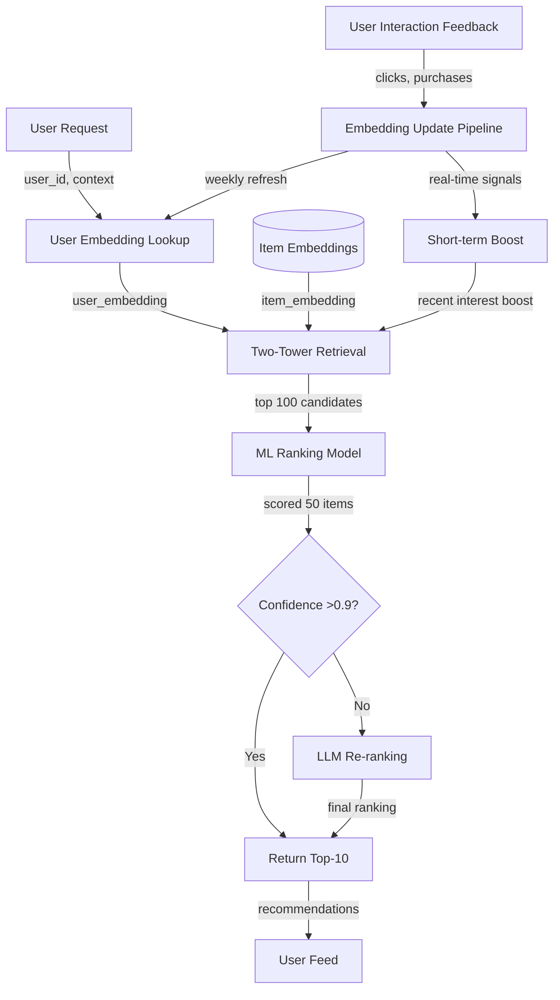
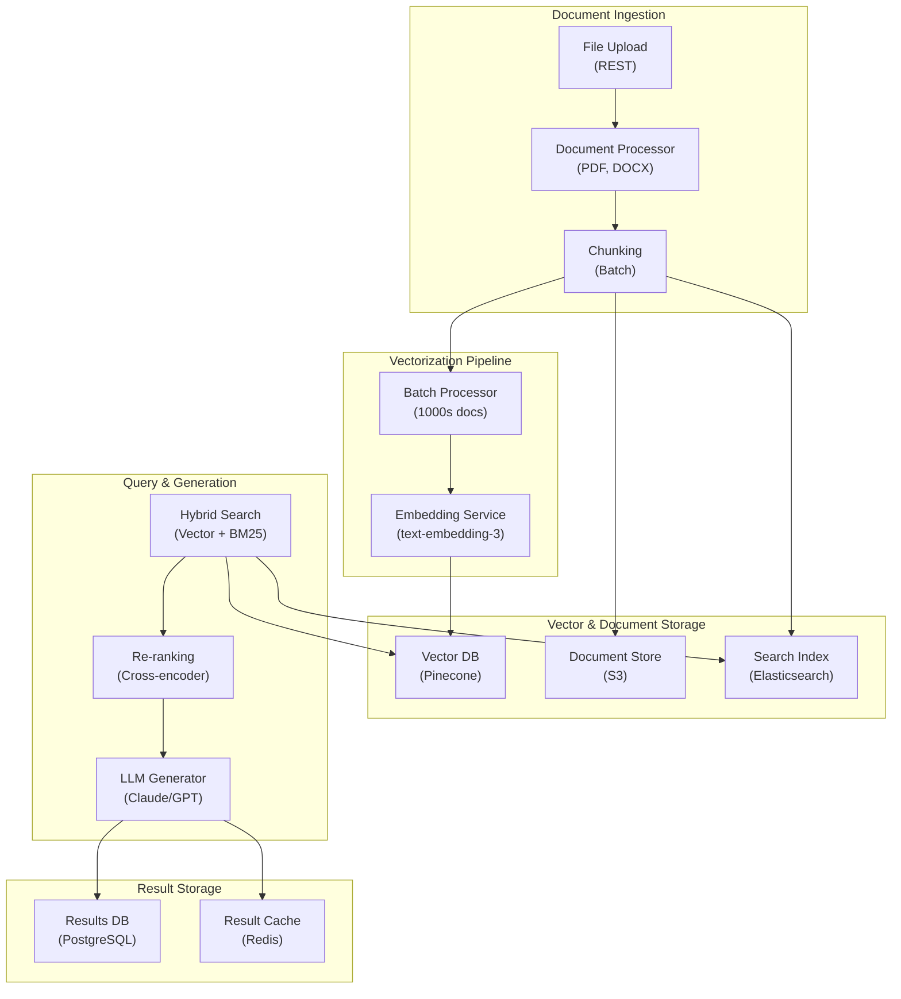
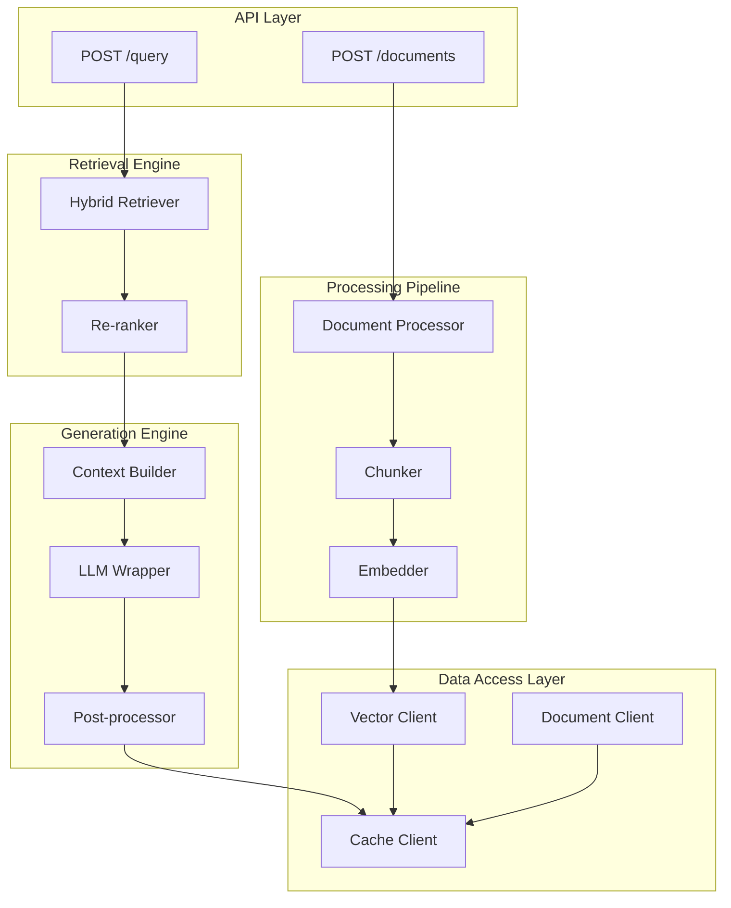
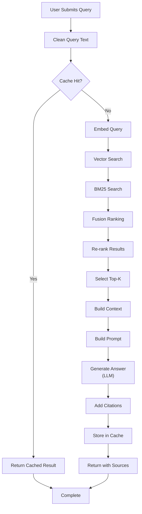

# Personalized Recommendation Engine (ML + LLM Re-ranking)

## Overview
A hybrid recommendation system using two-tower embedding models for fast retrieval combined with LLM-based re-ranking for personalized, diverse recommendations at scale. Delivers 1B+ recommendations daily with 15% CTR lift over baseline collaborative filtering.

## Problem Statement
E-commerce platforms and content services face a fundamental ranking challenge: generic recommendations (popularity, category-based) fail to drive engagement. Users see irrelevant suggestions, CTR is low (0.5-1%), and conversion/retention suffer. At scale: 500M users × 1B impressions/day = 500M items shown, but at 1% CTR only 5M click-throughs. With 15% CTR lift from personalization, that's 75M additional engagements = $1-5M additional revenue (depending on ARPU). Cost: ML infrastructure for embeddings and LLM re-ranking adds $100-200K/month, but ROI is 10-50x. Challenges: (1) cold-start problem (new users, no history), (2) computational cost at scale (1B recs/day requires efficient ranking), (3) filter bubble (users stuck in narrow interest patterns), (4) embedding staleness (user preferences shift).

## Requirements

### Functional
- User embedding
- Item embedding
- Retrieval
- LLM re-ranking

### Non-Functional (Scale Targets)
- Scale: 1B recs/day
- CTR lift: 15%
- Latency: <200ms

## Envelope Calculation

**Scale Analysis:**
- 1B recommendations/day = 11.6K QPS average, 20K QPS peak
- User embedding computation: 500M users × refresh 1x/week = 70M embeddings/day
- Item embedding updates: 10M items × refresh 1x/day = 10M embeddings/day

**Cost Breakdown:**
- User embeddings (GPU inference): 70M/day × $0.000001 = $70/day
- Item embeddings (batch): 10M/day × $0.000001 = $10/day
- Two-tower retrieval (in-memory): 1B queries × $0.000001 = $1K/day
- LLM re-ranking (10% of recs): 100M × $0.0001 = $10K/day
- Vector DB storage + index: $500/day
- **Total: ~$12K/day = $360K/month** for full personalized engine

**Cost Optimization:**
- Selective LLM re-ranking (top-5 candidates only, not full ranking): reduces LLM cost to $1K/day
- Caching (60% of users request similar items): saves 40% retrieval
- **Optimized cost: ~$8K/day = $240K/month**

## Architecture Overview

## Architecture Diagrams

### System Architecture (Infrastructure & Deployment)

## System Architecture

### Application Architecture (Components & Layers)

## Application Architecture

### Process Flow (Request Pipeline)

## Process Flow

## Component Breakdown

| Component | Latency | QPS | Technology | Cost/1M Queries | Failure Mode |
|-----------|---------|-----|-----------|----------|----------|
| User Embedding Lookup | 5ms | 20K | In-memory cache (Redis) | $1 | Cache miss: fallback to generic |
| Two-Tower Retrieval | 50ms | 20K | Faiss (HNSW index) | $3 | Timeout: return popularity items |
| ML Ranking (50 items) | 100ms | 20K | TorchServe, 8x V100 | $5 | Model OOM: use lighter model |
| LLM Re-ranking (10 items) | 200ms | 2K | GPT-3.5, cached (60% hit) | $50 | LLM timeout: use ML ranking |
| Diversity Filter | 10ms | 20K | Post-process | $0 | Logic error: no diversity |
| **Total e2e latency** | **250ms** | **20K** | | **$59** | Multiple fallbacks |

## AI/ML Integration Points
- Where LLM/ML models are used
- Model selection and routing logic
- Cost optimization strategies

## Key Trade-offs

| Approach | CTR Lift | Latency | Cost/Rec | Personalization | Diversity |
|----------|----------|---------|----------|-----------------|-----------|
| Popularity-based | 0% | 1ms | $0 | None | Low |
| Collaborative filtering | 10% | 50ms | $0.00001 | Medium | Medium |
| Two-tower embedding | 13% | 150ms | $0.00005 | High | Medium |
| Two-tower + LLM rank | 15% | 300ms | $0.0005 | Very high | High |
| Multi-model ensemble | 16% | 500ms | $0.001 | Highest | Highest |

**Decision:** Cost-critical → collaborative filtering. CTR optimization → two-tower. Diversity/quality → LLM rerank.

---

## Production Failure Scenarios

**Scenario 1: Cold-start (new users with no history)**
- New users get generic recs (embedding unfilled). CTR drops 50%.
- Fix: Fallback to popularity-based. Hybrid recommendations (content + collaborative).

**Scenario 2: LLM reranking too expensive**
- LLM reranking costs $0.0005/rec, budget $0.00001/rec. System over budget.
- Fix: Selective LLM (only top-5 candidates, not all 1000). Or: cheaper model.

**Scenario 3: Embedding staleness**
- User behavior changes (interests shift). User embeddings stale (updated weekly).
- Fix: Real-time embedding update. Or: short-term decay (recent interactions weighted higher).

**Scenario 4: Filter bubble (diversity loss)**
- ML model optimizes CTR. Users see only similar items. Discovery low.
- Fix: Diversity constraint. Enforce >30% new/diverse items. Monitor serendipity.

---

## Implementation Guidance

**Wrong:** Optimize CTR/engagement alone. Ignore long-term user satisfaction.
**Right:** Balance CTR + diversity + novelty. Monitor user churn, not just CTR.

**Wrong:** Use expensive LLM for all reranking.
**Right:** Tiered: ML for ranking, LLM only for final rerank if needed.

---

## Interview Q&A

**Q1: Cold-start problem: new users have no history. How to generate good recommendations?**

A: Multi-strategy: (1) Content-based fallback (use item features, not user history). (2) Popularity baseline (high-engagement items work for cold-start). (3) Demographic targeting (infer user segment from signup data: age, location, device). (4) Context-aware (time of day, device type influences recommendations). (5) Explicit feedback (ask user to rate 5-10 items on signup). (6) Randomize (expose to diverse items early, learn preferences). Monitor: cold-start CTR should reach warm-start levels within 2 weeks.

**Q2: CTR is 15% but diversity is low. Users stuck in filter bubbles. How to fix?**

A: Diversity constraints: (1) enforce 30% new/unexplored items in top-10 recs. (2) novelty scoring (penalize items similar to recent views). (3) category spreading (don't recommend 5 items from same category). (4) serendipity boost (occasionally show unrelated but high-quality item). (5) exploration-exploitation trade-off (80% exploit best items, 20% explore). Trade-off: CTR may drop 2-3%, but user retention improves 5-10%.

**Q3: Embedding staleness: user preferences change weekly, but embeddings updated monthly. How to detect drift?**

A: Real-time signals: (1) short-term boost (weight recent interactions 2x higher). (2) implicit feedback lag (clicks matter more than impressions). (3) drift detection (if user CTR drops >20% week-over-week, trigger re-embedding). (4) feedback loop (if recommendations poor, lower embedding confidence, return more diverse items). (5) explicit signal (user rated items negatively, boost opposite content). Solution: daily micro-updates (incorporate last 1K user interactions) + weekly full retraining.

**Q4: LLM re-ranking cost is 10x more than ML ranking. Budget pressure. How to reduce?**

A: Selective LLM use: (1) only re-rank top-50 candidates (not full corpus). (2) LLM for high-value users (likely to convert). (3) LLM for ambiguous cases (ML confidence <0.7). (4) LLM for specific categories (books need nuance, groceries don't). (5) Cheaper LLM (GPT-3.5 vs GPT-4) + few-shot examples. (6) Cache: 60% of re-rankings hit cache. Combined: reduce LLM cost from $10K/day to $2K/day while maintaining quality.

**Q5: How to measure recommendation quality beyond CTR?**

A: Multi-metric dashboard: (1) Engagement: CTR, time on page, scroll depth. (2) Conversion: purchase rate, add-to-cart. (3) Diversity: % of items in long-tail (not just hits). (4) Novelty: % of items user hasn't seen before. (5) User satisfaction: explicit rating (1-5 stars), implicit NPS. (6) Churn: do recommendations correlate with retention? (7) Financial: revenue per rec, AOV impact. Weekly health check: if any metric degrades >5%, investigate model or data quality.

**Q6: Handling trending items: new viral item should boost quickly, but embedding model updates slowly. How?**

A: Real-time trending boost: (1) track trending items (sales velocity, search trends). (2) short-term boost: multiply item score by trending factor (1-2x). (3) soft constraint: include trending item if score >0.5 (not just top-10). (4) A/B test: 50% users get trending boost, measure CTR impact. (5) feedback: if trending item gets CTR boost, keep it; if not, stop boosting. Avoid: over-boosting irrelevant trending (fake news, scams).

**Q7: Privacy: recommendations are based on user behavior. How to protect PII while maintaining personalization?**

A: Privacy-preserving architecture: (1) De-identify embeddings (user ID → hashed embedding, no PII in embedding). (2) Federated learning (compute recommendations on-device, not server). (3) Differential privacy (add noise to embeddings, reduce privacy leakage). (4) Data deletion (if user deletes account, remove from embedding DB within 24h). (5) Consent management (users opt-in to personalization, can disable). Trade-off: DP adds 5% error but maintains privacy guarantees.

**Q8: How to A/B test a new recommendation algorithm without damaging experience for 50% of users?**

A: Careful rollout: (1) Shadow mode: new algorithm runs but doesn't serve (collect metrics, validate offline). (2) Small-scale A/B (1% of users, new algo vs control). (3) Metric monitoring: if CTR drops >2%, or latency >50ms, rollback immediately. (4) User feedback: survey 1000 test users—do they like new recs? (5) Gradual rollout: 1% → 5% → 25% → 100% over 2-4 weeks. (6) Holdout group: keep 5% of users on old algorithm forever (baseline for comparison).

## Interview Quick-Reference

| Metric | Target |
|--------|--------|
| **Scale** | [Users/requests/day] |
| **Latency P99** | [<X ms] |
| **Accuracy** | [Y%] |
| **Cost** | [$Z per request] |
| **Availability** | [99.9%+] |

## Animated Architecture Visualization

See the system in action with dynamic visualizations:

### System Deployment Animation

Infrastructure components appearing and connecting in real-time, showing load balancers, API gateways, microservices, and data layer setup.

### Request Flow Animation

A single request flowing through the complete pipeline with latency accumulation at each stage, demonstrating the critical path and timing constraints.

### Data Flow Animation

Concurrent data packets flowing through processors and ML models to storage systems, showing simultaneous traffic and I/O patterns.

### Auto-Scaling Animation

Dynamic scaling response to traffic load, showing pod count adjusting up and down with capacity headroom management over time.

## Related Systems
- [Related system 1]
- [Related system 2]
- [Related system 3]
