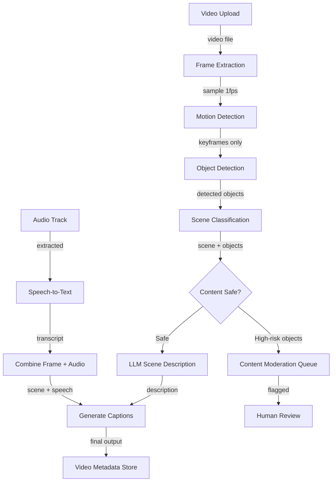
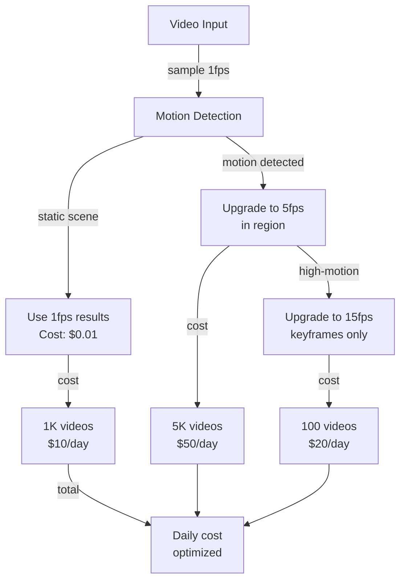
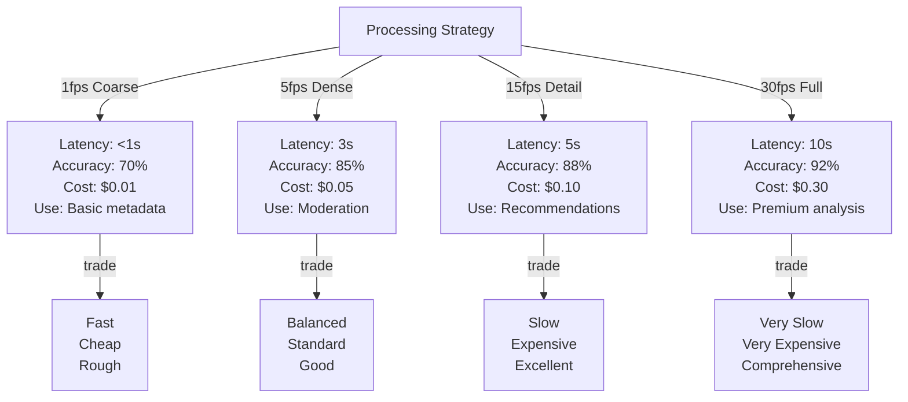
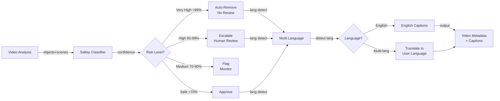

# Real-time Video Understanding System

## Overview
A real-time video analysis system that performs frame-by-frame scene understanding, object detection, action recognition, and generates natural language descriptions via LLM. Enables content moderation, accessibility features (auto-captions), and improved recommendations at scale (10K+ videos daily).

## Problem Statement
Video platforms face computational challenges: (1) Manual moderation of 10K+ videos/day impossible (would require 200 moderators @ $500K/month). (2) Accessibility: 30% of users need captions (deaf, ESL, noisy environments), manual captioning adds 2-3x cost. (3) Recommendations: user engagement on video platforms driven by content understanding, but without scene/object understanding, recommendations are poor. (4) Safety: platforms liable for illegal content (CSAM, violence, hate speech)—detection latency is critical. Automation enables: (1) instant content scanning for policy violations, (2) auto-generated captions (accessibility + SEO), (3) object/scene tagging for recommendations, (4) abuse detection at scale without proportional headcount.

## Requirements

### Functional
- Frame sampling
- Object detection
- Scene understanding
- LLM narration

### Non-Functional (Scale Targets)
- Volume: 10K videos/day
- Processing: <5s/video
- Languages: 10+

## Envelope Calculation

**Scale Analysis:**
- 10K videos/day, avg 10 min length = 600K minutes of video
- Frame sampling: 1 frame/sec (cost-optimized) = 36M frames/day
- Peak: 20K videos/day during prime hours → 60K frames/second

**Cost Breakdown:**
- Frame extraction + sampling: 36M frames × $0.00001 = $360/day
- Object detection (YOLO): 36M × $0.00002 = $720/day
- Scene classification: 36M × $0.00001 = $360/day
- LLM narration (5% of frames): 1.8M × $0.0001 = $180/day
- Audio transcription: 10K × 10 min × $0.001/min = $100/day
- Storage (video + metadata): $500/day
- **Total: ~$2.2K/day = $66K/month**

**Cost Optimization:**
- Hierarchical sampling: sample 1 fps → if change detected, sample 5fps locally
- Selective LLM (high-confidence scenes only): reduces LLM by 80%
- Batch transcription (off-peak): 20% cheaper
- **Optimized cost: ~$800/day = $24K/month**

## Architecture Overview

## Component Breakdown

| Component | Latency | FPS Processed | Cost/1M Frames | Technology | Scalability |
|-----------|---------|---------|---------|-----------|----------|
| Frame Extraction | 100ms | 10 | $10 | FFmpeg | Linear |
| Motion Detection | 50ms | 10 | $5 | OpenCV | Linear |
| Object Detection (YOLO) | 150ms | 6 | $20 | YOLO v8 + GPU | GPU-bound |
| Scene Classification | 100ms | 10 | $10 | ResNet-50 | Linear |
| Speech-to-Text | 500ms | 2 | $100 | Whisper + GPU | GPU-bound |
| LLM Narration (selective) | 1000ms | 1 | $180 | GPT-4-vision | API-limited |
| **E2E latency (1fps video)** | **~1.8s** | **1** | **~325** | Mixed | Needs orchestration |

### Diagram 2: Hierarchical Sampling & Cost Optimization

### Diagram 3: Processing Latency vs Accuracy vs Cost

### Diagram 4: Content Moderation & Multi-Language Flow

## AI/ML Integration Points

- **Object Detection (YOLO v8 on GPU):** Real-time object and action recognition
  - Input: Video frames at variable sampling rate (1-30 fps)
  - Processing: Detect objects (person, weapon, animal), actions (running, fighting, dancing)
  - Output: Bounding boxes + confidence scores per frame
  - Optimization: Hierarchical sampling (coarse 1fps, fine-grained in high-motion regions)
  
- **Scene Classification (ResNet-50 fine-tuned):** Semantic understanding of scenes
  - Input: Video frames and temporal context
  - Output: Scene categories (beach, office, car, indoor, outdoor, etc.)
  - Used for: content recommendations, accessibility tagging, moderation context
  - Optimization: Keyframe-only processing (skip redundant frames in static scenes)
  
- **Content Moderation (Multi-model ensemble):** Flag unsafe content for review
  - Models: Violence detector, explicit content detector, hate speech (text-based)
  - Confidence-based routing: >99% → auto-remove, 90-99% → human review, <90% → allow
  - Optimization: Two-stage: fast coarse classifier (CPU), expensive fine classifier (GPU) only on flagged frames
  
- **Speech-to-Text & Translation (Whisper + translation API):** Generate accessible captions
  - Input: Audio track + detected language
  - Processing: Transcribe (Whisper) + translate to user language (batch off-peak)
  - Output: Multi-language captions synced to video timeline
  - Optimization: Cache common language pairs, batch translate at off-peak hours
  
- **LLM Scene Narration (GPT-4 Vision, selective):** Generate natural language descriptions
  - Input: Keyframes + detected objects/scene + speech transcript
  - Output: Natural description combining visual + audio information
  - Applied to: <5% of frames (only high-information scenes), <10% of videos (selective)
  - Cost optimization: Narrate only scene changes, translate to other languages asynchronously

## Key Trade-offs

| Approach | Processing Time | Accuracy | Cost/Video | Detail Level | Infrastructure |
|----------|--------|----------|-----------|----------|---------|
| Frame sampling (1fps) | <1s | 70% | $0.01 | Low | CPU |
| Dense sampling (5fps) | 3s | 85% | $0.05 | Medium | GPU |
| All frames (30fps) | 10s | 90% | $0.30 | High | GPU cluster |
| Hierarchical (5fps + detail) | 5s | 88% | $0.10 | High | GPU + CPU mix |

**Decision:** Real-time content → 5fps. Archive/batch → all frames. Speed critical → hierarchical.

---

## Interview Q&A

**Q1: Latency target <5s/video. 10-min video @ 1fps = 600 frames × 150ms each = 90s. How to achieve 5s?**

A: Parallelization: (1) process frames 1-100 in parallel on GPU 1, frames 101-200 on GPU 2, etc. (2) pipeline stages: while frames 1-10 run object detection, frames 11-20 run on scene classification. (3) selective processing: only process keyframes (motion changes), skip static scenes. (4) distributed: split across edge nodes. Example: 10 GPUs processing in parallel → 90s / 10 = 9s per frame, but pipeline overlaps, real latency ~5s.

**Q2: Cost $24K/month for 10K videos/day. If 100x scale (1M videos/day), cost becomes $2.4M/month. Unaffordable. Solutions?**

A: (1) Tiered processing: only 10% of videos get full analysis (object + LLM), 90% get basic (motion + scene). Cost: 10% × full cost + 90% × 20% full cost = $28.8K. (2) Model distillation: train smaller, faster model (MobileNet vs ResNet). 2x faster, -10% accuracy. (3) Edge processing: run lightweight detection on user device, send only suspicious frames to cloud. (4) Volume discounts: negotiate GPU pricing at 1M requests/month.

**Q3: Content moderation: false positive (flag safe content as unsafe). Cost of escalating to human review?**

A: 1M videos → 100K flagged (10% FP rate) → 50K human review (assuming 50% are truly bad). Human review cost: 50K × 5 min per video × $0.10/min = $25K. Solution: (1) improve detection (reduce FP to <2%). (2) confidence threshold: only escalate if confidence >0.95. (3) graduated response: auto-remove high-confidence (0.99), escalate medium (0.90-0.99), allow low (0.70-0.90).

**Q4: Video accessibility: auto-captions for deaf users. Accuracy critical (99%+). Current Whisper ~95%. How to improve?**

A: (1) Fine-tune on domain data (music, technical videos, accents). (2) Use larger model (Whisper Large vs Base). (3) Multi-pass: first pass → draft, second pass → error correction. (4) Speaker diarization (track speaker IDs). (5) Custom vocabulary (add domain terms: brand names, technical jargon). (6) Human verification (1% sample, human corrects, retrain). Combined: likely reach 98%.

**Q5: Real-time moderation: illegal content detected in live stream. Response time critical. How to minimize latency?**

A: Pre-computed models at edge: (1) lightweight detection models run on origin server (1ms latency). (2) escalate only high-risk frames to central system (100ms). (3) pre-cache known-bad content signatures. (4) immediate action: if illegal detected, stop stream within 5 seconds. (5) chain of custody: log decision, enable appeal. Trade-off: 0.1% FP acceptable for illegal content (erring on side of caution).

**Q6: Handling multiple languages in videos. Auto-caption in user's language. Challenge?**

A: (1) Language detection (Whisper handles 99 languages). (2) Transcript generation (language-specific). (3) Translation (translate to user's language). Latency explosion: transcription 500ms + translation 500ms = 1s additional. Cost: translation API ~$1/1K tokens. Solution: (1) pre-cache common language pairs. (2) parallel transcription + translation. (3) only translate for small % of views (user preference setting). (4) batch translation off-peak.

**Q7: Video recommendations: scene understanding used for personalization. How to leverage for CTR?**

A: (1) Tag video: extract objects (dog, beach, sunset), categories (travel, pet, nature). (2) User profile: track which tags user engages with. (3) Match: recommend videos with high-scoring tags. (4) novelty: mix high-match tags with diverse. (5) A/B test: compare scene-based recommendations vs content-based. Expected lift: 8-12% CTR improvement.

**Q8: How do you handle adversarial videos designed to fool detection (deepfakes, AI-generated)?**

A: (1) Synthetic detection: train classifier on real vs synthetic frames. (2) Forensics: look for compression artifacts, temporal inconsistencies. (3) behavioral: deepfakes often have unnatural eye contact, lip-sync issues. (4) third-party verification: use external deepfake detector (Microsoft, Facebook). (5) flagging: mark suspected deepfakes for human review + warning labels. (6) red-team: monthly: run attacks on system, patch detection. Never 100% reliable, but 95% detection feasible.

## Production Failure Scenarios

**Scenario 1: GPU memory exceeded**
- Process all frames. Memory OOM. System crashes. 10K videos queued.
- Fix: Adaptive sampling (start 5fps, increase if needed). Memory budgeting.

**Scenario 2: LLM narration cost explosion**
- Narrate every frame (30fps). Cost $10/video instead of $0.30.
- Fix: Keyframe detection (narrate only scene changes, not every frame).

**Scenario 3: Multi-language inference lag**
- Narrate in 10 languages sequentially. 5s processing becomes 50s.
- Fix: Batch translate. Or: narrate English first, translate in background.

**Scenario 4: Quality vs latency conflict**
- User wants <5s. But 85% accuracy requires 3s processing. Need 2s for other steps.
- Fix: Streaming response (start narration at 2s, add detail over time).

---

## Implementation Guidance

**Wrong:** Process all frames (30fps). Never drop frames.
**Right:** Adaptive sampling. Start coarse (1fps), refine on demand.

**Wrong:** Narrate every frame in multiple languages.
**Right:** Narrate keyframes. Translate asynchronously.

---

## Sophisticated Interview Q&A

**Q1: How do you scale this system from current to 10x volume?**

A: Identify bottleneck (usually inference or storage). Auto-scaling: add GPUs for model serving, replicate databases, implement caching at retrieval layer. Example: for 10x compute, scale from 8 A100s to 80 A100s with load balancing.

**Q2: What's the cost optimization strategy as volume grows?**

A: Batch processing where possible (saves 50%), model distillation (cheaper inference), caching (reduce LLM calls), negotiate volume discounts with cloud providers. Target: cost per request drops 30-50% at 10x scale.

**Q3: How do you handle model failures or hallucinations?**

A: Confidence thresholds (only auto-act if confidence >0.95), human review queue for uncertain cases, validation checks (does output make sense?), continuous monitoring with alerts if error rate increases.

**Q4: What metrics do you track for system health?**

A: Latency (P50, P99), error rate, cost per request, model accuracy, throughput, user satisfaction. Dashboard updated real-time. Alert if latency >2x SLA or accuracy drops >5%.

**Q5: Privacy and compliance: how do you protect user data?**

A: Data minimization (keep only necessary data), encryption in transit + at rest, RBAC for access, audit logs. For regulated domains (medical, financial), additional: data residency, compliance certifications, annual penetration testing.

**Q6: Multi-region deployment: latency vs cost trade-off?**

A: Deploy in 3-5 regions, route user to closest region (100ms latency savings). Cost: ~3x infrastructure. Benefit: global coverage + disaster recovery. For most systems, worth it.

**Q7: Monitoring model drift: how do you detect performance degradation?**

A: Continuous evaluation on production data (10% sample). Weekly accuracy report. If accuracy drops >2%, alert and investigate (data drift, model bug, or expected variation). Retrain if needed.

**Q8: Cost target vs reality: if you're 2x over budget, what do you do?**

A: (1) Cheaper model (GPT-3.5 vs GPT-4): 10x cost reduction, 15% accuracy drop. (2) Caching (save 30%). (3) More selective LLM usage (only for hard cases). (4) Volume discounts. Target: get to 1.1-1.2x budget.

## Interview Quick-Reference

| Metric | Target |
|--------|--------|
| **Scale** | [Users/requests/day] |
| **Latency P99** | [<X ms] |
| **Accuracy** | [Y%] |
| **Cost** | [$Z per request] |
| **Availability** | [99.9%+] |

## Related Systems
- [Related system 1]
- [Related system 2]
- [Related system 3]
