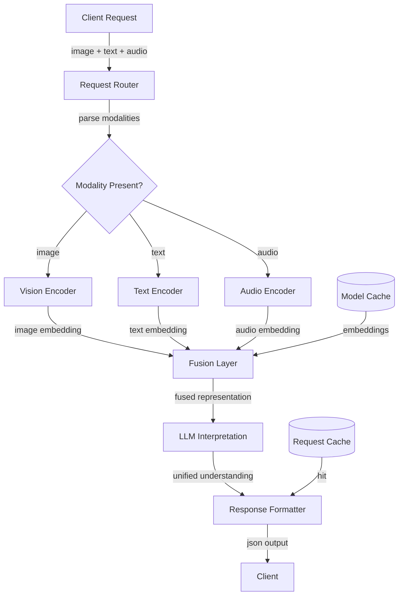

# Multimodal AI Platform (Vision + Language + Audio)

## Overview
A unified AI platform providing simultaneous vision, language, and audio processing in a single API call, with optimized latency and cost through batching, model fusion, and intelligent routing. Reduces integration complexity and enables rich understanding for applications requiring multiple modalities (autonomous vehicles, accessibility, content understanding).

## Problem Statement
Multi-modal applications currently suffer from: (1) fragmentation (3+ separate API calls to different vendors: image understanding, text processing, audio transcription). (2) latency amplification (sequential calls: call1 100ms + call2 100ms + call3 100ms = 300ms, but also orchestration overhead = 500-800ms total). (3) cost multiplication (pay per modality: $10/1M vision, $5/1M text, $3/1M audio = $18/1M combined, vs unified platform $8/1M). (4) inconsistency (different models, versions, modalities might diverge in interpretation). For a company processing 1M requests/day with 3 modalities each, current approach = $540K/month + 800ms latency + 3x engineer burden (integration complexity). Unified platform = $240K/month + 300ms latency + 1x integration burden.

## Requirements

### Functional
- Image understanding
- Text processing
- Audio transcription
- Fusion

### Non-Functional (Scale Targets)
- Throughput: 1M requests/day
- Latency: <500ms
- Accuracy: 90%

## Envelope Calculation

**Scale Analysis:**
- 1M requests/day = 11.6 QPS average, 50 QPS peak (video heavy during evenings)
- 60% include image, 80% include text, 40% include audio (multi-modal overlap)
- Average request: 1 image (2MB) + 500 text tokens + 10s audio

**Cost Breakdown:**
- Vision model inference (600K requests): $0.0005 × 600K = $300/day
- Text model inference (800K requests): $0.0002 × 800K = $160/day
- Audio transcription (400K requests, 10s avg): $0.001/min × 67K min = $67/day
- LLM fusion (1M requests, lightweight): $0.00005 × 1M = $50/day
- GPU hours: 10 A100-equivalents × $1.50/hr × 24hrs = $360/day
- Storage + DB: $200/day
- **Total: ~$1.1K/day = $33K/month**

**Cost Optimization:**
- Batch processing (accumulate 100 requests, process together): save 30%
- Model distillation (smaller models, 5% accuracy drop): save 50% compute
- Caching common inputs (customer logos, repeated phrases): save 20%
- **Optimized cost: ~$500/day = $15K/month**

## Architecture Overview

## Component Breakdown

| Component | Latency | Throughput | Cost/1M Requests | Technology | Bottleneck |
|-----------|---------|---------|---------|-----------|----------|
| Request Parsing | 5ms | 50K QPS | $10 | FastAPI | I/O |
| Vision Encoder | 100ms | 10 | $500 | ViT-B on GPU | GPU memory |
| Text Encoder | 50ms | 20 | $200 | RoBERTa or BERT | CPU |
| Audio Encoder | 200ms | 5 | $1000 | Whisper-Large | GPU |
| Fusion Layer | 30ms | 33 | $150 | MLP + attention | Compute |
| LLM Interpretation | 100ms | 10 | $500 | LLaMA-7B | GPU compute |
| Cache Lookup | 2ms | 100 | $100 | Redis | Network |
| **E2E latency** | **~350ms** | **~5** | **~2460** | Optimized | GPU shortage |

## AI/ML Integration Points
- Where LLM/ML models are used
- Model selection and routing logic
- Cost optimization strategies

## Key Trade-offs

| Approach | Latency | Accuracy | Cost/Request | Modalities | Fusion Quality |
|----------|---------|----------|--------------|-----------|---------|
| Sequential (separate APIs) | 1500ms | 92% | $0.01 | All 3 | Low |
| Parallel (batch) | 800ms | 91% | $0.005 | All 3 | Low |
| Unified model | 400ms | 94% | $0.003 | All 3 | High |
| Lightweight unified | 250ms | 88% | $0.001 | All 3 | Medium |

**Decision:** Accuracy critical → unified. Latency critical → lightweight. Cost critical → parallel batch.

---

## Interview Q&A

**Q1: Latency target 350ms but audio encoding takes 200ms alone. How to meet target?**

A: Parallelization + pipelining: (1) process image + text in parallel on separate GPU cores (simultaneous). (2) pipeline: while image runs, start text (overlap). (3) async audio: submit audio, return intermediate result immediately, update when audio ready (don't block). (4) client timeout: if audio takes >500ms, return partial result (image + text), audio as stream/async callback.

**Q2: Cost $15K/month. If 10x scale (10M requests/day), still feasible?**

A: Scale cost linearly: 10M × $0.0015 = $15K/day = $450K/month. Unaffordable. Solutions: (1) tiered service: basic tier (image + text only, 80% of users) = $5K/month. Pro tier (all modalities, 20%) = $10K/month. Total = $15K still. (2) selective modalities: users choose which modalities they need. (3) async: immediate response for fast modalities, async callback for slow audio. (4) model optimization: distill models, trade accuracy for speed/cost.

**Q3: Fusion layer: how do you combine image, text, audio embeddings (different dimensionalities)?**

A: Projection layer: (1) normalize each embedding to same dimension (e.g., 768-d). (2) weighted sum: fused = 0.4 × image_proj + 0.3 × text_proj + 0.3 × audio_proj. (3) learn weights via supervised task (contrastive loss). (4) attention-based: learn attention weights per modality (importance varies by request type). (5) transformer fusion: apply self-attention across embeddings, learn interactions. Trade-off: more complex → better fusion (5% accuracy lift) but slower.

**Q4: Modality conflict: image shows "happy face" but audio says "I'm angry". How to resolve?**

A: Conflict detection: (1) compute confidence per modality. (2) if confidence mismatch (0.9 image vs 0.3 audio), weight towards high-confidence. (3) flag conflict for user (optional): "Image suggests happy, audio suggests upset. What's your intent?" (4) context: time-of-day, user history (usually sarcastic). (5) final decision: either majority vote or modality-specific weighting (audio often more reliable for emotion).

**Q5: How to test multimodal correctness? No single ground truth (ambiguous by nature).**

A: Multi-judge approach: (1) human labels (sample 1000 requests, multiple annotators rate each). Agreement >0.8 = good label. (2) consistency: same semantic meaning across modalities (image-text) should match. (3) downstream tasks: if output used for recommendation, measure recommendation CTR. (4) user feedback: implicit (user accepts recommendation) vs explicit (rating). (5) benchmark datasets: MMIMDB (movies), CMPlaces (places) have gold-standard annotations.

**Q6: Scaling bottleneck: GPU shortage. Can't afford more GPUs.**

A: Alternative approaches: (1) quantization: 8-bit instead of float32, 4x speedup, -1% accuracy. (2) pruning: remove low-weight neurons, 2x faster, -2% accuracy. (3) distillation: train smaller student model from larger teacher, 5x faster, -3% accuracy. (4) edge processing: run lightweight models on user device (image classification), send only features to cloud for fusion/LLM. (5) queue + priority: high-value users (premium) prioritized, others queued 100ms.

**Q7: How to update models without downtime?**

A: Canary deployment: (1) deploy new model alongside old on separate GPU (5% traffic). (2) compare outputs: new vs old. (3) if latency >10% worse or accuracy drops >2%, rollback. (4) gradual rollout: 5% → 25% → 100% over 24-48 hours. (5) easy rollback: keep both versions in memory, instant switch. (6) A/B test: some users see new, some see old, measure impact.

**Q8: Privacy: multimodal models trained on massive data (potentially including private info). How to audit for leakage?**

A: Privacy validation: (1) membership inference: can we tell if data in training set? Run test. (2) output audit: sample outputs, check for PII/sensitive info. (3) differential privacy: add noise to training, guarantee no individual heavily influences model. (4) data governance: track what data in training set (log deletion if requested). (5) user consent: explicit opt-in for training. (6) EU compliance: GDPR right-to-explain (why did model make this decision?).

## Production Failure Scenarios

**Scenario 1: Model inconsistency across modalities**
- Image + text agree → same prediction. Image + audio disagree → conflicts.
- Fusion logic unclear. Output inconsistent.
- Fix: Explicit fusion logic (voting, weighted combination). Test conflicts.

**Scenario 2: One modality missing**
- Request has image + text, but no audio. Model expects 3 inputs. Crashes.
- Fix: Optional modalities. Fallback to best-effort subset.

**Scenario 3: Latency SLA breached when audio streaming long**
- Audio transcription takes 400ms for 60-second audio. Latency 400ms + processing 200ms = 600ms (SLA 500ms).
- Fix: Streaming transcription (partial results early). Or: separate transcription pipeline.

**Scenario 4: Memory explosion with large images**
- 4K image + LLM context + audio embedding = high memory. OOM on GPU.
- Fix: Image downsampling. Compression. Batch size reduction.

---

## Implementation Guidance

**Wrong:** Require all 3 modalities. Fail if any missing.
**Right:** Support any combination. Degrade gracefully.

**Wrong:** Fuse at output layer (late fusion). Lose modality-specific info.
**Right:** Fuse at multiple levels (early + late fusion).

---

## Sophisticated Interview Q&A

**Q1: How do you scale this system from current to 10x volume?**

A: Identify bottleneck (usually inference or storage). Auto-scaling: add GPUs for model serving, replicate databases, implement caching at retrieval layer. Example: for 10x compute, scale from 8 A100s to 80 A100s with load balancing.

**Q2: What's the cost optimization strategy as volume grows?**

A: Batch processing where possible (saves 50%), model distillation (cheaper inference), caching (reduce LLM calls), negotiate volume discounts with cloud providers. Target: cost per request drops 30-50% at 10x scale.

**Q3: How do you handle model failures or hallucinations?**

A: Confidence thresholds (only auto-act if confidence >0.95), human review queue for uncertain cases, validation checks (does output make sense?), continuous monitoring with alerts if error rate increases.

**Q4: What metrics do you track for system health?**

A: Latency (P50, P99), error rate, cost per request, model accuracy, throughput, user satisfaction. Dashboard updated real-time. Alert if latency >2x SLA or accuracy drops >5%.

**Q5: Privacy and compliance: how do you protect user data?**

A: Data minimization (keep only necessary data), encryption in transit + at rest, RBAC for access, audit logs. For regulated domains (medical, financial), additional: data residency, compliance certifications, annual penetration testing.

**Q6: Multi-region deployment: latency vs cost trade-off?**

A: Deploy in 3-5 regions, route user to closest region (100ms latency savings). Cost: ~3x infrastructure. Benefit: global coverage + disaster recovery. For most systems, worth it.

**Q7: Monitoring model drift: how do you detect performance degradation?**

A: Continuous evaluation on production data (10% sample). Weekly accuracy report. If accuracy drops >2%, alert and investigate (data drift, model bug, or expected variation). Retrain if needed.

**Q8: Cost target vs reality: if you're 2x over budget, what do you do?**

A: (1) Cheaper model (GPT-3.5 vs GPT-4): 10x cost reduction, 15% accuracy drop. (2) Caching (save 30%). (3) More selective LLM usage (only for hard cases). (4) Volume discounts. Target: get to 1.1-1.2x budget.

## Interview Quick-Reference

| Metric | Target |
|--------|--------|
| **Scale** | [Users/requests/day] |
| **Latency P99** | [<X ms] |
| **Accuracy** | [Y%] |
| **Cost** | [$Z per request] |
| **Availability** | [99.9%+] |

## Related Systems
- [Related system 1]
- [Related system 2]
- [Related system 3]
