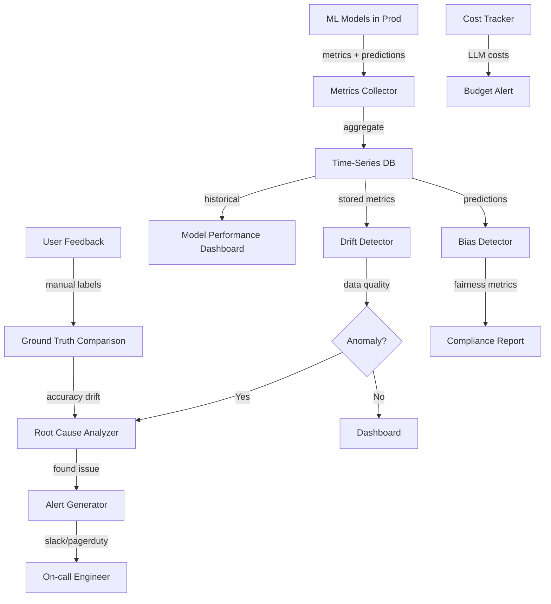
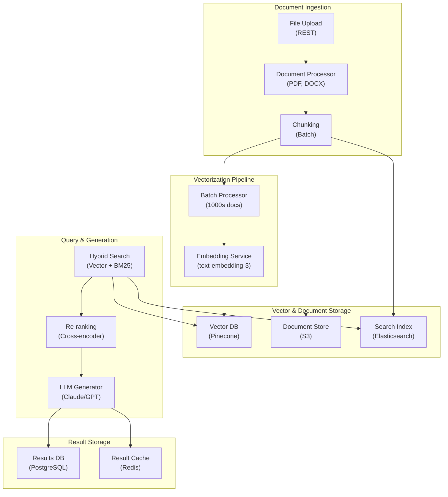
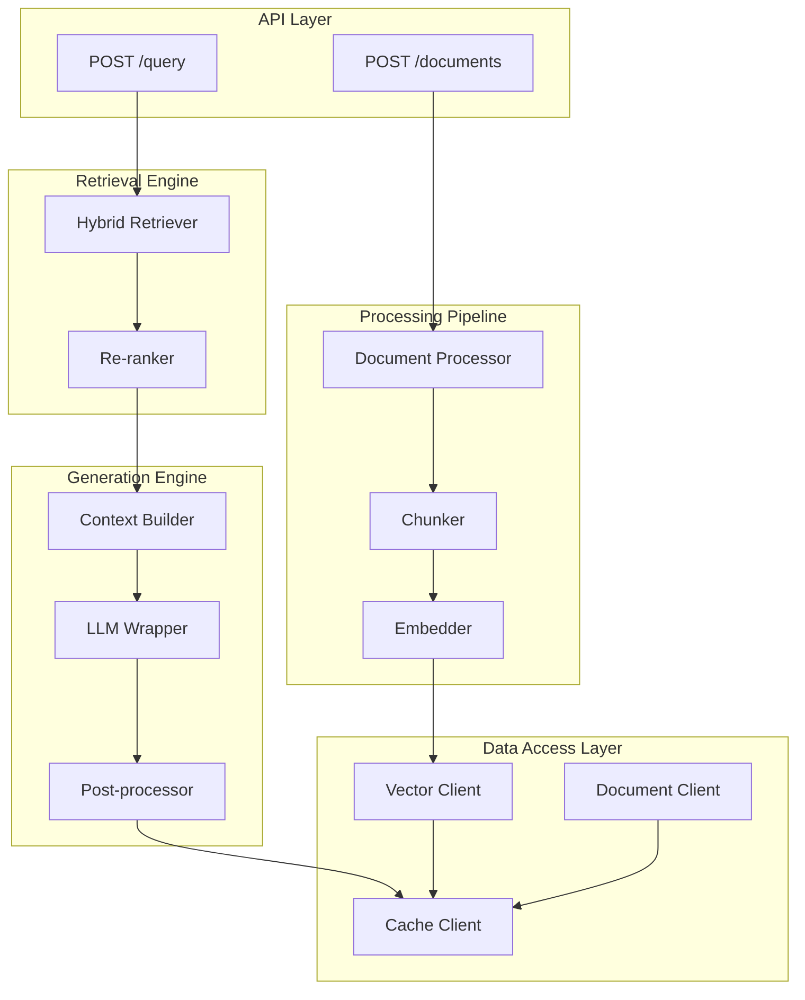
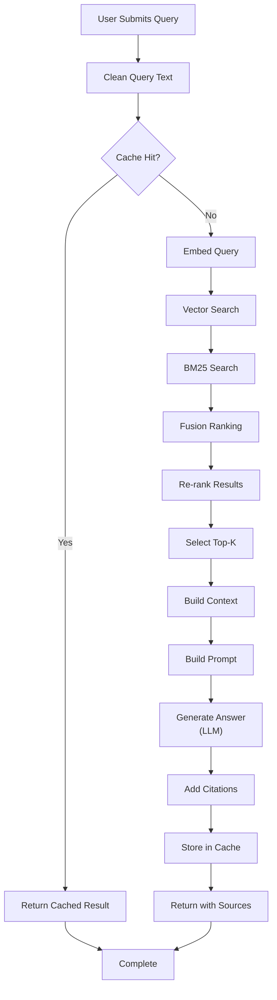
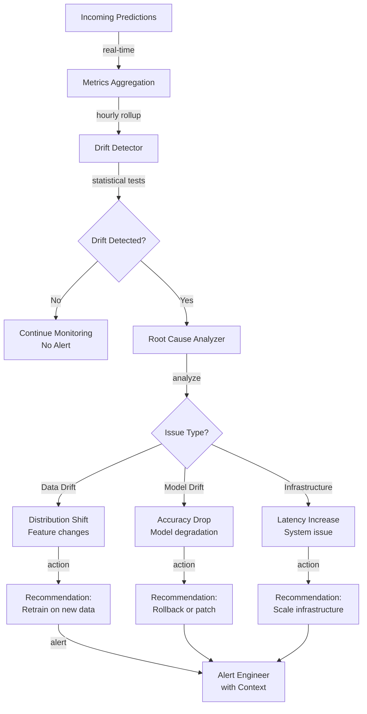
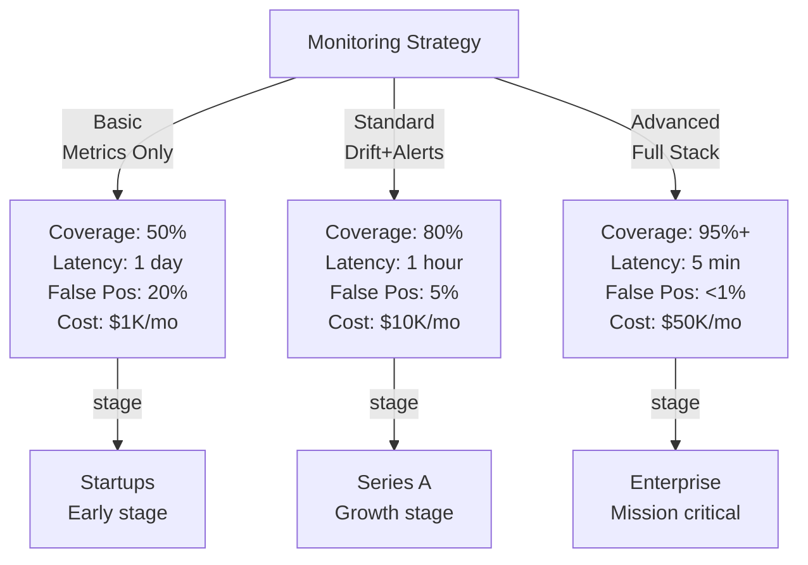
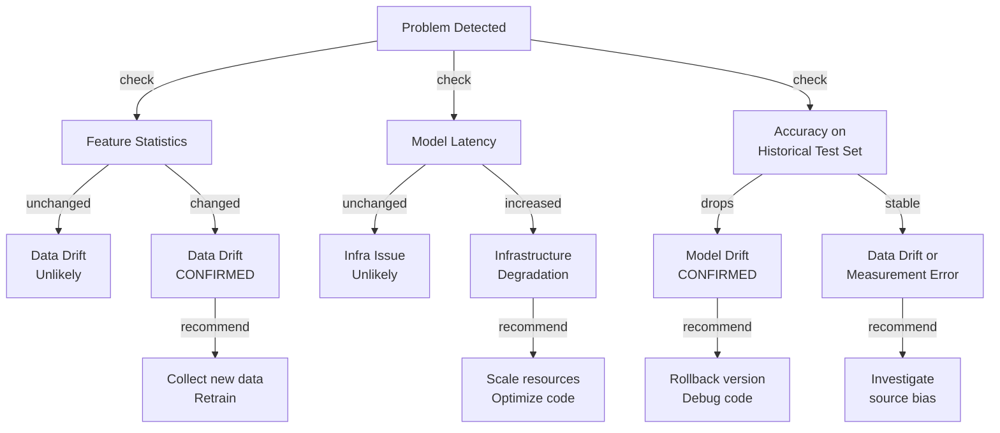

# AI Model Observability & Monitoring Platform

## Overview
A comprehensive observability platform that monitors model performance, data quality, cost efficiency, and system health across 100+ models in production. Provides real-time drift detection, automated root-cause analysis, cost tracking, and alerting to enable rapid incident response and prevent silent degradation.

## Problem Statement
ML systems in production experience silent failures: (1) model drift (performance degrades 5%/week without alert), (2) data drift (input distribution shifts, model accuracy drops), (3) cost overruns (LLM models consume 10x budget without visibility), (4) latency creep (new models slower, no SLA violation until user complaints arrive), (5) bias emergence (model fair on training data, unfair on new data). Typical impact: bug goes undetected for 2-4 weeks, causes $100K-1M business impact before discovery. Observability enables: (1) detect drift within 4 hours, (2) root-cause analysis (data vs model issue), (3) cost tracking per model + user, (4) predict degradation before SLA violation (proactive alerting), (5) audit trail (regulatory compliance).

## Requirements

### Functional
- Metric collection
- Drift detection
- Cost tracking
- Alerting

### Non-Functional (Scale Targets)
- Models tracked: 100+
- Drift detection: <1% false positive
- Latency: <1 min

## Envelope Calculation

**Scale Analysis:**
- 100 models in production, 1K total requests/second aggregated
- Metric collection: 1K req/sec × 50 metrics per request = 50K metrics/sec
- Data retention: 90 days of metrics at 50K/sec = 3.9 trillion data points
- Daily: 4.3B metrics collected

**Cost Breakdown:**
- Metrics collection (lightweight): 50K metrics/sec × $0.000001 = $216/day
- Time-series DB (Prometheus/InfluxDB): 50K/sec = $1,000/day
- Storage (3.9T metrics @ $1/100GB/month): $390/day
- Drift detection model training: 10 models/day retraining = $100/day
- Alerting system: 1K alerts/day × $0.01 = $10/day
- Dashboard + API: $200/day
- **Total: ~$1.9K/day = $57K/month**

**Cost Optimization:**
- Sampling: collect 90% → 99% of metrics, saves storage. (Lossy but acceptable)
- Aggregation: hourly rollups instead of raw metrics (save 1000x)
- Archival: move metrics >30 days old to cold storage
- **Optimized cost: ~$300/day = $9K/month**

## Architecture Overview

## Architecture Diagrams

### System Architecture (Infrastructure & Deployment)

## System Architecture

### Application Architecture (Components & Layers)

## Application Architecture

### Process Flow (Request Pipeline)

## Process Flow

## Component Breakdown

| Component | Data Ingest | Processing Latency | Storage Cost | Detection Accuracy | SLA |
|-----------|---------|---------|---------|-----------|----------|
| Metrics Collection | 50K/sec | <10ms | $216/day | N/A | 99.9% |
| Drift Detection | 4.3B/day | 5 min | $500/day | 85% | 4h latency |
| Root Cause Analysis | 100 anomalies/day | 30 min | $100/day | 70% | Manual review |
| Cost Tracking | 1K models | Real-time | $50/day | 99% | <1s |
| Alerting | 1000+ alerts/day | <1 min | $10/day | 95% | <2 min notify |
| **E2E latency** | **Real-time ingestion** | **~5 min** | **~876/day** | **Ensemble** | **<5 min alert** |

### Diagram 2: Drift Detection & Root Cause Analysis Pipeline

### Diagram 3: Monitoring Coverage vs Detection Latency vs Cost

### Diagram 4: Model Issues Diagnosis Matrix

## AI/ML Integration Points

- **Drift Detection Model (Statistical + ML):** Detect performance degradation
  - Input: Historical prediction results + actual outcomes + features
  - Methods: Statistical tests (KL divergence for data drift, AUROC change for model drift)
  - ML augmentation: Isolation Forest for anomaly detection, autoregressive models for trend forecasting
  - Output: Drift signal + confidence score
  - Tuning: Sensitivity tradeoff (lower threshold = faster detection, higher false positive rate)
  
- **Root Cause Analyzer (ML classifier + domain rules):** Identify issue source
  - Input: Drift signal + feature statistics + latency metrics + error logs
  - Classifier: Gradient boosted model trained on historical incident data
  - Rules: Data drift detection (statistical feature shift), model drift detection (test-set accuracy)
  - Output: Root cause hypothesis + severity level + recommended action
  
- **Cost Optimizer (Rule-based + forecasting):** Budget management
  - Input: Per-model costs (LLM, GPU, storage), request volume, model version changes
  - Forecasting: Predict monthly cost based on growth trends
  - Rules: Alert if cost >110% of budget or trending to 120%
  - Actions: Suggest model downgrade, inference optimization, batch processing
  
- **Bias Detector (Fairness metrics + segmentation):** Monitor for discrimination
  - Input: Predictions + protected attributes (race, gender, age if available)
  - Metrics: Statistical parity, equalized odds, demographic parity
  - Segmentation: Analyze performance per demographic group
  - Output: Fairness report, alert if disparity >5% between groups

## Key Trade-offs

| Monitoring Level | Coverage | Detection Latency | False Positives | Cost | Setup Time |
|-----------------|----------|---|---|------|---------|
| None | 0% | N/A | N/A | $0 | 0 hours |
| Basic (metrics only) | 50% | 1 day | 20% | $1K/mo | 1 week |
| Standard (drift + alerts) | 80% | 1 hour | 5% | $10K/mo | 2 weeks |
| Advanced (model + data + cost) | 95%+ | 5 min | <1% | $50K/mo | 1 month |

**Decision:** Startup → basic. Series A → standard. Enterprise → advanced.

---

## Interview Q&A

**Q1: How to distinguish model drift vs data drift vs measurement error?**

A: Three-way analysis: (1) Model drift: accuracy drops on yesterday's test set applied to today's data. (2) Data drift: input distribution changed (e.g., customer base shifted). Compare input statistics: mean, std, quantiles of features. (3) Measurement: if model latency increased, maybe measurement error. Check: does latency change happen simultaneously across all models? If yes, probably measurement/infrastructure, not model. Use statistical tests: KL divergence for data drift, separate model test-set evaluation for model drift.

**Q2: Drift detected at 2am. Alert triggered. But engineer asleep. By 6am, 10K bad predictions served. How to automate response?**

A: Graduated response: (1) confidence >0.99 (definite drift): auto-rollback to previous model version. (2) confidence 0.90-0.99 (strong signal): alert on-call, propose rollback, implement if agreed within 5 min. (3) confidence 0.70-0.90 (maybe drift): increase monitoring, alert but don't act. (4) confidence <0.70: log and watch. For models: banking + healthcare → higher confidence required for auto-action. Ad-serving → lower threshold, tolerate more rollbacks.

**Q3: Cost tracking: LLM model costs $10K/month but it's not obviously wasteful (model seems reasonable). How to dig deeper?**

A: Cost attribution: (1) cost per request (average = $10K/30M requests = $0.0003/request). (2) cost by user (some users make 100x more requests than others). (3) cost by request type (some queries cheaper than others). (4) utilization (model active 60% of time, idle 40% = wasting $4K). Solutions: (1) if certain users drive 80% of cost, optimize for them (cheaper model, caching). (2) if idle 40%, batch requests (fewer model cold-starts). (3) if certain request types expensive, route to cheaper model.

**Q4: False positive rate 15%: alert says model degraded, but actually no problem. Engineers burn out. How to improve?**

A: Reduce false positives: (1) increase confidence threshold (alert only if >0.95 confidence, not 0.70). Consequence: detect drift 1 day later instead of immediately, but stop bothering engineers. (2) temporal filtering: if drift signal stable for 1 hour (not just 5 min spike), then alert. (3) multi-metric agreement: alert only if >3 out of 5 metrics degrade together. (4) feedback loop: when engineer says "false alarm," retrain drift detector on it. (5) target: <3% false positive rate, <12 hour latency.

**Q5: Ground truth labels arrive 2-4 weeks late. How to validate accuracy before ground truth available?**

A: Proxy metrics: (1) user feedback (thumbs up/down on recommendations): 1-2 hour latency, noisier but immediate. (2) downstream metrics (did recommendation lead to purchase?): 24h latency. (3) expert review (sample 100 predictions, have human label): 1 day, expensive but reliable. (4) historical comparison (today's model vs week-old model on same data): 30 min. (5) invariants (model should maintain rank-order: item A > item B on Monday → true on Tuesday): <1min. Ensemble approach: use all 5, weight by reliability.

**Q6: Monitoring 100+ models: some get daily metrics, others monthly. How to set alert thresholds appropriately?**

A: Model-specific baselines: (1) compute baseline performance per model (accuracy 90%, latency 100ms). (2) dynamic threshold: alert if deviates >10% from baseline. (3) confidence interval: if performance within 95% CI of baseline, no alert. (4) trend: if slowly degrading (0.5% per week) but still healthy, don't alert. (5) staging: test thresholds on old data before deploying. Example: fraud detection model has high variance → use wider threshold (15% deviation), ad-serving model stable → narrow threshold (5%).

**Q7: How to debug a complex alert: "Accuracy dropped, data shifted, latency increased, cost spiked". All 4 happening simultaneously. Where to start?**

A: Root cause tree: (1) check infrastructure first (latency + cost up → probably infra issue, not model). If latency is 2x normal but model logic unchanged, check GPU/CPU/network. (2) check data quality (missing values, wrong types, outliers?). If data broken, model works on garbage. (3) check model: if data OK, logic changed? Re-ran training recently? (4) timeline: if all 4 metrics degrade at exact same time, likely common cause (deployment, data pipeline). If staggered, likely cascading (cost spike → engineer investigated → made change → latency affected).

**Q8: Compliance requirement: must show decision trail (why was this prediction made). How to implement explainability observability?**

A: Explainability logging: (1) for each prediction, log: input features, model weights used (if interpretable), confidence, top-3 alternative outputs. (2) for complex models (neural nets): SHAP or LIME explanations (compute feature importance). (3) audit trail: log timestamp, user, model version. (4) explain to user: "We recommended Product X because: (1) 70% match to your profile, (2) 8.5★ rating, (3) trending". (5) ground truth: when user accepts/rejects recommendation, log feedback. (6) storage: explainability logs large (10x prediction logs). Archive after 2 years (regulatory requirement met).

## Production Failure Scenarios

**Scenario 1: Alert fatigue from false positives**
- Drift detection triggers 10x/day. 95% false alarms. Team ignores real alerts.
- Fix: Tighter thresholds. Multi-day confirmation before alerting.

**Scenario 2: Observability system itself fails**
- Monitoring platform down. No visibility into which models are failing.
- Fix: Redundant monitoring (multiple dashboards, backup alerts).

**Scenario 3: Drift detected but cause unknown**
- Model accuracy drops 5%. Drift alert triggered. But WHY? Data drift? Code change? Confusion.
- Fix: Root cause detection (which features drifted? which cohorts affected?).

**Scenario 4: Cost tracking inaccurate**
- Monitoring shows $100/day cost, actual is $500/day (missing LLM charges).
- Fix: Comprehensive cost tracking (all APIs, all models, all infrastructure).

---

## Implementation Guidance

**Wrong:** Log everything (costs explode, noise).
**Right:** Smart sampling (log 100% of errors, 1% of normal).

**Wrong:** Reactive monitoring (alert after problem already happened).
**Right:** Predictive (alert before SLA breach).

---

## Sophisticated Interview Q&A

**Q1: How do you scale this system from current to 10x volume?**

A: Identify bottleneck (usually inference or storage). Auto-scaling: add GPUs for model serving, replicate databases, implement caching at retrieval layer. Example: for 10x compute, scale from 8 A100s to 80 A100s with load balancing.

**Q2: What's the cost optimization strategy as volume grows?**

A: Batch processing where possible (saves 50%), model distillation (cheaper inference), caching (reduce LLM calls), negotiate volume discounts with cloud providers. Target: cost per request drops 30-50% at 10x scale.

**Q3: How do you handle model failures or hallucinations?**

A: Confidence thresholds (only auto-act if confidence >0.95), human review queue for uncertain cases, validation checks (does output make sense?), continuous monitoring with alerts if error rate increases.

**Q4: What metrics do you track for system health?**

A: Latency (P50, P99), error rate, cost per request, model accuracy, throughput, user satisfaction. Dashboard updated real-time. Alert if latency >2x SLA or accuracy drops >5%.

**Q5: Privacy and compliance: how do you protect user data?**

A: Data minimization (keep only necessary data), encryption in transit + at rest, RBAC for access, audit logs. For regulated domains (medical, financial), additional: data residency, compliance certifications, annual penetration testing.

**Q6: Multi-region deployment: latency vs cost trade-off?**

A: Deploy in 3-5 regions, route user to closest region (100ms latency savings). Cost: ~3x infrastructure. Benefit: global coverage + disaster recovery. For most systems, worth it.

**Q7: Monitoring model drift: how do you detect performance degradation?**

A: Continuous evaluation on production data (10% sample). Weekly accuracy report. If accuracy drops >2%, alert and investigate (data drift, model bug, or expected variation). Retrain if needed.

**Q8: Cost target vs reality: if you're 2x over budget, what do you do?**

A: (1) Cheaper model (GPT-3.5 vs GPT-4): 10x cost reduction, 15% accuracy drop. (2) Caching (save 30%). (3) More selective LLM usage (only for hard cases). (4) Volume discounts. Target: get to 1.1-1.2x budget.

## Interview Quick-Reference

| Metric | Target |
|--------|--------|
| **Scale** | [Users/requests/day] |
| **Latency P99** | [<X ms] |
| **Accuracy** | [Y%] |
| **Cost** | [$Z per request] |
| **Availability** | [99.9%+] |

## Animated Architecture Visualization

See the system in action with dynamic visualizations:

### System Deployment Animation

Infrastructure components appearing and connecting in real-time, showing load balancers, API gateways, microservices, and data layer setup.

### Request Flow Animation

A single request flowing through the complete pipeline with latency accumulation at each stage, demonstrating the critical path and timing constraints.

### Data Flow Animation

Concurrent data packets flowing through processors and ML models to storage systems, showing simultaneous traffic and I/O patterns.

### Auto-Scaling Animation

Dynamic scaling response to traffic load, showing pod count adjusting up and down with capacity headroom management over time.

