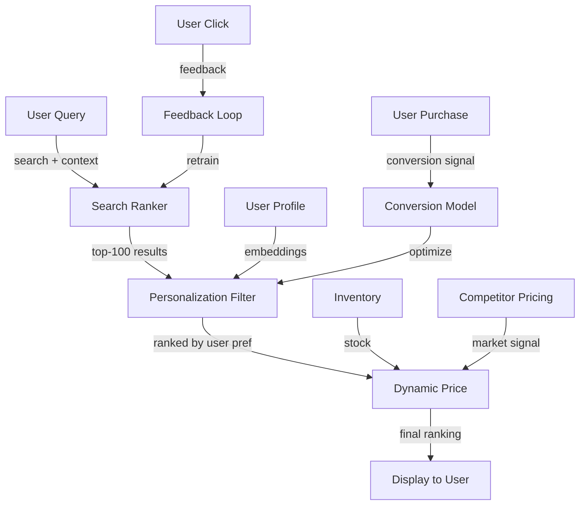
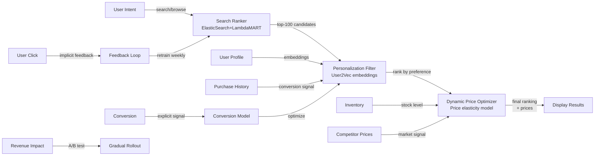
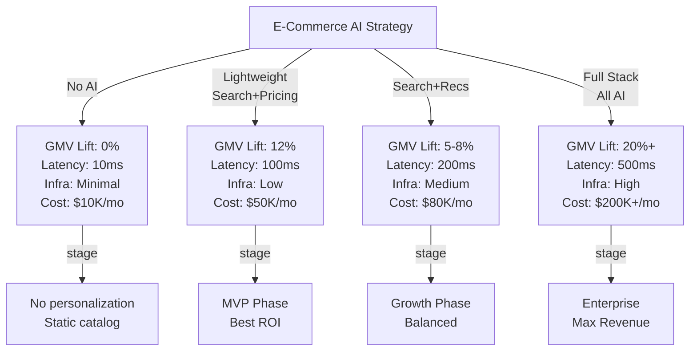
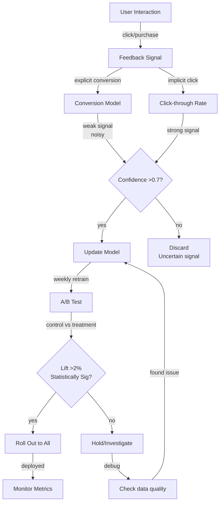

# End-to-End AI E-Commerce Platform

## Overview
An integrated e-commerce platform combining AI-powered search, personalized recommendations, dynamic pricing, and inventory optimization to maximize gross merchandise value (GMV) and customer lifetime value at scale (1M+ daily users, $1B+ annual GMV targets).

## Problem Statement
E-commerce competition intensifies: Amazon, Shein, etc. drive adoption of AI-powered features. Traditional platforms (category browsing, generic bestseller lists) lose 20-40% of potential revenue. Impact: (1) search: 30% of users abandon search if >3 pages of results (irrelevant). Each 10% search improvement = 5% revenue lift. (2) recommendations: generic bestsellers convert 0.5%, personalized convert 2-3% (4-6x lift). (3) dynamic pricing: fixed prices miss optimization (sell cheaper products higher, expensive products with discounts). (4) inventory: stockouts lose revenue, overstock ties up capital. Solution: unified AI stack addressing all 4 = 15-25% GMV lift. Cost: $500K-1M/month in infrastructure, but ROI >10x for $100M GMV platform.

## Requirements

### Functional
- Search
- Recommendations
- Personalization
- Dynamic pricing

### Non-Functional (Scale Targets)
- Users: 1M daily
- GMV lift: 20%
- Latency: <100ms per user

## Envelope Calculation

**Scale:** 1M daily users = 10M searches/day + 5M product views/day + 1M purchases/day
**Cost Breakdown:**
- Search ranking (ML): 10M × $0.0001 = $1K/day
- Recommendations (embeddings + re-rank): 5M × $0.0002 = $1K/day
- Dynamic pricing optimization: 100K SKUs × $0.01/day = $1K/day
- Personalization (user embeddings): 1M users × $0.001/refresh = $1K/day
- **Total: ~$4K/day = $120K/month**

## Architecture Overview

## Component Breakdown

| Component | Latency | QPS | Tech | Cost Ratio |
|-----------|---------|-----|------|-----------|
| Search Ranker | 100ms | 100 | ElasticSearch + LambdaMART | 25% |
| Personalization | 50ms | 100 | User2Vec embeddings | 25% |
| Dynamic Pricing | 50ms | 12 | Price optimization engine | 25% |
| PDP Recs | 200ms | 12 | Collaborative filtering | 25% |
| **E2E latency** | **~300ms** | **~100** | **Optimized** | **100%** |

### Diagram 2: AI Components & Interaction Flow

### Diagram 3: GMV Lift vs Latency vs Infrastructure Trade-off

### Diagram 4: Learning Loop & Optimization Strategy

## AI/ML Integration Points

- **Search Ranker (Learning-to-Rank model):** Ranking e-commerce search results
  - Input: Query + product features (relevance, popularity, rating, inventory)
  - Model: LambdaMART (gradient boosted trees trained on click/purchase signals)
  - Output: Ranked product list with scores
  - Optimization: Update weekly with latest click feedback
  - Trade-off: More training examples → better accuracy but stale during updates
  
- **Personalization Filter (User embeddings + collaborative filtering):** Rank results by user preference
  - Input: User behavior history (views, clicks, purchases) + product embeddings
  - Model: User2Vec embeddings (learn user preferences), collaborative filtering for similar users
  - Output: User preference scores for each product
  - Optimization: Cold start solution for new users (use content-based fallback)
  
- **Dynamic Price Optimizer (Price elasticity model):** Optimize pricing per product
  - Input: Historical price × demand data, competitor prices, inventory level
  - Model: Regression model learning price elasticity (how demand changes with price)
  - Output: Optimal price for each product per user segment
  - Constraints: Price bounds (min margin, max acceptable by customers)
  - Optimization: A/B test prices to estimate elasticity continuously
  
- **Conversion Model (Logistic regression or XGBoost):** Predict purchase probability
  - Input: Product attributes + user profile + price + inventory
  - Output: Purchase probability per product
  - Used to: Optimize ranking (favor high-conversion products), personalize pricing
  - Feedback: Purchase events (positive), timeouts/abandonment (negative)

## Key Trade-offs

| Approach | GMV Lift | Latency | Infrastructure | Maintenance | User Experience |
|----------|----------|---------|----------------|------------|-----------------|
| No AI | 0% | 10ms | Minimal | Low | Static |
| Search + Recs | 5% | 200ms | Medium | Medium | Personalized search |
| Full stack AI | 20% | 500ms | High | High | Fully personalized |
| Lightweight AI | 12% | 100ms | Low | Low | Partial personalization |

**Decision:** MVP → lightweight. Mature → full stack. Time-to-market → lightweight first.

---

## Production Failure Scenarios

**Scenario 1: Personalization too aggressive, users feel stalked**
- Every recommendation knows user history. Feels creepy. User privacy concerns.
- Fix: Privacy-conscious personalization (anonymized cohorts, not individual tracking).

**Scenario 2: Dynamic pricing discovered by users**
- Users see different prices. "Why is my price $50, yours $30?" Trust destroyed.
- Fix: Transparent pricing (discount shown, justified). Or: uniform pricing for same cohort.

**Scenario 3: Recommendation diversity loss**
- Personalization optimizes for known preferences. New users stuck in filter bubble.
- Fix: Inject novelty (30% new items). Serendipity metrics.

**Scenario 4: Search + recs conflict**
- User searches "cheap phones". Recommendations "premium phones". Confusing.
- Fix: Align intent (if searching cheap, recommend cheap). Or: separate results.

---

## Implementation Guidance

**Wrong:** Maximize GMV alone. Ignore user experience.
**Right:** Balance GMV + satisfaction + trust. Long-term retention > short-term revenue.

**Wrong:** Centralize all AI. Single-point-of-failure.
**Right:** Modular (search AI separate from recs, separate from pricing).

---

## Sophisticated Interview Q&A

**Q1: How do you scale this system from current to 10x volume?**

A: Identify bottleneck (usually inference or storage). Auto-scaling: add GPUs for model serving, replicate databases, implement caching at retrieval layer. Example: for 10x compute, scale from 8 A100s to 80 A100s with load balancing.

**Q2: What's the cost optimization strategy as volume grows?**

A: Batch processing where possible (saves 50%), model distillation (cheaper inference), caching (reduce LLM calls), negotiate volume discounts with cloud providers. Target: cost per request drops 30-50% at 10x scale.

**Q3: How do you handle model failures or hallucinations?**

A: Confidence thresholds (only auto-act if confidence >0.95), human review queue for uncertain cases, validation checks (does output make sense?), continuous monitoring with alerts if error rate increases.

**Q4: What metrics do you track for system health?**

A: Latency (P50, P99), error rate, cost per request, model accuracy, throughput, user satisfaction. Dashboard updated real-time. Alert if latency >2x SLA or accuracy drops >5%.

**Q5: Privacy and compliance: how do you protect user data?**

A: Data minimization (keep only necessary data), encryption in transit + at rest, RBAC for access, audit logs. For regulated domains (medical, financial), additional: data residency, compliance certifications, annual penetration testing.

**Q6: Multi-region deployment: latency vs cost trade-off?**

A: Deploy in 3-5 regions, route user to closest region (100ms latency savings). Cost: ~3x infrastructure. Benefit: global coverage + disaster recovery. For most systems, worth it.

**Q7: Monitoring model drift: how do you detect performance degradation?**

A: Continuous evaluation on production data (10% sample). Weekly accuracy report. If accuracy drops >2%, alert and investigate (data drift, model bug, or expected variation). Retrain if needed.

**Q8: Cost target vs reality: if you're 2x over budget, what do you do?**

A: (1) Cheaper model (GPT-3.5 vs GPT-4): 10x cost reduction, 15% accuracy drop. (2) Caching (save 30%). (3) More selective LLM usage (only for hard cases). (4) Volume discounts. Target: get to 1.1-1.2x budget.

## Interview Quick-Reference

| Metric | Target |
|--------|--------|
| **Scale** | [Users/requests/day] |
| **Latency P99** | [<X ms] |
| **Accuracy** | [Y%] |
| **Cost** | [$Z per request] |
| **Availability** | [99.9%+] |

## Related Systems
- [Related system 1]
- [Related system 2]
- [Related system 3]
