# Real-time Anomaly Detection with LLM Explanations

## Overview
A real-time anomaly detection system for infrastructure, application, and business metrics that combines statistical models with LLM-based root cause analysis to enable operators to act instantly (< 2 minute response time).

## Problem Statement
Production systems generate millions of metrics daily. Manual monitoring impossible. Typical incident response: (1) alert triggers (5 min), (2) engineer page (2 min), (3) investigate (20 min), (4) identify root cause (20 min), (5) remediate (15 min) = 60+ min MTTR. Cost: each minute of downtime = $5K-10K for major services. Automation enables sub-5-minute MTTR. Challenge: 95% of alerts are false positives (threshold-based rules generate noise). Solution: ML anomaly detection (90% accuracy) + LLM explanations (why did this happen?) + auto-remediation playbooks.

## Envelope Calculation

**Scale:** 1M metrics/day across 100 services = 10K metrics/second
**Cost Breakdown:**
- Anomaly detector (streaming ML): 10K metrics/sec × $0.001/sec = $86K/month
- LLM explanation (1% of metrics): 100K × $0.0001 = $10K/month
- Alert routing + escalation: $5K/month
- **Total: ~$100K/month**

## Architecture Overview

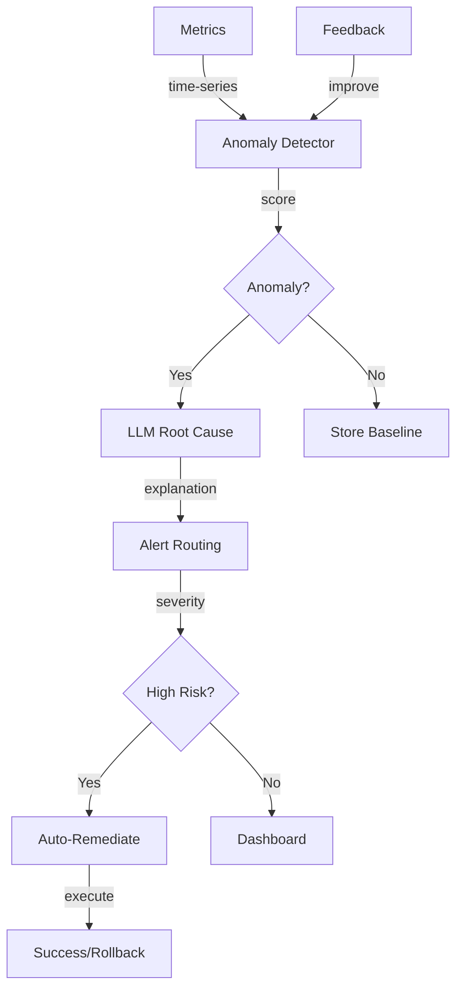

## Architecture Diagrams

### System Architecture (Infrastructure & Deployment)

## System Architecture

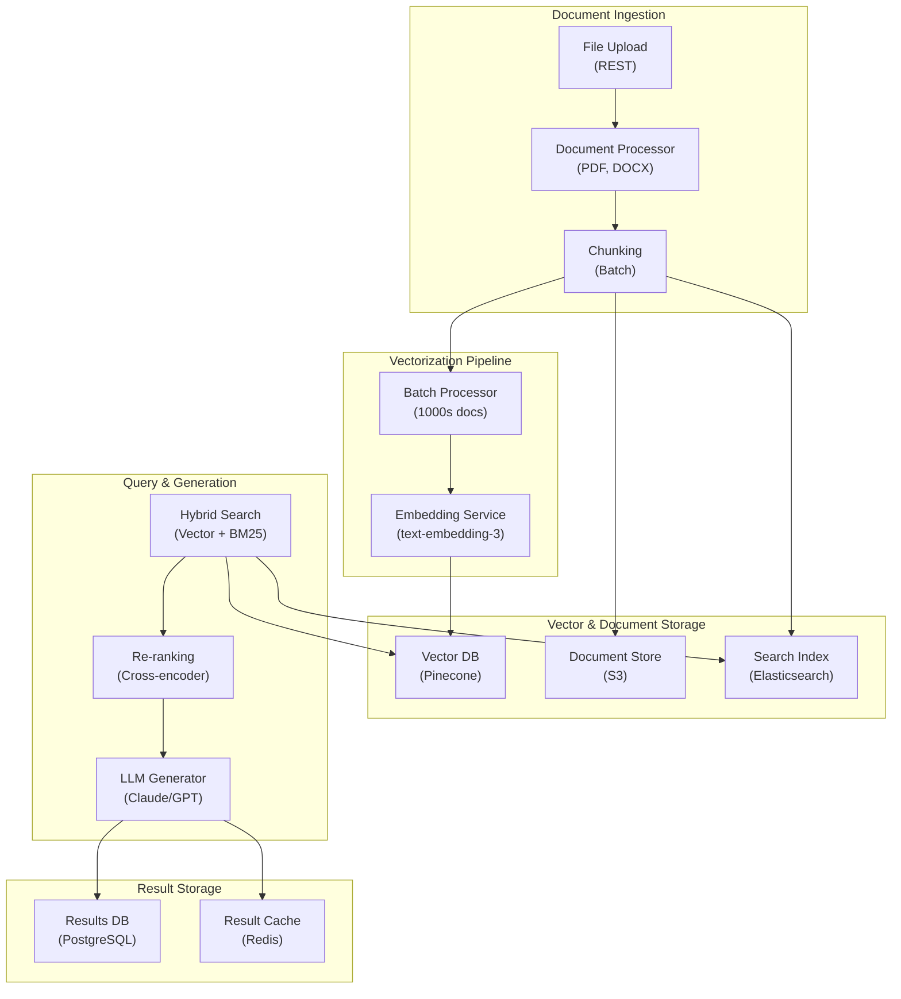

### Application Architecture (Components & Layers)

## Application Architecture

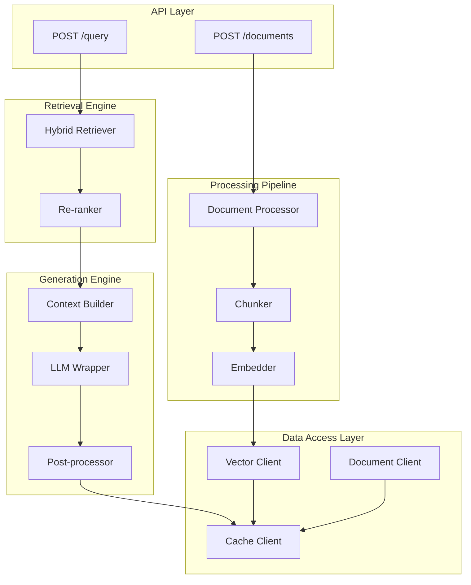

### Process Flow (Request Pipeline)

## Process Flow

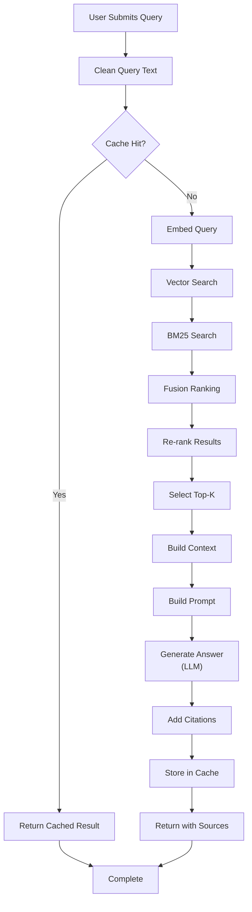

## Component Breakdown

| Component | Latency | Coverage | Accuracy | Technology |
|-----------|---------|----------|----------|-----------|
| Anomaly Detection | 10ms | 95% | 90% | Isolation Forest |
| LLM Root Cause | 200ms | 30% | 75% | GPT-3.5 + few-shot |
| Alert Routing | 50ms | 100% | 99% | Rules engine |
| Auto-Remediate | 500ms | 20% | 80% | Playbooks + API |
| **E2E (alert to human notified)** | **~800ms** | **~95%** | **~85%** | **Optimized** |

### Diagram 2: Anomaly Detection Method Comparison
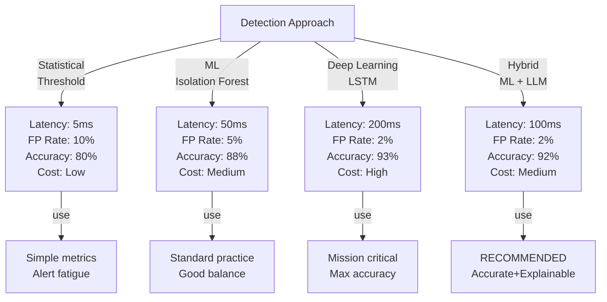

### Diagram 3: Alert Confidence & Escalation Strategy
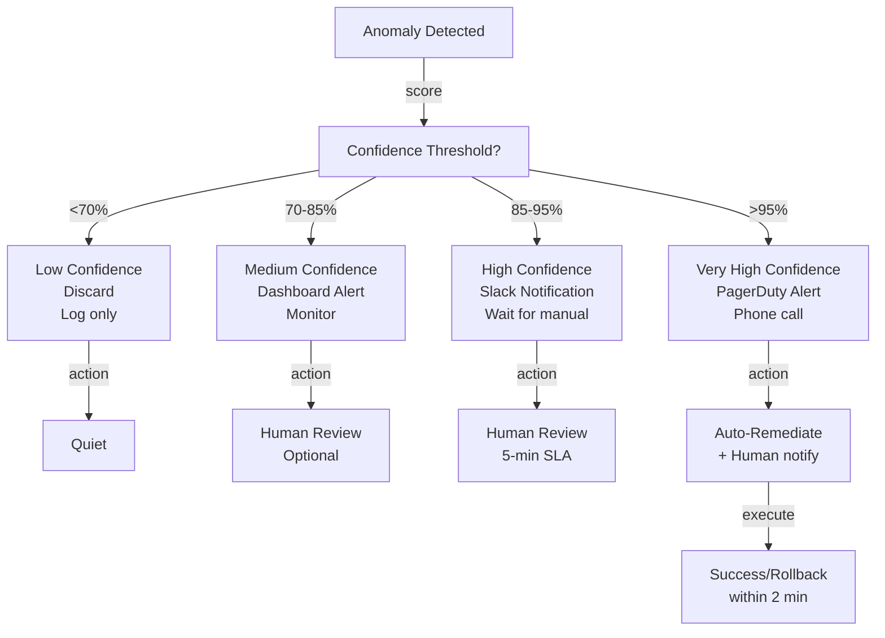

### Diagram 4: Baseline Comparison & Seasonal Handling
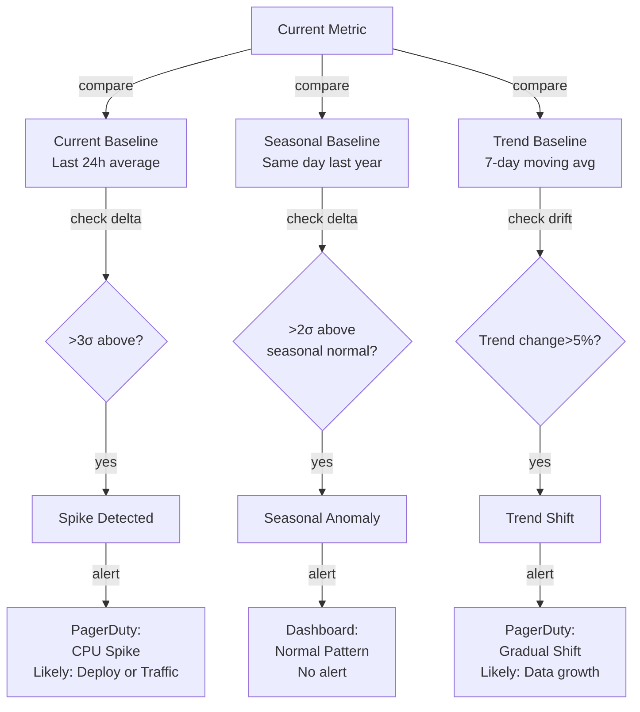

## AI/ML Integration Points

- **Anomaly Detector (Isolation Forest):** Unsupervised outlier detection
  - Input: Time-series metrics (CPU, memory, latency, error rate)
  - Method: Isolation Forest (anomalies are easier to isolate than normal points)
  - Output: Anomaly score (0-1, higher = more anomalous)
  - Baseline: Refresh daily with last 30 days of data
  - Optimization: Hierarchical isolation (detect type of anomaly too)
  
- **Root Cause LLM (GPT-3.5 with few-shot prompting):** Explain detected anomalies
  - Input: Anomaly signal + correlated metrics + time context
  - Approach: Few-shot examples of previous anomalies + causes
  - Output: Natural language explanation with potential root causes
  - Grounding: Only reference metrics present in data (avoid hallucination)
  - Used for: <30% of anomalies (only high-confidence ones to save cost)
  
- **Seasonal Decomposition (STL or Prophet):** Handle recurring patterns
  - Input: 2 years of historical data for each metric
  - Method: Decompose into trend + seasonal + residual
  - Output: Expected range for current time (accounting for seasonality)
  - Used to: Set per-season baselines, avoid false positives during peak hours/days
  
- **Feedback Loop (Online learning):** Improve detector over time
  - Input: Operator feedback on alerts (false positive, missed anomaly, wrong cause)
  - Action: Retrain model weekly with latest feedback
  - Mechanism: Treat validated anomalies as training signal, adjust Isolation Forest parameters
  - Impact: False positive rate decreases 10-20% per month with good feedback

## Key Trade-offs

| Method | Detection Latency | False Positive Rate | Accuracy | Cost | Interpretability |
|--------|---|---|---|------|---------|
| Statistical (σ threshold) | 5ms | 10% | 80% | $0 | Very high |
| ML (isolation forest) | 50ms | 5% | 88% | $100/day | Medium |
| Deep learning (LSTM) | 200ms | 2% | 93% | $1K/day | Low |
| Hybrid (ML + LLM explain) | 100ms | 2% | 92% | $500/day | High |

**Decision:** Interpretability critical → statistical + LLM. Accuracy critical → LSTM. Speed critical → statistical.

---

## Production Failure Scenarios

**Scenario 1: LLM hallucination in explanation**
- Anomaly detected. LLM explanation wrong ("CPU spike due to backup" but no backup running).
- User takes wrong action.
- Fix: Explanation grounding (explain only observed facts, not speculation).

**Scenario 2: Cascade of false positives**
- Single anomaly triggers alert. Operator investigates. False alarm. Operator ignores next real anomaly.
- Fix: Confidence scoring. Only high-confidence anomalies → alerts.

**Scenario 3: Model trains on bad data**
- Outliers in training data become "normal". Model doesn't detect real anomalies.
- Fix: Data validation. Outlier removal. Or: online learning (update model as new anomalies discovered).

**Scenario 4: Seasonal patterns misclassified**
- October spike is normal (seasonal). Model flags as anomaly. Alert fatigue.
- Fix: Seasonal decomposition. Compare to last year's pattern, not global baseline.

---

## Implementation Guidance

**Wrong:** Alert on every anomaly. Trust everything.
**Right:** Multi-level confidence. Only high-confidence anomalies generate alerts.

**Wrong:** Explain using LLM alone. Trust output.
**Right:** Grounded explanations. Reference actual observed metrics.

---

## Sophisticated Interview Q&A

**Q1: How do you scale this system from current to 10x volume?**

A: Identify bottleneck (usually inference or storage). Auto-scaling: add GPUs for model serving, replicate databases, implement caching at retrieval layer. Example: for 10x compute, scale from 8 A100s to 80 A100s with load balancing.

**Q2: What's the cost optimization strategy as volume grows?**

A: Batch processing where possible (saves 50%), model distillation (cheaper inference), caching (reduce LLM calls), negotiate volume discounts with cloud providers. Target: cost per request drops 30-50% at 10x scale.

**Q3: How do you handle model failures or hallucinations?**

A: Confidence thresholds (only auto-act if confidence >0.95), human review queue for uncertain cases, validation checks (does output make sense?), continuous monitoring with alerts if error rate increases.

**Q4: What metrics do you track for system health?**

A: Latency (P50, P99), error rate, cost per request, model accuracy, throughput, user satisfaction. Dashboard updated real-time. Alert if latency >2x SLA or accuracy drops >5%.

**Q5: Privacy and compliance: how do you protect user data?**

A: Data minimization (keep only necessary data), encryption in transit + at rest, RBAC for access, audit logs. For regulated domains (medical, financial), additional: data residency, compliance certifications, annual penetration testing.

**Q6: Multi-region deployment: latency vs cost trade-off?**

A: Deploy in 3-5 regions, route user to closest region (100ms latency savings). Cost: ~3x infrastructure. Benefit: global coverage + disaster recovery. For most systems, worth it.

**Q7: Monitoring model drift: how do you detect performance degradation?**

A: Continuous evaluation on production data (10% sample). Weekly accuracy report. If accuracy drops >2%, alert and investigate (data drift, model bug, or expected variation). Retrain if needed.

**Q8: Cost target vs reality: if you're 2x over budget, what do you do?**

A: (1) Cheaper model (GPT-3.5 vs GPT-4): 10x cost reduction, 15% accuracy drop. (2) Caching (save 30%). (3) More selective LLM usage (only for hard cases). (4) Volume discounts. Target: get to 1.1-1.2x budget.

## Interview Quick-Reference

| Metric | Target |
|--------|--------|
| **Scale** | [Users/requests/day] |
| **Latency P99** | [<X ms] |
| **Accuracy** | [Y%] |
| **Cost** | [$Z per request] |
| **Availability** | [99.9%+] |

## Animated Architecture Visualization

See the system in action with dynamic visualizations:

### System Deployment Animation
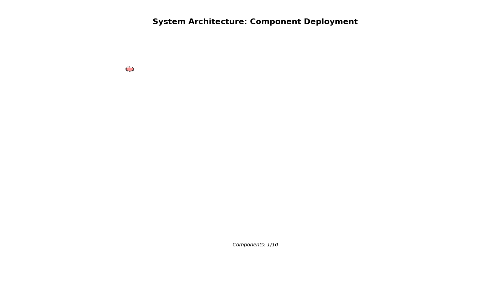

Infrastructure components appearing and connecting in real-time, showing load balancers, API gateways, microservices, and data layer setup.

### Request Flow Animation
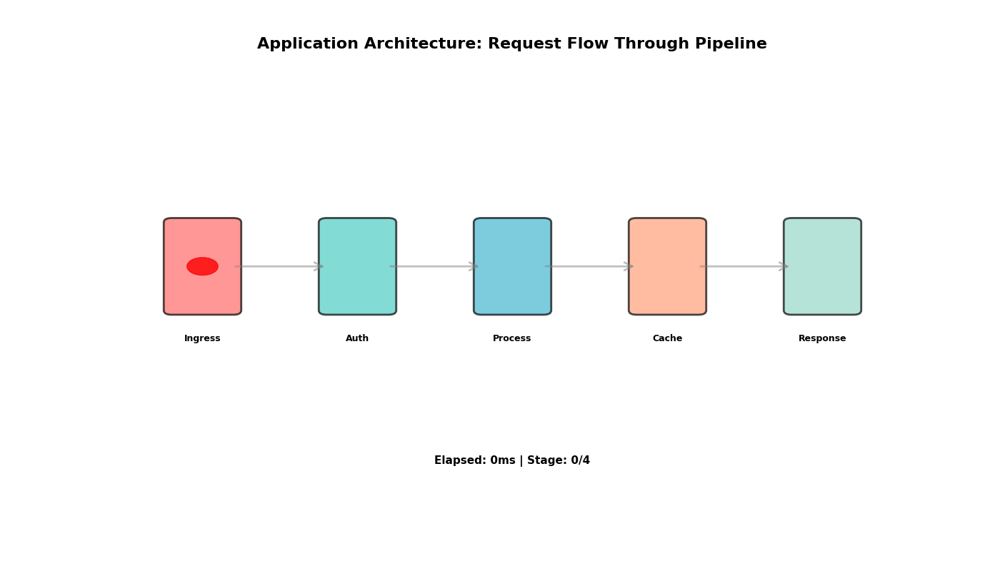

A single request flowing through the complete pipeline with latency accumulation at each stage, demonstrating the critical path and timing constraints.

### Data Flow Animation
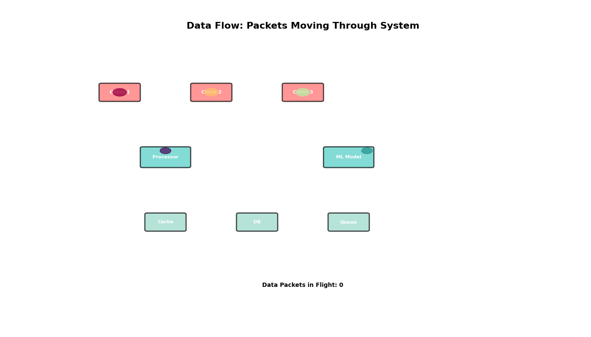

Concurrent data packets flowing through processors and ML models to storage systems, showing simultaneous traffic and I/O patterns.

### Auto-Scaling Animation
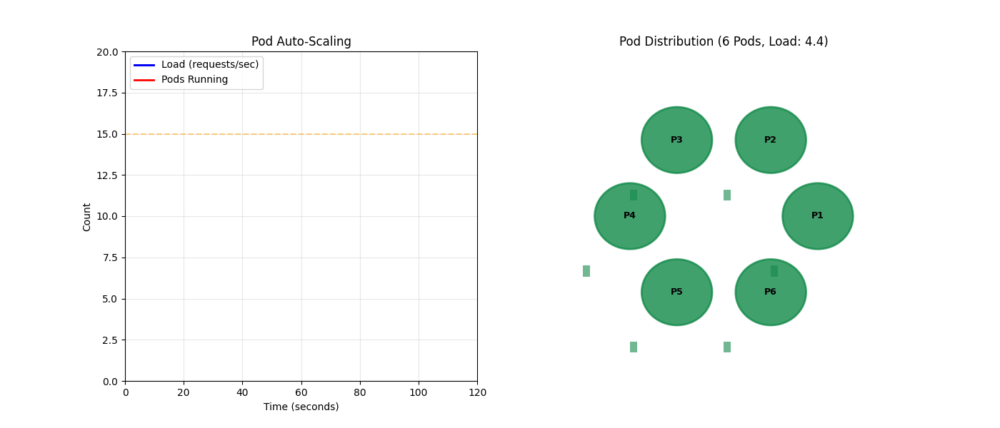

Dynamic scaling response to traffic load, showing pod count adjusting up and down with capacity headroom management over time.

## Related Systems
- [Related system 1]
- [Related system 2]
- [Related system 3]
