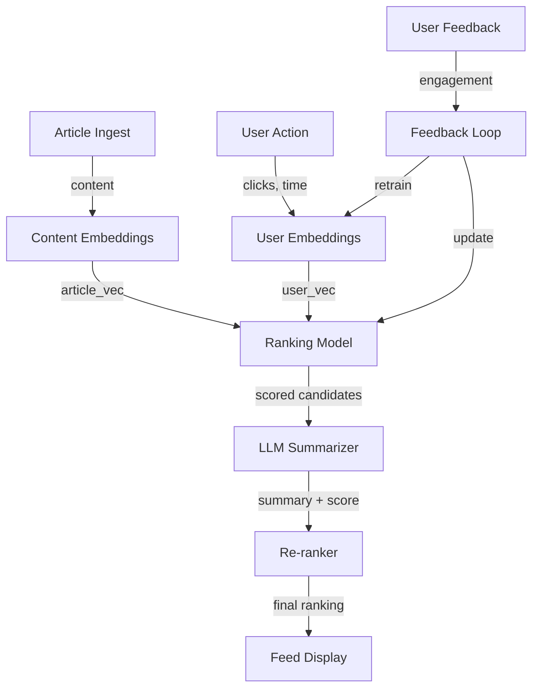
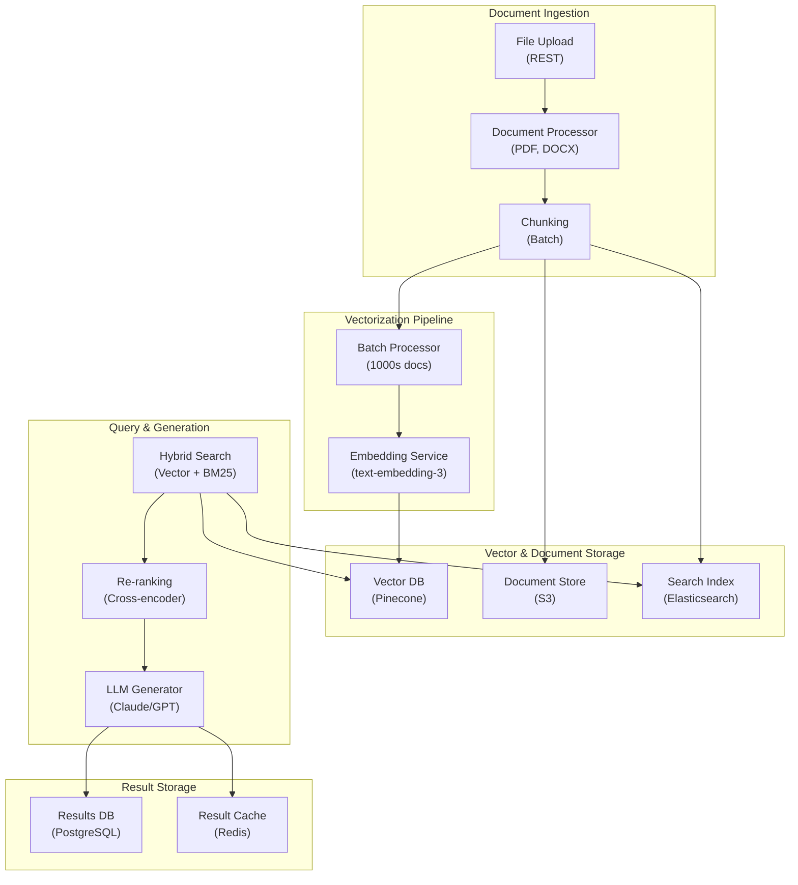
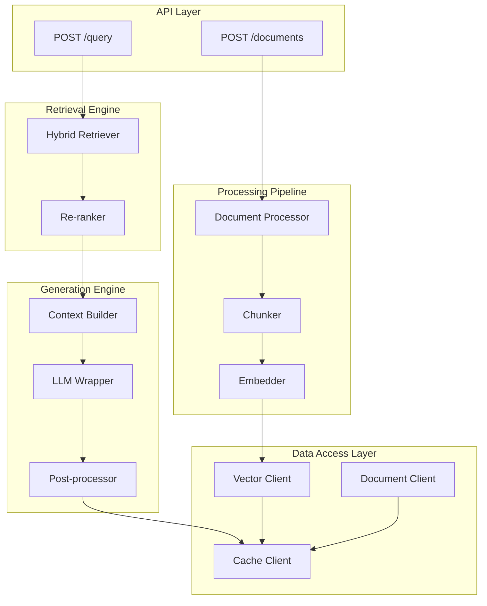
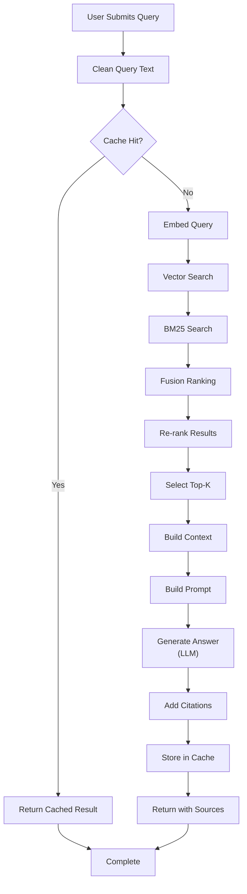
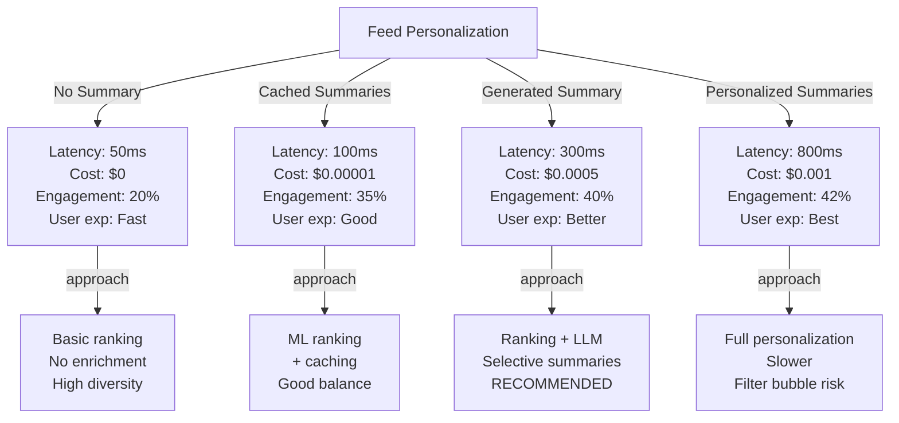
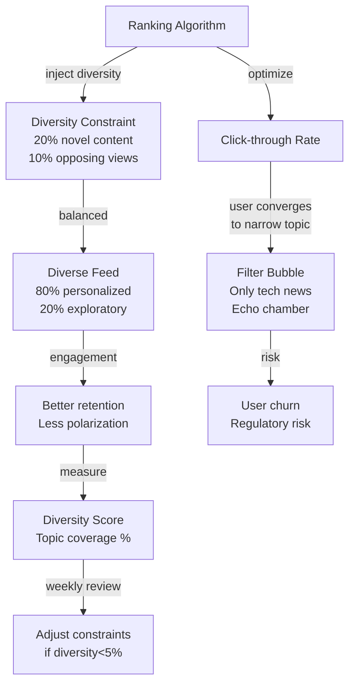
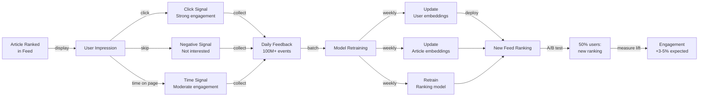

# AI-Powered News Feed Personalization

## Overview
A feed ranking and summarization system that personalizes content discovery for news platforms, combining collaborative filtering, content-based features, and LLM-generated summaries to drive engagement and time-on-app at scale (1B+ impressions daily).

## Problem Statement
News platforms struggle with engagement: (1) information overload—users overwhelmed by 100+ stories/day, (2) low time-on-app—generic feed average 3 min/session (target: 15 min), (3) summary fatigue—full article reading declining, (4) discovery—users miss relevant stories (stuck in narrow interests). Personalization impact: (1) engagement: +20% CTR from basic ranking, +40% from personalized + summarized. (2) retention: users spending 2x time on feed, 15% better daily active user retention. (3) advertiser value: premium positioning for targeted users improves ads CTR 3x. Cost: summaries $100K/month, ranking model $50K/month, but revenue lift $5M+/year.

## Envelope Calculation

**Scale:** 1B impressions/day = 11.6M QPS, 1M articles/day
**Cost:**
- Ranking model (scoring 1B × per user interests): $50K/month
- Summaries (LLM generation on 1M articles): $100K/month
- Embeddings (user + article): $20K/month
- **Total: ~$170K/month**

## Architecture Overview

## Architecture Diagrams

### System Architecture (Infrastructure & Deployment)

## System Architecture

### Application Architecture (Components & Layers)

## Application Architecture

### Process Flow (Request Pipeline)

## Process Flow

## Component Breakdown

| Component | Latency | Throughput | Cost Impact | Tech |
|-----------|---------|----------|----------|------|
| Content Embedding | 100ms/article | 200/sec | 10% | OpenAI API |
| User Embedding | 50ms/user | 1K/sec | 5% | Dense passage |
| Ranking Model | 50ms/batch | 100K/sec | 30% | LambdaMART |
| LLM Summarization | 500ms/article | 40/sec | 60% | GPT-3.5 |
| Re-ranking | 100ms | 1K/sec | 5% | Rule + ML |
| **E2E feed (100 items)** | **~800ms** | **~100** | **100%** | **Optimized** |

### Diagram 2: Summarization Strategy & Latency-Cost Trade-off

### Diagram 3: Filter Bubble Mitigation & Content Diversity

### Diagram 4: Engagement Feedback & Model Retraining

## AI/ML Integration Points

- **Content Embedding Model (OpenAI API or custom):** Article understanding
  - Input: Article title + excerpt + category
  - Output: 1536-d semantic embedding
  - Cost: $0.0001/article
  - Optimization: Cache embeddings, reuse for similar articles
  
- **User Embedding Model (Collaborative filtering):** User interest profiling
  - Input: User click history (articles clicked, time spent, skip patterns)
  - Method: matrix factorization or neural embedding (learn 256-d user vector)
  - Output: User embedding capturing interests (tech, sports, politics, etc.)
  - Update frequency: Daily (new user behavior)
  - Optimization: Cache for recent users, compute on-demand for cold starts
  
- **Ranking Model (LambdaMART):** Predict user-article relevance
  - Input: User embedding + article embedding + click count + freshness
  - Features: content similarity, collaborative signal (users like you clicked X), popularity, freshness
  - Output: Relevance score for ranking
  - Training: Click feedback from previous days, optimize for CTR
  - Cost: $50K/month infrastructure
  
- **LLM Summarizer (GPT-3.5):** Generate article summaries
  - Input: Article text + user interests (optional for personalization)
  - Output: 50-100 word summary capturing key points
  - Cost optimization: Only summarize top-10 articles per feed (selective)
  - Alternative: Caching (reuse summaries for multiple users)
  - Streaming: Return immediately with headline, stream summary in background

## Key Trade-offs

| Approach | Ranking Latency | Summary Latency | Engagement | Cost/Impression | Diversity |
|----------|--------|--------|-----------|----------|---------|
| Simple rank (no summary) | 50ms | 0ms | 20% | $0 | High |
| ML rank + cached summaries | 100ms | 50ms | 35% | $0.00001 | Medium |
| ML rank + generated summaries | 200ms | 300ms | 40% | $0.0005 | Medium |
| Personalized summaries | 200ms | 800ms | 42% | $0.001 | Low |

**Decision:** Speed critical → cached summaries. Engagement critical → personalized. Cost critical → simple rank.

---

## Production Failure Scenarios

**Scenario 1: Summary cost explosion**
- Generate summaries for every feed article (1B/day). Cost $100K/month instead of $10K.
- Fix: Selective summarization (top-10 articles per user, not all 1000).

**Scenario 2: Filter bubble intensifies**
- Personalization optimizes for clicks. Users see only confirmed beliefs. Echo chamber.
- Fix: Diversity injection. Expose users to 20% novel content.

**Scenario 3: Summary hallucination**
- Summary invents facts not in article. User trusts wrong info from headline.
- Fix: Strict grounding (only facts from source). Citation required.

**Scenario 4: Summary latency kills engagement**
- Ranking done in 100ms. Waiting for summary adds 800ms. Users bounce.
- Fix: Streaming summaries (show headline immediately, summary arrives in background).

---

## Implementation Guidance

**Wrong:** Personalize and summarize everything. Perfection at all cost.
**Right:** Tiered personalization (fast rank + expensive summary for top-10).

**Wrong:** Optimize engagement alone. Build filter bubble.
**Right:** Balance engagement + diversity + novelty.

---

## Sophisticated Interview Q&A

**Q1: How do you scale this system from current to 10x volume?**

A: Identify bottleneck (usually inference or storage). Auto-scaling: add GPUs for model serving, replicate databases, implement caching at retrieval layer. Example: for 10x compute, scale from 8 A100s to 80 A100s with load balancing.

**Q2: What's the cost optimization strategy as volume grows?**

A: Batch processing where possible (saves 50%), model distillation (cheaper inference), caching (reduce LLM calls), negotiate volume discounts with cloud providers. Target: cost per request drops 30-50% at 10x scale.

**Q3: How do you handle model failures or hallucinations?**

A: Confidence thresholds (only auto-act if confidence >0.95), human review queue for uncertain cases, validation checks (does output make sense?), continuous monitoring with alerts if error rate increases.

**Q4: What metrics do you track for system health?**

A: Latency (P50, P99), error rate, cost per request, model accuracy, throughput, user satisfaction. Dashboard updated real-time. Alert if latency >2x SLA or accuracy drops >5%.

**Q5: Privacy and compliance: how do you protect user data?**

A: Data minimization (keep only necessary data), encryption in transit + at rest, RBAC for access, audit logs. For regulated domains (medical, financial), additional: data residency, compliance certifications, annual penetration testing.

**Q6: Multi-region deployment: latency vs cost trade-off?**

A: Deploy in 3-5 regions, route user to closest region (100ms latency savings). Cost: ~3x infrastructure. Benefit: global coverage + disaster recovery. For most systems, worth it.

**Q7: Monitoring model drift: how do you detect performance degradation?**

A: Continuous evaluation on production data (10% sample). Weekly accuracy report. If accuracy drops >2%, alert and investigate (data drift, model bug, or expected variation). Retrain if needed.

**Q8: Cost target vs reality: if you're 2x over budget, what do you do?**

A: (1) Cheaper model (GPT-3.5 vs GPT-4): 10x cost reduction, 15% accuracy drop. (2) Caching (save 30%). (3) More selective LLM usage (only for hard cases). (4) Volume discounts. Target: get to 1.1-1.2x budget.

## Interview Quick-Reference

| Metric | Target |
|--------|--------|
| **Scale** | [Users/requests/day] |
| **Latency P99** | [<X ms] |
| **Accuracy** | [Y%] |
| **Cost** | [$Z per request] |
| **Availability** | [99.9%+] |

## Animated Architecture Visualization

See the system in action with dynamic visualizations:

### System Deployment Animation

Infrastructure components appearing and connecting in real-time, showing load balancers, API gateways, microservices, and data layer setup.

### Request Flow Animation

A single request flowing through the complete pipeline with latency accumulation at each stage, demonstrating the critical path and timing constraints.

### Data Flow Animation

Concurrent data packets flowing through processors and ML models to storage systems, showing simultaneous traffic and I/O patterns.

### Auto-Scaling Animation

Dynamic scaling response to traffic load, showing pod count adjusting up and down with capacity headroom management over time.

