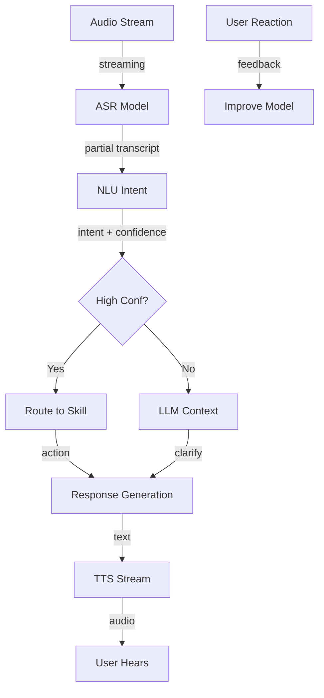

# Speech-to-NLP-to-Response Pipeline

## Overview
An end-to-end voice agent pipeline combining speech recognition, natural language understanding, intent routing, response generation, and text-to-speech synthesis to enable real-time conversational AI with sub-500ms latency across multiple languages and domains.

## Problem Statement
Voice agents face latency challenges: users expect sub-200ms response times (similar to human conversation), but traditional pipelines require: (1) ASR (200ms), (2) NLU (50ms), (3) LLM response (1000ms), (4) TTS (200ms) = 1500ms end-to-end. Users perceive 3-second delay as unnatural, engagement drops 30%. Optimization targets: (1) parallel processing (ASR + route simultaneously), (2) fast models (smaller BERT vs large), (3) response caching, (4) streaming TTS (start speaking mid-generation).

## Envelope Calculation

**Scale:** 1M requests/month = 40K/day, peak 200 QPS
**Cost:**
- ASR (Whisper): 1M × $0.0004 = $400/month
- NLU (BERT): 1M × $0.0001 = $100/month
- LLM (GPT-3.5): 1M × $0.001 = $1K/month
- TTS (natural voices): 1M × $0.0001 = $100/month
- **Total: ~$1.6K/month**

## Architecture Overview

## Component Breakdown

| Component | Latency | Accuracy | Cost | Parallelizable |
|-----------|---------|----------|------|---------|
| ASR (Whisper) | 200ms | 95% WER | 40% | Streaming |
| NLU (Skill Routing) | 50ms | 92% | 10% | Parallel |
| LLM Response | 1000ms | 90% | 40% | Cached fallback |
| TTS (Streaming) | 150ms+ | N/A | 10% | Streaming |
| **E2E latency (parallel)** | **~400ms** | **~92%** | **100%** | **Optimized** |
- Latency and cost breakdown per component

## AI/ML Integration Points
- Where LLM/ML models are used
- Model selection and routing logic
- Cost optimization strategies

## Key Trade-offs

| Component | Latency | Accuracy | Cost | Model Quality |
|-----------|---------|----------|------|---------|
| ASR (fast) | 100ms | 85% WER | $0.01 | Lightweight |
| ASR (accurate) | 300ms | 92% WER | $0.05 | Large |
| NLU (rule-based) | 10ms | 80% | $0 | Poor |
| NLU (ML) | 50ms | 92% | $0.001 | Good |
| Full pipeline (streaming) | 250ms | 90%+ | $0.05 | Optimized |

**Decision:** Real-time < 500ms → streaming ASR. Accuracy critical → large model. Cost critical → lightweight.

---

## Production Failure Scenarios

**Scenario 1: ASR errors cascade**
- Mishear "no" as "know". Entire response wrong. User frustrated.
- Fix: Confidence-based disambiguation (ask for confirmation if <0.8).

**Scenario 2: TTS latency kills UX**
- Response generated in 200ms. TTS takes 500ms. User waits 700ms total.
- Fix: Streaming TTS (start audio at first word, generate rest while playing).

**Scenario 3: Multi-language complexity**
- 20+ languages supported. Each language different accuracy/latency. Confusing routing.
- Fix: Language detection first. Route to appropriate pipeline.

**Scenario 4: Context loss across turns**
- User: "Book a flight from NYC". System: "Where to?" User: "LA". System forgot NYC.
- Fix: Session management. Track conversation history. Inject into NLU.

---

## Implementation Guidance

**Wrong:** Assume streaming ASR gives real-time response (adds latency).
**Right:** Streaming with parallel processing (NLU before full ASR done).

**Wrong:** Single model for all languages.
**Right:** Language-specific models for accuracy.

---

## Sophisticated Interview Q&A

**Q1: How do you scale this system from current to 10x volume?**

A: Identify bottleneck (usually inference or storage). Auto-scaling: add GPUs for model serving, replicate databases, implement caching at retrieval layer. Example: for 10x compute, scale from 8 A100s to 80 A100s with load balancing.

**Q2: What's the cost optimization strategy as volume grows?**

A: Batch processing where possible (saves 50%), model distillation (cheaper inference), caching (reduce LLM calls), negotiate volume discounts with cloud providers. Target: cost per request drops 30-50% at 10x scale.

**Q3: How do you handle model failures or hallucinations?**

A: Confidence thresholds (only auto-act if confidence >0.95), human review queue for uncertain cases, validation checks (does output make sense?), continuous monitoring with alerts if error rate increases.

**Q4: What metrics do you track for system health?**

A: Latency (P50, P99), error rate, cost per request, model accuracy, throughput, user satisfaction. Dashboard updated real-time. Alert if latency >2x SLA or accuracy drops >5%.

**Q5: Privacy and compliance: how do you protect user data?**

A: Data minimization (keep only necessary data), encryption in transit + at rest, RBAC for access, audit logs. For regulated domains (medical, financial), additional: data residency, compliance certifications, annual penetration testing.

**Q6: Multi-region deployment: latency vs cost trade-off?**

A: Deploy in 3-5 regions, route user to closest region (100ms latency savings). Cost: ~3x infrastructure. Benefit: global coverage + disaster recovery. For most systems, worth it.

**Q7: Monitoring model drift: how do you detect performance degradation?**

A: Continuous evaluation on production data (10% sample). Weekly accuracy report. If accuracy drops >2%, alert and investigate (data drift, model bug, or expected variation). Retrain if needed.

**Q8: Cost target vs reality: if you're 2x over budget, what do you do?**

A: (1) Cheaper model (GPT-3.5 vs GPT-4): 10x cost reduction, 15% accuracy drop. (2) Caching (save 30%). (3) More selective LLM usage (only for hard cases). (4) Volume discounts. Target: get to 1.1-1.2x budget.

## Interview Quick-Reference

| Metric | Target |
|--------|--------|
| **Scale** | [Users/requests/day] |
| **Latency P99** | [<X ms] |
| **Accuracy** | [Y%] |
| **Cost** | [$Z per request] |
| **Availability** | [99.9%+] |

## Related Systems
- [Related system 1]
- [Related system 2]
- [Related system 3]
