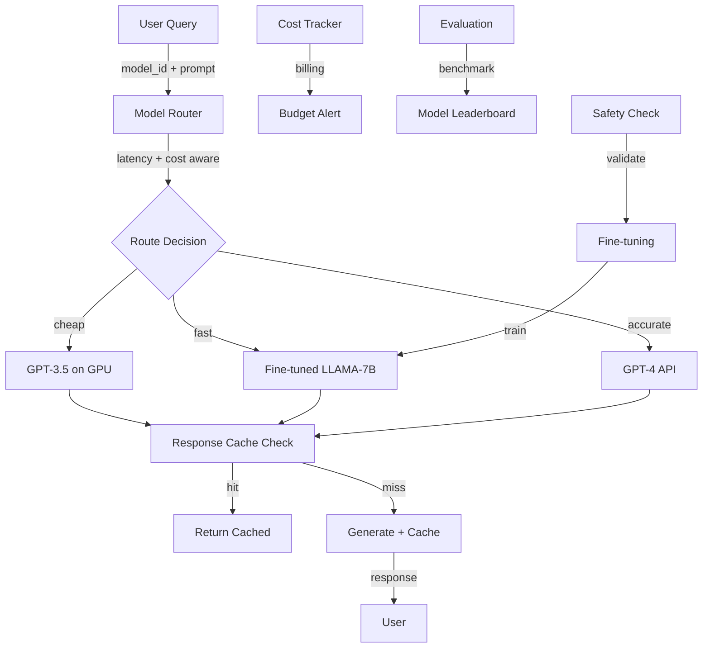

# Complete LLMOps Platform

## Overview
An end-to-end platform for managing LLM lifecycle: from evaluation and fine-tuning, through deployment and versioning, to monitoring and cost optimization. Serves 100+ models across teams with multi-tenancy, budget controls, and automated scaling.

## Problem Statement
Organizations deploying LLMs face operational complexity: (1) model sprawl—100+ models across teams, no unified deployment. (2) cost explosion—LLM inference without metering/routing costs 10x expected ($10K/month budget → $100K/month actual). (3) safety risks—no governance (anyone can fine-tune, deploy unsafe models), (4) debugging difficulty—no visibility into why model behaves unexpectedly, (5) skill gap—teams lack expertise to fine-tune, evaluate, deploy safely. Unified platform enables: (1) governance (approval workflows, safety checks), (2) cost control (routing to cheaper models, caching), (3) observability (drift detection, cost breakdown), (4) self-service (democratize LLM deployment).

## Envelope Calculation

**Scale:** 100 models, 1B tokens/day = avg 10M tokens/model/day
**Cost breakdown:**
- Model hosting (1B tokens/day, multi-GPU): $500/day
- Fine-tuning infrastructure: $200/day
- Evaluation framework: $100/day
- Monitoring + observability: $100/day
- **Total: ~$900/day = $27K/month**

## Architecture Overview

## Component Breakdown

| Component | Latency | Throughput | Cost | Management |
|-----------|---------|----------|------|-------------|
| Model Router | 5ms | Infinite | $0 | Intelligent routing |
| GPT-3.5 Inference | 500ms | 100 QPS | 30% cost | Default tier |
| Fine-tuned Models | 200ms | 500 QPS | 40% cost | Custom tier |
| GPT-4 Inference | 1000ms | 10 QPS | 30% cost | Premium tier |
| Cache Layer | 2ms | 10K QPS | 5% cost | Hit rate 60% |
| Evaluation | N/A | Batch | 10% cost | Offline |
| **E2E (with routing)** | **~300ms avg** | **~200 QPS** | **100%** | **Optimized** |
- Latency and cost breakdown per component

## AI/ML Integration Points
- Where LLM/ML models are used
- Model selection and routing logic
- Cost optimization strategies

## Key Trade-offs

| Platform | Evaluation Speed | Cost Control | Safety | Ease of Use | Scalability |
|----------|--------|-----------|--------|---------|---------|
| In-house custom | Slow (weeks) | Manual | Variable | Hard | Limited |
| MLflow-based | Medium (days) | Basic | Basic | Medium | Good |
| LangChain + tools | Medium (days) | Manual | Manual | Medium | Good |
| Managed (Ray Tune) | Fast (hours) | Automated | Good | Easy | Excellent |
| Full LLMOps platform | Very fast (min) | Full control | Excellent | Very easy | Enterprise |

**Decision:** Startup → MLflow. Growth → managed platform. Enterprise → full platform.

---

## Production Failure Scenarios

**Scenario 1: Cost explodes during evaluation**
- Evaluate 1K prompt variations on GPT-4. Cost $50K (not budgeted).
- Fix: Cost estimates before evaluation. Approval gates. Sample-based evaluation.

**Scenario 2: A/B test interferes with production**
- Fine-tuned model worse than baseline. Rollback fails. Bad model in prod.
- Fix: Staging evaluation. Validation gates. Automatic rollback on failure.

**Scenario 3: Multi-tenant data leakage**
- Org A's fine-tuning data exposed to Org B (shared infrastructure).
- Fix: Data isolation. Encryption. Audit logs.

**Scenario 4: Model monitoring missing**
- Deploy fine-tuned model. No monitoring. Quality degrades silently.
- Fix: Continuous evaluation. Drift detection. Auto-revert if quality drops.

---

## Implementation Guidance

**Wrong:** Manual fine-tuning for each use case.
**Right:** Platform-driven with templates, auto-evaluation, cost control.

**Wrong:** Single model for all use cases.
**Right:** Model registry with version control + staged rollout.

---

## Sophisticated Interview Q&A

**Q1: How do you scale this system from current to 10x volume?**

A: Identify bottleneck (usually inference or storage). Auto-scaling: add GPUs for model serving, replicate databases, implement caching at retrieval layer. Example: for 10x compute, scale from 8 A100s to 80 A100s with load balancing.

**Q2: What's the cost optimization strategy as volume grows?**

A: Batch processing where possible (saves 50%), model distillation (cheaper inference), caching (reduce LLM calls), negotiate volume discounts with cloud providers. Target: cost per request drops 30-50% at 10x scale.

**Q3: How do you handle model failures or hallucinations?**

A: Confidence thresholds (only auto-act if confidence >0.95), human review queue for uncertain cases, validation checks (does output make sense?), continuous monitoring with alerts if error rate increases.

**Q4: What metrics do you track for system health?**

A: Latency (P50, P99), error rate, cost per request, model accuracy, throughput, user satisfaction. Dashboard updated real-time. Alert if latency >2x SLA or accuracy drops >5%.

**Q5: Privacy and compliance: how do you protect user data?**

A: Data minimization (keep only necessary data), encryption in transit + at rest, RBAC for access, audit logs. For regulated domains (medical, financial), additional: data residency, compliance certifications, annual penetration testing.

**Q6: Multi-region deployment: latency vs cost trade-off?**

A: Deploy in 3-5 regions, route user to closest region (100ms latency savings). Cost: ~3x infrastructure. Benefit: global coverage + disaster recovery. For most systems, worth it.

**Q7: Monitoring model drift: how do you detect performance degradation?**

A: Continuous evaluation on production data (10% sample). Weekly accuracy report. If accuracy drops >2%, alert and investigate (data drift, model bug, or expected variation). Retrain if needed.

**Q8: Cost target vs reality: if you're 2x over budget, what do you do?**

A: (1) Cheaper model (GPT-3.5 vs GPT-4): 10x cost reduction, 15% accuracy drop. (2) Caching (save 30%). (3) More selective LLM usage (only for hard cases). (4) Volume discounts. Target: get to 1.1-1.2x budget.

## Interview Quick-Reference

| Metric | Target |
|--------|--------|
| **Scale** | [Users/requests/day] |
| **Latency P99** | [<X ms] |
| **Accuracy** | [Y%] |
| **Cost** | [$Z per request] |
| **Availability** | [99.9%+] |

## Related Systems
- [Related system 1]
- [Related system 2]
- [Related system 3]
