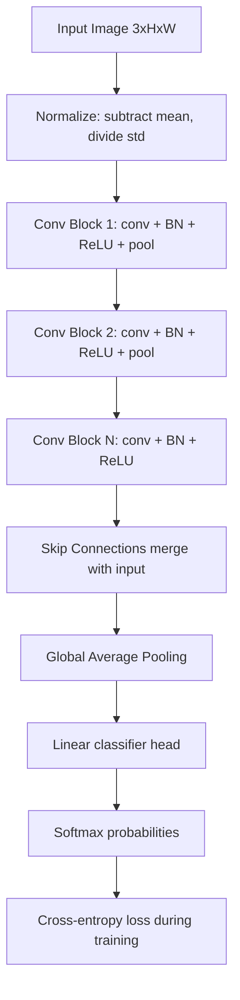

# Image Classification

## Detailed Explanation

Image classification assigns a label to an entire image from a fixed set of categories. It is the foundational task in computer vision: nearly every production vision pipeline starts with a classifier, even when the final goal is detection, segmentation, or generation.

The ImageNet Large Scale Visual Recognition Challenge (ILSVRC) is the benchmark that drove progress. In 2011 shallow methods achieved a top-5 error of 26%. AlexNet (2012) dropped that to 15% using deep CNNs and GPU training. By 2017 the winning top-5 error was 2.25% — surpassing human performance. Each winning architecture — VGG, Inception, ResNet, EfficientNet — contributed lasting ideas: depth, multi-scale features, residual connections, compound scaling.

In practice, training from scratch is rare. Transfer learning from ImageNet pretrained weights is the default strategy: the model has already learned edges, textures, and parts that transfer across visual domains. The only decision is whether to fine-tune all layers or freeze the backbone and train only the head (feature extraction). That choice depends on dataset size and how similar the target domain is to ImageNet.

Production classifiers must handle: input normalization (always per-dataset mean/std), data augmentation to prevent overfitting, class imbalance (weighted loss or oversampling), and latency requirements (MobileNet for mobile, ResNet50 for server). Getting input normalization wrong is one of the most common deployment bugs.

## Core Intuition

CNNs learn a hierarchy — early layers detect edges and color blobs, middle layers recognize textures and patterns, deep layers compose parts into objects. Transfer learning works because this hierarchy is largely universal across visual tasks: the edge detectors learned on ImageNet are still the right edge detectors for medical images or satellite imagery.

## How It Works

1. **Input normalization** — subtract per-channel mean and divide by std (ImageNet: mean=[0.485, 0.456, 0.406], std=[0.229, 0.224, 0.225])
2. **Convolutional blocks** — each block applies conv2d → batch norm → ReLU → optional pooling; receptive field grows at each stage
3. **Residual connections** — add input to output of each block; this prevents vanishing gradients and allows training 100+ layers
4. **Global average pooling** — replaces the large fully-connected bottleneck; reduces spatial H×W to 1×1 per channel with far fewer parameters
5. **Classification head** — single linear layer: `Linear(channels, num_classes)` → softmax (or use cross-entropy loss which folds in softmax)
6. **Fine-tuning strategy** — freeze backbone, train head for a few epochs to warm up; then optionally unfreeze backbone with a small learning rate (1e-4 to 1e-5) to adapt features

## Architecture and Trade-offs

### Training strategy comparison

| Strategy | Dataset needed | Training time | Accuracy | When to use |
|---|---|---|---|---|
| Train from scratch | 500K+ images | Days-weeks | Baseline | Unique domain (satellite, medical) with large data |
| Fine-tune all layers | 10K–500K | Hours | High | Target domain differs from ImageNet |
| Feature extraction (head only) | 1K–10K | Minutes | Moderate | Small dataset, similar domain to ImageNet |
| Linear probe | <1K | Seconds | Lower | Prototyping, frozen self-supervised features |

### Architecture comparison (ImageNet top-1 accuracy)

| Architecture | Params | Top-1 Acc | Inference latency (GPU) | Best use case |
|---|---|---|---|---|
| MobileNetV2 | 3.4M | 72% | Fast (1ms) | Mobile / edge deployment |
| ResNet-50 | 25M | 76% | Medium (4ms) | General server workloads |
| EfficientNet-B4 | 19M | 83% | Medium (6ms) | Accuracy-efficiency balanced |
| ViT-B/16 | 86M | 81% | Slow (10ms) | Large data pretraining regimes |

### Learning rate for fine-tuning

| Scenario | Recommended LR | Notes |
|---|---|---|
| Head only (frozen backbone) | 1e-3 to 1e-2 | Head is randomly initialized |
| Full fine-tune after warmup | 1e-4 to 1e-5 | Small LR to not destroy pretrained features |
| Train from scratch | 1e-2 with momentum | With cosine schedule and warmup |

## Interview Q&A

**Q: When would you NOT use transfer learning from ImageNet?**
A: When your domain is far from natural RGB images — X-rays, SAR satellite data, single-channel microscopy, or spectral data with unusual channel counts. In those cases ImageNet priors may actively hurt, and training from scratch with domain-specific augmentation can win. But even then, start with transfer learning as a baseline — it usually still helps more than it hurts.

**Q: Why does ResNet use skip connections, and what problem do they solve?**
A: Without skip connections, gradients must pass through every nonlinearity on the backward pass; in deep networks (50+ layers) they vanish to near zero before reaching early layers. Skip connections add a direct gradient highway: the gradient of the loss can flow straight back through the identity mapping, bypassing layers. This makes 100+ layer networks trainable and removes the "degradation problem" where adding more layers made training accuracy worse.

**Q: Your model has 99% train accuracy but 60% test accuracy — what do you do?**
A: That is severe overfitting. In order of impact: (1) add regularization — dropout, weight decay; (2) add data augmentation — flip, crop, color jitter; (3) reduce model capacity if dataset is small; (4) get more labeled data or use semi-supervised learning. If using transfer learning, check that you are not fine-tuning the backbone on a tiny dataset — freeze it and only train the head.

**Q: How does batch normalization affect fine-tuning and what can go wrong?**
A: During inference, BN uses running statistics computed during training. If you fine-tune with a small batch size or a domain-shifted dataset, the running statistics become inconsistent with actual batch stats, causing a distribution mismatch at test time. Fix: freeze BN layers during fine-tuning (`model.eval()` on BN layers) or use GroupNorm instead of BatchNorm when batch size is small.

**Q: How would you handle class imbalance in a 1000-class classification problem?**
A: Three main options: (1) class-weighted cross-entropy loss — weight each class inversely to its frequency; (2) oversampling minority classes in the data loader; (3) focal loss — down-weights easy majority-class examples to focus training on hard minority examples. In practice, combining weighted sampling with focal loss works best. Also monitor per-class recall, not just overall accuracy, to detect when rare classes are being ignored.

**Q: What is the difference between top-1 and top-5 accuracy, and when does each matter?**
A: Top-1 checks whether the highest-probability prediction is correct; top-5 checks whether the correct label is in the five highest predictions. Top-5 is reported on ImageNet because many categories are ambiguous (snake species, dog breeds). For production systems, top-1 usually matters unless the application tolerates showing multiple options — search and recommendation can use top-5 naturally.

## Best Practices

- Always normalize inputs with the **dataset's own mean and std**, not ImageNet stats, unless you are using a pretrained model that was trained on ImageNet. Mismatching normalization is the most common deployment bug.
- Use a **learning rate of 1e-4** for fine-tuning the backbone and 1e-3 for the head. Differential learning rates (lower for early layers, higher for later layers) often improve convergence.
- Apply standard augmentation: **horizontal flip (p=0.5), random crop (scale 0.8–1.0), color jitter (brightness=0.2, contrast=0.2)**. Avoid aggressive augmentation (large rotations, cutout) early — add them only if validation loss stagnates.
- Monitor **val accuracy per epoch**, not just train loss. Early stopping with patience=10 prevents overfitting on small datasets.
- Use **AdamW with weight decay 1e-4** for fine-tuning. SGD with momentum 0.9 and cosine LR schedule for training from scratch.
- For binary or few-class tasks, prefer **weighted cross-entropy** over accuracy as the training signal to handle class imbalance.
- Profile inference time with `torch.utils.benchmark` before claiming a model "is fast" — GPU batch throughput and single-image latency differ by 10-50x.

## Common Pitfalls

- **Wrong normalization in deployment:** Model was trained with ImageNet normalization but production pipeline does not normalize. Symptoms: accuracy collapses to near-random. Fix: verify preprocessing code matches training exactly, and add an assertion that input means are approximately zero.
- **Forgetting to freeze BN during fine-tuning:** Running BN in train mode with small batches corrupts the running statistics. Symptom: unstable val loss that degrades after initially improving. Fix: call `model.eval()` on all BN layers before fine-tuning, or use `requires_grad_(False)` on BN params.
- **Over-augmenting on a small dataset:** Heavy augmentation (rotation, cutmix, mixup) on fewer than 1K samples adds regularization but also increases effective training difficulty too much. Symptoms: train loss does not decrease. Fix: start with flip+crop only, add more augmentation after baseline converges.
- **Wrong input channel order:** OpenCV reads images as BGR; PyTorch expects RGB. Symptom: colors are inverted and model accuracy drops. Fix: always convert with `img = img[:, :, ::-1]` or use `plt.imread` which returns RGB.
- **Reporting accuracy on unbalanced test set:** 95% accuracy on a dataset that is 95% class-0 means the model is ignoring all other classes. Fix: report per-class F1 and confusion matrix alongside overall accuracy.

## Related Concepts

- [Object Detection](./02-object-detection.md) — Classification applied at every location; shares CNN backbones
- [Image Segmentation](./03-image-segmentation.md) — Per-pixel classification; U-Net builds on CNN encoder
- [Vision Transformers](./04-vision-transformers.md) — Replaces CNN backbone with self-attention over image patches
