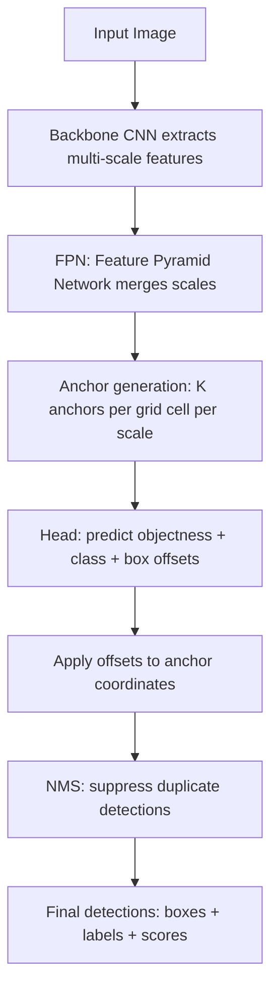

# Object Detection

## Detailed Explanation

Object detection combines localization and classification: for every object in an image, output a bounding box (x, y, width, height) and a class label with a confidence score. This is one order of magnitude harder than classification because the number and location of objects is unknown at inference time.

Architectures split into two paradigms. Two-stage detectors (Faster R-CNN) use a Region Proposal Network to propose candidate regions, then classify and refine each proposal. This produces high accuracy (~50 mAP on COCO) but runs at 1–5 FPS on a single GPU. One-stage detectors (YOLO, SSD) predict class and box directly from a grid of anchor boxes in one forward pass, trading some accuracy for speed (30–100+ FPS). Modern versions (YOLOv8, DINO) close much of the accuracy gap.

Anchor boxes are pre-defined bounding box shapes (tall-narrow for pedestrians, wide-short for cars) placed at each grid cell. The network predicts offsets from these priors rather than raw coordinates, which stabilizes training. Anchor-free methods (FCOS, CenterNet) skip anchors entirely and predict boxes from object centers, reducing hyperparameter engineering.

Non-maximum suppression (NMS) eliminates duplicate detections: keep the highest-confidence box, suppress all other boxes that overlap it by more than an IoU threshold (typically 0.5). Without NMS a detector fires multiple times on each object.

Mean Average Precision (mAP) is the standard metric. For each class, compute precision-recall curve across confidence thresholds, interpolate the area under it (Average Precision), then average across classes. mAP@0.5 (IoU threshold 0.5) and mAP@0.5:0.95 (averaged over IoU thresholds 0.5, 0.55, ..., 0.95) are the two most reported numbers.

## Core Intuition

Object detection is image classification applied at every possible location and scale — made tractable through clever shortcuts. Anchor boxes provide a small set of "guesses" about where and what size objects might be, and the network only needs to predict small offsets from those guesses rather than raw coordinates from scratch.

## How It Works

1. **Backbone** — ResNet or similar extracts feature maps at multiple spatial resolutions (stride 8, 16, 32)
2. **Neck / FPN** — Feature Pyramid Network combines low-resolution semantically rich features with high-resolution spatially precise features via top-down lateral connections
3. **Anchor placement** — at each grid cell on each feature map, place K anchor boxes with different aspect ratios and scales; total anchors = H×W×K per scale
4. **Head prediction** — for each anchor: predict (1) objectness score (object vs background), (2) 4 box offsets (dx, dy, dw, dh relative to anchor), (3) C class probabilities
5. **Loss** — focal loss for objectness (handles extreme class imbalance: most anchors are background), smooth L1 / GIoU for box regression
6. **NMS post-processing** — sort by confidence, greedily keep boxes while suppressing overlapping detections (IoU > threshold), return final set

## Architecture and Trade-offs

### Two-stage vs one-stage detectors

| Property | Two-stage (Faster R-CNN) | One-stage (YOLO) |
|---|---|---|
| Accuracy (COCO mAP) | Higher (~50+) | Lower–competitive (45–55+) |
| Speed (GPU) | 1–5 FPS | 30–100+ FPS |
| Small object detection | Better (ROI align) | Weaker (coarse grid) |
| Implementation complexity | High | Moderate |
| Best use case | Accuracy-critical, offline batch | Real-time, edge, video |

### Anchor-based vs anchor-free

| Property | Anchor-based (YOLOv5, SSD) | Anchor-free (FCOS, CenterNet) |
|---|---|---|
| Anchor design required | Yes (cluster from data) | No |
| Performance on irregular objects | Better with good anchors | More flexible |
| Hyperparameter sensitivity | High (anchor shapes matter) | Low |
| Multi-scale handling | Via FPN with anchors per scale | Direct center prediction |

### IoU thresholds and their meaning

| Metric | IoU threshold | What it measures |
|---|---|---|
| mAP@0.5 | 0.50 | Loose: center is roughly right |
| mAP@0.75 | 0.75 | Strict: box boundaries are precise |
| mAP@0.5:0.95 | 0.5–0.95 avg | COCO standard: full precision spectrum |

## Interview Q&A

**Q: What is IoU and why is it the standard metric for detection, not pixel accuracy?**
A: Intersection over Union = |box_A ∩ box_B| / |box_A ∪ box_B|. It is scale-invariant: a perfect box on a small object and a perfect box on a large object both score 1.0. Pixel accuracy would favor large objects — a big box placed loosely still covers many correct pixels. IoU penalizes both over-large and poorly-centered boxes equally.

**Q: When would you use a two-stage detector over a one-stage detector?**
A: When accuracy is the priority and latency is not a hard constraint: medical imaging (small lesion detection requires precise boxes), aerial/satellite imagery (many tiny objects), forensics, and quality control inspection. Two-stage detectors handle small objects better because ROI align crops features at the exact proposed region. For real-time video, autonomous driving at 30 FPS, or mobile deployment, use one-stage.

**Q: How does NMS work and when does it fail?**
A: Sort detections by confidence. Keep the top detection, then suppress all remaining detections whose IoU with it exceeds a threshold (e.g., 0.5). Repeat. NMS fails in two scenarios: (1) densely packed objects of the same class (e.g., a crowd of people) — NMS merges nearby correct detections thinking they are duplicates; fix with Soft-NMS which down-weights rather than removes. (2) Very low confidence threshold — keeps too many boxes; (3) Very high threshold — keeps duplicates. Tune threshold per dataset.

**Q: What is mAP and how does it differ from classification accuracy?**
A: mAP is Mean Average Precision — the mean of per-class AP values. AP for one class is the area under its precision-recall curve, computed by varying the confidence threshold from 0 to 1. This captures the full trade-off between recall and precision, unlike accuracy which picks one operating point. AP = 1.0 means perfect precision at all recall levels. A model can have high AP but low accuracy at any single threshold, so always report mAP rather than accuracy for detection.

**Q: How do you handle classes with very different object sizes — detecting both people (tall) and cars (wide)?**
A: Use an FPN backbone with anchors designed for each scale, and cluster anchor aspect ratios from your specific dataset using k-means on ground truth boxes. At each FPN scale, assign ground truth boxes to anchors with matching size range. Alternatively, use an anchor-free detector like FCOS that learns per-pixel centerness and scale naturally without hand-designed anchors.

**Q: Your detector has high mAP on your test set but misses objects in production. What do you investigate?**
A: (1) Distribution shift: production images may have different lighting, resolution, or object sizes. Check mAP on a held-out production sample. (2) Confidence threshold: default 0.5 threshold may be too high for your use case — lower it and recheck precision/recall trade-off. (3) NMS threshold: if objects are close together, raise it. (4) Anchor mismatch: if production objects are smaller or have unusual aspect ratios, re-cluster anchors on production data samples.

## Best Practices

- **Cluster anchor sizes from your training data** using k-means on ground truth boxes — do not use default ImageNet anchors for non-natural-image domains (documents, satellite, medical).
- Start evaluation with **mAP@0.5** for a quick signal, then compute **mAP@0.5:0.95** before deployment — models that look good at 0.5 sometimes degrade significantly at stricter thresholds.
- Use **focal loss** for the objectness head with gamma=2.0 and alpha=0.25 — the extreme anchor imbalance (10K background anchors per 10 foreground anchors) makes standard cross-entropy ineffective.
- Tune **NMS IoU threshold** per dataset: 0.45 for sparse scenes, 0.65 for dense crowd/shelf scenarios. Use Soft-NMS when objects frequently overlap.
- Always apply **test-time augmentation (TTA)** for offline high-accuracy tasks: flip, multi-scale, then ensemble predictions with weighted boxes fusion.
- **Profile memory and FPS** with your target batch size before deployment. FPN with P3–P7 scales uses 3-4x more memory than single-scale.

## Common Pitfalls

- **Using mAP@0.5 only and not reporting per-class AP:** A model with high overall mAP may have near-zero AP on rare classes. Always report per-class AP breakdown and flag any class with AP < 0.3 for additional data collection.
- **Not tuning the confidence threshold:** Default 0.5 threshold causes false negatives for small/occluded objects. Sweep threshold on a validation set and pick the point that optimizes the metric you actually care about (F1, recall@precision=0.9, etc.).
- **Anchors mismatched to domain:** Out-of-box anchors tuned for COCO fail on medical images where lesions are tiny (4–8px) and satellite imagery where vehicles are small rectangles. Fix: always cluster anchors from your training set before training.
- **Forgetting NMS during evaluation:** Computing mAP without NMS inflates recall (many duplicate true-positive boxes per object) and gives unrealistically high numbers. Ensure your evaluation script applies the same NMS settings as inference.

## Related Concepts

- [Image Classification](./01-image-classification.md) — Classification head and CNN backbone shared with detectors
- [Image Segmentation](./03-image-segmentation.md) — Instance segmentation adds a mask head to the detection pipeline
- [Vision Transformers](./04-vision-transformers.md) — DETR replaces anchors and NMS with transformer-based set prediction
