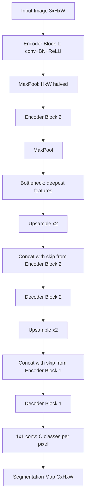

# Image Segmentation

## Detailed Explanation

Image segmentation assigns a label to every pixel in an image. This is more demanding than classification (one label per image) or detection (one box per object) because the output is a full spatial map with the same resolution as the input.

Three levels of segmentation exist. Semantic segmentation assigns a class to each pixel without distinguishing between object instances: every pixel belonging to "car" gets the same label, whether from one car or ten. Instance segmentation detects and separately labels each individual object, producing a binary mask per detected instance. Panoptic segmentation unifies both: "stuff" (road, sky, grass) receives semantic labels; "things" (cars, people) receive per-instance masks.

U-Net (Ronneberger et al., 2015) is the dominant architecture. Its encoder-decoder structure with skip connections was designed for biomedical image segmentation, where training data is scarce. The encoder (series of conv-pool blocks) compresses the image to a bottleneck capturing context. The decoder upsamples step by step, and skip connections from each encoder stage reintroduce spatial details (exact edge locations) lost during pooling. Without skip connections, the decoder must recover fine-grained spatial information from the bottleneck alone — this is very hard.

Segment Anything Model (SAM, Meta 2023) introduced promptable zero-shot segmentation: given a point, box, or text prompt, SAM produces a mask for the indicated object. It was trained on 1 billion masks and works across diverse domains without fine-tuning.

Class imbalance is the central practical challenge: background pixels routinely outnumber object pixels by 50:1 or 100:1. Standard cross-entropy loss is dominated by background. Dice loss and Focal loss both address this, with Dice being standard in medical imaging.

## Core Intuition

Segmentation is classification at every pixel, but context determines class — a pixel's color alone does not identify it as road or sky. The encoder captures this context by compressing neighboring pixels into shared representations; the decoder then uses skip connections to recover the exact spatial boundaries that were discarded during compression.

## How It Works

1. **Encoder (downsampling path)** — repeated conv + BN + ReLU blocks each followed by max pooling; feature maps halve in spatial size and double in channels; captures hierarchical context
2. **Bottleneck** — smallest spatial resolution with the deepest feature channels; encodes global scene understanding
3. **Decoder (upsampling path)** — transposed convolution or bilinear upsampling doubles spatial resolution at each step; channels halve
4. **Skip connections** — concatenate encoder feature maps at the matching spatial resolution onto the decoder feature maps; this provides exact spatial location information
5. **Per-pixel head** — final 1×1 convolution maps channels to number of classes; output shape is (C, H, W)
6. **Dice loss** — 2 × |prediction ∩ target| / (|prediction| + |target|); invariant to class frequency, directly optimizes the IoU-like overlap metric

## Architecture and Trade-offs

### Segmentation task types

| Task | Output | Distinguishes instances | Typical use case |
|---|---|---|---|
| Semantic segmentation | Class per pixel | No | Road segmentation, sky/ground |
| Instance segmentation | Binary mask per object | Yes | Counting objects, robotic grasping |
| Panoptic segmentation | Both | Yes (things), No (stuff) | Autonomous driving, scene understanding |

### Architecture comparison

| Architecture | Key idea | Memory | Speed | Best use case |
|---|---|---|---|---|
| U-Net | Encoder-decoder + skip connections | Moderate | Fast | Medical imaging, small datasets |
| DeepLab v3+ | Atrous convolutions, ASPP | Moderate | Moderate | Street scenes, natural images |
| Mask R-CNN | Detection + mask head | High | Slow | Instance segmentation |
| SAM | Promptable zero-shot, ViT backbone | Very high | Slow | Universal, interactive segmentation |

### Loss functions for segmentation

| Loss | Formula | Best for |
|---|---|---|
| Cross-entropy | -sum(y_true * log(y_pred)) | Balanced classes |
| Dice loss | 1 - 2*intersection/(sum_pred + sum_true) | Class imbalance, medical |
| Focal loss | -(1-p)^gamma * log(p) | Extreme imbalance |
| Dice + CE combined | alpha*Dice + (1-alpha)*CE | Most common production choice |

## Interview Q&A

**Q: Why do we need skip connections in U-Net, and what happens without them?**
A: The encoder's pooling operations discard precise spatial locations in exchange for larger receptive fields. The bottleneck knows "there is a tumor somewhere here" but not exactly where each cell boundary is. Skip connections short-circuit spatial details from the encoder directly to the corresponding decoder level — the decoder then combines high-resolution position with deep semantic context. Without skip connections, fine boundary localization drops significantly: typically 5-15% lower Dice on medical segmentation tasks.

**Q: When would you choose instance segmentation over semantic segmentation?**
A: Choose instance segmentation when you need to count objects, track individuals, or handle overlapping objects separately — robotic bin picking (grasp one item at a time), cell counting in microscopy, crowd counting, or any task requiring per-object attributes (size, trajectory). Semantic segmentation suffices when you only care about region-level understanding: drivable area detection in autonomous driving, background removal, or material classification in remote sensing.

**Q: How do you handle class imbalance in segmentation when background is 90% of pixels?**
A: Three approaches ordered by effectiveness: (1) Dice loss directly optimizes overlap between prediction and target mask, independent of class frequency — it naturally handles imbalance; (2) Focal loss down-weights easy background pixels, forcing the model to focus on hard foreground boundaries; (3) weighted cross-entropy assigns higher loss weight to minority classes (weight = 1 / class_frequency). In practice, Dice + weighted CE combination is standard for medical imaging.

**Q: How would you evaluate a segmentation model beyond pixel accuracy?**
A: Pixel accuracy is useless with imbalanced classes. Use: (1) mean IoU (mIoU) — average IoU across all classes, penalizes both false positives and negatives; (2) Dice score (= F1 score at pixel level) — more interpretable, directly optimizable; (3) boundary F1 — measures precision and recall of predicted boundaries within a tolerance of K pixels; (4) Hausdorff distance — measures worst-case boundary error, important for medical tasks where outliers matter.

**Q: Your U-Net produces correct shapes but with blurry boundaries. What do you change?**
A: Blurry boundaries usually mean the skip connections are insufficient or the decoder upsampling is too coarse. Try: (1) increase skip connection strength — use more channels or add a small attention gate to the skip; (2) use bilinear upsampling + conv instead of transposed convolution (transposed conv creates checkerboard artifacts); (3) add a boundary loss term that specifically penalizes distance between predicted and ground-truth boundaries; (4) check that you are using skip connections at every scale — missing them at the highest-resolution stage causes the most blur.

**Q: How does SAM differ from a trained semantic segmentation model, and when would you use each?**
A: SAM is promptable and zero-shot — it segments "the object at this point" without knowing what class it is. It generalizes across domains without fine-tuning. Use SAM when: you need to segment arbitrary objects without labeled data, the domain is novel, or you want interactive segmentation. Use a trained semantic model when: you know your classes in advance, you need class labels (not just masks), latency matters (SAM is slow — 50ms+ per image), and you have labeled training data for your classes.

## Best Practices

- Use **Dice + cross-entropy combined loss** (alpha=0.5) as the default for medical and satellite segmentation. Pure CE diverges on highly imbalanced datasets; pure Dice can be unstable early in training.
- Apply **test-time augmentation**: flip horizontal and vertical, average predicted probability maps before argmax — typically gains 0.5–2% mIoU.
- Monitor **per-class IoU** during training, not just mean IoU. A single class with IoU=0 can hide behind a high mean from easy majority classes.
- For **small object segmentation** (lesions, small defects), use higher-resolution encoder outputs — reduce stride from 32 to 16 or 8, or use dilated convolutions to maintain resolution without reducing receptive field.
- When training on **limited medical data** (fewer than 500 images), initialize U-Net encoder from ImageNet pretrained ResNet weights — even for single-channel images, convert to 3 channels by replicating.
- Post-process predictions with **connected components analysis** to remove small isolated blobs: if an object prediction is smaller than min_size pixels, remove it. This dramatically reduces false positives in practice.

## Common Pitfalls

- **Not accounting for class imbalance in loss function:** Default cross-entropy with 95% background pixels means the loss is dominated by correct background predictions. Model learns to predict all-background and achieves 95% accuracy while having 0% foreground recall. Fix: switch to Dice loss or add class weights immediately.
- **Forgetting to apply skip connections at all scales:** Implementing skip connections only at one or two scales but not all encoder stages leaves the decoder without fine-grained spatial information at those scales. Boundaries are blurry or slightly misaligned. Fix: verify skip connections exist at every encoder-decoder pairing and check feature map shapes match at each junction.
- **Using transposed convolution without compensating for checkerboard artifacts:** Transposed convolution creates periodic grid artifacts in the output segmentation map. Symptom: high-frequency grid pattern on predicted boundaries. Fix: replace with bilinear upsample followed by regular convolution.
- **Evaluating with pixel accuracy on imbalanced test set:** Reports 95% accuracy while foreground recall is 20%. Fix: always report mIoU or Dice score; include a confusion matrix in evaluation reports.

## Related Concepts

- [Image Classification](./01-image-classification.md) — Classification head and CNN encoder are the same; segmentation adds the decoder
- [Object Detection](./02-object-detection.md) — Instance segmentation (Mask R-CNN) extends detection with a per-instance mask head
- [Vision Transformers](./04-vision-transformers.md) — Segmentation ViTs (SegFormer, SETR) replace the CNN encoder with a transformer
