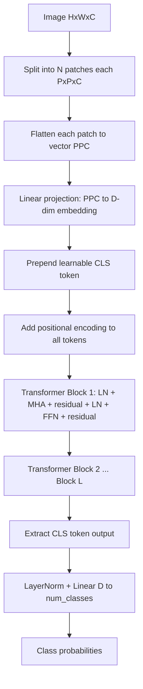

# Vision Transformers

## Detailed Explanation

Vision Transformer (ViT, Dosovitskiy et al., 2020) applies the transformer architecture to images by splitting each image into a sequence of fixed-size patches and treating them as tokens. A 224×224 image with 16×16 patches yields 196 patch tokens, each projected from 16×16×3 = 768 raw values to a D-dimensional embedding. A learnable CLS token is prepended; its output from the final transformer block is used for classification.

ViT's key departure from CNNs is the absence of locality inductive bias. Convolutions are inherently local — each output pixel depends only on a neighborhood. Transformers apply self-attention globally: every patch attends to every other patch from the first layer. This global receptive field is powerful but expensive (O(N^2) in sequence length) and requires more data to learn useful patterns from scratch. ViT trained on ImageNet-1k underperforms ResNet-50; trained on JFT-300M (300M images), it significantly outperforms CNNs.

In practice, the transition point is roughly 10–30M training images: below this, CNNs win with their built-in spatial inductive bias; above this, ViT's global attention wins because it can learn patterns CNNs are structurally prevented from learning (long-range dependencies, global texture statistics).

Efficient variants address the O(N^2) bottleneck: Swin Transformer uses shifted window attention (local patches), DeiT uses knowledge distillation to train ViT on ImageNet-1k without JFT, and FlexiViT allows variable patch sizes at inference. These make ViT practical for standard research and production use without massive compute.

Positional encoding is critical: without it, ViT is permutation-invariant and cannot distinguish patch order. Options are learned (standard in ViT), sinusoidal (used in NLP), and 2D sinusoidal (explicitly encodes row and column). Learned works best when training and inference use the same resolution; 2D sinusoidal generalizes better to different image sizes.

## Core Intuition

ViT treats an image like a sentence — split into patches (words), each patch gets a representation, and self-attention relates patches globally. Unlike a CNN that can only "see" a neighborhood at first, a transformer can relate the top-left patch to the bottom-right patch in the very first layer — at the cost of needing far more data to learn what matters.

## How It Works

1. **Patch extraction** — divide image (H×W×C) into N patches of size P×P; N = (H×W) / P^2; each patch flattened to a vector of length P*P*C
2. **Patch embedding** — linear projection: each flattened patch → D-dimensional embedding vector (a trainable weight matrix E of shape P*P*C × D)
3. **CLS token** — prepend a learnable [CLS] embedding to the sequence; final CLS representation encodes the whole image
4. **Positional encoding** — add a learnable position vector to each token (including CLS); without this, self-attention is permutation-invariant
5. **Transformer encoder** — L blocks, each: LayerNorm → Multi-Head Self-Attention → residual + LayerNorm → MLP (FFN, 2 layers with GELU) → residual
6. **Classification head** — take CLS output from final block → LayerNorm → Linear(D, num_classes) → softmax

## Architecture and Trade-offs

### ViT vs CNN comparison

| Property | CNN (ResNet) | ViT |
|---|---|---|
| Locality bias | Yes (convolution is local) | No (global attention from layer 1) |
| Data efficiency | High (<100K images OK) | Low (needs 10M+ for best results) |
| Global context | Only at deep layers | At every layer |
| Compute | O(HW) per layer | O(N^2) where N = HW/P^2 |
| Transfer to new resolution | Requires interpolation of nothing | Requires PE interpolation |
| Standard small-data baseline | Strong | Weaker without distillation |

### ViT size variants (ViT trained on ImageNet-21k, fine-tuned on ImageNet-1k)

| Variant | Layers | Hidden dim | Heads | Params | Top-1 Acc |
|---|---|---|---|---|---|
| ViT-S/16 | 12 | 384 | 6 | 22M | 81.4% |
| ViT-B/16 | 12 | 768 | 12 | 86M | 85.0% |
| ViT-L/16 | 24 | 1024 | 16 | 307M | 86.5% |
| ViT-H/14 | 32 | 1280 | 16 | 632M | 88.5% |

### Positional encoding options

| Method | Generalizes to new resolution | Complexity | Notes |
|---|---|---|---|
| Learned 1D | No (requires interpolation) | Low | Standard ViT |
| Sinusoidal 1D | Better | Low | From NLP transformers |
| 2D sinusoidal | Yes | Low | Encodes row+col separately |
| Rotary (RoPE) | Yes | Moderate | Used in modern vision LLMs |

## Interview Q&A

**Q: Why does ViT need more data than ResNet to achieve the same accuracy from scratch?**
A: CNNs have locality and translation-equivariance built in — the same filter applies at every location, so the model must learn fewer parameters to discover that edges exist everywhere in an image. ViT has no such prior: its attention mechanism must learn from data that nearby patches are more related than distant ones, and that the same pattern appearing at different locations should be treated similarly. This requires far more examples to learn these geometric regularities from scratch. With sufficient pretraining data (JFT-300M), ViT surpasses CNNs because it can learn patterns CNNs' local receptive fields prevent.

**Q: What does the CLS token represent and why does it work for classification?**
A: CLS is a learnable vector prepended to the patch sequence with no corresponding image region. Through the transformer's self-attention, it learns to aggregate information from all patch tokens. Because every token attends to every other token, by the final layer the CLS token has "seen" and summarized the entire image. It is the natural choice for classification because it is position-free (not tied to a specific patch location) and its final representation has attended to global context. An alternative is global average pooling over all patch outputs — empirically similar.

**Q: How would you adapt ViT for high-resolution images (e.g., 1024×1024 pathology slides)?**
A: Standard ViT with 16×16 patches on a 1024×1024 image yields 4096 tokens — O(N^2) attention becomes prohibitive. Options: (1) Use larger patches (32×32 → 1024 tokens, or 64×64 → 256 tokens), sacrificing fine detail; (2) Hierarchical approach — encode small patches into local features first, then apply attention over local region summaries (Swin, HiViT); (3) Use linear attention approximations to reduce O(N^2) to O(N); (4) Tile the image into overlapping 224×224 crops, process each independently, then aggregate. Which you choose depends on whether fine-grained local detail matters.

**Q: What is the role of the MLP/FFN block in each transformer layer?**
A: The attention mechanism aggregates information across tokens (mixing "where to look"), but it does not transform the individual token representations. The MLP (two linear layers with GELU, typically expanding 4x then contracting) applies a non-linear transformation to each token independently. Together: attention = token mixing, MLP = token transformation. The MLP accounts for the majority of parameters and compute in ViT (8/12 of parameters in ViT-B).

**Q: How do you visualize what a ViT has learned, and what does the attention look like?**
A: Extract attention weights from the final transformer block's multi-head attention. For each head, the attention from the CLS token to each patch shows which regions the model "focuses on" for classification. In practice, different heads specialize: some focus on foreground objects, others on background context, some on low-level texture. You can also visualize rollout — propagating attention through all layers multiplicatively to get an effective attention map that accounts for residual connections.

**Q: When would you use Swin Transformer instead of vanilla ViT?**
A: Swin uses shifted window attention — attention only within local windows, shifted each layer to allow cross-window communication. This reduces complexity from O(N^2) to O(N) and adds hierarchical feature maps (like FPN in CNNs), making it suitable for dense prediction tasks (segmentation, detection) and high-resolution inputs. Use Swin when: input resolution is large, you need multi-scale features, or you are adapting existing CNN-based pipelines (Swin is a drop-in CNN backbone replacement). Use vanilla ViT for global understanding tasks (image classification, retrieval) where resolution is manageable.

## Best Practices

- For training ViT **on small datasets (<1M images)**, use DeiT's training recipe: strong augmentation (RandAugment, mixup, cutmix), teacher distillation token from a CNN teacher, stochastic depth regularization. These techniques close the gap with CNNs on ImageNet-1k.
- Always initialize from **pretrained weights** when possible. ViT-B/16 pretrained on ImageNet-21k then fine-tuned to your task will outperform any from-scratch training below 100M images.
- When fine-tuning at a different resolution than pretraining, **interpolate positional encodings** using bicubic 2D interpolation rather than discarding them. Fine-tuning without PE interpolation loses spatial structure and degrades accuracy by 1-3%.
- Use **patch size 16×16 as the default**. Smaller patches (8×8) quadruple sequence length and memory. Larger patches (32×32) miss fine details. For high-resolution tasks, 16×16 with hierarchical aggregation (Swin) is the best trade-off.
- Monitor **attention entropy per head** during training. Heads that collapse to uniform attention or to attending only to the CLS token are not learning useful representations — add attention regularization or use more data.
- When building custom ViT, **use pre-LN (layer norm before attention/MLP)** rather than post-LN. Pre-LN training is significantly more stable and does not require learning rate warmup tricks.

## Common Pitfalls

- **Not interpolating positional encoding when changing input resolution:** If pretrained at 224×224 and fine-tuned at 384×384, the extra patch positions have no corresponding learned embedding — they default to zero or nearest-neighbor copying. Use bicubic interpolation of the PE weight matrix to cover the new grid. Failure to do this costs 1-3% accuracy.
- **Using ViT without pretrained weights on a small dataset:** Vanilla ViT trains poorly on fewer than 100K images because it lacks CNN's inductive biases. Symptom: validation accuracy is flat or poor for 10+ epochs while CNN baseline converges quickly. Fix: either use pretrained weights, or switch to a hybrid CNN-ViT, or use Swin which has local attention with CNN-like inductive bias.
- **Forgetting that attention is O(N^2) in memory:** Fine-tuning ViT-L on 512×512 images with patch size 16 gives 1024 tokens — attention matrix is 1024^2 = 1M entries per head × number of heads × batch size. This easily exceeds 40GB GPU memory. Fix: use gradient checkpointing, reduce batch size, or switch to Swin with window attention.
- **Treating the CLS token as a standard patch:** Concatenating or mixing CLS token in the loss with patch tokens breaks the design — CLS is a "free" global summary slot. If you want dense prediction, use all patch outputs, not CLS.

## Related Concepts

- [Image Classification](./01-image-classification.md) — ViT is a drop-in replacement for CNN classification backbones
- [Image Segmentation](./03-image-segmentation.md) — SegFormer and SETR use ViT encoder with lightweight decoder for segmentation
- [Object Detection](./02-object-detection.md) — DETR and Deformable DETR use transformer for detection without anchors or NMS
