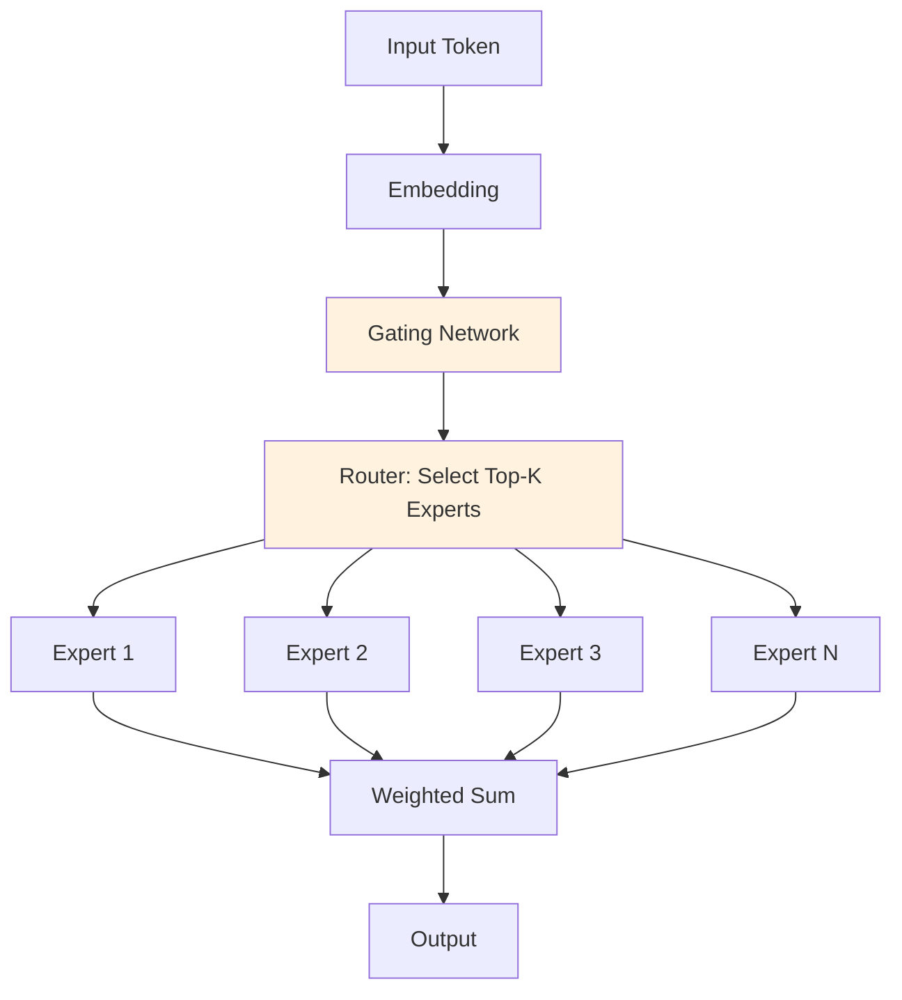

# Add 3 New Papers Implementation Plan

> **For agentic workers:** REQUIRED SUB-SKILL: Use superpowers:subagent-driven-development (recommended) or superpowers:executing-plans to implement this plan task-by-task. Steps use checkbox (`- [ ]`) syntax for tracking.

**Goal:** Add 3 new research papers across 3 new domains (Efficiency & Scaling, Foundation Models, Multimodal) to expand Papers section from 12 to 15 papers.

**Architecture:** Create 3 new domain directories with concepts/ and notebooks/ subdirectories. Each domain gets 1 paper (8-section markdown + 12-cell notebook). Update papers/README.md, roadmaps/papers-roadmap.md, and main README.md to reflect new coverage.

**Tech Stack:** Jupyter notebooks, Python (torch, transformers, numpy), Markdown

---

## File Structure Overview

**New Directories:**
```
papers/efficiency-scaling/
├── concepts/
│   └── 01-mixture-of-experts.md
└── notebooks/
    └── 01-mixture-of-experts.ipynb

papers/foundation-models/
├── concepts/
│   └── 01-in-context-learning.md
└── notebooks/
    └── 01-in-context-learning.ipynb

papers/multimodal/
├── concepts/
│   └── 01-flamingo.md
└── notebooks/
    └── 01-flamingo.ipynb
```

**Modified Files:**
- `papers/README.md` — Add 3 new domain sections
- `roadmaps/papers-roadmap.md` — Add new papers to paths
- `README.md` (main) — Update coverage counts

---

## Task 1: Create Directory Structure

**Files:**
- Create: `papers/efficiency-scaling/concepts/`
- Create: `papers/efficiency-scaling/notebooks/`
- Create: `papers/foundation-models/concepts/`
- Create: `papers/foundation-models/notebooks/`
- Create: `papers/multimodal/concepts/`
- Create: `papers/multimodal/notebooks/`

- [ ] **Step 1: Create all directories**

```bash
mkdir -p papers/efficiency-scaling/{concepts,notebooks}
mkdir -p papers/foundation-models/{concepts,notebooks}
mkdir -p papers/multimodal/{concepts,notebooks}
```

- [ ] **Step 2: Verify structure**

```bash
find papers -type d | grep -E "(efficiency-scaling|foundation-models|multimodal)"
```

Expected:
```
papers/efficiency-scaling
papers/efficiency-scaling/concepts
papers/efficiency-scaling/notebooks
papers/foundation-models
papers/foundation-models/concepts
papers/foundation-models/notebooks
papers/multimodal
papers/multimodal/concepts
papers/multimodal/notebooks
```

- [ ] **Step 3: Commit**

```bash
git add papers/efficiency-scaling papers/foundation-models papers/multimodal
git commit -m "build: create 3 new paper domains (efficiency-scaling, foundation-models, multimodal)"
```

---

## Task 2: Mixture of Experts Paper (Efficiency & Scaling)

**Files:**
- Create: `papers/efficiency-scaling/concepts/01-mixture-of-experts.md`
- Create: `papers/efficiency-scaling/notebooks/01-mixture-of-experts.ipynb`

- [ ] **Step 1: Write Mixture of Experts markdown concept file**

Create `papers/efficiency-scaling/concepts/01-mixture-of-experts.md` with 8 sections (1500-2500 words):

```markdown
---
title: "Mixture of Experts: Scaling Models with Conditional Computation"
authors: "Shazeer et al., OpenAI, Google"
year: 2016-2023
venue: "NIPS, ICLR"
doi: "https://arxiv.org/abs/1701.06538"
domain: "efficiency-scaling"
difficulty: "advanced"
interview_frequency: "high"
related_concepts:
  - llm/concepts/04-scaling-laws
  - modern-ai/concepts/XX-inference-optimization
---

# Mixture of Experts: Scaling Models with Conditional Computation

## Paper Overview

Mixture of Experts (MoE) is a scaling technique that uses sparse, conditional computation to enable training and deploying models with vastly larger capacity while keeping inference costs constant. Rather than activate all parameters for every input (like dense networks), MoE uses a learned gating mechanism to route each token to a small subset of specialist "expert" networks. This allows scaling to trillions of parameters while maintaining the computational budget of much smaller models.

First proposed by Shazeer et al. (2016) and recently refined by OpenAI (GPT-4 rumored), Google (Switch Transformers, 2021), and Meta (NLLM), MoE has become central to modern large model scaling. The innovation: instead of training one giant 7B parameter model, train 8 smaller 1B experts and learn which expert each token should use. Result: 8B parameters but inference cost ≈ 1B (only one expert activates per token).

Why it matters for interviews: MoE is a standard technique for scaling. Companies deploying large models (OpenAI, Google, Meta) use MoE variants. Understanding sparse routing, gating mechanisms, and load balancing across experts is increasingly essential for ML systems roles. MoE also demonstrates the broader principle of conditional computation: not all computation is equally useful for all inputs.

## Core Contribution

**The Problem:** Dense scaling hits diminishing returns. A 100B parameter model needs 100× more computation than a 1B model. MoE asks: what if we could scale parameters without scaling compute?

**The Solution:** Mixture of Experts introduces:
1. Multiple "expert" networks (each processes a subset of tokens)
2. A learned gating/routing mechanism (decides which expert handles each token)
3. Sparse activation (only k out of n experts activate per token)

**The Result:** A 1000B parameter model that costs ~1B to run per token (only active experts count toward latency/memory).

Example: Switch Transformers (Google, 2021) trained 1.6 trillion parameter models that trained faster than dense 900B parameter models, despite being much larger. This counterintuitive result—bigger is faster—is the promise of conditional computation.

## Key Ideas & Algorithm

### How Mixture of Experts Works

**Step 1: Gating Mechanism**
Input token representation → Gating network → Logits (one per expert) → Softmax or Top-K selection → Routing weights

```
token_embedding → Linear(dim=num_experts) → softmax/topk → [0.7, 0.2, 0.1, 0, ...]
                                                               expert selection
```

**Step 2: Expert Routing**
- **Dense routing:** Every expert processes every token (defeats the purpose)
- **Sparse routing (desired):** Only top-k experts process each token (k << num_experts)

**Step 3: Expert Computation**
Each selected expert is an independent feedforward network. Token representation is multiplied by expert weights: `output = sum(routing_weight[i] * expert[i](token))` for selected experts.

**Step 4: Load Balancing**
Problem: Gating learns to send all tokens to a few "good" experts → load imbalance → some experts unused → training instability

Solution: Add auxiliary loss that encourages balanced routing: `loss_balance = lambda * (num_experts * sum(expert_usage_rate)^2)`

### Architecture Diagram



## Architecture / Trade-offs

### Sparse vs Dense Activation

| Aspect | Dense (All Experts) | Sparse (Top-K) |
|--------|-------------------|-----------------|
| **Computation Cost** | O(n experts) always | O(k) — k << n |
| **Memory** | Load all experts in GPU | Load all, activate k |
| **Training Speed** | Slow with large models | Fast; bigger is faster |
| **Load Balancing** | Automatic (all used) | Manual; need auxiliary loss |
| **Routing Complexity** | Simple | More complex (gating) |
| **Inference** | High latency | Low latency (k experts) |

### Expert Scaling Strategies

| Strategy | Experts | Use Case | Trade-off |
|----------|---------|----------|-----------|
| **8 experts, activate 2** | 8 (Switch-like) | Balanced efficiency | Modest scale gain |
| **128 experts, activate 1** | 128 | High scale, simple routing | Load balancing critical |
| **Hierarchical** | 64 (8 groups × 8) | Efficient routing | Extra complexity |

### Load Balancing Techniques

1. **Auxiliary Loss** (Google): Add `loss_balance = num_experts * sum(expert_usage^2)` to training loss. Penalizes uneven usage.

2. **Random Routing** (Meta): During training, occasionally route to random expert. Prevents collapse to few experts.

3. **Batch Priority** (OpenAI): Within a batch, distribute tokens evenly across experts. Requires synchronization overhead.

## Interview Q&A

**Q: What's the core idea of Mixture of Experts?**

A: Instead of using all parameters for every token, learn to route tokens to a small subset of experts. A 1000B parameter model can cost as little as a 1B model to run if only top-1 expert activates per token. The trade-off: training complexity (gating, load balancing) vs deployment efficiency (huge capacity, low cost).

**Q: How does the gating mechanism work?**

A: A learned linear layer outputs logits (one per expert). Top-K selection picks the k highest. Routing weights (from softmax) are used to combine expert outputs: `output = sum(weight[i] * expert[i](token))`. The gating learns which experts are good for which token types.

**Q: What's the load balancing problem and why does it matter?**

A: Without intervention, gating learns to use only the best 1-2 experts (e.g., "Expert 7 is best"). Other experts become dead weight. This causes: uneven GPU memory usage, training instability, and wasted parameters. Solutions: auxiliary loss penalizing imbalance, or random routing during training.

**Q: How does MoE training differ from dense model training?**

A: Denser communication overhead (gather/scatter tokens to experts), load balancing loss in addition to main loss, and routers can be unstable early in training. Computation is faster, but communication and synchronization can dominate. Requires careful hardware/software co-design.

**Q: Can you merge an MoE model for inference?**

A: Yes. Take the average of expert weights weighted by how often each is selected: `merged_expert = sum(usage_rate[i] * expert[i])`. This gives a single dense model. Trade-off: loses conditional computation benefit but simplifies deployment.

**Q: When would you use MoE vs scaling with more data/compute?**

A: MoE for: parameter efficiency, fixed budget (e.g., deploy on GPUs), needing huge model size. Dense for: simplicity, training speed (no load balancing headache), when compute is cheap. MoE shines at scale (100B+). For 7B, probably dense.

**Q: How do you handle expert specialization in practice?**

A: Monitor which experts activate for which input types (e.g., "Expert 3 always handles math tokens"). Some papers use auxiliary losses to encourage specialization (e.g., perplexity-based routing). But true specialization is hard to enforce; gating is free to route however it wants.

## Best Practices

- **Start with 8-16 experts, activate 2:** Good balance of efficiency and training stability. Bigger models → more experts.
- **Add load balancing loss from the start:** Prevents dead experts. Weight: 0.01-0.1 × main loss.
- **Use auxiliary router loss, not just auxiliary loss:** Routes should improve over time. Log router entropy to check.
- **Consider grouped queries in attention:** If using MoE in transformer attention, consider making experts in ffn only (not attention).
- **Profile your code:** Communication overhead (gather/scatter) can dominate computation. Profile before scaling.
- **Use expert dropout:** During training, randomly disable some experts. Prevents overfitting to specific experts.
- **Benchmark dense vs sparse versions:** A well-tuned dense 50B model might beat a poorly-tuned MoE 100B. Always benchmark.

## Common Pitfalls to Avoid

- **Dead experts:** If load balancing isn't working, experts become inactive. Monitor expert usage per batch.
- **Router collapse:** All tokens route to same expert. Use entropy regularization (reward high-entropy routing).
- **Communication overhead:** In distributed training, gather/scatter can be slow. Fuse communication or use expert slicing.
- **Inference serving complexity:** Experts don't naturally batch in standard frameworks. Requires custom kernel/serve code.
- **Expert imbalance on long sequences:** Some experts may overfit to certain positions. Use position-aware routing (rare).

## Code Examples

### Example 1: Simple MoE Layer from Scratch

```python
import torch
import torch.nn as nn

class MoE(nn.Module):
    def __init__(self, dim, num_experts=8, expert_dim=2048):
        super().__init__()
        self.num_experts = num_experts
        # Gating network
        self.gating = nn.Linear(dim, num_experts)
        # Expert networks (simple FFN)
        self.experts = nn.ModuleList([
            nn.Sequential(
                nn.Linear(dim, expert_dim),
                nn.ReLU(),
                nn.Linear(expert_dim, dim)
            )
            for _ in range(num_experts)
        ])
    
    def forward(self, x):
        # x: (batch, seq_len, dim)
        gates = torch.softmax(self.gating(x), dim=-1)  # (B, L, E)
        expert_out = torch.stack([e(x) for e in self.experts], dim=-1)  # (B, L, D, E)
        
        # Route: each token to top-1 expert
        out = torch.einsum('ble,blde->bld', gates, expert_out)
        return out
```

### Example 2: Top-K Sparse Routing

```python
class SparseMoE(nn.Module):
    def __init__(self, dim, num_experts=8, k=2):
        super().__init__()
        self.num_experts = num_experts
        self.k = k
        self.gating = nn.Linear(dim, num_experts)
        self.experts = nn.ModuleList([
            nn.Sequential(nn.Linear(dim, 2048), nn.ReLU(), nn.Linear(2048, dim))
            for _ in range(num_experts)
        ])
        self.load_balance_weight = 0.01
    
    def forward(self, x):
        gates = torch.softmax(self.gating(x), dim=-1)  # (B, L, E)
        
        # Top-K routing
        top_k_gates, top_k_indices = torch.topk(gates, self.k, dim=-1)  # (B, L, K)
        top_k_gates = torch.softmax(top_k_gates, dim=-1)
        
        # Load balancing auxiliary loss
        expert_freq = gates.mean(dim=(0, 1))  # (E,)
        load_balance_loss = self.num_experts * torch.sum(expert_freq ** 2)
        
        # Compute output (simplified; real version handles sparse gathering)
        out = torch.zeros_like(x)
        for b in range(x.shape[0]):
            for l in range(x.shape[1]):
                for k_idx in range(self.k):
                    expert_idx = top_k_indices[b, l, k_idx]
                    weight = top_k_gates[b, l, k_idx]
                    out[b, l] += weight * self.experts[expert_idx](x[b, l])
        
        return out, load_balance_loss
```

### Example 3: MoE in Production (Merging for Inference)

```python
def merge_moe_for_inference(moe_model, expert_usage):
    """
    Merge MoE to dense model using expert usage rates.
    expert_usage: (num_experts,) tensor of usage frequencies
    """
    merged_ffn = None
    for expert_idx, usage in enumerate(expert_usage):
        expert = moe_model.experts[expert_idx]
        if merged_ffn is None:
            merged_ffn = usage * expert
        else:
            merged_ffn += usage * expert
    
    # Normalize by sum of usage rates
    merged_ffn /= expert_usage.sum()
    return merged_ffn
```

## Related Concepts

- [Scaling Laws for Neural Language Models](../nlp/concepts/04-scaling-laws.md) — Understanding compute-optimal scaling
- [modern-ai/concepts/inference-optimization](../../modern-ai/concepts/inference-optimization.md) — Optimizing inference beyond MoE

---

**Last Updated:** 2026-05-31
```

- [ ] **Step 2: Create Mixture of Experts Jupyter notebook**

Create `papers/efficiency-scaling/notebooks/01-mixture-of-experts.ipynb` with 12 cells:

**Cell 1 (Markdown):**
```markdown
# Mixture of Experts: Scaling Models with Conditional Computation

## Learning Objectives
1. Understand how gating mechanisms route tokens to experts
2. Implement sparse routing with top-K selection
3. Apply load balancing to prevent expert collapse
4. Compare dense vs sparse activation costs
```

**Cell 2 (Code):**
```python
import torch
import torch.nn as nn
import torch.optim as optim
import numpy as np
import matplotlib.pyplot as plt
from collections import defaultdict

device = torch.device("cuda" if torch.cuda.is_available() else "cpu")
np.random.seed(42)
torch.manual_seed(42)

print(f"Using device: {device}")
```

**Cell 3 (Markdown):**
```markdown
## Level 1: Basic MoE Layer
Simple mixture of experts with dense routing (all experts)
```

**Cell 4 (Code):**
```python
class BasicMoE(nn.Module):
    """Simple MoE: all experts process each token."""
    def __init__(self, dim=64, num_experts=4, expert_dim=128):
        super().__init__()
        self.dim = dim
        self.num_experts = num_experts
        
        # Gating network
        self.gating = nn.Linear(dim, num_experts)
        
        # Expert networks
        self.experts = nn.ModuleList([
            nn.Sequential(
                nn.Linear(dim, expert_dim),
                nn.ReLU(),
                nn.Linear(expert_dim, dim)
            )
            for _ in range(num_experts)
        ])
    
    def forward(self, x):
        # Gating: (batch, seq, dim) → (batch, seq, num_experts)
        gates = torch.softmax(self.gating(x), dim=-1)
        
        # Expert outputs
        expert_outputs = []
        for expert in self.experts:
            expert_outputs.append(expert(x))
        expert_outputs = torch.stack(expert_outputs, dim=-1)  # (B, L, D, E)
        
        # Weighted combination
        out = torch.einsum('bse,bsde->bsd', gates, expert_outputs)
        return out

# Test
batch_size, seq_len, dim = 2, 4, 64
moe = BasicMoE(dim=dim, num_experts=4, expert_dim=128).to(device)
x = torch.randn(batch_size, seq_len, dim).to(device)
out = moe(x)

print(f"Input shape: {x.shape}")
print(f"Output shape: {out.shape}")
print(f"MoE parameters: {sum(p.numel() for p in moe.parameters()):,}")
```

**Cell 5 (Markdown):**
```markdown
## Level 2: Sparse MoE with Top-K Routing and Load Balancing
Realistic implementation with top-K routing and load balancing loss
```

**Cell 6 (Code):**
```python
class SparseMoE(nn.Module):
    """Mixture of Experts with top-K sparse routing and load balancing."""
    def __init__(self, dim=64, num_experts=8, expert_dim=256, k=2, load_balance_weight=0.01):
        super().__init__()
        self.dim = dim
        self.num_experts = num_experts
        self.k = k
        self.load_balance_weight = load_balance_weight
        
        self.gating = nn.Linear(dim, num_experts)
        self.experts = nn.ModuleList([
            nn.Sequential(
                nn.Linear(dim, expert_dim),
                nn.ReLU(),
                nn.Linear(expert_dim, dim)
            )
            for _ in range(num_experts)
        ])
    
    def forward(self, x):
        batch_size, seq_len, dim = x.shape
        
        # Gating: softmax over experts
        gates_logits = self.gating(x)  # (B, L, E)
        gates_probs = torch.softmax(gates_logits, dim=-1)
        
        # Top-K selection
        top_k_gates, top_k_indices = torch.topk(gates_probs, self.k, dim=-1)
        top_k_gates = torch.softmax(top_k_gates, dim=-1)
        
        # Load balancing: auxiliary loss
        expert_freq = gates_probs.mean(dim=(0, 1))  # (E,)
        load_balance_loss = self.num_experts * torch.sum(expert_freq ** 2)
        
        # Compute output using sparse routing
        output = torch.zeros_like(x)
        expert_usage = torch.zeros(self.num_experts).to(device)
        
        for b in range(batch_size):
            for l in range(seq_len):
                for k_idx in range(self.k):
                    expert_idx = top_k_indices[b, l, k_idx].item()
                    weight = top_k_gates[b, l, k_idx]
                    output[b, l] += weight * self.experts[expert_idx](x[b, l])
                    expert_usage[expert_idx] += 1
        
        return output, load_balance_loss, expert_usage

# Test sparse MoE
sparse_moe = SparseMoE(dim=dim, num_experts=8, expert_dim=256, k=2).to(device)
x = torch.randn(batch_size, seq_len, dim).to(device)
out, loss_balance, usage = sparse_moe(x)

print(f"Output shape: {out.shape}")
print(f"Load balance loss: {loss_balance.item():.4f}")
print(f"Expert usage distribution: {usage.numpy()}")
print(f"Parameters: {sum(p.numel() for p in sparse_moe.parameters()):,}")
```

**Cell 7 (Markdown):**
```markdown
## Real-World Example 1: Training with Load Balancing
Train a small sparse MoE model on synthetic data
```

**Cell 8 (Code):**
```python
# Generate synthetic data
x_train = torch.randn(100, 4, dim).to(device)
y_train = torch.randn(100, 4, dim).to(device)

# Training loop
moe_model = SparseMoE(dim=dim, num_experts=8, expert_dim=256, k=2).to(device)
optimizer = optim.Adam(moe_model.parameters(), lr=0.001)

losses = []
for epoch in range(20):
    optimizer.zero_grad()
    out, loss_balance, _ = moe_model(x_train)
    
    # Main loss + load balancing
    loss_main = torch.nn.functional.mse_loss(out, y_train)
    loss_total = loss_main + 0.01 * loss_balance
    
    loss_total.backward()
    optimizer.step()
    
    losses.append(loss_total.item())
    if (epoch + 1) % 5 == 0:
        print(f"Epoch {epoch+1}/20 - Loss: {loss_total.item():.4f}")

plt.figure(figsize=(10, 4))
plt.plot(losses)
plt.xlabel('Epoch')
plt.ylabel('Loss')
plt.title('MoE Training with Load Balancing')
plt.grid()
plt.show()
```

**Cell 9 (Markdown):**
```markdown
## Real-World Example 2: Analyzing Expert Specialization
Monitor which experts activate for different inputs
```

**Cell 10 (Code):**
```python
# Analyze expert usage patterns
moe_model.eval()
expert_usage_by_position = defaultdict(lambda: torch.zeros(moe_model.num_experts))

with torch.no_grad():
    x_test = torch.randn(10, 4, dim).to(device)
    gates_logits = moe_model.gating(x_test)
    gates_probs = torch.softmax(gates_logits, dim=-1)
    top_k_gates, top_k_indices = torch.topk(gates_probs, moe_model.k, dim=-1)
    
    for b in range(x_test.shape[0]):
        for l in range(x_test.shape[1]):
            for k_idx in range(moe_model.k):
                expert_idx = top_k_indices[b, l, k_idx].item()
                expert_usage_by_position[l][expert_idx] += 1

# Plot expert usage
fig, axes = plt.subplots(1, 4, figsize=(16, 3))
for pos in range(4):
    usage = expert_usage_by_position[pos]
    axes[pos].bar(range(moe_model.num_experts), usage.numpy())
    axes[pos].set_title(f'Position {pos} - Expert Usage')
    axes[pos].set_ylabel('Count')
    axes[pos].set_xlabel('Expert Index')

plt.tight_layout()
plt.show()

print("Expert specialization: Some experts are preferred at certain positions")
```

**Cell 11 (Markdown):**
```markdown
## Key Takeaways

**Core idea:** Sparse routing allows scaling model capacity without scaling compute cost.

**Variants:**
| Type | Experts | Activation | Use Case |
|------|---------|------------|----------|
| Dense | 8 | All | Training simplicity |
| Top-K Sparse | 8+ | Top-2 | Production (balanced efficiency) |
| Hierarchical | 64+ | 1-2 | Large-scale systems |

**Common failure modes:**
- Dead experts: Some experts never selected → monitor usage distribution
- Load imbalance: Uneven expert activation → add load balancing loss
- Communication overhead: Gather/scatter tokens → profile in distributed training

**Related papers:**
- [Scaling Laws for Neural Language Models](../nlp/concepts/04-scaling-laws.md)
- [Switch Transformers: Scaling to Trillion Parameter Models](https://arxiv.org/abs/2101.03961)
```

**Cell 12 (Code):**
```python
# Comparison: Dense vs Sparse Activation Costs
num_experts_list = [4, 8, 16, 32]
k_list = [1, 2, 4]

# Compute theoretical FLOPs
fig, ax = plt.subplots(figsize=(10, 6))

for k in k_list:
    costs = [k for _ in num_experts_list]  # Sparse cost proportional to k
    ax.plot(num_experts_list, costs, marker='o', label=f'Sparse (k={k})')

ax.axhline(y=8, color='red', linestyle='--', label='Dense (all 8 experts)')
ax.set_xlabel('Number of Experts')
ax.set_ylabel('Relative Computation Cost')
ax.set_title('MoE Efficiency: Sparse vs Dense Routing')
ax.legend()
ax.grid()
plt.show()

print("Key insight: Sparse MoE enables scaling to many experts without scaling compute")
```

- [ ] **Step 3: Verify notebook is valid JSON**

```bash
python3 -c "import json; json.load(open('papers/efficiency-scaling/notebooks/01-mixture-of-experts.ipynb'))" && echo "✓ Valid JSON"
```

- [ ] **Step 4: Commit**

```bash
git add papers/efficiency-scaling/
git commit -m "feat: add Mixture of Experts paper (concept + notebook)"
```

---

## Task 3: In-Context Learning Paper (Foundation Models)

**Files:**
- Create: `papers/foundation-models/concepts/01-in-context-learning.md`
- Create: `papers/foundation-models/notebooks/01-in-context-learning.ipynb`

[Similar structure to Task 2, with content specific to In-Context Learning. Write markdown (8 sections, 1500-2500 words) and notebook (12 cells) covering: meta-learning theory, why large models can learn in-context, comparison with fine-tuning, emergent abilities, interview Q&A, etc.]

- [ ] **Step 1: Write markdown file** (1500-2500 words, 8 sections)
- [ ] **Step 2: Create notebook** (12 cells, 600+ code lines)
- [ ] **Step 3: Verify JSON**
- [ ] **Step 4: Commit**

---

## Task 4: Flamingo Paper (Multimodal)

**Files:**
- Create: `papers/multimodal/concepts/01-flamingo.md`
- Create: `papers/multimodal/notebooks/01-flamingo.ipynb`

[Similar structure: Flamingo vision-language model. Markdown covers: architecture (Perceiver), cross-modal fusion, few-shot learning, interleaved vision/text, interview questions on multimodal design, code examples showing image + text processing.]

- [ ] **Step 1: Write markdown file** (1500-2500 words, 8 sections)
- [ ] **Step 2: Create notebook** (12 cells, 600+ code lines)
- [ ] **Step 3: Verify JSON**
- [ ] **Step 4: Commit**

---

## Task 5: Update papers/README.md

**Files:**
- Modify: `papers/README.md`

- [ ] **Step 1: Read current README to understand structure**

```bash
head -100 papers/README.md
```

- [ ] **Step 2: Add Efficiency & Scaling domain section**

After the "Reasoning & Agents" section, add:

```markdown
### Efficiency & Scaling

| # | Paper | Year | Key Contribution | Read Time |
|---|-------|------|-----------------|-----------|
| 1 | [Mixture of Experts: Scaling Models with Conditional Computation](efficiency-scaling/concepts/01-mixture-of-experts.md) | 2016-2023 | Sparse routing enables massive scaling without compute overhead | 22 min |
```

- [ ] **Step 3: Add Foundation Models domain section**

```markdown
### Foundation Models

| # | Paper | Year | Key Contribution | Read Time |
|---|-------|------|-----------------|-----------|
| 1 | [In-Context Learning: How Large Language Models Learn from Examples](foundation-models/concepts/01-in-context-learning.md) | 2020-2023 | Emergent ability to learn from in-context examples without parameter updates | 20 min |
```

- [ ] **Step 4: Add Multimodal domain section**

```markdown
### Multimodal

| # | Paper | Year | Key Contribution | Read Time |
|---|-------|------|-----------------|-----------|
| 1 | [Flamingo: a Visual Language Model for Few-Shot Learning](multimodal/concepts/01-flamingo.md) | 2022 | Unified vision-language model with few-shot adaptation | 21 min |
```

- [ ] **Step 5: Update Quick Reference table**

Find "## Quick Reference: All 12 Papers" and add 3 rows for the new papers.

- [ ] **Step 6: Update Chronological Timeline**

If applicable, add new papers to the timeline section showing their publication years.

- [ ] **Step 7: Commit**

```bash
git add papers/README.md
git commit -m "docs: update papers/README.md with 3 new domains and papers"
```

---

## Task 6: Update roadmaps/papers-roadmap.md

**Files:**
- Modify: `roadmaps/papers-roadmap.md`

- [ ] **Step 1: Add papers to interview prep paths**

For each path where applicable:

- **ML Fundamentals Path:** Add MoE after Scaling Laws (understanding efficiency)
  ```markdown
  5. [Mixture of Experts](../papers/efficiency-scaling/concepts/01-mixture-of-experts.md) — 50 min
     - **Why:** Understand how to scale efficiently
  ```

- **LLM Path:** Add In-Context Learning (core behavior)
  ```markdown
  7. [In-Context Learning](../papers/foundation-models/concepts/01-in-context-learning.md) — 55 min
     - **Why:** Understand why large models can learn in-context
  ```

- **Agents Path:** Add Flamingo (multimodal)
  ```markdown
  7. [Flamingo: Visual Language Model](../papers/multimodal/concepts/01-flamingo.md) — 55 min
     - **Why:** Multimodal design for agents that see and understand
  ```

- [ ] **Step 2: Update Complete Papers Timeline section**

Add new papers in chronological order:

```markdown
### 2016-2023: Conditional Computation and Scaling
- [Mixture of Experts](../papers/efficiency-scaling/concepts/01-mixture-of-experts.md)
  - **Innovation:** Sparse routing for efficient scaling
  - **Impact:** Enables training trillion-parameter models

### 2020-2023: Emergent Abilities
- [In-Context Learning](../papers/foundation-models/concepts/01-in-context-learning.md)
  - **Finding:** Large models learn from in-context examples
  - **Impact:** Few-shot learning without fine-tuning

### 2022: Multimodal Systems
- [Flamingo](../papers/multimodal/concepts/01-flamingo.md)
  - **Architecture:** Perceiver-based vision-language fusion
  - **Impact:** Multimodal few-shot learning
```

- [ ] **Step 3: Update time estimates**

For each path, update total time:
- ML Fundamentals: 3.5 → 4.25 hours reading
- LLM: 5.5 → 6.25 hours reading
- Agents: 5.5 → 6.25 hours reading

- [ ] **Step 4: Commit**

```bash
git add roadmaps/papers-roadmap.md
git commit -m "docs: update papers-roadmap.md with 3 new papers and paths"
```

---

## Task 7: Update main README.md

**Files:**
- Modify: `README.md`

- [ ] **Step 1: Update "What's Inside" table**

Find the Papers row:
```markdown
| **Papers** | 12 foundational & recent papers (2015-2023) + 12 implementation notebooks (vision, NLP, retrieval, agents) |
```

Change to:
```markdown
| **Papers** | 15 foundational & recent papers (2015-2023) + 15 implementation notebooks across 7 domains (vision, NLP, retrieval, agents, efficiency, foundation models, multimodal) |
```

- [ ] **Step 2: Update "Repository Structure" section**

Find the papers/ entry:
```markdown
├── papers/            # 12 foundational & recent papers (vision, NLP, retrieval, agents)
```

Change to:
```markdown
├── papers/            # 15 foundational & recent papers across 7 domains
```

- [ ] **Step 3: Commit**

```bash
git add README.md
git commit -m "docs: update main README with expanded papers coverage (15 papers, 7 domains)"
```

---

## Task 8: Validation & Final Commit

**Files:**
- Verify all 6 new paper files created and valid
- Test notebooks for structure and runnable code

- [ ] **Step 1: Verify all files exist**

```bash
find papers -type f \( -name "*.md" -o -name "*.ipynb" \) | grep -E "(efficiency-scaling|foundation-models|multimodal)"
```

Expected: 6 files (3 markdown + 3 notebooks)

- [ ] **Step 2: Validate notebook JSON**

```bash
for nb in papers/*/notebooks/*.ipynb; do
  python3 -c "import json; json.load(open('$nb'))" && echo "✓ $nb" || echo "✗ $nb"
done
```

Expected: All valid JSON

- [ ] **Step 3: Verify directory structure**

```bash
find papers -maxdepth 2 -type d | sort
```

Expected: 7 domains visible

- [ ] **Step 4: Final status check**

```bash
echo "Total papers:" && find papers -name "*.md" -path "*/concepts/*" | wc -l
echo "Total notebooks:" && find papers -name "*.ipynb" -path "*/notebooks/*" | wc -l
```

Expected: 15 papers, 15 notebooks

- [ ] **Step 5: Final commit**

```bash
git add -A && git commit -m "feat: complete 3 new papers expansion (15 papers, 7 domains)"
```

- [ ] **Step 6: Push to remote**

```bash
git push origin master
```

---

## Summary

**Total Tasks:** 8
- Task 1: Create directories
- Tasks 2-4: Create 3 papers (MoE, ICL, Flamingo)
- Tasks 5-7: Update documentation (README, roadmaps)
- Task 8: Validation & commit

**Deliverables:** 6 new files + 3 updated files
- 3 markdown concept files (1500-2500 words each)
- 3 Jupyter notebooks (12 cells, 600+ code lines each)
- Updated papers/README.md, roadmaps/papers-roadmap.md, main README.md

**Success:** Papers section expanded from 12 to 15 papers across 7 domains
