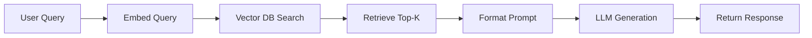
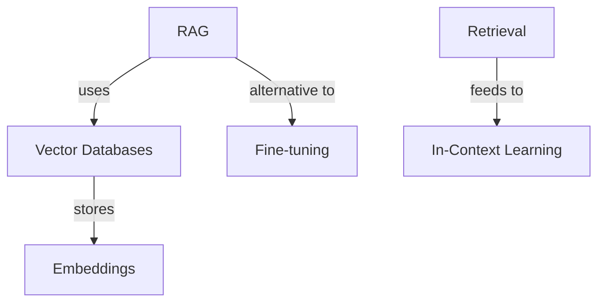

# LLM Concept Interactive Notebooks & Flowcharts Design

**Date:** 2026-05-16  
**Status:** Design Complete  
**Scope:** Create interactive Jupyter notebooks for 33 LLM concepts with executable code, visualizations, and mermaid flowcharts

---

## Problem Statement

The `/llm/concepts/` directory contains 33 detailed markdown concept documents covering essential LLM topics (RAG, LoRA, quantization, attention optimization, etc.). These are valuable reference material but lack:
- Interactive, executable code examples for hands-on learning
- Visual flowcharts showing algorithm workflows
- Visual relationship graphs showing how concepts connect
- Structured interview prep format
- Code snippets candidates can copy and experiment with

## Solution Overview

Create **33 interactive Jupyter notebooks** (one per concept) in `/llm/notebooks/`, each containing:
- Executable Python code with real library imports (transformers, torch, openai, etc.)
- Two types of embedded mermaid flowcharts:
  1. **Workflow/Algorithm flowcharts** — step-by-step process showing how the concept works
  2. **Relationship flowcharts** — how this concept connects to other LLM concepts
- Interview-ready Q&A format
- Code examples, equations (LaTeX), and visualizations where applicable
- Full traceability to source markdown files

---

## Design Specifications

### 1. Directory Structure

```
/llm/
├── concepts/                    # Original markdown files (unchanged)
│   ├── rag.md
│   ├── lora.md
│   ├── quantization.md
│   └── ... (33 total)
│
└── notebooks/                   # NEW: Interactive notebooks
    ├── 01-adapters.ipynb
    ├── 02-attention-optimization.ipynb
    ├── 03-chain-of-thought.ipynb
    ├── 04-context-window.ipynb
    ├── ...
    └── 33-zero-shot-learning.ipynb
```

**Naming Convention:** `NN-concept-name.ipynb` (numeric prefix ensures consistent ordering)

### 2. Notebook Structure (Per Notebook)

Each notebook contains the following cells in order:

#### **Cell 1: Metadata (Hidden Markdown)**
```markdown
# Concept Name

**Tags:** tag1, tag2  
**Prerequisites:** [related concepts]  
**Related Concepts:** [dependent/related concepts]  
**Source:** `/llm/concepts/{concept}.md`
```

#### **Cell 2: TL;DR (Markdown)**
- One-liner definition
- 2-3 sentence summary
- When/why to use it
- Extracted from source markdown

#### **Cell 3: Core Intuition (Markdown + Diagram)**
- Plain-language explanation
- Simple ASCII art or inline mermaid diagram (if applicable)
- Real-world analogy

#### **Cell 4: How It Works (Markdown + Workflow Flowchart)**
- Step-by-step breakdown of the algorithm/process
- **Embedded Mermaid Flowchart:**
  - Flowchart format (LR or TD direction)
  - Process boxes, decision diamonds, data flow arrows
  - Shows input → processing → output

Example structure for RAG:


#### **Cell 5: Key Properties & Trade-offs (Markdown)**
- Comparison tables (when applicable)
- Pros/cons list
- When to use vs alternatives

#### **Cell 6: Code Implementation (Python Cells - Executable)**
- **Imports Cell:** Real library imports (transformers, torch, numpy, etc.)
- **Code Example Cells:** Working code or well-commented pseudocode
  - Real imports that actually exist
  - If concept requires complex setup, show practical pseudocode + conceptual example
  - Include explanatory comments for interview candidates
- **Math Examples Cell:** LaTeX equations + numeric Python examples
- **Visualizations Cell:** Matplotlib/plotly code (if applicable) showing concept visually

Guidelines:
- Code should be executable or clearly marked as pseudocode
- Include imports at the top (e.g., `from transformers import...`)
- Add "Interview tip" comments explaining key insights
- Link to specific lines in source markdown where relevant

#### **Cell 7: Related Concepts Flowchart (Markdown)**
- **Embedded Mermaid Diagram** showing concept relationships
- Node format: concept names
- Edge labels: "prerequisite for", "enhances", "alternative to", "used with"
- Includes all 33 concepts as a concept map

Example structure:


#### **Cell 8: Interview Q&A (Markdown)**
- 3-5 common interview questions specific to this concept
- Concise, interview-ready answers (1-2 sentences each)
- Focus on "why", tradeoffs, and real-world application

Example:
```markdown
### Common Interview Questions

**Q: What's the main difference between RAG and fine-tuning?**  
A: RAG retrieves external knowledge at query time (fast, updatable), while fine-tuning embeds knowledge into weights (slower to update, permanent). RAG is better for dynamic knowledge; fine-tuning is better for style/format.

**Q: How would you decide between semantic search and BM25 retrieval?**  
A: BM25 is keyword-based (good for exact matches, interpretable), semantic search uses embeddings (good for meaning, but slower). Use hybrid retrieval to combine both.
```

#### **Cell 9: References (Markdown)**
- Links to original concept markdown
- Key papers/articles
- Implementation links (HuggingFace, GitHub repos, etc.)

---

### 3. Flowchart Design Standards

#### **Workflow Flowcharts (Cell 4)**
- **Direction:** LR (left-to-right) for sequential processes, TD (top-down) for hierarchical
- **Node Types:**
  - Rectangles: Processing steps (`[Step]`)
  - Diamonds: Decisions (`{Decision?}`)
  - Circles: Start/end (`((Start/End))`)
  - Parallelograms: Data input/output (`[\Input/Output\]`)
- **Arrows:** Show data flow with directional labels where needed

#### **Relationship Flowcharts (Cell 7)**
- **Direction:** TD (top-down) for clarity
- **Node Types:** Rectangles for each concept (all 33 concepts)
- **Edge Labels:** Relationship type
  - `prerequisite for` (must learn first)
  - `enhances` (improves/extends)
  - `alternative to` (competing approach)
  - `used with` (often combined)
- **Color coding (optional):** Group related concepts visually if helpful

---

### 4. Code Implementation Guidelines

#### **Real Imports**
Use actual, installable packages:
```python
import torch
import numpy as np
from transformers import AutoTokenizer, AutoModel
from sklearn.metrics.pairwise import cosine_similarity
```

#### **Pseudocode for Complex Concepts**
When a concept is too heavy to implement fully (e.g., training a language model), use:
```python
# Pseudocode: High-level flow
def train_lora(model, data, rank=8):
    """
    LoRA training overview:
    1. Freeze base model weights
    2. Add low-rank adapter matrices A, B
    3. Train only A, B on downstream task
    """
    # In practice, use: peft library
    # from peft import get_peft_model, LoraConfig
    # config = LoraConfig(r=rank, ...)
    # model = get_peft_model(model, config)
    pass
```

#### **Math Examples**
Include both LaTeX and executable Python:
```markdown
**Attention Mechanism:**
$$\text{Attention}(Q, K, V) = \text{softmax}\left(\frac{QK^T}{\sqrt{d_k}}\right)V$$
```

```python
import torch
import torch.nn.functional as F

# Numeric example
Q = torch.randn(1, 4, 64)  # Query: batch_size, seq_len, dim
K = torch.randn(1, 4, 64)  # Key
V = torch.randn(1, 4, 64)  # Value

# Scaled dot-product attention
scores = torch.matmul(Q, K.transpose(-1, -2)) / (64 ** 0.5)
weights = F.softmax(scores, dim=-1)
output = torch.matmul(weights, V)
```

---

### 5. Notebook Metadata & Cross-References

Each notebook should include metadata linking related concepts. Example for RAG notebook:

```
**Tags:** retrieval, knowledge, generation  
**Prerequisites:** Embeddings, Vector Databases  
**Related Concepts:** In-Context Learning, Semantic Search, Quantization (for optimization)  
**Enhances:** Fine-tuning strategies, Context Window utilization  
**Alternative to:** Fine-tuning, Pre-training
```

This metadata feeds into:
- **Relationship flowcharts** (Cell 7) — automatically generated from these relationships
- **Interview questions** — can reference related concepts in answers
- **Easy navigation** — readers can jump between related notebooks

The relationship flowchart in Cell 7 will visualize all 33 concepts and show these connections directionally.

---

### 6. Quality Standards

#### **Code Quality**
- [ ] All imports are real, installable packages
- [ ] Code is either executable or clearly marked pseudocode
- [ ] Comments explain "why", not "what"
- [ ] Math equations accompany code examples

#### **Flowchart Quality**
- [ ] Workflow flowchart shows clear input → process → output
- [ ] Relationship flowchart includes all 33 concepts
- [ ] Edge labels are consistent and meaningful
- [ ] Mermaid syntax is valid (tested in preview)

#### **Interview Readiness**
- [ ] Q&A section has 3-5 relevant questions
- [ ] Answers are concise (1-2 sentences)
- [ ] No jargon without explanation
- [ ] Answers highlight trade-offs and when to use

---

### 7. Implementation Order

**Phase 1:** Create notebook template structure (cells, sections, defaults)

**Phase 2:** Populate notebooks for first 5 concepts as proof-of-concept:
- RAG
- LoRA
- Quantization
- Attention Optimization
- Chain-of-Thought

**Phase 3:** Populate remaining 28 notebooks (batch in groups of 5-7)

**Phase 4:** Generate consolidated relationship flowchart showing all 33 concepts

**Phase 5:** Validation & polish

---

### 8. Deliverables

- ✅ `/llm/notebooks/` directory with 33 notebooks
- ✅ Each notebook fully executable (or pseudocode + notes)
- ✅ Workflow flowcharts in each notebook (Cell 4)
- ✅ Relationship flowcharts in each notebook (Cell 7)
- ✅ Interview Q&A format (Cell 8)
- ✅ Cross-referenced to source markdown files
- ✅ Git commit with clear message

---

### 9. Success Criteria

1. **Completeness:** All 33 concepts have notebooks
2. **Executability:** Code cells run without errors (or are clearly marked pseudocode)
3. **Clarity:** Someone unfamiliar with each concept can understand the workflow from the flowchart
4. **Interview Ready:** Q&A section answers common technical questions
5. **Maintainability:** Notebooks are easy to update if source markdown changes

---

## Trade-offs & Decisions

| Decision | Rationale |
|----------|-----------|
| One notebook per concept | Modular, reusable, avoids huge monolithic file |
| Executable code preferred, pseudocode acceptable | Balance realism vs. implementation burden |
| Two flowcharts per notebook | Addresses both "how does it work" and "where does it fit" |
| Interview Q&A format | Matches stated goal of interview prep use case |
| Numeric prefixes in filenames | Ensures consistent ordering across all notebooks |

---

## Next Steps

1. ✅ Design approved
2. ⏳ Write detailed implementation plan (superpowers:writing-plans)
3. ⏳ Execute plan in batches
4. ⏳ Validate and polish
5. ⏳ Commit to git

